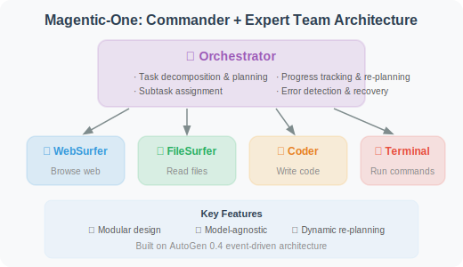
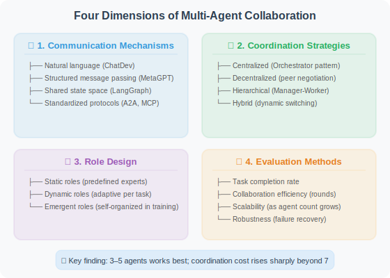
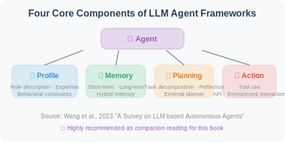
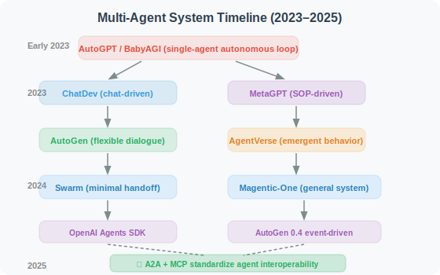

# 16.6 Paper Readings: Frontier Research in Multi-Agent Systems

> 📖 *"One person walks fast; a group of people walks far. Multi-Agent systems are the most active direction in Agent research."*  
> *This section provides in-depth analysis of core papers in the field of multi-Agent collaboration.*

---

## MetaGPT: Multi-Agent Collaboration Constrained by SOPs

**Paper**: *MetaGPT: Meta Programming for A Multi-Agent Collaborative Framework*  
**Authors**: Hong et al.  
**Published**: 2023 | ICLR 2024 Oral | [arXiv:2308.00352](https://arxiv.org/abs/2308.00352)

### Core Problem

What problems arise in information transfer when multiple Agents communicate freely in natural language?
- **Information loss**: Details are omitted when Agent B relays Agent A's requirements to Agent C
- **Misunderstanding**: Each Agent may interpret the same sentence differently
- **Inefficiency**: Large amounts of "small talk" between Agents don't produce useful information

### Core Insight

**Multi-Agent systems need SOPs (Standard Operating Procedures) to constrain collaborative behavior.**

MetaGPT simulates a real software company with clearly defined roles and workflows:

```
Product Manager
  → Output: PRD (Product Requirements Document)
    ↓
Architect
  → Output: System design document + interface definitions
    ↓
Project Manager
  → Output: Task assignments + development plan
    ↓
Engineer
  → Output: Code files
    ↓
QA Engineer
  → Output: Test cases + test report
```

### Key Innovation: Structured Artifact Transfer

MetaGPT's Agents don't pass loose natural language messages — they pass **structured artifacts**:

```
❌ Loose chat messages:
  Product Manager: "We need to build a weather query feature, it should be able
                   to check Beijing's weather, make the interface nice, add a chart..."

✅ Structured PRD document:
  {
    "product_name": "Weather Query System",
    "feature_list": [
      {"name": "City weather query", "priority": "P0", "description": "..."},
      {"name": "Weather trend chart", "priority": "P1", "description": "..."}
    ],
    "technical_requirements": ["Python 3.10+", "FastAPI", "..."],
    "api_interfaces": [{...}]
  }
```

### Experimental Results

On the SoftwareDev benchmark:
- **MetaGPT code execution success rate: 87%**
- ChatDev code execution success rate: 44%
- The large gap in success rates is mainly attributed to structured communication reducing information loss

### Lessons for Agent Development

1. **Structured communication > natural language communication**: Passing structured data between Agents is more reliable than natural language
2. **The value of SOPs**: Defining clear workflows prevents chaotic collaboration between Agents
3. **Role-based prompts**: Each Agent's System Prompt should clearly define role responsibilities and output format

---

## ChatDev: Software Development Driven by Chat Chains

**Paper**: *Communicative Agents for Software Development*  
**Authors**: Qian et al.  
**Published**: 2023 | [arXiv:2307.07924](https://arxiv.org/abs/2307.07924)

### Core Idea

ChatDev simulates the organizational structure of a software company, but uses a different communication method from MetaGPT — **Chat Chains**:

```
The development process is broken into multiple phases:
Design phase → Coding phase → Testing phase → Documentation phase

Each phase involves only two Agents in dialogue:
  Design phase: CEO ↔ CTO
  Coding phase: CTO ↔ Programmer
  Testing phase: Programmer ↔ Tester
  Documentation phase: CEO ↔ Programmer
```

### Inception Prompting

ChatDev uses a technique called **"Inception Prompting"** to guide the conversation in each phase:

```
At the start of each chat phase, both Agents receive:
1. Role description: "You are the CTO, responsible for selecting the technical solution..."
2. Phase goal: "The goal of this phase is to determine the programming language and framework to use"
3. Output format: "At the end of the conversation, please summarize the technology selection"
4. Prior information: The output from the previous phase
```

### Comparison with MetaGPT

| Dimension | MetaGPT | ChatDev |
|-----------|---------|---------|
| Communication method | Structured artifacts (shared message pool) | Two-person chat chain |
| Collaboration pattern | Publish-subscribe | Pairwise dialogue |
| Advantage | More precise information transfer | Simpler and more intuitive design |
| Code success rate | 87% | 44% |
| Design philosophy | Engineering, process-oriented | Social, conversation-oriented |

### Lessons for Agent Development

ChatDev's design of **"only two Agents dialogue per phase"** reduces the complexity of multi-Agent coordination — the communication complexity of N fully connected Agents is O(N²), while pairwise dialogue reduces it to O(N). In practice, if the number of Agents is small (< 5), pairwise dialogue may be easier to debug than complex shared state.

---

## AutoGen: Conversable Agent Framework

**Paper**: *AutoGen: Enabling Next-Gen LLM Applications via Multi-Agent Conversation*  
**Authors**: Wu et al., Microsoft Research  
**Published**: 2023 | [arXiv:2308.08155](https://arxiv.org/abs/2308.08155)

### Core Abstraction: Conversable Agent

AutoGen proposes the abstraction of "Conversable Agent" — each Agent is an independent conversation participant:

```python
# AutoGen's core abstraction (conceptual illustration)
class ConversableAgent:
    """Each Agent can converse with other Agents or humans"""
    
    def __init__(self, name, system_message, llm_config):
        self.name = name
        self.system_message = system_message
    
    def generate_reply(self, messages):
        """Generate a reply based on received messages"""
        ...
    
    def receive(self, message, sender):
        """Receive a message from another Agent or human"""
        ...
    
    def initiate_chat(self, recipient, message):
        """Initiate a conversation with another Agent"""
        ...
```

### Three Predefined Agent Types

```
1. AssistantAgent (AI assistant)
   - Driven by LLM
   - Generates replies based on conversation history

2. UserProxyAgent (user proxy)
   - Represents a human user
   - Can execute code, request human input
   - Key to Human-in-the-Loop

3. GroupChatManager (group chat manager)
   - Manages group conversations among multiple Agents
   - Decides which Agent speaks next
```

### Human-in-the-Loop

AutoGen particularly emphasizes human participation — humans can join multi-Agent conversations at any time to provide feedback or correct direction:

```
Agent A: "I think we should use React to build the frontend..."
Agent B: "Agreed, React's ecosystem is more mature..."
Human:   "Wait, our project requires Vue.js. Please reconsider."
Agent A: "Understood, then let's use Vue 3 + Composition API..."
```

### Lessons for Agent Development

1. **Flexible conversation patterns**: Agents can communicate one-on-one, one-to-many, in group chats, and more
2. **Code execution capability**: UserProxyAgent can execute code locally, which is very important for programming tasks
3. **The importance of human participation**: Fully autonomous multi-Agent systems may go off track; timely human intervention is crucial

---

## AgentVerse: Emergent Behaviors in Multi-Agent Systems

**Paper**: *AgentVerse: Facilitating Multi-Agent Collaboration and Exploring Emergent Behaviors*  
**Authors**: Chen et al.  
**Published**: 2023 | [arXiv:2308.10848](https://arxiv.org/abs/2308.10848)

### Core Problem

When multiple Agents interact freely, what **emergent behaviors** appear? Are these behaviors good or bad?

### Discovered Emergent Behaviors

```
Positive emergence:
✅ Complementary enhancement: different Agents fill each other's knowledge gaps
✅ Quality improvement: solutions after multi-Agent discussion are better than any single Agent's
✅ Creative combination: collision of different perspectives generates new solutions

Negative emergence:
❌ Group polarization: majority opinions are amplified; minority views are ignored
❌ Social loafing: some Agents "free-ride" in groups without contributing valuable content
❌ Information cascade: the first Agent's opinion excessively influences subsequent Agents
```

### Dynamic Role Adjustment

AgentVerse proposes a **dynamic role adjustment mechanism**: dynamically adding or removing Agent roles during collaboration based on task needs, rather than using a fixed predefined team configuration.

### Lessons for Agent Development

1. **Pay attention to group dynamics**: Multi-Agent system design must consider not just individual Agents but also group behavior
2. **Speaking order matters**: The first Agent to speak may excessively influence the outcome — consider introducing randomness
3. **Independent thinking → discussion → voting**: Have each Agent think independently first, then discuss, then vote to decide

---

## Magentic-One: A General-Purpose Multi-Agent System

**Paper/Technical Report**: *Magentic-One: A Generalist Multi-Agent System for Solving Complex Tasks*  
**Authors**: Fourney et al., Microsoft Research  
**Published**: November 2024 | [arXiv:2411.04468](https://arxiv.org/abs/2411.04468)

### Core Problem

Previous multi-Agent systems (MetaGPT, ChatDev) mostly focused on the specific domain of **software development**. Can we build a **general-purpose** multi-Agent system that handles various complex tasks like a team of human experts?

### Architecture Design

Magentic-One uses a **"Commander + Expert Team"** architecture:



### Experimental Results

| Benchmark | Task Type | Magentic-One Performance |
|-----------|----------|------------------------|
| GAIA | General AI assistant | Near human level |
| AssistantBench | Complex web tasks | State-of-the-art at the time |
| WebArena | Web interaction | Competitive performance |

### Lessons for Agent Development

1. **Effectiveness of the Orchestrator pattern**: A dedicated coordinator Agent is more reliable than "Agents discussing freely"
2. **Error recovery is key**: Approximately 30% of Magentic-One's successes come from dynamic re-planning during execution
3. **Built on AutoGen**: Demonstrates the engineering capability of AutoGen 0.4's event-driven architecture

---

## OpenAI Swarm: Lightweight Multi-Agent Orchestration

**Project**: *Swarm: Educational Framework for Ergonomic, Lightweight Multi-Agent Orchestration*  
**Authors**: OpenAI Solutions Team  
**Released**: October 2024 | [github.com/openai/swarm](https://github.com/openai/swarm)

### Core Philosophy

Unlike heavyweight frameworks like MetaGPT and AutoGen, Swarm pursues **minimalism** — using only two core concepts:

```python
# Concept 1: Agent = instructions + tools
agent_a = Agent(
    name="Sales Advisor",
    instructions="You are a friendly sales advisor...",
    functions=[check_inventory, get_price]
)

# Concept 2: Handoff = transfer between Agents
def transfer_to_support():
    """When the user needs technical support, hand off to the technical support Agent"""
    return agent_b  # Returning another Agent completes the handoff

agent_a = Agent(
    name="Sales Advisor",
    functions=[check_inventory, transfer_to_support]  # handoff is a regular function
)
```

### Design Philosophy

```
Heavyweight frameworks (AutoGen, CrewAI):
  - Rich abstractions (roles, tasks, processes)
  - Built-in state management and memory
  - Suitable for complex multi-Agent workflows
  
Swarm's minimalist philosophy:
  - Agent = instructions + functions
  - Handoff = return another Agent
  - No state management (stateless, each call is independent)
  - Suitable for simple routing and handoff scenarios
```

### Relationship with OpenAI Agents SDK

Swarm is an **educational experimental framework** (not recommended for production use), but its core concepts — **Handoff (Agent transfer) and Routines** — were inherited by the **OpenAI Agents SDK** released in 2025, which is the official framework for production environments.

### Lessons for Agent Development

1. **Simple is better than complex**: Not every scenario needs AutoGen or CrewAI; simple routing and handoffs can be handled with the Swarm pattern
2. **Handoff is the primitive of multi-Agent collaboration**: Transfers between Agents can be implemented with regular function calls
3. **OpenAI's Agent direction**: From Swarm to Agents SDK, reflecting the design philosophy of "minimal + composable"

---

## Multi-Agent Collaboration Survey (2025)

**Paper**: *Multi-Agent Collaboration Mechanisms: A Survey of LLMs*  
**Authors**: Nguyen et al., University College Cork & Pusan National University  
**Published**: January 2025 | [arXiv:2501.06322](https://arxiv.org/abs/2501.06322)

### Core Contribution

This is the most comprehensive survey of multi-Agent collaboration mechanisms as of early 2025, systematically organizing four dimensions of collaboration:



### Key Findings

1. **Structured communication significantly outperforms natural language communication**: MetaGPT's success validates this
2. **Orchestrator mode is most reliable in most scenarios**: But for creative tasks, decentralized discussion may produce better results
3. **There is a "sweet spot" for Agent count**: Usually 3–5 Agents works best; coordination costs rise sharply beyond 7
4. **Standardized protocols are the trend**: A2A and MCP are changing how Agents interoperate

---

## Comprehensive Survey

**Paper**: *A Survey on Large Language Model based Autonomous Agents*  
**Authors**: Wang et al., Gaoling School of Artificial Intelligence, Renmin University of China  
**Published**: 2023 | [arXiv:2308.11432](https://arxiv.org/abs/2308.11432)

This is currently the most comprehensive survey paper on LLM Agents, systematically organizing the four major components of Agents:



> 💡 **Strongly recommended as companion reading for this book**, especially when reading chapters related to multi-Agent systems.

---

## Paper Comparison and Development Timeline

| Paper | Year | Communication Mode | Agent Count | Core Contribution |
|-------|------|-------------------|------------|------------------|
| MetaGPT | 2023 | Structured artifacts | 5 | SOP + structured communication |
| ChatDev | 2023 | Two-person chat chain | 4–6 | Chat chain phased collaboration |
| AutoGen | 2023 | Free conversation | 2+ | Conversable Agent abstraction |
| AgentVerse | 2023 | Group discussion | 3+ | Emergent behavior research |
| **Swarm** | **2024** | **Handoff transfer** | **2+** | **Minimal multi-Agent orchestration** |
| **Magentic-One** | **2024** | **Orchestrator command** | **5** | **General-purpose multi-Agent system** |
| **Collaboration Survey** | **2025** | **Systematic classification** | **—** | **Four-dimension collaboration mechanism analysis** |

**Development timeline**:



> 💡 **Frontier trends (2025–2026)**: Multi-Agent systems are shifting from "framework competition" to "protocol standardization." Three major trends: ① **Orchestrator mode dominates**: Both Magentic-One and OpenAI Agents SDK adopt the "one coordinator + multiple experts" architecture; ② **Interoperability standardization**: Google's A2A and Anthropic's MCP protocols allow Agents built with different frameworks to collaborate with each other (see Chapter 17); ③ **Expanding from software development to general scenarios**: Broader multi-Agent applications in scientific research, business analysis, educational simulation, and more are emerging.

---

*Back to: [Chapter 16: Multi-Agent Collaboration](./README.md)*
