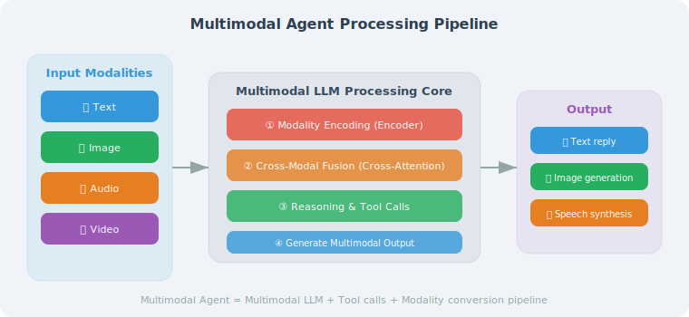

# Multimodal Capabilities Overview

> **Section Goal**: Understand the capability boundaries and typical application scenarios of multimodal large models.

---

## What is Multimodal?



"Multimodal" refers to the ability to simultaneously process and understand multiple types of information (modalities):

| Modality | Input | Output |
|----------|-------|--------|
| Text | Natural language questions | Text answers |
| Image | Photos, screenshots | Image descriptions, generated images |
| Audio | Voice commands | Voice replies |
| Video | Video clips | Video descriptions, keyframe analysis |

GPT-4o is a typical multimodal model — it can simultaneously understand text and image inputs.

---

## Application Scenarios for Multimodal Agents

```python
MULTIMODAL_USE_CASES = {
    "Image Analysis Assistant": {
        "Input": "User uploads a photo",
        "Agent does": "Identify content, extract text, analyze scene",
        "Example": "Auto-translate menu photos, auto-solve math problems from photos"
    },
    "Voice Interaction Assistant": {
        "Input": "User speaks",
        "Agent does": "Speech-to-text → understand intent → execute → voice reply",
        "Example": "Smart speakers, in-car assistants"
    },
    "Document Processing Assistant": {
        "Input": "PDF/PPT with images and text",
        "Agent does": "Understand charts and text, generate summaries and analysis",
        "Example": "Auto-analyze financial reports, summarize research papers"
    },
    "Creative Design Assistant": {
        "Input": "Text description + reference images",
        "Agent does": "Generate design images matching requirements",
        "Example": "Logo design, UI mockup generation"
    }
}
```

---

## Mainstream Models Supporting Multimodal

| Model | Text Understanding | Image Understanding | Image Generation | Audio |
|-------|-------------------|--------------------|--------------------|-------|
| GPT-4o | ✅ | ✅ | ✅ (DALL-E) | ✅ |
| Claude 4 | ✅ | ✅ | ❌ | ❌ |
| Gemini 2.5 Pro | ✅ | ✅ | ✅ | ✅ |
| Qwen | ✅ | ✅ | ✅ | ✅ |

> ⏰ *Note: The table above is based on publicly available capability information for each model as of March 2026. Model capabilities are updated frequently; please refer to official documentation.*

---

## Using Multimodal in Python

```python
from openai import OpenAI
import base64

client = OpenAI()

def analyze_image(image_path: str, question: str) -> str:
    """Analyze an image with GPT-4o"""
    
    # Read and encode the image
    with open(image_path, "rb") as f:
        image_data = base64.b64encode(f.read()).decode()
    
    response = client.chat.completions.create(
        model="gpt-4o",
        messages=[
            {
                "role": "user",
                "content": [
                    {"type": "text", "text": question},
                    {
                        "type": "image_url",
                        "image_url": {
                            "url": f"data:image/png;base64,{image_data}"
                        }
                    }
                ]
            }
        ],
        max_tokens=1000
    )
    
    return response.choices[0].message.content


# Usage example
result = analyze_image(
    "screenshot.png",
    "What is in this screenshot? Please describe in detail."
)
print(result)
```

---

## Cross-Modal Fusion Architecture


The core challenge of multimodal Agents is how to fuse information from different modalities into a unified understanding. There are three mainstream fusion approaches:

```python
# Three cross-modal fusion architectures

FUSION_ARCHITECTURES = {
    "early_fusion": {
        "Principle": "Concatenate raw data from all modalities and feed into the model together",
        "Advantages": "Model can learn low-level feature correlations between modalities",
        "Disadvantages": "High computational cost, requires specific model architecture",
        "Representative": "GPT-4o (native multimodal input)"
    },
    "late_fusion": {
        "Principle": "Each modality is processed independently, then results are merged at the decision layer",
        "Advantages": "Modular, flexible, each modality can be optimized independently",
        "Disadvantages": "May lose interaction information between modalities",
        "Representative": "Traditional Pipeline (OCR + NLP processed separately)"
    },
    "hybrid_fusion": {
        "Principle": "Cross-modal interactions at multiple levels simultaneously",
        "Advantages": "Balances low-level features and high-level semantics",
        "Disadvantages": "Complex architecture, high training cost",
        "Representative": "Gemini (multi-level cross-modal attention)"
    }
}
```

For Agent developers, **you usually don't need to implement fusion architectures yourself** — just choose the right multimodal model API. But understanding these architectures helps you:
- Determine which tasks are suitable for the current model's capabilities
- Analyze possible causes when the model misunderstands
- Design better multimodal Prompts

---

## Multimodal Agent Design Patterns

In practice, multimodal Agents typically adopt the following design patterns:

### Pattern 1: Modality Router

Route to different processing pipelines based on the type of user input:

```python
from openai import OpenAI

client = OpenAI()

class ModalityRouter:
    """Route to the appropriate processing flow based on input modality"""
    
    def __init__(self):
        self.handlers = {
            "text": self._handle_text,
            "image": self._handle_image,
            "audio": self._handle_audio,
        }
    
    async def route(self, input_data: dict) -> str:
        modality = input_data.get("type", "text")
        handler = self.handlers.get(modality, self._handle_text)
        return await handler(input_data)
    
    async def _handle_text(self, data: dict) -> str:
        response = client.chat.completions.create(
            model="gpt-4o-mini",  # Use cheaper model for pure text
            messages=[{"role": "user", "content": data["content"]}]
        )
        return response.choices[0].message.content
    
    async def _handle_image(self, data: dict) -> str:
        response = client.chat.completions.create(
            model="gpt-4o",  # Image understanding requires multimodal model
            messages=[{
                "role": "user",
                "content": [
                    {"type": "text", "text": data.get("question", "Describe this image")},
                    {"type": "image_url", "image_url": {"url": data["image_url"]}}
                ]
            }]
        )
        return response.choices[0].message.content
    
    async def _handle_audio(self, data: dict) -> str:
        # Transcribe first, then understand
        transcript = client.audio.transcriptions.create(
            model="whisper-1",
            file=open(data["audio_path"], "rb")
        )
        # Process transcription as text
        return await self._handle_text({"content": transcript.text})
```

### Pattern 2: Multimodal Enhancement Chain

Add multimodal capabilities to a text Agent through tools:

```python
from langchain_core.tools import tool

@tool
def analyze_image_tool(image_url: str, question: str = "Describe the image content") -> str:
    """Analyze image content. Pass in image URL and question, return analysis result."""
    response = client.chat.completions.create(
        model="gpt-4o",
        messages=[{
            "role": "user",
            "content": [
                {"type": "text", "text": question},
                {"type": "image_url", "image_url": {"url": image_url}}
            ]
        }],
        max_tokens=500
    )
    return response.choices[0].message.content

@tool
def generate_image_tool(prompt: str) -> str:
    """Generate an image from a text description. Returns the generated image URL."""
    response = client.images.generate(
        model="dall-e-3",
        prompt=prompt,
        size="1024x1024",
        n=1
    )
    return f"Image generated: {response.data[0].url}"

@tool
def transcribe_audio_tool(audio_path: str) -> str:
    """Convert an audio file to text. Supports mp3, wav, m4a, and other formats."""
    with open(audio_path, "rb") as f:
        transcript = client.audio.transcriptions.create(
            model="whisper-1", file=f
        )
    return transcript.text

# Register these tools with a text Agent to give it multimodal capabilities
multimodal_tools = [analyze_image_tool, generate_image_tool, transcribe_audio_tool]
```

> 💡 **Design recommendation**: Pattern 2 (tool enhancement) is the **most recommended** approach for beginners — you can progressively add multimodal tools to an existing text Agent without rewriting the entire architecture.

---

## Multimodal Agent vs Pure Text Agent

Key differences between multimodal Agents and pure text Agents:

```python
# Pure text Agent: can only process text
text_agent_response = agent.run("Analyze this data")
# User must manually paste data as text

# Multimodal Agent: can directly process images, files
multimodal_response = agent.run(
    "Analyze the data in this financial report screenshot",
    images=["financial_report.png"]
)
# Agent automatically recognizes table content → extracts data → performs analysis
```

**Three major challenges of multimodal development**:

| Challenge | Description | Mitigation Strategy |
|-----------|-------------|---------------------|
| Modality understanding bias | LLM may misread image content | Multi-turn confirmation + structured extraction |
| High token consumption | Image encoding uses many tokens | Image compression + on-demand transmission |
| Increased latency | Multimodal inference is slower than pure text | Async processing + streaming output |

---

## Image Token Cost Optimization

In multimodal APIs, the number of tokens consumed by images is directly related to image size. Controlling image size appropriately can **significantly reduce costs**:

```python
from PIL import Image
import io
import base64

def optimize_image_for_api(
    image_path: str,
    max_size: int = 1024,
    quality: int = 85
) -> str:
    """Optimize image size and quality to reduce API token consumption
    
    GPT-4o image token calculation rules (2026-03):
    - low detail: fixed 85 tokens
    - high detail: based on 512x512 tiles, 170 tokens per tile + 85 base
    
    Therefore, reducing images to within 1024px can significantly lower costs.
    """
    img = Image.open(image_path)
    
    # Proportional scaling
    if max(img.size) > max_size:
        ratio = max_size / max(img.size)
        new_size = (int(img.size[0] * ratio), int(img.size[1] * ratio))
        img = img.resize(new_size, Image.LANCZOS)
    
    # Convert to JPEG and compress
    buffer = io.BytesIO()
    img.convert("RGB").save(buffer, format="JPEG", quality=quality)
    
    return base64.b64encode(buffer.getvalue()).decode()


def analyze_with_detail_control(
    image_path: str,
    question: str,
    detail: str = "auto"
) -> str:
    """Control image analysis precision (low/high/auto)
    
    low: Quick overview, suitable for simple classification, presence detection
    high: Fine-grained analysis, suitable for text recognition, detail extraction
    auto: Let the model decide
    """
    image_b64 = optimize_image_for_api(image_path)
    
    response = client.chat.completions.create(
        model="gpt-4o",
        messages=[{
            "role": "user",
            "content": [
                {"type": "text", "text": question},
                {
                    "type": "image_url",
                    "image_url": {
                        "url": f"data:image/jpeg;base64,{image_b64}",
                        "detail": detail  # Control precision
                    }
                }
            ]
        }],
        max_tokens=500
    )
    return response.choices[0].message.content
```

---

## Summary

| Concept | Description |
|---------|-------------|
| Multimodal | Simultaneously process text, images, audio, and other information |
| Mainstream models | GPT-4o, Claude 4, Gemini 2.5 Pro |
| Typical scenarios | Image analysis, voice interaction, document processing, creative design |
| Core process | Input encoding → cross-modal fusion → reasoning → multimodal output |
| Key challenges | Modality understanding bias, token consumption, latency control |

> **Next Section Preview**: We will dive deep into image understanding and generation capabilities.

---

[Next: 21.2 Image Understanding and Generation →](./02_image_understanding.md)
