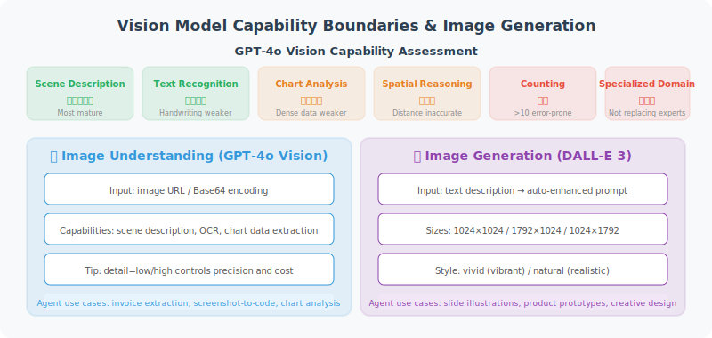

# Image Understanding and Generation

> **Section Goal**: Master the techniques for analyzing images with GPT-4o and generating images with DALL-E, with a deep understanding of the capability boundaries and Prompt techniques for vision models.



---

## Capabilities and Boundaries of Vision Models

Before diving into coding, we need to objectively understand what current Vision Language Models (VLMs) can and cannot do. Understanding capability boundaries helps set reasonable expectations in Agent design and avoid building unrealistic features.

### Capability Assessment Dimensions

| Capability Dimension | Performance Level | Typical Applications | Notes |
|---------------------|------------------|---------------------|-------|
| **Scene Description** | ⭐⭐⭐⭐⭐ | Image content overview, scene classification | Most mature capability |
| **Text Recognition (OCR)** | ⭐⭐⭐⭐ | Invoice extraction, screenshot to text | Accuracy drops for handwriting and blurry text |
| **Chart Analysis** | ⭐⭐⭐⭐ | Reading bar/line chart data | Dense data points prone to omission or misreading |
| **Spatial Reasoning** | ⭐⭐⭐ | "Is the object on the left larger than the right?" | Precise distance/angle estimation unreliable |
| **Fine-grained Counting** | ⭐⭐ | "How many people are in the image?" | Error-prone when count exceeds 10 |
| **Specialized Domain Recognition** | ⭐⭐⭐ | Medical imaging, circuit diagrams | Accuracy insufficient to replace professionals |
| **Multi-image Reasoning** | ⭐⭐⭐⭐ | Before/after comparison, spot the difference | Attention disperses with more than 4 images |

> ⚠️ **Key insight**: Vision models are assistants that "can see but may not see accurately." When building Agents, for scenarios requiring precise counting, spatial measurement, or professional diagnosis, treat model output as "reference opinion" rather than "definitive fact," and introduce human confirmation steps when necessary (see Chapter 12 Human-in-the-Loop pattern).

### Multi-Turn Visual Conversations

GPT-4o supports retaining image context in conversation history for multi-turn visual conversations. This is very useful in real Agents — users can upload an image first, then progressively deepen the analysis through multiple follow-up questions:

```python
class MultiTurnVisionChat:
    """Multi-turn visual conversation manager"""
    
    def __init__(self, model: str = "gpt-4o"):
        self.client = OpenAI()
        self.model = model
        self.messages: list[dict] = []
    
    def send_image(self, image_path: str, question: str) -> str:
        """Send image and ask question (first turn)"""
        with open(image_path, "rb") as f:
            data = base64.b64encode(f.read()).decode()
        
        self.messages.append({
            "role": "user",
            "content": [
                {"type": "text", "text": question},
                {"type": "image_url", 
                 "image_url": {"url": f"data:image/png;base64,{data}"}}
            ]
        })
        
        response = self.client.chat.completions.create(
            model=self.model,
            messages=self.messages,
            max_tokens=2000
        )
        
        reply = response.choices[0].message.content
        self.messages.append({"role": "assistant", "content": reply})
        return reply
    
    def follow_up(self, question: str) -> str:
        """Follow-up question (subsequent turns, no need to resend image)"""
        self.messages.append({"role": "user", "content": question})
        
        response = self.client.chat.completions.create(
            model=self.model,
            messages=self.messages,
            max_tokens=2000
        )
        
        reply = response.choices[0].message.content
        self.messages.append({"role": "assistant", "content": reply})
        return reply

# Usage example: multi-turn analysis of an architecture diagram
chat = MultiTurnVisionChat()
print(chat.send_image("system_arch.png", "Please describe the overall structure of this system architecture diagram"))
print(chat.follow_up("What is the data flow in the diagram?"))
print(chat.follow_up("What potential bottlenecks do you see in this architecture?"))
```

---

## Prompt Engineering for Image Analysis

Unlike pure text Prompts, visual task Prompts need special attention to **guiding the model to focus on the correct regions and dimensions**:

### General Principles

1. **Specify task type**: Tell the model whether you need description, extraction, comparison, or judgment
2. **Specify output format**: Request JSON, table, or structured text to avoid the model improvising
3. **Provide domain context**: "This is an e-commerce product image" works much better than "describe this image"
4. **Step-by-step guidance**: For complex analysis, have the model give an overview first, then break down details

### Common Prompt Templates

```python
# Structured information extraction
EXTRACT_PROMPT = """Please extract the following information from this image and return as JSON:
{
  "document_type": "document type",
  "key_fields": {"field_name": "field_value", ...},
  "confidence": "high/medium/low"
}
If a field cannot be recognized, fill in null."""

# Comparative analysis
COMPARE_PROMPT = """Please compare these two images:
1. List all differences (check at minimum: colors, text, layout, element count)
2. Assess the significance of each difference (high/medium/low)
3. Output results in table format"""

# Chart data extraction
CHART_PROMPT = """This is a data chart. Please:
1. Identify the chart type (bar/line/pie/scatter, etc.)
2. Extract all readable data points in table format
3. Summarize the main trends or conclusions shown in the chart
Note: If certain values are unclear, mark as "approximately" and provide an estimate."""
```

---

## Image Understanding

### Encapsulating Image Analysis Tools

```python
from openai import OpenAI
import base64
import httpx

class VisionTool:
    """Image analysis tool"""
    
    def __init__(self, model: str = "gpt-4o"):
        self.client = OpenAI()
        self.model = model
    
    def analyze_local_image(
        self,
        image_path: str,
        prompt: str = "Please describe the content of this image"
    ) -> str:
        """Analyze a local image"""
        with open(image_path, "rb") as f:
            image_data = base64.b64encode(f.read()).decode()
        
        # Auto-detect image format
        ext = image_path.rsplit(".", 1)[-1].lower()
        mime_type = {
            "jpg": "image/jpeg", "jpeg": "image/jpeg",
            "png": "image/png", "gif": "image/gif",
            "webp": "image/webp"
        }.get(ext, "image/png")
        
        return self._call_vision(
            prompt,
            f"data:{mime_type};base64,{image_data}"
        )
    
    def analyze_url_image(
        self,
        image_url: str,
        prompt: str = "Please describe the content of this image"
    ) -> str:
        """Analyze an image from a URL"""
        return self._call_vision(prompt, image_url)
    
    def compare_images(
        self,
        image_paths: list[str],
        prompt: str = "Please compare the similarities and differences of these images"
    ) -> str:
        """Compare multiple images"""
        content = [{"type": "text", "text": prompt}]
        
        for path in image_paths:
            with open(path, "rb") as f:
                data = base64.b64encode(f.read()).decode()
            content.append({
                "type": "image_url",
                "image_url": {"url": f"data:image/png;base64,{data}"}
            })
        
        response = self.client.chat.completions.create(
            model=self.model,
            messages=[{"role": "user", "content": content}],
            max_tokens=2000
        )
        return response.choices[0].message.content
    
    def _call_vision(self, prompt: str, image_url: str) -> str:
        """Call the Vision API"""
        response = self.client.chat.completions.create(
            model=self.model,
            messages=[
                {
                    "role": "user",
                    "content": [
                        {"type": "text", "text": prompt},
                        {
                            "type": "image_url",
                            "image_url": {"url": image_url}
                        }
                    ]
                }
            ],
            max_tokens=2000
        )
        return response.choices[0].message.content
```

---

## Image Generation

### Generating Images with DALL-E

```python
class ImageGenerator:
    """Image generation tool (based on DALL-E)"""
    
    def __init__(self):
        self.client = OpenAI()
    
    def generate(
        self,
        prompt: str,
        size: str = "1024x1024",
        quality: str = "standard",
        n: int = 1
    ) -> list[str]:
        """Generate images from a description"""
        
        response = self.client.images.generate(
            model="dall-e-3",
            prompt=prompt,
            size=size,        # "1024x1024", "1792x1024", "1024x1792"
            quality=quality,  # "standard" or "hd"
            n=n
        )
        
        return [img.url for img in response.data]
    
    def edit_image(
        self,
        image_path: str,
        prompt: str,
        mask_path: str = None
    ) -> str:
        """Edit an existing image"""
        
        with open(image_path, "rb") as f:
            image_file = f.read()
        
        kwargs = {
            "model": "dall-e-2",
            "image": image_file,
            "prompt": prompt,
            "n": 1,
            "size": "1024x1024"
        }
        
        if mask_path:
            with open(mask_path, "rb") as f:
                kwargs["mask"] = f.read()
        
        response = self.client.images.edit(**kwargs)
        return response.data[0].url
```

---

## Practical Examples

```python
# Example 1: OCR — extract text from an image
vision = VisionTool()

text = vision.analyze_local_image(
    "receipt.jpg",
    "Please extract all text information from this receipt and return as structured JSON"
)
print(text)

# Example 2: Chart analysis
analysis = vision.analyze_local_image(
    "sales_chart.png",
    "Please analyze this sales chart and identify key trends and data points"
)
print(analysis)

# Example 3: Code screenshot to code
code = vision.analyze_local_image(
    "code_screenshot.png",
    "Please transcribe the code in the screenshot to text, preserving formatting"
)
print(code)
```

---

## Summary

| Feature | API | Description |
|---------|-----|-------------|
| Image analysis | GPT-4o Vision | Understand image content, extract text |
| Image comparison | GPT-4o Vision | Multiple image input, analyze similarities/differences |
| Image generation | DALL-E 3 | Generate images from text descriptions |
| Image editing | DALL-E 2 | Modify existing images |

---

[Next: 21.3 Voice Interaction Integration →](./03_voice_interaction.md)
