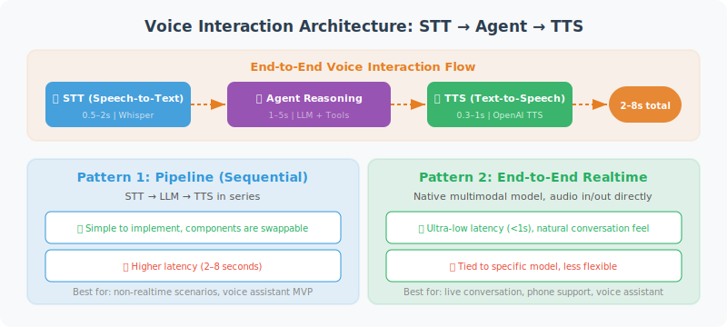

# Voice Interaction Integration

> **Section Goal**: Integrate speech recognition (STT) and text-to-speech (TTS) capabilities into the Agent, and understand real-time voice processing architecture and multilingual support strategies.



---

## Voice Interaction Architecture Overview

The core challenge of voice Agents is **latency**. Users expect voice interaction to feel "as natural as talking to a person," meaning the delay from finishing speaking to hearing a reply cannot exceed 1–2 seconds. The entire pipeline involves three latency sources:

| Stage | Typical Latency | Optimization Direction |
|-------|----------------|----------------------|
| Speech Recognition (STT) | 0.5–2s | Streaming recognition, endpoint detection |
| Agent Reasoning | 1–5s | Streaming output, caching |
| Text-to-Speech (TTS) | 0.3–1s | Streaming synthesis, pre-generation |
| **End-to-End Total Latency** | **2–8s** | **Full-pipeline streaming** |

### Two Architecture Patterns

**Pattern 1: Sequential Processing (STT → LLM → TTS)**

After audio recording is complete, perform speech recognition, LLM reasoning, and speech synthesis in sequence. Simple to implement, higher latency (3–8 seconds), suitable for scenarios with low real-time requirements. The first half of this section uses this pattern.

**Pattern 2: Full-Pipeline Streaming**

Speech recognition transcribes while listening, LLM outputs while thinking, TTS synthesizes while playing — three stages execute in parallel pipeline. Latency can be reduced to 1–2 seconds, but implementation complexity is high. OpenAI's Realtime API uses this pattern.

---

## Speech Recognition (Speech-to-Text)

Use OpenAI's Whisper model to convert speech to text:

```python
from openai import OpenAI
from pathlib import Path

class SpeechToText:
    """Speech-to-text tool"""
    
    def __init__(self):
        self.client = OpenAI()
    
    def transcribe(
        self,
        audio_path: str,
        language: str = "en"
    ) -> str:
        """Convert an audio file to text"""
        
        with open(audio_path, "rb") as audio_file:
            transcript = self.client.audio.transcriptions.create(
                model="whisper-1",
                file=audio_file,
                language=language,
                response_format="text"
            )
        
        return transcript
    
    def transcribe_with_timestamps(
        self,
        audio_path: str,
        language: str = "en"
    ) -> dict:
        """Transcribe and return timestamps"""
        
        with open(audio_path, "rb") as audio_file:
            transcript = self.client.audio.transcriptions.create(
                model="whisper-1",
                file=audio_file,
                language=language,
                response_format="verbose_json",
                timestamp_granularities=["segment"]
            )
        
        return {
            "text": transcript.text,
            "segments": [
                {
                    "text": seg.text,
                    "start": seg.start,
                    "end": seg.end
                }
                for seg in (transcript.segments or [])
            ]
        }


# Usage example
stt = SpeechToText()
text = stt.transcribe("user_voice.mp3")
print(f"User said: {text}")
```

---

## Text-to-Speech

Convert the Agent's text replies to audio:

```python
class TextToSpeech:
    """Text-to-speech tool"""
    
    VOICES = ["alloy", "echo", "fable", "onyx", "nova", "shimmer"]
    
    def __init__(self, voice: str = "nova"):
        self.client = OpenAI()
        self.voice = voice
    
    def speak(
        self,
        text: str,
        output_path: str = "response.mp3",
        speed: float = 1.0
    ) -> str:
        """Convert text to an audio file"""
        
        response = self.client.audio.speech.create(
            model="tts-1",       # or "tts-1-hd" for high quality
            voice=self.voice,
            input=text,
            speed=speed          # 0.25 - 4.0
        )
        
        response.stream_to_file(output_path)
        return output_path
    
    def stream_speak(self, text: str):
        """Streaming speech synthesis (generate and play simultaneously)"""
        
        response = self.client.audio.speech.create(
            model="tts-1",
            voice=self.voice,
            input=text
        )
        
        # Return byte stream, can be received and played simultaneously
        return response.content


# Usage example
tts = TextToSpeech(voice="nova")
tts.speak("Hello! I'm your AI assistant. How can I help you today?")
```

---

## Voice Conversation Loop

```python
import asyncio

class VoiceConversation:
    """Voice conversation system"""
    
    def __init__(self, agent_func):
        self.stt = SpeechToText()
        self.tts = TextToSpeech(voice="nova")
        self.agent = agent_func  # Agent processing function
    
    async def process_voice(self, audio_path: str) -> str:
        """Process one round of voice conversation"""
        
        # 1. Audio → Text
        print("🎤 Recognizing speech...")
        user_text = self.stt.transcribe(audio_path)
        print(f"📝 Recognition result: {user_text}")
        
        # 2. Agent processing
        print("🤔 Agent thinking...")
        response_text = await self.agent(user_text)
        print(f"💬 Agent reply: {response_text}")
        
        # 3. Text → Audio
        print("🔊 Generating audio...")
        audio_output = self.tts.speak(response_text)
        print(f"✅ Audio saved: {audio_output}")
        
        return audio_output
```

---

## OpenAI Realtime API: Low-Latency Voice Interaction

In late 2024, OpenAI launched the Realtime API <sup>[1]</sup>, supporting direct audio input/output (Audio-in, Audio-out), bypassing the traditional STT → LLM → TTS three-stage process and reducing end-to-end latency to sub-second levels.

### Core Features

- **Speech-to-Speech**: The model directly receives audio input and generates audio output, without intermediate text conversion steps
- **WebSocket persistent connection**: Establishes a persistent connection via WebSocket, supporting bidirectional real-time communication
- **Function Calling**: Even in voice mode, the Agent can call external tools
- **Voice Activity Detection (VAD)**: Built-in endpoint detection, automatically determines when the user has finished speaking

### Basic Connection Example

```python
import asyncio
import websockets
import json
import base64

class RealtimeVoiceAgent:
    """Voice Agent based on OpenAI Realtime API"""
    
    REALTIME_URL = "wss://api.openai.com/v1/realtime?model=gpt-4o-realtime-preview"
    
    def __init__(self, api_key: str, instructions: str = "You are a friendly voice assistant"):
        self.api_key = api_key
        self.instructions = instructions
    
    async def connect(self):
        """Establish WebSocket connection"""
        headers = {
            "Authorization": f"Bearer {self.api_key}",
            "OpenAI-Beta": "realtime=v1"
        }
        
        async with websockets.connect(
            self.REALTIME_URL, 
            additional_headers=headers
        ) as ws:
            # Configure session
            await ws.send(json.dumps({
                "type": "session.update",
                "session": {
                    "instructions": self.instructions,
                    "voice": "nova",
                    "input_audio_format": "pcm16",
                    "output_audio_format": "pcm16",
                    "turn_detection": {
                        "type": "server_vad",  # Server-side voice activity detection
                        "threshold": 0.5,
                        "silence_duration_ms": 500
                    }
                }
            }))
            
            # Event handling loop
            async for message in ws:
                event = json.loads(message)
                await self._handle_event(event)
    
    async def _handle_event(self, event: dict):
        """Handle server-side events"""
        event_type = event.get("type", "")
        
        if event_type == "response.audio.delta":
            # Received audio chunk, can play immediately
            audio_chunk = base64.b64decode(event["delta"])
            await self._play_audio(audio_chunk)
        
        elif event_type == "response.text.delta":
            # Received text chunk (for debugging)
            print(event["delta"], end="", flush=True)
        
        elif event_type == "response.function_call_arguments.done":
            # Agent requests tool call
            await self._handle_tool_call(event)
    
    async def _play_audio(self, chunk: bytes):
        """Play audio chunk (requires audio playback library integration)"""
        # In actual implementation, use pyaudio or sounddevice
        pass
    
    async def _handle_tool_call(self, event: dict):
        """Handle tool calls"""
        # Same logic as Function Calling in text mode
        pass
```

> 💡 **Selection advice**: If your Agent needs "phone call-like" real-time voice interaction (e.g., customer service bots, voice assistants), the Realtime API currently provides the best experience. If you only occasionally need voice input/output (e.g., voice memos), the traditional STT + TTS approach is simpler and more controllable.

---

## Multilingual and Dialect Support

### Whisper's Language Capabilities

OpenAI Whisper supports speech recognition in 99 languages, but accuracy varies significantly across languages:

| Language Category | Representative Languages | WER (Word Error Rate) | Recommendation |
|------------------|--------------------------|----------------------|----------------|
| High-resource languages | English, Mandarin Chinese | < 5% | Use directly, excellent results |
| Medium-resource languages | Japanese, Korean, German | 5–15% | Usable, recommend specifying `language` parameter |
| Low-resource languages | Cantonese, Tibetan, dialects | 15–30% | Requires post-processing correction |

### Multilingual Agent Design Strategy

```python
class MultilingualVoiceAgent:
    """Multilingual voice Agent"""
    
    # Language to TTS voice mapping
    VOICE_MAP = {
        "en": "alloy",     # English uses alloy
        "zh": "nova",      # Chinese uses nova (more natural)
        "ja": "shimmer",   # Japanese uses shimmer
    }
    
    def __init__(self):
        self.stt = SpeechToText()
        self.client = OpenAI()
    
    async def detect_and_respond(self, audio_path: str) -> str:
        """Auto-detect language and reply in the same language"""
        
        # Whisper auto-detects language
        with open(audio_path, "rb") as f:
            result = self.client.audio.transcriptions.create(
                model="whisper-1",
                file=f,
                response_format="verbose_json"
            )
        
        detected_lang = result.language  # e.g., "english", "chinese"
        lang_code = {"chinese": "zh", "english": "en", "japanese": "ja"
                    }.get(detected_lang, "en")
        
        # Reply in the detected language
        voice = self.VOICE_MAP.get(lang_code, "nova")
        
        # Agent processing (specify reply language in System Prompt)
        response = await self._process_with_language(result.text, lang_code)
        
        # Synthesize speech with the corresponding language voice
        tts = TextToSpeech(voice=voice)
        return tts.speak(response)
```

---

## Voice Sentiment Analysis

Voice conveys not only text information but also emotional cues (tone, speed, pitch). In customer service, mental health, and other scenarios, recognizing user emotions has important value:

```python
class VoiceSentimentAnalyzer:
    """Voice-based sentiment analysis"""
    
    def __init__(self):
        self.client = OpenAI()
    
    async def analyze(self, audio_path: str) -> dict:
        """Analyze the text content and sentiment of speech"""
        
        # Step 1: Transcribe speech
        with open(audio_path, "rb") as f:
            transcript = self.client.audio.transcriptions.create(
                model="whisper-1", file=f, 
                response_format="verbose_json",
                timestamp_granularities=["segment"]
            )
        
        # Step 2: Let LLM analyze sentiment
        # Note: This only analyzes the sentiment of the text semantics.
        # True acoustic sentiment analysis requires specialized models (e.g., emotion2vec)
        analysis_prompt = f"""Analyze the sentiment of the following speech transcription, return JSON:
{{
  "text": "original text",
  "sentiment": "positive/neutral/negative",
  "emotion": "primary emotion (e.g., happy, anxious, angry, calm)",
  "urgency": "high/medium/low",
  "confidence": 0.0-1.0
}}

Transcription: {transcript.text}"""
        
        response = self.client.chat.completions.create(
            model="gpt-4o",
            messages=[{"role": "user", "content": analysis_prompt}],
            response_format={"type": "json_object"}
        )
        
        return json.loads(response.choices[0].message.content)
```

---

## Voice Agent Design Patterns

In practice, voice Agents have several common design patterns:

### Pattern 1: Voice Frontend + Text Backend

The simplest pattern. Voice is just the "skin" for input/output; the Agent core still processes text. Suitable for the vast majority of scenarios.

```
🎤 User voice → [STT] → Text → [Agent] → Text → [TTS] → 🔊 Voice reply
```

### Pattern 2: Voice-Aware Agent

The Agent can perceive voice characteristics (speed, pauses, emotion) and adjust reply strategy accordingly. For example, when detecting urgency in the user's tone, reply more concisely and directly.

### Pattern 3: Continuous Listening Agent

The Agent continuously monitors ambient audio and activates when it detects a wake word or specific event. Suitable for smart home and in-car scenarios. Requires a lightweight local VAD (Voice Activity Detection) model.

### Pattern Comparison

| Pattern | Complexity | Latency | Applicable Scenarios |
|---------|-----------|---------|---------------------|
| Voice frontend + text backend | ⭐ | 3–8s | General assistants, customer service |
| Voice-aware Agent | ⭐⭐⭐ | 3–8s | Emotional customer service, counseling |
| Continuous listening Agent | ⭐⭐⭐⭐ | 1–3s | Smart home, in-car |
| Realtime API Agent | ⭐⭐ | 0.5–2s | Real-time conversation, phone Agent |

---

## References

[1] OpenAI. "Realtime API." OpenAI Platform Documentation, 2024. https://platform.openai.com/docs/guides/realtime

---

## Summary

| Feature | Model | Description |
|---------|-------|-------------|
| Speech recognition | Whisper | Supports 50+ languages, high accuracy |
| Text-to-speech | TTS-1 | 6 voice options |
| Voice conversation | Combined use | Complete STT → Agent → TTS pipeline |

---

[Next: 21.4 Practice: Multimodal Personal Assistant →](./04_practice_multimodal_assistant.md)