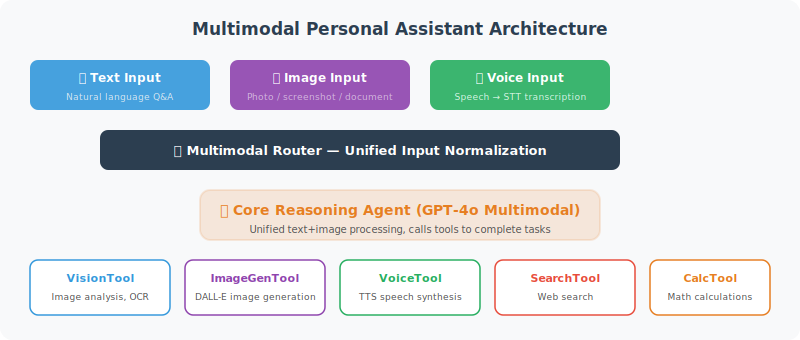

# Practice: Multimodal Personal Assistant

> **Section Goal**: Build a multimodal Agent that can handle text, image, and voice input.



---

## Complete Implementation

```python
"""
Multimodal Personal Assistant — supports text, image, and voice input
"""
import asyncio
import os
from openai import OpenAI
from langchain_openai import ChatOpenAI

# Import components implemented in previous sections
# Full implementations of each component are in the corresponding sections:
# from vision_tool import VisionTool           # → Section 21.2
# from image_generator import ImageGenerator   # → Section 21.2
# from speech_to_text import SpeechToText      # → Section 21.3
# from text_to_speech import TextToSpeech      # → Section 21.3
# Note: Before running this section's code, save sections 21.2–21.3 code as independent modules


class MultimodalAssistant:
    """Multimodal personal assistant"""
    
    def __init__(self):
        self.client = OpenAI()
        self.llm = ChatOpenAI(model="gpt-4o", temperature=0.7)
        self.vision = VisionTool()
        self.image_gen = ImageGenerator()
        self.stt = SpeechToText()
        self.tts = TextToSpeech(voice="nova")
        
        self.history = []  # Conversation history
    
    async def process(self, user_input: dict) -> dict:
        """Process multimodal input
        
        Args:
            user_input: {
                "text": "optional text",
                "image": "optional image path",
                "audio": "optional audio path"
            }
        
        Returns:
            {
                "text": "text reply",
                "image": "optional image path",
                "audio": "optional audio path"
            }
        """
        
        # 1. Unify to text
        text_input = await self._unify_input(user_input)
        print(f"📝 Understood as: {text_input}")
        
        # 2. Determine what type of output is needed
        output_type = await self._classify_output(text_input)
        
        # 3. Process and generate reply
        result = {"text": "", "image": None, "audio": None}
        
        if output_type == "image_generation":
            # Need to generate an image
            urls = self.image_gen.generate(text_input)
            result["text"] = "Image generated for you ✨"
            result["image"] = urls[0] if urls else None
            
        elif output_type == "image_analysis":
            # Analyze image
            if user_input.get("image"):
                analysis = self.vision.analyze_local_image(
                    user_input["image"], text_input
                )
                result["text"] = analysis
            else:
                result["text"] = "Please provide the image you want to analyze."
            
        else:
            # Regular text conversation
            self.history.append({"role": "user", "content": text_input})
            
            response = await self.llm.ainvoke(self.history)
            result["text"] = response.content
            
            self.history.append({
                "role": "assistant", "content": result["text"]
            })
        
        # 4. If voice input, also generate voice reply
        if user_input.get("audio"):
            audio_path = self.tts.speak(result["text"])
            result["audio"] = audio_path
        
        return result
    
    async def _unify_input(self, user_input: dict) -> str:
        """Unify multimodal input to text"""
        parts = []
        
        if user_input.get("audio"):
            # Speech to text
            text = self.stt.transcribe(user_input["audio"])
            parts.append(text)
        
        if user_input.get("text"):
            parts.append(user_input["text"])
        
        if user_input.get("image") and not parts:
            parts.append("Please describe this image")
        
        return " ".join(parts)
    
    async def _classify_output(self, text: str) -> str:
        """Determine what type of output to produce"""
        
        # Simple keyword detection
        if any(kw in text.lower() for kw in ["generate image", "draw", "create image", "design a"]):
            return "image_generation"
        elif any(kw in text.lower() for kw in ["analyze image", "look at this", "in the image", "in the picture"]):
            return "image_analysis"
        else:
            return "text"


async def main():
    """Interactive multimodal assistant"""
    
    print("🌟 Multimodal Personal Assistant")
    print("=" * 40)
    print("Commands:")
    print("  Type text directly → text conversation")
    print("  img:<path>         → analyze image")
    print("  gen:<description>  → generate image")
    print("  quit               → exit")
    print()
    
    assistant = MultimodalAssistant()
    
    while True:
        raw_input = input("You: ").strip()
        
        if raw_input.lower() in ("quit", "exit", "q"):
            print("👋 Goodbye!")
            break
        
        if not raw_input:
            continue
        
        # Parse input type
        user_input = {"text": None, "image": None, "audio": None}
        
        if raw_input.startswith("img:"):
            image_path = raw_input[4:].strip()
            user_input["image"] = image_path
            user_input["text"] = "Please analyze this image"
        elif raw_input.startswith("gen:"):
            user_input["text"] = "generate image: " + raw_input[4:].strip()
        else:
            user_input["text"] = raw_input
        
        # Process
        result = await assistant.process(user_input)
        
        # Display results
        print(f"\n🤖: {result['text']}")
        if result.get("image"):
            print(f"🖼️  Image: {result['image']}")
        if result.get("audio"):
            print(f"🔊 Audio: {result['audio']}")
        print()


if __name__ == "__main__":
    asyncio.run(main())
```

---

## Usage Output

```
🌟 Multimodal Personal Assistant
========================================

You: Hello, what's the weather like today?
🤖: Hello! I don't have access to real-time weather data, but I can suggest checking a weather app.

You: img:receipt.jpg
📝 Understood as: Please analyze this image
🤖: This is a restaurant receipt containing the following information:
    - Restaurant: Old Beijing Hot Pot
    - Amount: $42.50
    - Date: 2026-03-10
    ...

You: gen:a shiba inu wearing sunglasses sitting on a beach
📝 Understood as: generate image: a shiba inu wearing sunglasses sitting on a beach
🤖: Image generated for you ✨
🖼️  Image: https://...
```

---

## Summary

| Feature | Implementation |
|---------|---------------|
| Text conversation | GPT-4o + conversation history |
| Image analysis | GPT-4o Vision API |
| Image generation | DALL-E 3 |
| Speech recognition | Whisper |
| Text-to-speech | TTS-1 |
| Multimodal fusion | Unified input → classify → route → output |

> 🎓 **Chapter Summary**: Multimodal Agents free AI from text-only interaction. By integrating visual understanding, image generation, speech recognition, and synthesis, we built a more natural and powerful personal assistant.

> 🎉 **Book Summary**: From the basic concepts in Chapter 1 to the multimodal practice in Chapter 21, you have completed the full learning path of Agent development. You have learned tool calling, memory systems, planning and reasoning, RAG, multi-Agent collaboration, secure deployment, and other core technologies. Now go build your own Agent applications!

---

[Appendix A: Common Prompt Template Collection →](../appendix/prompt_templates.md)
