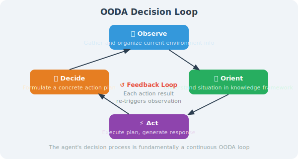
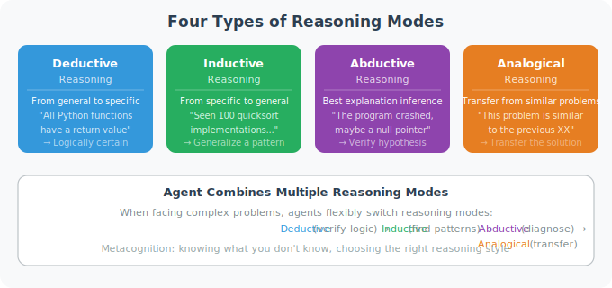

# How Do Agents "Think"?

An Agent's "thinking" is essentially the **process of organizing information, deriving conclusions, and formulating plans within a context**. Understanding this process is a prerequisite for designing effective Agents.

## The Nature of Thinking: Reasoning in Context

LLMs have no independent "thinking space" — all their reasoning happens within the Context Window. By carefully designing prompts, we can guide the model to produce higher-quality reasoning.

```python
from openai import OpenAI

client = OpenAI()

# Without guided reasoning: answer directly (may be wrong)
def direct_answer(question: str) -> str:
    response = client.chat.completions.create(
        model="gpt-4o",
        messages=[{"role": "user", "content": question}]
    )
    return response.choices[0].message.content

# With guided reasoning: think step by step (more accurate)
def structured_thinking(question: str) -> str:
    system_prompt = """When solving problems, strictly follow this framework:

[Problem Analysis]
- What is the core of the problem?
- What are the known conditions?
- What are the uncertain factors?

[Reasoning Process]
1. First step...
2. Second step...
...

[Conclusion]
The final answer is...

[Verification]
Verify whether the answer is reasonable...
"""
    
    response = client.chat.completions.create(
        model="gpt-4o",
        messages=[
            {"role": "system", "content": system_prompt},
            {"role": "user", "content": question}
        ]
    )
    return response.choices[0].message.content

# Comparison test
question = "A bucket full of water weighs 10 kg. Half a bucket of water weighs 6 kg. How much does the empty bucket weigh?"
print("Direct answer:", direct_answer(question))
print("\nStructured thinking:", structured_thinking(question))
```

## Cognitive Framework: The OODA Loop

An Agent's decision-making can be understood through the OODA loop:



```python
class OODAAgent:
    """Agent framework based on the OODA loop"""
    
    def __init__(self):
        self.context = {}  # current situational understanding
    
    def observe(self, input_data: str) -> str:
        """Observe: collect and organize current environmental information"""
        prompt = f"""
Analyze the following input and extract key information:
{input_data}

Please identify:
1. The user's explicit needs
2. Implicit expectations
3. Possible obstacles
"""
        response = client.chat.completions.create(
            model="gpt-4o",
            messages=[{"role": "user", "content": prompt}]
        )
        observation = response.choices[0].message.content
        self.context["observation"] = observation
        return observation
    
    def orient(self, observation: str) -> str:
        """Orient: understand the current situation within a known knowledge framework"""
        prompt = f"""
Based on the following observation, perform a situational assessment:
{observation}

Please analyze:
1. What type of problem is this?
2. What methods and tools are available?
3. What are the main risks and challenges?
"""
        response = client.chat.completions.create(
            model="gpt-4o",
            messages=[{"role": "user", "content": prompt}]
        )
        orientation = response.choices[0].message.content
        self.context["orientation"] = orientation
        return orientation
    
    def decide(self, orientation: str) -> str:
        """Decide: formulate a concrete action plan"""
        prompt = f"""
Based on the situational assessment, formulate a specific action plan:
{orientation}

Please provide:
1. The recommended course of action (first choice)
2. Alternative options
3. Execution steps (sorted by priority)
"""
        response = client.chat.completions.create(
            model="gpt-4o",
            messages=[{"role": "user", "content": prompt}]
        )
        decision = response.choices[0].message.content
        self.context["decision"] = decision
        return decision
    
    def act(self, plan: str, user_input: str) -> str:
        """Act: execute the plan and generate the final response"""
        response = client.chat.completions.create(
            model="gpt-4o",
            messages=[
                {
                    "role": "system",
                    "content": f"Execute the plan:\n{plan}\n\nGive the user a clear answer in natural language."
                },
                {"role": "user", "content": user_input}
            ]
        )
        return response.choices[0].message.content
    
    def process(self, user_input: str) -> str:
        """Complete OODA loop"""
        obs = self.observe(user_input)
        orientation = self.orient(obs)
        decision = self.decide(orientation)
        result = self.act(decision, user_input)
        return result
```

## Metacognition: An Agent's Self-Awareness

Advanced Agents possess metacognitive capabilities — the ability to think about their own thinking process:

```python
def metacognitive_reasoning(problem: str) -> dict:
    """Metacognitive reasoning: the Agent can assess its own confidence and limitations"""
    
    response = client.chat.completions.create(
        model="gpt-4o",
        messages=[
            {
                "role": "system",
                "content": """When answering, always perform a metacognitive assessment:
1. How reliable is my knowledge about this problem? (confidence 0-10)
2. What aspects might I have blind spots in?
3. Do I need additional tools or information?
4. What assumptions is my answer based on?"""
            },
            {"role": "user", "content": problem}
        ]
    )
    
    return {
        "answer": response.choices[0].message.content,
        "self_assessed_by_llm": True
    }

# Test metacognition
result = metacognitive_reasoning("When will quantum computers surpass classical computers?")
print(result["answer"])
```

## Comparison of Reasoning Modes



---

## Summary

An Agent's "thinking" relies on:
- Structured reasoning frameworks (CoT, OODA, etc.)
- Metacognitive capabilities (knowing what you don't know)
- Different reasoning modes (deductive, inductive, abductive, analogical)

---

*Next: [6.2 ReAct: Reasoning + Acting Framework](./02_react_framework.md)*