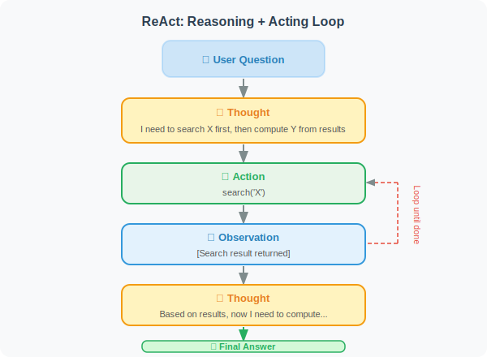

# ReAct: Reasoning + Acting Framework

ReAct (Reasoning + Acting) is one of the most important frameworks in Agent development, originating from the 2022 paper *"ReAct: Synergizing Reasoning and Acting in Language Models"* by Yao et al. from Princeton University and Google Brain. It combines the LLM's reasoning capabilities with tool use to create more reliable and transparent Agent behavior.

> 📄 **Paper Background**: Before ReAct, LLM reasoning (Chain-of-Thought) and action (tool calling) were two separate research directions. CoT made models "able to think" but "unable to act" — reasoning couldn't access external information; while tool calling made models "able to act" but "unable to think" — blindly executing without explaining the rationale. ReAct's core insight is: **reasoning provides direction for action, action provides evidence for reasoning, and the two must alternate to solve complex problems.**
>
> Experiments in the paper across multiple tasks confirmed this: on HotpotQA (multi-hop QA), ReAct improved accuracy by about 6 percentage points over pure CoT, because CoT can only rely on the model's existing knowledge while ReAct can retrieve up-to-date facts via search. On ALFWorld (interactive text games), ReAct improved by 34 percentage points over pure action (Act-only), because explicit reasoning helped the Agent avoid blind trial-and-error.

## The Core Idea of ReAct

ReAct's key innovation is **making the thinking process explicit**: the Agent "thinks out loud" before taking action, then acts.



> 🎬 **Interactive Animation**: An animation comparing ReAct, pure CoT, and Act-only on the same multi-hop QA question — showing how reasoning guides action and how action informs reasoning.
>
> <a href="../animations/react_cycle.html" target="_blank" style="display:inline-block;padding:8px 16px;background:#2196F3;color:white;border-radius:6px;text-decoration:none;font-weight:bold;">▶ Open ReAct Reasoning Loop Interactive Animation</a>

**Comparison with traditional Agents:**

| Feature | Traditional Agent (black box) | ReAct Agent (transparent) |
|---------|:---:|:---:|
| Thinking process | Hidden | Explicitly written to context |
| Explainability | Poor | Good |
| Self-correction | Difficult | Easy |
| Hallucination risk | High | Low (tool verification) |

## Implementing a ReAct Agent from Scratch

```python
import json
import re
from openai import OpenAI
from typing import Callable

client = OpenAI()

class ReActAgent:
    """
    ReAct Agent implementation.
    Explicit reasoning + tool calls interleaved.
    """
    
    def __init__(self, tools: dict[str, Callable], tool_descriptions: str):
        """
        Args:
            tools: mapping of tool name → tool function
            tool_descriptions: text description of available tools
        """
        self.tools = tools
        self.tool_descriptions = tool_descriptions
        self.scratchpad = []  # records the reasoning process
    
    def _build_system_prompt(self) -> str:
        return f"""You are an AI assistant that can use tools to solve problems.

Available tools:
{self.tool_descriptions}

Response format (strictly follow):
Thought: [analyze the current situation, decide the next step]
Action: tool_name[argument]
Observation: [result returned by the tool, filled by the system]
...(repeat until the problem is solved)
Final Answer: [synthesize all information and give the answer]

Notes:
- Choose only one tool at a time
- Action format must be: tool_name[argument]
- Wait for the observation result before continuing
- If no tool is needed, write "Final Answer:" directly
"""
    
    def _parse_action(self, text: str) -> tuple[str, str] | None:
        """Parse an Action from text"""
        # Match "Action: tool_name[argument]" format
        pattern = r'Action:\s*(\w+)\[([^\]]*)\]'
        match = re.search(pattern, text)
        if match:
            return match.group(1), match.group(2)
        return None
    
    def _is_final_answer(self, text: str) -> bool:
        """Check if there is a final answer"""
        return "Final Answer:" in text
    
    def _extract_final_answer(self, text: str) -> str:
        """Extract the final answer"""
        idx = text.find("Final Answer:")
        if idx != -1:
            return text[idx + len("Final Answer:"):].strip()
        return text
    
    def run(self, question: str, max_steps: int = 8) -> str:
        """
        Run the ReAct loop.
        
        Args:
            question: user's question
            max_steps: maximum number of steps
        
        Returns:
            final answer
        """
        self.scratchpad = []
        
        print(f"\n🔍 Question: {question}")
        print("=" * 60)
        
        # Build initial messages
        messages = [
            {"role": "system", "content": self._build_system_prompt()},
            {"role": "user", "content": f"Please answer the following question: {question}"}
        ]
        
        for step in range(max_steps):
            # Call LLM
            response = client.chat.completions.create(
                model="gpt-4o",
                messages=messages,
                stop=["Observation:"],  # stop before "Observation:", wait for tool execution
                max_tokens=500
            )
            
            output = response.choices[0].message.content
            print(f"\n{output}")
            
            self.scratchpad.append(output)
            
            # Check for final answer
            if self._is_final_answer(output):
                answer = self._extract_final_answer(output)
                print(f"\n✅ Final Answer: {answer}")
                return answer
            
            # Parse action
            action = self._parse_action(output)
            if not action:
                # No action found, may have given a direct answer
                if output.strip():
                    return output
                break
            
            tool_name, tool_input = action
            
            # Execute tool
            tool_func = self.tools.get(tool_name)
            if tool_func:
                try:
                    observation = tool_func(tool_input)
                except Exception as e:
                    observation = f"Tool execution error: {str(e)}"
            else:
                observation = f"Unknown tool: {tool_name}"
            
            # Print observation
            obs_text = f"Observation: {observation}"
            print(obs_text)
            self.scratchpad.append(obs_text)
            
            # Add the complete interaction to message history
            messages.append({
                "role": "assistant",
                "content": output + "\n" + obs_text
            })
        
        return "Reached maximum number of steps, unable to give a definitive answer"


# ============================
# Tool Definitions
# ============================

import math

def search(query: str) -> str:
    """Simulated search (use a real search API in production)"""
    # Pre-defined knowledge base
    knowledge = {
        "python creator": "Python was created by Guido van Rossum, first released in 1991",
        "speed of light": "The speed of light in a vacuum is approximately 299,792,458 m/s (about 300,000 km/s)",
        "earth circumference": "The Earth's equatorial circumference is approximately 40,075 km",
        "boiling point of water": "At standard atmospheric pressure, water boils at 100°C (212°F)",
    }
    
    for key, value in knowledge.items():
        if key in query.lower():
            return value
    
    return f"Search '{query}': found relevant information, recommend verifying with calculation"

def calculate(expression: str) -> str:
    """Calculate a mathematical expression"""
    try:
        safe_dict = {k: getattr(math, k) for k in dir(math) if not k.startswith('_')}
        # ⚠️ Security warning: eval() has security risks; use safe alternatives like simpleeval in production
        result = eval(expression, {"__builtins__": {}}, safe_dict)
        return f"{expression} = {result}"
    except Exception as e:
        return f"Calculation error: {e}"

def get_current_date(_: str = "") -> str:
    """Get the current date"""
    import datetime
    return datetime.datetime.now().strftime("%B %d, %Y")

# Tool descriptions (critical!)
tool_descriptions = """
- search[query]: search the internet for information
  Example: search[who created Python]
  
- calculate[expression]: evaluate a mathematical expression
  Supports: +, -, *, /, **, sqrt, sin, cos, log, pi
  Example: calculate[sqrt(144) + pi * 2]
  
- get_current_date[]: get today's date
  Example: get_current_date[]
"""

# ============================
# Test
# ============================

agent = ReActAgent(
    tools={
        "search": search,
        "calculate": calculate,
        "get_current_date": get_current_date
    },
    tool_descriptions=tool_descriptions
)

# Test 1: requires search + calculation
result = agent.run("How many milliseconds does it take light to travel around the Earth's equator?")

# Test 2: requires multi-step reasoning
result = agent.run("What year was Python released? How many years ago was that?")
```

## Advantages and Limitations of ReAct

**Advantages:**
- Reasoning process is transparent and explainable
- Supports self-correction (can rethink when an incorrect result is observed)
- Reduces hallucinations (each step is verified by tools)

**Limitations:**
- Higher token consumption (each step requires writing out the thought process)
- Can feel cumbersome for simple tasks
- May get stuck in loops (needs `max_steps` protection)

---

## Summary

The three key elements of the ReAct framework:
- **Explicit reasoning**: the thinking process is written into the context
- **Action-Observation loop**: tool calls and reasoning alternate
- **Natural termination**: the loop ends when a final answer is reached

> 📖 **Want to dive deeper into the academic frontiers of ReAct and planning/reasoning?** Read [6.6 Paper Readings: Frontiers in Planning and Reasoning](./06_paper_readings.md), covering in-depth analyses of key papers including ReAct, MRKL, Plan-and-Solve, Reflexion, and CRITIC.
>
> 💡 **Practical advice**: ReAct is the default architecture in most Agent frameworks (LangChain, LlamaIndex). But it's not a silver bullet — for pure reasoning tasks that don't need tools, CoT is more efficient; for workflows with fixed processes, direct orchestration (LangGraph) is more controllable. Choose the right architecture rather than defaulting to ReAct for everything.

---

## References

[1] YAO S, ZHAO J, YU D, et al. ReAct: Synergizing reasoning and acting in language models[C]//ICLR. 2023.

[2] WEI J, WANG X, SCHUURMANS D, et al. Chain-of-thought prompting elicits reasoning in large language models[C]//NeurIPS. 2022.

[3] SHINN N, CASSANO F, GOPINATH A, et al. Reflexion: Language agents with verbal reinforcement learning[C]//NeurIPS. 2023.

---

*Next: [6.3 Task Decomposition: Breaking Complex Problems into Subtasks](./03_task_decomposition.md)*