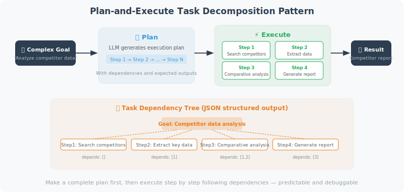

# Task Decomposition: Breaking Complex Problems into Subtasks

Complex tasks often exceed the capacity of a single LLM call. Task decomposition is the process of breaking a large problem into manageable smaller problems and solving them step by step.

> 📄 **Academic Background**: The idea of task decomposition has a long history in AI planning (e.g., Hierarchical Task Networks, HTN), but combining it with LLMs is a recent research hotspot. *"Plan-and-Solve Prompting: Improving Zero-Shot Chain-of-Thought Reasoning"* (Wang et al., 2023) is a representative work in this direction. It proposes having the LLM first devise a plan ("Let's first understand the problem and devise a plan"), then execute each subtask step by step. This approach improved performance by 5–6 percentage points over standard Zero-shot CoT on mathematical reasoning benchmarks like GSM8K.



## Plan-and-Execute Pattern

```python
from openai import OpenAI
import json

client = OpenAI()

class PlanAndExecuteAgent:
    """
    Plan-and-Execute pattern Agent.
    First formulates a complete plan, then executes step by step.
    """
    
    def __init__(self, available_tools: dict):
        self.tools = available_tools
    
    def plan(self, goal: str) -> list[dict]:
        """
        Decompose a goal into an ordered list of subtasks.
        
        Returns:
            [{"step": 1, "task": "...", "tool": "...", "depends_on": []}]
        """
        response = client.chat.completions.create(
            model="gpt-4o",
            messages=[
                {
                    "role": "system",
                    "content": f"""You are a task planning expert. Break down the user's goal into executable subtasks.

Available tools: {list(self.tools.keys())}

Return an execution plan in JSON format:
{{
  "goal": "overall goal",
  "steps": [
    {{
      "step": 1,
      "task": "task description",
      "tool": "tool name (optional)",
      "expected_output": "expected output",
      "depends_on": []
    }}
  ]
}}"""
                },
                {"role": "user", "content": f"Please create an execution plan for the following goal: {goal}"}
            ],
            response_format={"type": "json_object"}
        )
        
        plan = json.loads(response.choices[0].message.content)
        return plan
    
    def execute_step(self, step: dict, context: dict) -> str:
        """Execute a single step"""
        task = step["task"]
        tool_name = step.get("tool")
        
        print(f"\n[Step {step['step']}] {task}")
        
        if tool_name and tool_name in self.tools:
            # Let the LLM decide the tool parameters
            param_response = client.chat.completions.create(
                model="gpt-4o-mini",
                messages=[
                    {
                        "role": "user",
                        "content": f"""
Task: {task}
Available context: {json.dumps(context, ensure_ascii=False)}
Generate the parameters needed to call tool "{tool_name}" (JSON format, return only the parameter values):"""
                    }
                ]
            )
            
            try:
                params = json.loads(param_response.choices[0].message.content)
                result = self.tools[tool_name](**params)
            except:
                result = self.tools[tool_name](task)
        else:
            # Handle directly with LLM
            response = client.chat.completions.create(
                model="gpt-4o",
                messages=[
                    {
                        "role": "system",
                        "content": f"You are executing the following task. Available context: {json.dumps(context, ensure_ascii=False)}"
                    },
                    {"role": "user", "content": task}
                ]
            )
            result = response.choices[0].message.content
        
        print(f"  Result: {str(result)[:200]}")
        return str(result)
    
    def execute(self, goal: str) -> str:
        """Execute the complete goal"""
        # 1. Formulate the plan
        plan = self.plan(goal)
        print(f"\n📋 Execution Plan: {plan.get('goal', goal)}")
        for step in plan.get("steps", []):
            print(f"  Step {step['step']}: {step['task']}")
        
        # 2. Execute step by step
        context = {}  # shared context for step results
        
        for step in plan.get("steps", []):
            result = self.execute_step(step, context)
            context[f"step_{step['step']}_result"] = result
        
        # 3. Summarize results
        summary_response = client.chat.completions.create(
            model="gpt-4o",
            messages=[
                {
                    "role": "user",
                    "content": f"""
Goal: {goal}

Results from each step:
{json.dumps(context, ensure_ascii=False, indent=2)}

Please synthesize the above results and provide a final answer:"""
                }
            ]
        )
        
        final_answer = summary_response.choices[0].message.content
        print(f"\n✅ Final Result:\n{final_answer}")
        return final_answer


# Test tools
def mock_search(query: str) -> str:
    return f"Search results for '{query}': [relevant information...]"

def mock_calculate(expression: str) -> str:
    import math
    try:
        result = eval(expression, {"__builtins__": {}, "math": math})
        return f"{expression} = {result}"
    except:
        return "Calculation failed"

def mock_write_file(filename: str, content: str) -> str:
    with open(filename, 'w', encoding='utf-8') as f:
        f.write(content)
    return f"File {filename} created"

# Example execution
agent = PlanAndExecuteAgent({
    "search": mock_search,
    "calculate": mock_calculate,
    "write_file": mock_write_file
})

result = agent.execute(
    "Research the main use cases of Python in AI development and write a 300-word summary report"
)
```

## Hierarchical Task Decomposition (HTN)

For more complex tasks, hierarchical decomposition can be used:

```python
def hierarchical_decompose(task: str, depth: int = 2) -> dict:
    """
    Hierarchical task decomposition.
    Recursively decomposes tasks until reaching "atomic operation" level.
    """
    
    response = client.chat.completions.create(
        model="gpt-4o",
        messages=[
            {
                "role": "system",
                "content": """You are a task decomposition expert. Break complex tasks into subtasks.
                
Criteria:
- Atomic task (leaf): can be executed directly, no further decomposition needed
- Composite task (composite): needs to be broken into subtasks

Return JSON format:
{
  "task": "task description",
  "type": "leaf|composite",
  "subtasks": [],  // fill in for composite tasks
  "tool": "tool to use (for leaf tasks)",
  "estimated_minutes": 5
}"""
            },
            {
                "role": "user",
                "content": f"Decompose this task (depth {depth} levels): {task}"
            }
        ],
        response_format={"type": "json_object"}
    )
    
    return json.loads(response.choices[0].message.content)

# Example
task_tree = hierarchical_decompose(
    "Develop a weather forecast Python application"
)
print(json.dumps(task_tree, ensure_ascii=False, indent=2))
```

---

## Summary

Core patterns for task decomposition:
- **Plan-and-Execute**: plan first, then execute, with steps sharing context
- **Hierarchical decomposition**: recursively break down until atomic tasks
- **Dependency management**: execute independent subtasks in parallel

> 📖 **Want to dive deeper into the academic frontiers of task planning?** Read [6.6 Paper Readings: Frontiers in Planning and Reasoning](./06_paper_readings.md), covering in-depth analyses of Plan-and-Solve, HuggingGPT, LLM+P, and more.

---

## References

[1] WANG L, XU W, LAN Y, et al. Plan-and-solve prompting: Improving zero-shot chain-of-thought reasoning by large language models[C]//ACL. 2023.

[2] YAO S, YU D, ZHAO J, et al. Tree of thoughts: Deliberate problem solving with large language models[C]//NeurIPS. 2023.

[3] SHEN Y, SONG K, TAN X, et al. HuggingGPT: Solving AI tasks with ChatGPT and its friends in Hugging Face[C]//NeurIPS. 2023.

---

*Next: [6.4 Reflection and Self-Correction Mechanisms](./04_reflection.md)*