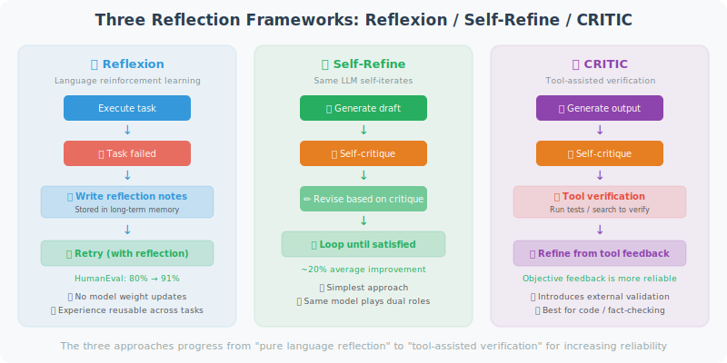

# Reflection and Self-Correction Mechanisms

An excellent Agent not only completes tasks but also evaluates the quality of its own output, identifies problems, and self-improves. This capability comes from the **Reflection mechanism**.

> 📄 **Academic Background**: Reflection mechanisms are one of the fastest-growing directions in Agent research. The core question is: **Can LLMs recognize their own mistakes and self-correct?** The following three papers answer this affirmatively from different angles, each proposing a different reflection framework:
>
> - **Reflexion** (*Reflexion: Language Agents with Verbal Reinforcement Learning*, Shinn et al., 2023): Proposes "verbal reinforcement learning" — after a task failure, the Agent doesn't update model weights but instead writes the failure experience as natural language "reflection notes" stored in long-term memory. The next time a similar task is encountered, these notes are retrieved to guide behavior. On the HumanEval coding task, the Reflexion Agent's pass rate improved from 80% to 91%.
>
> - **Self-Refine** (*Self-Refine: Iterative Refinement with Self-Feedback*, Madaan et al., CMU, 2023): A simpler approach — having the same LLM play both the "generator" and "critic" roles. First generate a draft, then self-critique, then revise based on the critique, repeating until satisfied. Average improvement of ~20% across code generation, mathematical reasoning, dialogue summarization, and other tasks.
>
> - **CRITIC** (*CRITIC: Large Language Models Can Self-Correct with Tool-Interactive Critiquing*, Gou et al., 2023): Introduces **tool verification** on top of self-critique — after writing code, the Agent runs unit tests; after writing factual statements, it verifies them with a search engine. Objective feedback from tools is more reliable than pure self-critique.



## Basic Reflection Loop

```python
from openai import OpenAI

client = OpenAI()

class ReflectiveAgent:
    """An Agent with reflection capabilities"""
    
    def __init__(self, max_reflection_rounds: int = 3):
        self.max_rounds = max_reflection_rounds
    
    def generate(self, task: str, context: str = "") -> str:
        """Generate an initial answer"""
        response = client.chat.completions.create(
            model="gpt-4o",
            messages=[
                {"role": "system", "content": context or "You are a professional assistant"},
                {"role": "user", "content": task}
            ]
        )
        return response.choices[0].message.content
    
    def reflect(self, task: str, output: str, criteria: list[str]) -> dict:
        """
        Reflective evaluation: check whether the output meets the criteria.
        
        Returns:
            {"score": 0-10, "passed": bool, "feedback": str, "improvements": []}
        """
        criteria_text = "\n".join([f"- {c}" for c in criteria])
        
        response = client.chat.completions.create(
            model="gpt-4o",
            messages=[
                {
                    "role": "user",
                    "content": f"""Please evaluate whether the following output meets the requirements and provide improvement suggestions.

[Original Task]
{task}

[Generated Output]
{output}

[Evaluation Criteria]
{criteria_text}

Return a JSON evaluation:
{{
  "score": score from 0-10,
  "passed": true/false (whether all criteria are met),
  "feedback": "overall feedback",
  "failed_criteria": ["unmet criterion 1", "unmet criterion 2"],
  "improvements": ["improvement suggestion 1", "improvement suggestion 2"]
}}"""
                }
            ],
            response_format={"type": "json_object"}
        )
        
        import json
        return json.loads(response.choices[0].message.content)
    
    def revise(self, task: str, output: str, feedback: dict) -> str:
        """Revise the output based on reflection feedback"""
        improvements = "\n".join([f"- {i}" for i in feedback.get("improvements", [])])
        failed = "\n".join([f"- {c}" for c in feedback.get("failed_criteria", [])])
        
        response = client.chat.completions.create(
            model="gpt-4o",
            messages=[
                {
                    "role": "user",
                    "content": f"""Please improve the following output to address the identified issues.

[Original Task]
{task}

[Current Output]
{output}

[Unmet Criteria]
{failed}

[Improvement Suggestions]
{improvements}

Please provide the improved version:"""
                }
            ]
        )
        return response.choices[0].message.content
    
    def run_with_reflection(self, task: str, criteria: list[str]) -> dict:
        """
        Run the reflection loop: generate → reflect → improve → repeat.
        
        Returns:
            {"final_output": str, "rounds": int, "history": list}
        """
        history = []
        current_output = self.generate(task)
        
        print(f"\nTask: {task}")
        
        for round_num in range(self.max_rounds):
            print(f"\n=== Reflection Round {round_num + 1} ===")
            
            # Evaluate
            evaluation = self.reflect(task, current_output, criteria)
            score = evaluation.get("score", 0)
            passed = evaluation.get("passed", False)
            
            print(f"Score: {score}/10 | Passed: {passed}")
            if evaluation.get("feedback"):
                print(f"Feedback: {evaluation['feedback'][:100]}")
            
            history.append({
                "round": round_num + 1,
                "output": current_output,
                "score": score,
                "passed": passed
            })
            
            # Stop if passed
            if passed or score >= 8:
                print(f"✅ Output quality meets requirements, stopping reflection")
                break
            
            # Improve
            if round_num < self.max_rounds - 1:
                print("🔄 Improving...")
                current_output = self.revise(task, current_output, evaluation)
        
        return {
            "final_output": current_output,
            "rounds": len(history),
            "history": history
        }


# Test
agent = ReflectiveAgent(max_reflection_rounds=3)

result = agent.run_with_reflection(
    task="Write Python code implementing a binary search algorithm",
    criteria=[
        "Code runs correctly",
        "Includes detailed comments",
        "Has type annotations",
        "Handles edge cases",
        "Code is concise and readable"
    ]
)

print(f"\nFinal output (round {result['rounds']}):")
print(result["final_output"])
```

## Self-Correction: Detecting and Fixing Errors

```python
def self_correcting_code_generator(requirement: str) -> str:
    """
    Self-correcting code generator.
    Generate code → auto-test → detect errors → fix → repeat.
    """
    import subprocess
    import tempfile
    import os
    
    max_attempts = 3
    
    for attempt in range(max_attempts):
        print(f"\n[Attempt {attempt + 1}]")
        
        # Generate code
        response = client.chat.completions.create(
            model="gpt-4o",
            messages=[
                {
                    "role": "user",
                    "content": f"""
Write Python code to fulfill the following requirement:
{requirement}

Requirements:
1. Code must be directly runnable (include complete test cases)
2. Add test code at the end under if __name__ == '__main__':
3. Return only pure Python code, no Markdown formatting
"""
                }
            ]
        )
        
        code = response.choices[0].message.content
        
        # Clean up code (remove possible markdown markers)
        if "```python" in code:
            code = code.split("```python")[1].split("```")[0].strip()
        elif "```" in code:
            code = code.split("```")[1].split("```")[0].strip()
        
        # Test the code
        with tempfile.NamedTemporaryFile(mode='w', suffix='.py', 
                                          delete=False, encoding='utf-8') as f:
            f.write(code)
            tmp_file = f.name
        
        try:
            result = subprocess.run(
                ["python", tmp_file],
                capture_output=True,
                text=True,
                timeout=10
            )
            
            if result.returncode == 0:
                print(f"✅ Code ran successfully!")
                os.unlink(tmp_file)
                return code
            else:
                error = result.stderr
                print(f"❌ Runtime error: {error[:200]}")
                
                # Fix the error
                fix_response = client.chat.completions.create(
                    model="gpt-4o",
                    messages=[
                        {
                            "role": "user",
                            "content": f"""The following code has an error. Please fix it:

Code:
```python
{code}
```

Error message:
{error}

Please return the complete fixed Python code (no Markdown formatting):"""
                        }
                    ]
                )
                code = fix_response.choices[0].message.content
                if "```python" in code:
                    code = code.split("```python")[1].split("```")[0].strip()
        
        except subprocess.TimeoutExpired:
            print("❌ Code execution timed out")
        finally:
            try:
                os.unlink(tmp_file)
            except:
                pass
    
    return f"# Unable to generate code meeting requirements (after {max_attempts} attempts)\n" + code

# Test
code = self_correcting_code_generator(
    "Implement a function that calculates the average of all even numbers in a list, returning 0 if there are no even numbers"
)
print(code)
```

---

## Summary

The value of reflection mechanisms:
- **Quality assurance**: multi-round evaluation ensures output meets criteria
- **Automatic error correction**: detects and fixes errors without human intervention
- **Continuous improvement**: each reflection round brings the output closer to the goal
- **Use cases**: code generation, content writing, complex analysis

> 📖 **Want to dive deeper into the academic frontiers of reflection and self-correction?** Read [6.6 Paper Readings: Frontiers in Planning and Reasoning](./06_paper_readings.md), covering in-depth analyses of Reflexion, Self-Refine, CRITIC, and more, as well as the boundaries and limitations of self-correction.
>
> 💡 **Practical advice**: When implementing reflection in real Agents, **always set a maximum iteration count** (usually 2–3 rounds is sufficient), and prioritize reflection with tool feedback (e.g., running tests, querying databases). Pure self-critique is suitable for subjective tasks (like improving writing style), while tasks requiring objective correctness (like code or data analysis) must have external validation.

---

*Next: [6.5 Practice: Automated Research Assistant Agent](./05_practice_research_agent.md)*
