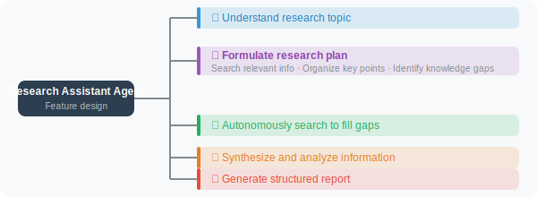

# Practice: Automated Research Assistant Agent

Combining the planning, reasoning, and reflection capabilities learned in this chapter, we'll build an Agent capable of conducting research autonomously.

> **Design Note**: This project uses a "Plan-then-Execute" multi-stage Pipeline architecture rather than a pure ReAct loop. This is because research tasks have a clear sequential order across stages (plan → search → analyze → quality check), and the Pipeline pattern makes it easier to control the flow and debug. Within the Pipeline, each stage still applies ReAct thinking — the Agent "thinks" about the next action based on the current stage's output, and performs "reflection" during the quality check stage. This embodies the principle discussed in Section 6.1: "apply the right reasoning framework to the right scenario."

## Research Assistant Feature Design



## Complete Implementation

```python
import json
import datetime
from openai import OpenAI
import requests

client = OpenAI()

class ResearchAssistant:
    """Automated research assistant"""
    
    def __init__(self):
        self.research_notes = []
        self.sources = []
    
    def _search(self, query: str) -> str:
        """Search tool (using DuckDuckGo)"""
        try:
            url = "https://api.duckduckgo.com/"
            params = {"q": query, "format": "json", "no_html": 1}
            response = requests.get(url, params=params, timeout=8)
            data = response.json()
            
            results = []
            if data.get("AbstractText"):
                results.append(data["AbstractText"])
                if data.get("AbstractURL"):
                    self.sources.append(data["AbstractURL"])
            
            for topic in data.get("RelatedTopics", [])[:3]:
                if isinstance(topic, dict) and topic.get("Text"):
                    results.append(topic["Text"][:300])
            
            return "\n".join(results) if results else "No relevant results found"
        except Exception as e:
            return f"Search failed: {e}"
    
    def _take_notes(self, content: str, source: str = ""):
        """Record research notes"""
        self.research_notes.append({
            "content": content,
            "source": source,
            "time": datetime.datetime.now().isoformat()
        })
    
    def research(self, topic: str, depth: str = "standard") -> str:
        """
        Conduct research.
        
        Args:
            topic: research topic
            depth: "quick"=quick overview, "standard"=standard research, "deep"=deep research
        """
        
        depth_config = {
            "quick": {"max_searches": 2, "sections": 3},
            "standard": {"max_searches": 4, "sections": 5},
            "deep": {"max_searches": 8, "sections": 7}
        }
        config = depth_config.get(depth, depth_config["standard"])
        
        print(f"\n🔬 Starting research: {topic}")
        print(f"Research depth: {depth}\n")
        
        # ===== Stage 1: Plan the Research =====
        print("📋 Stage 1: Formulating research plan...")
        plan_response = client.chat.completions.create(
            model="gpt-4o",
            messages=[
                {
                    "role": "user",
                    "content": f"""You are a research analyst. Create a research plan for the following topic:

Topic: {topic}
Research goal: Comprehensively understand the topic and generate a report with {config['sections']} core sections

Generate a research plan in JSON format:
{{
  "research_questions": ["core question 1", "core question 2", ...],
  "search_queries": ["search term 1", "search term 2", ...(max {config['max_searches']})],
  "report_outline": ["section 1 title", "section 2 title", ...]
}}"""
                }
            ],
            response_format={"type": "json_object"}
        )
        
        plan = json.loads(plan_response.choices[0].message.content)
        search_queries = plan.get("search_queries", [topic])[:config["max_searches"]]
        report_outline = plan.get("report_outline", [f"{topic} Overview"])
        
        print(f"  Search plan: {len(search_queries)} queries")
        print(f"  Report structure: {len(report_outline)} sections")
        
        # ===== Stage 2: Search for Information =====
        print("\n🔍 Stage 2: Searching for information...")
        all_findings = []
        
        for i, query in enumerate(search_queries, 1):
            print(f"  Search [{i}/{len(search_queries)}]: {query}")
            result = self._search(query)
            
            self._take_notes(result, source=f"Search: {query}")
            all_findings.append(f"[Query: {query}]\n{result}")
        
        findings_text = "\n\n".join(all_findings)
        
        # ===== Stage 3: Analyze and Synthesize =====
        print("\n🧠 Stage 3: Analyzing and synthesizing...")
        
        analysis_response = client.chat.completions.create(
            model="gpt-4o",
            messages=[
                {
                    "role": "user",
                    "content": f"""Based on the following research materials, conduct an in-depth analysis of the topic "{topic}".

Research materials:
{findings_text[:4000]}

Report outline: {report_outline}

Please generate a complete research report following the outline:
1. Each section should have substantive content (200-400 words)
2. Include specific data, case studies, or viewpoints
3. Provide conclusions and recommendations at the end of the report
4. Use Markdown formatting"""
                }
            ]
        )
        
        report = analysis_response.choices[0].message.content
        
        # ===== Stage 4: Quality Check =====
        print("\n✅ Stage 4: Quality check...")
        
        review_response = client.chat.completions.create(
            model="gpt-4o-mini",
            messages=[
                {
                    "role": "user",
                    "content": f"""Briefly evaluate the quality of the following research report (JSON format):

Topic: {topic}
Report (first 1000 characters): {report[:1000]}

Evaluation:
{{
  "completeness_score": 1-10,
  "accuracy_indicators": "high/medium/low",
  "missing_aspects": ["missing point 1"],
  "overall_quality": "excellent/good/average"
}}"""
                }
            ],
            response_format={"type": "json_object"}
        )
        
        review = json.loads(review_response.choices[0].message.content)
        
        # Generate final report
        final_report = f"""# Research Report: {topic}

> Generated: {datetime.datetime.now().strftime('%Y-%m-%d %H:%M')}
> Research depth: {depth}
> Quality score: {review.get('completeness_score', 'N/A')}/10
> Sources: {len(self.research_notes)} entries

---

{report}

---

## Research Notes

- This report is based on {len(search_queries)} web searches
- Information cutoff date: {datetime.datetime.now().strftime('%Y-%m-%d')}
- Recommend verifying with the latest sources
"""
        
        print(f"\n📄 Report generation complete!")
        print(f"Quality: {review.get('overall_quality', 'N/A')} | "
              f"Completeness: {review.get('completeness_score', 'N/A')}/10")
        
        return final_report


# Usage example
assistant = ResearchAssistant()

report = assistant.research(
    topic="Applications of Large Language Models in Software Development",
    depth="standard"
)

# Save the report
filename = f"research_report_{datetime.datetime.now().strftime('%Y%m%d_%H%M')}.md"
with open(filename, 'w', encoding='utf-8') as f:
    f.write(report)

print(f"\n📁 Report saved to: {filename}")
```

## Running the Research Assistant

```bash
pip install openai python-dotenv requests rich
python research_agent.py
```

Example output:
```markdown
# Research Report: Applications of Large Language Models in Software Development

> Generated: 2024-03-15 14:30
> Research depth: standard
> Quality score: 8/10

## 1. Overview
...

## 2. Code Generation and Completion
...

## 3. Code Review and Bug Detection
...
```

---

## Chapter Summary

This chapter covered the core techniques for Agent planning and reasoning:

| Technique | Core Value |
|-----------|-----------|
| OODA Loop | Systematic thinking framework: Observe-Orient-Decide-Act |
| ReAct Framework | Makes reasoning transparent, improving reliability |
| Task Decomposition | Breaks complex problems into manageable subtasks |
| Reflection Mechanism | Self-evaluation and iterative improvement |

---

*Next chapter: [Chapter 7: Retrieval-Augmented Generation (RAG)](../chapter_rag/README.md)*