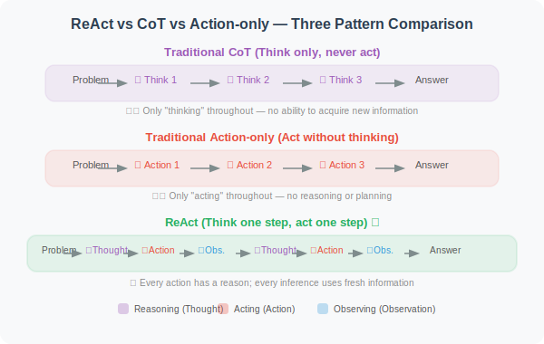
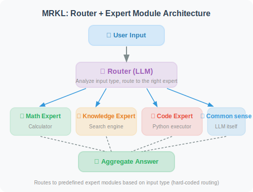
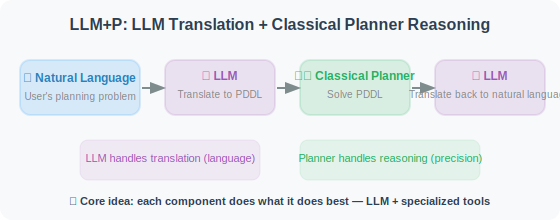
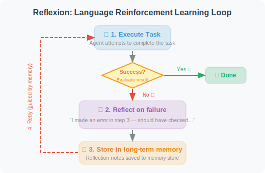
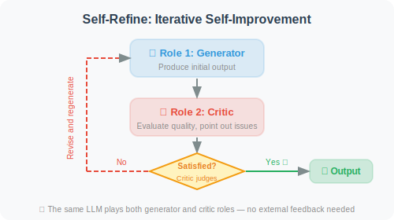
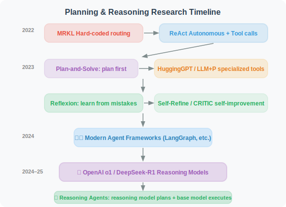

# 6.6 Paper Readings: Frontiers in Planning and Reasoning

> 📖 *"An Agent's reasoning ability determines its ceiling, while its planning ability determines the complexity of tasks it can handle."*  
> *This section provides in-depth analyses of key papers in planning and reasoning.*

---

## ReAct: Fusing Reasoning and Acting

**Paper**: *ReAct: Synergizing Reasoning and Acting in Language Models*  
**Authors**: Yao et al., Princeton University & Google Brain  
**Published**: 2022 | [arXiv:2210.03629](https://arxiv.org/abs/2210.03629)

### Core Problem

Before ReAct, LLM reasoning (Chain-of-Thought) and action (tool calling) were two separate research directions:
- **CoT made models "able to think" but "unable to act"** — reasoning couldn't access external information
- **Tool calling made models "able to act" but "unable to think"** — blindly executing without explaining the rationale

### Core Idea

ReAct's core insight: **reasoning provides direction for action, action provides evidence for reasoning, and the two must alternate to solve complex problems.**



### Experimental Results

| Task | CoT | Act-only | ReAct | Improvement |
|------|-----|----------|-------|-------------|
| HotpotQA (multi-hop QA) | 29.4% | 25.7% | 35.1% | +6pp vs CoT |
| ALFWorld (interactive game) | — | 45% | 79% | +34pp vs Act |
| WebShop (online shopping) | — | 30.1% | 40.0% | +10pp vs Act |

### Implications for Agent Development

ReAct directly established the foundational architecture of modern Agents. Today, almost all mainstream frameworks (LangChain, LlamaIndex, AutoGen) use ReAct as their default Agent pattern. The code implementation in Section 6.2 is an engineering realization of the ReAct paper.

---

## MRKL Systems: Modular Expert Routing

**Paper**: *MRKL Systems: A modular, neuro-symbolic architecture that combines large language models, external knowledge sources and discrete reasoning*  
**Authors**: Karpas et al., AI21 Labs  
**Published**: 2022

### Core Idea

MRKL (Modular Reasoning, Knowledge and Language) proposes a "router + expert modules" architecture:



### Relationship to ReAct

MRKL is one of ReAct's predecessors, but with a key difference:
- **MRKL's routing is relatively fixed**: inputs are assigned to predefined experts based on type
- **ReAct lets the model decide autonomously**: the model dynamically decides which tool to call during reasoning

This evolution from "hard-coded routing" to "autonomous decision-making" is an important step in the development of Agent technology.

---

## Plan-and-Solve: Plan First, Then Execute

**Paper**: *Plan-and-Solve Prompting: Improving Zero-Shot Chain-of-Thought Reasoning by Large Language Models*  
**Authors**: Wang et al.  
**Published**: 2023 | [arXiv:2305.04091](https://arxiv.org/abs/2305.04091)

### Core Problem

Zero-shot CoT ("Let's think step by step") is simple and effective, but tends to make three types of errors on complex problems:
1. **Calculation errors**: making a mistake in one step of a multi-step calculation
2. **Missing-step errors**: omitting a critical intermediate step
3. **Semantic misunderstanding errors**: misinterpreting key information in the problem

### Method

Plan-and-Solve's core improvement is elegantly simple — replacing one prompt phrase:

```
Zero-shot CoT:
"Let's think step by step."

Plan-and-Solve (PS):
"Let's first understand the problem and devise a plan to solve it.
 Then, let's carry out the plan and solve the problem step by step."

Plan-and-Solve+ (PS+):
"Let's first understand the problem, extract relevant variables and their 
 corresponding numerals, and make a plan. Then, let's carry out the plan, 
 calculate intermediate results (pay attention to correct numerical 
 calculation and target commonsense reasoning), and solve the problem 
 step by step."
```

### Experimental Results

On the GSM8K mathematical reasoning benchmark, PS+ improved by 5–6 percentage points over standard Zero-shot CoT.

### Implications for Agent Development

The Plan-and-Solve idea directly corresponds to the **Plan-and-Execute pattern** in Agents (Section 6.3): first have the LLM formulate a complete execution plan, then execute each subtask step by step. This is more reliable than the "one step at a time" ReAct pattern for certain tasks.

---

## HuggingGPT: Cross-Modal Task Planning

**Paper**: *HuggingGPT: Solving AI Tasks with ChatGPT and its Friends in HuggingFace*  
**Authors**: Shen et al., Microsoft Research  
**Published**: 2023

### Core Idea

Use ChatGPT as the "brain" to decompose complex tasks, then schedule specialized models from HuggingFace to execute subtasks:

```
User request: "Describe the content of this image and translate the description into French"
    ↓
ChatGPT (planner):
  Subtask 1: Use an image captioning model to describe the image → call blip-image-captioning
  Subtask 2: Use a translation model to translate to French → call Helsinki-NLP/opus-mt-en-fr
    ↓
Collect results and synthesize
```

### Implications for Agent Development

HuggingGPT demonstrates the power of "planning + tool calling" for multimodal tasks. Its architectural idea (large model plans, small models execute) is widely applied in today's Agent systems.

---

## LLM+P: Combining Traditional AI Planners

**Paper**: *LLM+P: Empowering Large Language Models with Optimal Planning Proficiency*  
**Authors**: Liu et al.  
**Published**: 2023

### Core Problem

LLMs tend to make mistakes in long-horizon planning — especially planning problems that require satisfying complex constraints (e.g., scheduling, resource allocation). Traditional AI planners (e.g., PDDL-based planners) are more reliable for these problems but cannot understand natural language.

### Method



**Core idea**: LLM handles translation, the planner handles reasoning — each doing what it does best.

### Implications for Agent Development

This "LLM + specialized tools" combination is very practical in Agent development:
- Don't let the LLM do everything — its planning ability is limited
- For tasks requiring precise reasoning, delegate the reasoning part to specialized tools

---

## Reflexion: Verbal Reinforcement Learning

**Paper**: *Reflexion: Language Agents with Verbal Reinforcement Learning*  
**Authors**: Shinn et al.  
**Published**: 2023 | [arXiv:2303.11366](https://arxiv.org/abs/2303.11366)

### Core Problem

Traditional reinforcement learning requires extensive trial-and-error and parameter updates. For LLM Agents, can we learn from mistakes in a more lightweight way?

### Method

Reflexion proposes **"verbal reinforcement learning"** — after a task failure, the Agent doesn't update model weights but instead generates natural language "reflection notes" and stores them in long-term memory:



### Experimental Results

| Task | Without Reflection | With Reflection (Reflexion) | Improvement |
|------|-------------------|----------------------------|-------------|
| HumanEval (code generation) | 80% | 91% | +11pp |
| AlfWorld (decision task) | 63% | 97% | +34pp |

### Key Findings

1. **Reflection memory is key**: not just reflecting within the current task, but saving and reusing reflection experiences across tasks
2. **Language is more flexible than gradients**: "lessons learned" described in natural language transfer more easily to new tasks than parameter updates
3. **The value of long-term memory**: as reflection notes accumulate, Agent performance continuously improves

---

## Self-Refine: Iterative Self-Improvement

**Paper**: *Self-Refine: Iterative Refinement with Self-Feedback*  
**Authors**: Madaan et al., CMU  
**Published**: 2023 | [arXiv:2303.17651](https://arxiv.org/abs/2303.17651)

### Method

Self-Refine's approach is simpler — having the same LLM play two roles:



### Experimental Results

Average improvement of ~20% across 7 tasks including code generation, mathematical reasoning, and dialogue summarization.

### Difference from Reflexion

- **Self-Refine**: repeatedly improves within the current task, no long-term memory saved
- **Reflexion**: accumulates reflection experience across tasks, forming long-term memory

---

## CRITIC: Tool-Assisted Self-Correction

**Paper**: *CRITIC: Large Language Models Can Self-Correct with Tool-Interactive Critiquing*  
**Authors**: Gou et al.  
**Published**: 2023 | [arXiv:2305.11738](https://arxiv.org/abs/2305.11738)

### Core Innovation

Introduces **tool verification** on top of self-critique — the Agent's self-evaluation no longer relies solely on the LLM's own judgment but uses external tools for objective verification:

```
Code tasks: Agent writes code → runs unit tests → revises code based on test results
Fact tasks: Agent writes answer → verifies key facts with search engine → corrects errors
Math tasks: Agent gives reasoning → verifies calculations with calculator → corrects errors
```

### Key Finding: The Limits of Self-Correction

An important counterpoint paper deserves attention — **"Large Language Models Cannot Self-Correct Reasoning Yet"** (Huang et al., 2023) points out:

- **Without external feedback, pure LLM self-reflection may actually decrease reasoning accuracy**
- Models tend to "confidently make mistakes" — changing correct answers to wrong ones
- **Practical implication: reflection loops must incorporate external validation (e.g., code execution, search verification)**

---

## DeepSeek-R1: Reinforcement Learning Elicits Reasoning

**Paper**: *DeepSeek-R1: Incentivizing Reasoning Capability in LLMs via Reinforcement Learning*  
**Authors**: DeepSeek-AI  
**Published**: January 2025 | [arXiv:2501.12948](https://arxiv.org/abs/2501.12948)

### Core Problem

Traditional LLM reasoning enhancement relies on supervised fine-tuning (SFT) — requiring human annotation of "correct reasoning steps". But high-quality reasoning data annotation is extremely costly, and human annotators may miss optimal reasoning paths. **Can a model autonomously learn to reason through pure reinforcement learning?**

### Method

DeepSeek-R1's core innovation is using the **GRPO (Group Relative Policy Optimization)** algorithm to let the model autonomously evolve reasoning capabilities:

```
DeepSeek-R1-Zero (pure RL, no SFT):
  1. Start from the DeepSeek-V3 base model
  2. Only give the model "question" and "whether the answer is correct" signals
  3. No human-annotated reasoning processes provided
  4. The model spontaneously emerges during training:
     - "Let me reconsider..." (self-reflection)
     - "Wait, this step has an error..." (self-correction)
     - "Let me think from another angle..." (multi-path exploration)

DeepSeek-R1 (RL + distillation):
  Building on R1-Zero:
  1. First "cold start" with a small amount of high-quality SFT data
  2. Then large-scale RL training
  3. Distill the large model's reasoning ability into smaller models
     → Distilled versions from 1.5B to 70B also have strong reasoning
```

### Key Findings

1. **Reasoning ability can emerge through pure RL**: R1-Zero never saw any human-annotated reasoning processes but spontaneously learned reflection, verification, and multi-step reasoning
2. **"Aha moment"**: the turning point during training when the model suddenly learns self-reflection is a classic case of emergent behavior
3. **Distillation results are remarkable**: the 32B distilled model surpasses OpenAI o1-mini on mathematical reasoning; the 7B version also has strong reasoning
4. **Open-source ecosystem**: MIT license open-source, driving the democratization of reasoning models

### Experimental Results

| Benchmark | GPT-4o | OpenAI o1 | DeepSeek-R1 |
|-----------|--------|-----------|-------------|
| AIME 2024 (math competition) | 9.3% | 79.2% | 79.8% |
| MATH-500 | 76.6% | 96.4% | 97.3% |
| Codeforces Rating | 759 | 1891 | 2029 |
| GPQA Diamond (science reasoning) | 49.9% | 75.7% | 71.5% |

### Implications for Agent Development

1. **Reasoning models are reshaping Agent architecture design**: o1/o3/R1 reasoning models far surpass ordinary models in "thinking before acting", making them ideal as the planning and decision-making core of Agents
2. **"Slow thinking" vs "fast thinking"**: use reasoning models (o3, DeepSeek-R1) for complex planning and decisions; use ordinary models for simple tool calls and information retrieval
3. **Small models can also reason**: distilled R1 makes edge-deployed reasoning Agents possible

---

## OpenAI o1: A Milestone in Native Reasoning

**Paper/Technical Report**: *Learning to Reason with LLMs*  
**Authors**: OpenAI  
**Published**: September 2024

### Core Contribution

OpenAI o1 is the first commercial model to **internalize "chain-of-thought" into the model training process**, marking the birth of "reasoning models" as a new category:

```
Traditional LLM (e.g., GPT-4o):
  Directly generates answers; reasoning ability depends on prompt engineering (e.g., CoT Prompting)

Reasoning model (e.g., o1):
  Before generating an answer, first performs internal "thinking"
  Generates a (possibly hidden from the user) reasoning chain
  Then generates the final answer based on the reasoning chain

Key difference:
  - GPT-4o: write "Let's think step by step" in the Prompt → externally guided reasoning
  - o1: the model itself "thinks" before "speaking" → internally native reasoning
```

### Subsequent Development

| Model | Release Date | Features |
|-------|-------------|---------|
| o1-preview | 2024.09 | First reasoning model, significant improvements in math/coding |
| o1 | 2024.12 | Full release, comprehensive performance improvements |
| o3-mini | 2025.01 | Cost-optimized, supports low/medium/high reasoning intensity |
| o3 | 2025.04 | Flagship reasoning model |
| o4-mini | 2025.04 | Combination of tool calling + reasoning |

### Implications for Agent Development

The emergence of reasoning models gives Agent developers new choices:
- Use ordinary models (GPT-4o-mini) for **simple tasks** — low cost, fast speed
- Use reasoning models (o3, DeepSeek-R1) for **complex planning and decisions** — higher accuracy
- **Return of the Plan-and-Execute pattern**: reasoning models are naturally suited to "plan first, then execute" Agent architectures

---

## Paper Comparison and Development Timeline

| Paper | Year | Core Contribution | Limitation |
|-------|------|------------------|-----------|
| MRKL | 2022 | Modular routing architecture | Hard-coded routing rules |
| ReAct | 2022 | Alternating reasoning + action | High token consumption |
| Plan-and-Solve | 2023 | Plan first, then execute | Static plan, doesn't adapt to changes |
| HuggingGPT | 2023 | Cross-modal task planning | High latency, depends on external models |
| LLM+P | 2023 | LLM + traditional planner | PDDL translation may fail |
| Reflexion | 2023 | Verbal reinforcement learning | Requires clear success/failure signals |
| Self-Refine | 2023 | Iterative self-improvement | May get stuck in ineffective loops |
| CRITIC | 2023 | Tool-assisted self-correction | Requires appropriate verification tools |
| **OpenAI o1** | **2024** | **Native reasoning model** | High cost, no tool calling (early) |
| **DeepSeek-R1** | **2025** | **Pure RL emergent reasoning + open-source** | Reasoning process uncontrollable, may over-think |

**Development Timeline**:



> 💡 **Frontier Trends (2025–2026)**: "Reasoning models" are reshaping Agent architecture design. OpenAI o3/o4-mini now supports the combination of tool calling + reasoning, and DeepSeek-R1's open-source release enables small models to have strong reasoning capabilities. An important new pattern in Agent development is the **"dual-model architecture"** — using a reasoning model (o3/R1) as the planning core for complex decisions, and an ordinary model (GPT-4o-mini) as the execution layer for tool calls and information retrieval, balancing accuracy and cost. Meanwhile, research shows that LLM success rates drop sharply on tasks requiring 5+ planning steps — reasoning models are alleviating but have not yet fully solved this bottleneck.

---

*Back to: [Chapter 6: Planning and Reasoning](./README.md)*
