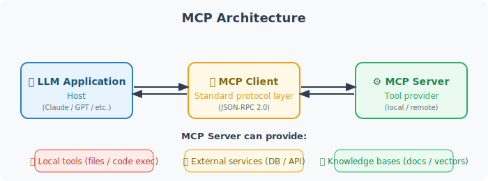

# MCP (Model Context Protocol) Deep Dive

MCP (Model Context Protocol) is an open protocol launched by Anthropic in November 2024, designed to standardize the way LLMs connect to external tools and data sources. After more than a year of development, MCP has become the de facto standard for Agent tool interfaces, widely supported by mainstream products including Claude Desktop, Cursor, Windsurf, and the OpenAI Agents SDK.

## The Core Idea of MCP

Before MCP, every Agent framework had its own tool interface:

```python
# Tool definitions across different frameworks (incompatible!)

# OpenAI Function Calling
openai_tool = {
    "type": "function",
    "function": {"name": "search", "parameters": {...}}
}

# LangChain Tool
from langchain_core.tools import tool
@tool
def search(query: str) -> str: ...

# Anthropic Tool
anthropic_tool = {
    "name": "search",
    "description": "...",
    "input_schema": {...}
}
```

MCP provides a unified standard, allowing tools to be reused across different frameworks — think of it as the "USB-C port" of the AI world:



```
MCP Architecture:

[LLM Application/Host]  ←→  [MCP Client]  ←→  [MCP Server]
                              (standard protocol)  (tool provider)

MCP Server can be:
- Local tools (filesystem, code execution)
- External services (databases, APIs)
- Knowledge bases (documents, vector stores)
```

## Implementing an MCP Server

```python
# pip install mcp

from mcp.server import Server
from mcp.server.stdio import stdio_server
from mcp.types import (
    Tool, TextContent, CallToolResult,
    ListToolsResult
)

# Create an MCP Server
server = Server("my-tools-server")

# Declare available tools
@server.list_tools()
async def list_tools() -> ListToolsResult:
    return ListToolsResult(tools=[
        Tool(
            name="calculate",
            description="Calculate a mathematical expression",
            inputSchema={
                "type": "object",
                "properties": {
                    "expression": {
                        "type": "string",
                        "description": "The mathematical expression to calculate"
                    }
                },
                "required": ["expression"]
            }
        ),
        Tool(
            name="read_file",
            description="Read file contents",
            inputSchema={
                "type": "object",
                "properties": {
                    "path": {
                        "type": "string",
                        "description": "File path"
                    }
                },
                "required": ["path"]
            }
        )
    ])

# Implement tool logic
@server.call_tool()
async def call_tool(name: str, arguments: dict) -> CallToolResult:
    if name == "calculate":
        import math
        try:
            expression = arguments["expression"]
            safe_env = {k: getattr(math, k) for k in dir(math) if not k.startswith('_')}
            # ⚠️ Security warning: eval() has security risks in production
            # Consider using the simpleeval library instead: pip install simpleeval
            result = eval(expression, {"__builtins__": {}}, safe_env)
            return CallToolResult(
                content=[TextContent(type="text", text=f"{expression} = {result}")]
            )
        except Exception as e:
            return CallToolResult(
                content=[TextContent(type="text", text=f"Error: {e}")],
                isError=True
            )
    
    elif name == "read_file":
        path = arguments["path"]
        try:
            with open(path, 'r', encoding='utf-8') as f:
                content = f.read()
            return CallToolResult(
                content=[TextContent(type="text", text=content)]
            )
        except Exception as e:
            return CallToolResult(
                content=[TextContent(type="text", text=f"Read failed: {e}")],
                isError=True
            )
    
    else:
        return CallToolResult(
            content=[TextContent(type="text", text=f"Unknown tool: {name}")],
            isError=True
        )

# Run in stdio mode (for clients like Claude Desktop to connect)
async def main():
    async with stdio_server() as (read_stream, write_stream):
        await server.run(read_stream, write_stream)

if __name__ == "__main__":
    import asyncio
    asyncio.run(main())
```

## Using MCP Tools in an Agent

```python
# pip install mcp anthropic

import anthropic
from mcp import ClientSession, StdioServerParameters
from mcp.client.stdio import stdio_client
import asyncio

async def use_mcp_tools(query: str):
    """Agent that uses MCP tools"""
    
    # Connect to the MCP Server
    server_params = StdioServerParameters(
        command="python",
        args=["my_mcp_server.py"],  # The server file defined above
    )
    
    async with stdio_client(server_params) as (read, write):
        async with ClientSession(read, write) as session:
            
            # Initialize the connection
            await session.initialize()
            
            # Get available tools
            tools_result = await session.list_tools()
            
            # Convert MCP tools to Anthropic format
            anthropic_tools = [
                {
                    "name": tool.name,
                    "description": tool.description,
                    "input_schema": tool.inputSchema
                }
                for tool in tools_result.tools
            ]
            
            client = anthropic.Anthropic()
            
            # Call Claude and allow tool use
            response = client.messages.create(
                model="claude-4-sonnet-20250514",
                max_tokens=1024,
                tools=anthropic_tools,
                messages=[{"role": "user", "content": query}]
            )
            
            # Handle tool calls
            while response.stop_reason == "tool_use":
                tool_results = []
                
                for content_block in response.content:
                    if content_block.type == "tool_use":
                        # Execute the tool via MCP
                        tool_result = await session.call_tool(
                            content_block.name,
                            content_block.input
                        )
                        
                        tool_results.append({
                            "type": "tool_result",
                            "tool_use_id": content_block.id,
                            "content": tool_result.content[0].text
                        })
                
                # Continue the conversation
                response = client.messages.create(
                    model="claude-4-sonnet-20250514",
                    max_tokens=1024,
                    tools=anthropic_tools,
                    messages=[
                        {"role": "user", "content": query},
                        {"role": "assistant", "content": response.content},
                        {"role": "user", "content": tool_results}
                    ]
                )
            
            # Return the final text response
            for block in response.content:
                if hasattr(block, "text"):
                    return block.text

# Test
asyncio.run(use_mcp_tools("Calculate sqrt(144) + pi * 2"))
```

## Main MCP Resource Types

```python
# In addition to Tools, MCP also supports:

# 1. Resources: static data sources
@server.list_resources()
async def list_resources():
    return [
        Resource(
            uri="file:///docs/readme.md",
            name="Project Documentation",
            mimeType="text/markdown"
        )
    ]

# 2. Prompt Templates
@server.list_prompts()
async def list_prompts():
    return [
        Prompt(
            name="code_review",
            description="Code review template",
            arguments=[
                PromptArgument(name="code", required=True)
            ]
        )
    ]
```

## Important MCP Updates in 2025

The MCP protocol underwent major evolution in 2025, primarily in the following areas:

### 1. Streamable HTTP Transport (March 2025)

MCP introduced **Streamable HTTP** to replace the original HTTP + SSE transport, addressing several pain points with remote MCP services:

```python
# New Streamable HTTP transport mode
from mcp.server.fastmcp import FastMCP

# FastMCP is a more concise way to create MCP Servers
mcp = FastMCP("my-remote-server")

@mcp.tool()
def get_weather(city: str) -> str:
    """Query city weather"""
    return f"Weather in {city}: Sunny, 25°C"

# Run in Streamable HTTP mode (supports remote access)
# Unified endpoint, no longer needs a separate /sse endpoint
if __name__ == "__main__":
    mcp.run(transport="streamable-http", port=8000)
```

**Streamable HTTP vs. Legacy HTTP + SSE**:

| Feature | HTTP + SSE (old) | Streamable HTTP (new) |
|---------|-----------------|----------------------|
| Endpoints | Requires separate `/sse` + `/messages` endpoints | Single unified endpoint |
| Connection recovery | Cannot recover after disconnect | Supports session recovery |
| Server load | Long connections continuously consume resources | On-demand streaming, optional regular HTTP response |
| Deployment friendliness | Requires SSE-supporting infrastructure | Standard HTTP, compatible with any infrastructure |

### 2. Remote MCP and Authentication

The 2025 MCP specification added comprehensive support for remote servers, including an authentication mechanism based on **OAuth 2.1**:

```
Remote MCP Architecture:

[Local Agent]  ←→  [MCP Client]  ←→  [Internet]  ←→  [Remote MCP Server]
                                          ↑
                                    OAuth 2.1 authentication
                                    + Streamable HTTP
```

### 3. MCP Ecosystem Status (2025–2026)

As of early 2026, MCP has been widely adopted:

| Client | MCP Support Status |
|--------|-------------------|
| Claude Desktop | ✅ First to support |
| Cursor | ✅ Deep integration |
| Windsurf | ✅ Supported |
| OpenAI Agents SDK | ✅ Native support |
| VS Code (Copilot) | ✅ Supported |
| Dify | ✅ Plugin support |

Community MCP Servers now number in the thousands, covering databases, cloud services, development tools, and many other scenarios.

### 4. Elicitation: Requesting Information from Users

The 2025 MCP specification added the **Elicitation** feature, allowing MCP Servers to proactively request additional information from users during tool execution (such as confirming dangerous operations or filling in missing parameters), rather than failing directly:

```python
# Elicitation example: MCP Server requests user confirmation
@server.call_tool()
async def call_tool(name: str, arguments: dict) -> CallToolResult:
    if name == "delete_file":
        path = arguments["path"]
        
        # Request user confirmation via Elicitation
        confirmation = await server.elicit(
            message=f"Are you sure you want to delete the file {path}? This action cannot be undone.",
            schema={
                "type": "object",
                "properties": {
                    "confirm": {
                        "type": "boolean",
                        "description": "Confirm deletion",
                        "default": False
                    }
                }
            }
        )
        
        if not confirmation.get("confirm"):
            return CallToolResult(
                content=[TextContent(type="text", text="Operation cancelled")]
            )
        
        # Execute deletion after user confirmation
        os.remove(path)
        return CallToolResult(
            content=[TextContent(type="text", text=f"Deleted {path}")]
        )
```

**Core value of Elicitation**:
- Get user confirmation before dangerous operations (deleting files, sending emails, etc.)
- Collect missing parameters at runtime (database connection info, API keys, etc.)
- Get user preference selections in multi-step workflows

### 5. Sampling: MCP Server Calling LLMs

The **Sampling** feature allows MCP Servers to in turn request LLM capabilities from the Host, creating a closed loop of "tools calling AI":

```python
# Sampling example: MCP Server leverages LLM capabilities
@server.call_tool()
async def call_tool(name: str, arguments: dict) -> CallToolResult:
    if name == "smart_summarize":
        file_path = arguments["path"]
        
        with open(file_path, 'r') as f:
            content = f.read()
        
        # MCP Server requests the Host's LLM for summarization
        summary_result = await server.sample(
            messages=[
                {
                    "role": "user",
                    "content": {
                        "type": "text",
                        "text": f"Please summarize the following document in 3 sentences:\n\n{content}"
                    }
                }
            ],
            max_tokens=200,
            model_preferences={
                "hints": [{"name": "claude-4-sonnet"}],
                "costPriority": 0.3,   # Cost priority (0-1)
                "speedPriority": 0.7,  # Speed priority
            }
        )
        
        return CallToolResult(
            content=[TextContent(
                type="text",
                text=f"Document summary:\n{summary_result.content.text}"
            )]
        )

# Sampling workflow:
# Host(LLM) → calls MCP Tool → MCP Server needs LLM capability
#                                → requests Host's LLM via Sampling
#                                ← returns LLM result
#             ← returns tool result
```

**Typical Sampling scenarios**:
- Code analysis tools need LLM to explain code intent
- Data processing tools need LLM to interpret the meaning of anomalous data
- File management tools need LLM to automatically classify and name files

---

## Summary

The value of MCP:
- **Standardization**: Unified tool interface, reusable across frameworks — "write once, use everywhere"
- **Security**: Clear permission boundaries, OAuth 2.1 authentication
- **Composability**: Multiple MCP Servers can be combined
- **Remote support**: Streamable HTTP takes MCP from local to the cloud
- **Thriving ecosystem**: Claude Desktop, Cursor, OpenAI Agents SDK, and others have full support

---

*Next section: [17.2 A2A (Agent-to-Agent) Protocol](./02_a2a_protocol.md)*
