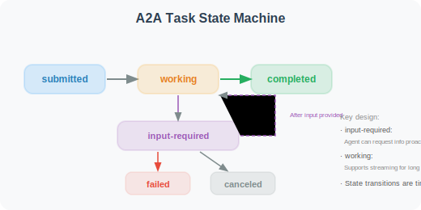

# A2A (Agent-to-Agent) Protocol

A2A (Agent-to-Agent) is an open protocol launched by Google at Google Cloud Next in April 2025, specifically designed for interoperability between different Agents. The protocol received support from over 50 technology partners at launch.

## A2A's Design Goals

```
Problems A2A solves:
- How can Agents developed by different companies/teams call each other?
- How to standardize the declaration and discovery of Agent capabilities?
- How can Agents across frameworks securely pass tasks?

Analogy:
A2A is to Agents what HTTP is to web services —
making Agents into "microservices" that can connect to each other
```

### MCP vs. A2A: Complementary, Not Competing

```
MCP and A2A solve problems at different layers:

MCP (Model-Tool layer):
  Agent ←→ Tools/Data
  "Enabling Agents to use various tools"
  Analogy: a person learning to use a hammer or wrench

A2A (Agent-Agent layer):
  Agent ←→ Agent
  "Enabling Agents to collaborate with other Agents"
  Analogy: communication and collaboration between people

Together = a complete Agent interoperability system
```

## Agent Card

Every A2A-compatible Agent needs to publish a capability card at `/.well-known/agent.json`:

```python
import json
from typing import Optional

class AgentCard:
    """A2A Agent capability declaration"""
    
    def __init__(
        self,
        name: str,
        description: str,
        url: str,
        version: str = "1.0.0"
    ):
        self.card = {
            "name": name,
            "description": description,
            "url": url,
            "version": version,
            "capabilities": {
                "streaming": True,
                "pushNotifications": False,
                "stateTransitionHistory": True,  # Supports state tracking
            },
            "defaultInputModes": ["text"],
            "defaultOutputModes": ["text"],
            "skills": []
        }
    
    def add_skill(
        self,
        id: str,
        name: str,
        description: str,
        input_modes: list[str] = None,
        output_modes: list[str] = None
    ):
        """Add a skill description"""
        self.card["skills"].append({
            "id": id,
            "name": name,
            "description": description,
            "inputModes": input_modes or ["text"],
            "outputModes": output_modes or ["text"],
        })
    
    def to_json(self) -> str:
        return json.dumps(self.card, indent=2)

# Create an example Agent Card
card = AgentCard(
    name="Data Analysis Agent",
    description="A professional data analysis Agent that can process CSV data and generate visualization reports",
    url="https://my-agent.example.com",
    version="2.1.0"
)

card.add_skill(
    id="analyze_csv",
    name="CSV Data Analysis",
    description="Analyze data in CSV files and calculate statistical metrics",
    input_modes=["text", "file"],
    output_modes=["text", "data"]
)

card.add_skill(
    id="generate_chart",
    name="Data Visualization",
    description="Generate data charts (line charts, bar charts, pie charts)",
    input_modes=["data"],
    output_modes=["image", "text"]
)

print(card.to_json())
```

## A2A Task Passing

A2A defines a complete task lifecycle management, including task creation, execution, status tracking, and result return:

```python
from fastapi import FastAPI
from pydantic import BaseModel
import uuid
import datetime

app = FastAPI(title="A2A Agent Server")

# ============================
# A2A Message Format
# ============================

class A2AMessage(BaseModel):
    """A2A standard message format"""
    role: str  # "user" | "agent"
    parts: list[dict]  # Message content blocks (supports text, file, data, etc.)

class A2ATask(BaseModel):
    """A2A task request"""
    id: Optional[str] = None
    message: A2AMessage

class A2ATaskResult(BaseModel):
    """A2A task result"""
    id: str
    status: dict  # state: "completed" | "failed" | "working" | "input-required"
    artifacts: list[dict] = []

# ============================
# A2A Server Endpoints
# ============================

@app.get("/.well-known/agent.json")
async def get_agent_card():
    """Agent capability declaration (all A2A Agents must implement this)"""
    return card.card

@app.post("/tasks/send")
async def send_task(task: A2ATask) -> A2ATaskResult:
    """Receive and process a task (synchronous mode)"""
    task_id = task.id or str(uuid.uuid4())
    
    # Extract user message
    user_message = ""
    for part in task.message.parts:
        if part.get("type") == "text":
            user_message += part.get("text", "")
    
    # Process the task (call real Agent logic)
    from openai import OpenAI
    client = OpenAI()
    
    response = client.chat.completions.create(
        model="gpt-4o-mini",
        messages=[{"role": "user", "content": user_message}]
    )
    
    result = response.choices[0].message.content
    
    return A2ATaskResult(
        id=task_id,
        status={
            "state": "completed",
            "timestamp": datetime.datetime.now().isoformat()
        },
        artifacts=[{
            "parts": [{"type": "text", "text": result}],
            "name": "response"
        }]
    )

@app.post("/tasks/sendSubscribe")
async def send_task_streaming(task: A2ATask):
    """Receive and process a task (streaming mode, returns intermediate status via SSE)"""
    # Supports long-running tasks; pushes status updates via SSE
    pass

# ============================
# A2A Client (calling other Agents)
# ============================

import requests

class A2AClient:
    """A2A client: calls other Agents"""
    
    def __init__(self, agent_url: str):
        self.agent_url = agent_url.rstrip("/")
        self.agent_card = None
    
    def discover(self) -> dict:
        """Discover Agent capabilities"""
        response = requests.get(
            f"{self.agent_url}/.well-known/agent.json"
        )
        self.agent_card = response.json()
        return self.agent_card
    
    def send_task(self, message: str) -> str:
        """Send a task to the Agent"""
        payload = {
            "message": {
                "role": "user",
                "parts": [{"type": "text", "text": message}]
            }
        }
        
        response = requests.post(
            f"{self.agent_url}/tasks/send",
            json=payload
        )
        
        result = response.json()
        
        # Extract result
        for artifact in result.get("artifacts", []):
            for part in artifact.get("parts", []):
                if part.get("type") == "text":
                    return part["text"]
        
        return "Agent returned an empty result"

# Usage example
client = A2AClient("https://my-data-agent.example.com")
card = client.discover()
print(f"Discovered Agent: {card['name']}")
print(f"Available skills: {[s['name'] for s in card.get('skills', [])]}")

result = client.send_task("Analyze this sales data and provide a trend analysis: [100, 120, 95, 140, 160]")
print(result)
```

## A2A Task State Machine

A2A defines a clear task state transition flow:



## Streaming Mode: `/tasks/sendSubscribe`

For long-running tasks (such as data analysis or document generation), A2A provides a streaming mode based on **SSE (Server-Sent Events)**, allowing clients to receive real-time task progress updates:

```python
from fastapi import FastAPI
from fastapi.responses import StreamingResponse
import json
import asyncio

app = FastAPI()

async def task_stream(task_id: str, user_message: str):
    """Return task progress and results via SSE streaming"""
    
    # 1. Send task status change: working
    yield f"data: {json.dumps({'id': task_id, 'status': {'state': 'working', 'message': 'Analyzing data...'}})}\n\n"
    
    await asyncio.sleep(1)  # Simulate processing
    
    # 2. Send intermediate result (artifact update)
    yield f"data: {json.dumps({'id': task_id, 'artifact': {'parts': [{'type': 'text', 'text': 'Phase 1 complete: data cleaning'}], 'name': 'progress', 'append': True}})}\n\n"
    
    await asyncio.sleep(1)
    
    # 3. Send final result
    yield f"data: {json.dumps({'id': task_id, 'status': {'state': 'completed'}, 'artifact': {'parts': [{'type': 'text', 'text': 'Analysis complete: sales grew 23%'}], 'name': 'result', 'lastChunk': True}})}\n\n"

@app.post("/tasks/sendSubscribe")
async def send_task_streaming(task: dict):
    """A2A streaming task endpoint"""
    task_id = task.get("id", str(uuid.uuid4()))
    user_message = task["message"]["parts"][0].get("text", "")
    
    return StreamingResponse(
        task_stream(task_id, user_message),
        media_type="text/event-stream",
        headers={
            "Cache-Control": "no-cache",
            "Connection": "keep-alive",
        }
    )
```

**Client consuming the SSE stream**:

```python
import httpx

async def subscribe_task(agent_url: str, message: str):
    """Subscribe to streaming task results"""
    payload = {
        "message": {
            "role": "user",
            "parts": [{"type": "text", "text": message}]
        }
    }
    
    async with httpx.AsyncClient() as client:
        async with client.stream(
            "POST", f"{agent_url}/tasks/sendSubscribe", json=payload
        ) as response:
            async for line in response.aiter_lines():
                if line.startswith("data: "):
                    event = json.loads(line[6:])
                    status = event.get("status", {})
                    print(f"Status: {status.get('state', 'unknown')}")
                    
                    if artifact := event.get("artifact"):
                        for part in artifact.get("parts", []):
                            if part.get("type") == "text":
                                print(f"  → {part['text']}")
```

## Push Notifications

For tasks that require even longer processing times, A2A supports asynchronously notifying clients via a **Push Notifications** mechanism, avoiding clients having to maintain long-lived SSE connections:

```python
class AgentCardWithPush:
    """Agent Card with push notification support"""
    
    def __init__(self, name: str, url: str):
        self.card = {
            "name": name,
            "url": url,
            "capabilities": {
                "streaming": True,
                "pushNotifications": True,  # Declare push support
                "stateTransitionHistory": True,
            },
            "skills": []
        }

# Push Notification workflow:
# 1. Client calls /tasks/send to submit the task
# 2. Client calls /tasks/{id}/pushNotification/set to register a callback URL
# 3. Agent sends a notification to the callback URL upon completion
# 4. Client calls /tasks/{id} to get the full result

@app.post("/tasks/{task_id}/pushNotification/set")
async def set_push_notification(task_id: str, config: dict):
    """Register a push notification callback"""
    callback_url = config.get("url")
    # Store the callback URL; send a POST request to this URL when the task completes
    push_registry[task_id] = callback_url
    return {"status": "registered"}
```

## Authentication and Security

The A2A protocol declares authentication requirements via the `authentication` field in the Agent Card, supporting multiple authentication schemes:

```python
# Authentication declaration in Agent Card
agent_card_with_auth = {
    "name": "Enterprise Data Analysis Agent",
    "url": "https://data-agent.corp.example.com",
    "version": "2.0.0",
    "authentication": {
        "schemes": [
            {
                "scheme": "Bearer",
                "description": "Authenticate using OAuth 2.0 Bearer Token",
                "tokenUrl": "https://auth.corp.example.com/oauth/token",
                "scopes": ["agent:read", "agent:execute"]
            },
            {
                "scheme": "ApiKey",
                "description": "Authenticate using API Key",
                "in": "header",
                "name": "X-API-Key"
            }
        ]
    },
    "capabilities": {
        "streaming": True,
        "pushNotifications": True,
        "stateTransitionHistory": True,
    },
    "skills": [...]
}

# Client calling with authentication
class A2ASecureClient:
    """A2A client with authentication"""
    
    def __init__(self, agent_url: str, auth_token: str):
        self.agent_url = agent_url
        self.headers = {
            "Authorization": f"Bearer {auth_token}",
            "Content-Type": "application/json"
        }
    
    def send_task(self, message: str) -> dict:
        response = requests.post(
            f"{self.agent_url}/tasks/send",
            json={
                "message": {
                    "role": "user",
                    "parts": [{"type": "text", "text": message}]
                }
            },
            headers=self.headers
        )
        response.raise_for_status()
        return response.json()
```

---

## Summary

The value of the A2A protocol:
- **Interoperability**: Agents from different frameworks and teams can call each other
- **Service discovery**: Declare capabilities via Agent Card (`/.well-known/agent.json`)
- **Standard message format**: Unified request/response format supporting multimodal content
- **Task state management**: Complete task lifecycle tracking
- **Complementary to MCP**: MCP manages Agent-tool connections; A2A manages Agent-Agent connections
- **Industry support**: 50+ companies including Google, Salesforce, and SAP are participating

---

*Next section: [17.3 ANP (Agent Network Protocol)](./03_anp_protocol.md)*
