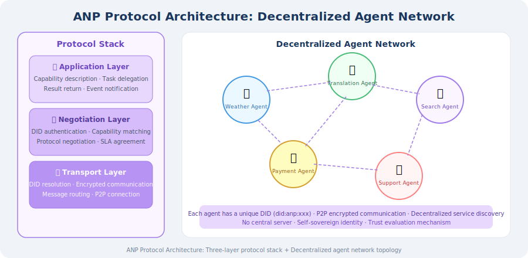
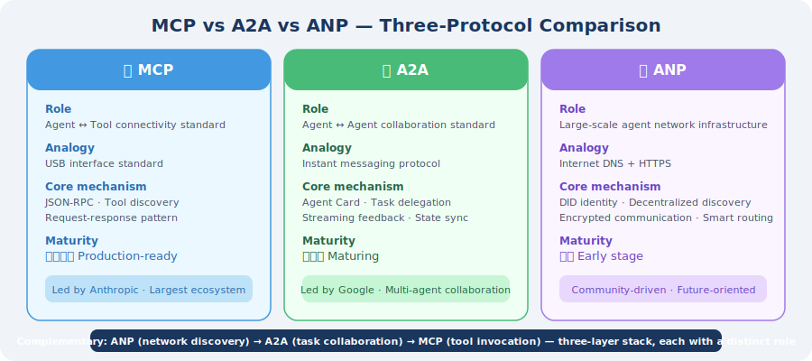

# 17.3 ANP (Agent Network Protocol)

> **Section Goal**: Understand the design philosophy of the ANP protocol, master the core mechanisms of decentralized Agent networks, and compare it with MCP/A2A.

---

## Why Do We Need ANP?

In the previous two sections, we learned about two protocols — MCP and A2A:
- **MCP** solves the "connection" problem between Agents and tools
- **A2A** solves the "collaboration" problem between Agents

But when we face the scenario of **large-scale Agent networks**, a new problem emerges:

> **In an open network with thousands of Agents, how do Agents discover each other, verify identities, and communicate securely?**

This is the problem that **ANP (Agent Network Protocol)** is designed to solve [1].

### Understanding Through Analogy

| Protocol | Analogy | Core Problem |
|----------|---------|-------------|
| **MCP** | USB interface standard | How does an Agent connect to tools? |
| **A2A** | Instant messaging protocol | How do two Agents collaborate? |
| **ANP** | Internet DNS + HTTPS | How do large numbers of Agents form a network? |

If MCP is "the USB of Agents" and A2A is "the messaging app of Agents," then ANP is "**the internet of Agents**."

---

## ANP's Core Design Philosophy

ANP's design follows these key principles [1]:

### 1. Decentralization

Traditional Agent collaboration (including A2A) typically relies on centralized service discovery — Agents register with a central registry, and other Agents look them up through the registry. But centralized solutions have problems including **single points of failure, scalability bottlenecks, and concentrated trust**.

ANP adopts a **decentralized architecture**: each Agent has its own identity, can independently publish its capability descriptions, and doesn't need to rely on a central server.

### 2. DID Authentication (Decentralized Identifiers)

ANP uses **DIDs (Decentralized Identifiers)** [2] as the identity foundation for Agents:

```
# DID format
did:anp:agent_12345

# Complete DID Document example
{
  "@context": "https://www.w3.org/ns/did/v1",
  "id": "did:anp:agent_12345",
  "authentication": [
    {
      "id": "did:anp:agent_12345#keys-1",
      "type": "Ed25519VerificationKey2020",
      "publicKeyMultibase": "z6MkhaXgBZDvotDkL5257faiztiGiC2QtKLGpbnnEGta2doK"
    }
  ],
  "service": [
    {
      "id": "did:anp:agent_12345#agent-service",
      "type": "AgentService",
      "serviceEndpoint": "https://agent.example.com/api"
    }
  ]
}
```

Key advantages of DIDs:
- **Autonomy**: Agents generate and manage their own identities without relying on third parties
- **Verifiability**: Agent identity is verified through cryptographic signatures
- **Interoperability**: W3C standard, cross-platform compatible

### 3. Decentralized Service Discovery

ANP defines the **capability description format** and **discovery mechanism** for Agents:

```python
# ANP Agent capability description (conceptual implementation)
agent_capability = {
    "did": "did:anp:weather_agent_001",
    "name": "Weather Forecast Agent",
    "description": "Provides real-time weather queries and 7-day forecasts for cities worldwide",
    
    "capabilities": [
        {
            "name": "get_current_weather",
            "description": "Get current weather for a specified city",
            "input_schema": {
                "type": "object",
                "properties": {
                    "city": {"type": "string", "description": "City name"},
                    "unit": {"type": "string", "enum": ["celsius", "fahrenheit"]}
                },
                "required": ["city"]
            },
            "output_schema": {
                "type": "object",
                "properties": {
                    "temperature": {"type": "number"},
                    "condition": {"type": "string"},
                    "humidity": {"type": "number"}
                }
            }
        },
        {
            "name": "get_forecast",
            "description": "Get a 7-day weather forecast",
            "input_schema": {
                "type": "object",
                "properties": {
                    "city": {"type": "string"},
                    "days": {"type": "integer", "minimum": 1, "maximum": 7}
                },
                "required": ["city"]
            }
        }
    ],
    
    "trust_score": 0.95,
    "response_time_ms": 200,
    "pricing": {
        "model": "per_request",
        "price": 0.001,
        "currency": "USD"
    }
}
```

---

## ANP's Three-Layer Protocol Stack

ANP's protocol design is divided into three layers:



### Transport Layer: Secure Communication

```python
class ANPTransport:
    """ANP transport layer (conceptual implementation)"""
    
    def __init__(self, agent_did: str, private_key):
        self.did = agent_did
        self.private_key = private_key
    
    def send_message(self, target_did: str, message: dict) -> dict:
        """
        Send an encrypted message to the target Agent
        
        Process:
        1. Resolve the target DID to get the public key and endpoint
        2. Encrypt the message with the target's public key
        3. Sign with your own private key
        4. Send to the target endpoint
        """
        # 1. DID resolution
        target_doc = self.resolve_did(target_did)
        target_pubkey = target_doc["authentication"][0]["publicKeyMultibase"]
        target_endpoint = target_doc["service"][0]["serviceEndpoint"]
        
        # 2. Build signed message
        signed_message = {
            "from": self.did,
            "to": target_did,
            "timestamp": time.time(),
            "payload": message,
            "signature": self.sign(message),  # Private key signature
        }
        
        # 3. Encrypt and send
        encrypted = self.encrypt(signed_message, target_pubkey)
        response = self.http_post(target_endpoint, encrypted)
        
        return response
    
    def resolve_did(self, did: str) -> dict:
        """Resolve a DID to get the DID Document"""
        # Look up the DID Document in the decentralized network
        # Can use blockchain, DHT, DNS, and other resolution methods
        pass
    
    def sign(self, message: dict) -> str:
        """Sign a message with the private key"""
        pass
    
    def encrypt(self, message: dict, public_key: str) -> bytes:
        """Encrypt a message with the target's public key"""
        pass
```

### Negotiation Layer: Intelligent Routing

```python
class ANPRouter:
    """ANP intelligent routing (conceptual implementation)"""
    
    def __init__(self):
        self.known_agents = {}  # DID -> capability description
    
    def discover_agents(
        self, 
        capability_query: str,
        min_trust_score: float = 0.8
    ) -> list[dict]:
        """
        Discover Agents with specific capabilities
        
        Search strategy:
        1. Local cache lookup
        2. Query known neighbor nodes
        3. Network-wide broadcast (last resort)
        """
        candidates = []
        
        for did, capability in self.known_agents.items():
            # Capability matching
            if self._match_capability(capability, capability_query):
                # Trust filtering
                if capability.get("trust_score", 0) >= min_trust_score:
                    candidates.append({
                        "did": did,
                        "capability": capability,
                        "trust_score": capability["trust_score"],
                        "response_time": capability.get("response_time_ms", 999),
                    })
        
        # Sort by trust score and response time
        candidates.sort(
            key=lambda x: (-x["trust_score"], x["response_time"])
        )
        
        return candidates
    
    def _match_capability(self, capability: dict, query: str) -> bool:
        """Check if an Agent's capabilities match the query"""
        # Simplified: keyword matching
        description = capability.get("description", "").lower()
        cap_names = [c["name"].lower() for c in capability.get("capabilities", [])]
        
        query_lower = query.lower()
        return (
            query_lower in description or
            any(query_lower in name for name in cap_names)
        )
```

---

## MCP vs. A2A vs. ANP: Three-Protocol Comparison



| Dimension | MCP | A2A | ANP |
|-----------|-----|-----|-----|
| **Core goal** | Agent ↔ tool connection | Agent ↔ Agent collaboration | Large-scale Agent networking |
| **Communication mode** | Request-response | Task delegation + streaming | Peer-to-peer + routing |
| **Service discovery** | Client actively connects | Centralized Agent Card | Decentralized DID + DHT |
| **Authentication** | Optional (usually none) | Agent Card declaration | DID cryptographic verification |
| **Security** | Depends on transport layer | JSON-RPC over HTTPS | End-to-end encryption + signatures |
| **Scalability** | Single-point connection | Small-scale teams | Large-scale networks |
| **Standardization** | Anthropic-led | Google-led | Community-driven |
| **Maturity** | ⭐⭐⭐⭐ Production-ready | ⭐⭐⭐ Maturing | ⭐⭐ Early stage |
| **Use cases** | Tool/data source integration | Multi-Agent workflows | Open Agent ecosystems |

### The Complementary Relationship of the Three Protocols

In practice, the three protocols are typically **used in combination**:
1. **ANP** is responsible for discovering suitable Agents in the open network
2. **A2A** is responsible for coordinating task collaboration among multiple Agents
3. **MCP** is responsible for each Agent calling its own tools

---

## ANP Use Cases

### Scenario 1: Cross-Organization Agent Collaboration

```
Company A's customer service Agent
    ↕ (ANP discovery + authentication)
Company B's logistics Agent
    ↕ (A2A task collaboration)
Company C's payment Agent

Scenario: A user asks Company A's customer service about a return.
The customer service Agent uses ANP to discover Company B's logistics
Agent to check shipping status, then processes the refund through
Company C's payment Agent — all completed automatically, no human intervention.
```

### Scenario 2: Decentralized Agent Marketplace

```
Developer publishes Agent → registers DID + capability description
                                ↓
User describes need → ANP router matches the best Agent
                                ↓
            Automatically negotiate pricing, SLA, data permissions
                                ↓
              Execute task → automatic settlement
```

### Scenario 3: IoT Agent Network

```
Smart home Agent cluster:
  - HVAC Agent (DID: did:anp:hvac_001)
  - Lighting Agent (DID: did:anp:light_001)
  - Security Agent (DID: did:anp:security_001)
  - Energy Agent (DID: did:anp:energy_001)

Forms an autonomous network via ANP, no central controller needed:
  Security Agent detects anomaly → notifies Lighting Agent to turn on lights
                                 → notifies Energy Agent to enter alert mode
```

---

## Current Progress and Challenges

### Progress

- The ANP community has published a protocol specification draft
- Aligned with the W3C DID standard
- Multiple open-source implementations are under development

### Main Challenges

| Challenge | Description |
|-----------|-------------|
| **Performance** | DID resolution and encrypted communication add latency |
| **Trust mechanism** | How to establish reliable trust evaluation in a decentralized network |
| **Standardization** | No widely accepted industry standard has yet emerged |
| **Ecosystem building** | Enough Agents need to join the network to create network effects |
| **Privacy protection** | How to protect privacy during capability discovery and communication |

> **🏭 Production Practice**
>
> - **Current stage**: ANP is still in its early stages; production environments should primarily use MCP + A2A
> - **Watch the trend**: ANP represents the future direction of Agent networking and is worth continued attention
> - **Gradual adoption**: You can start experimenting with DID authentication and decentralized service discovery in internal Agent networks
> - **Security first**: Any scenario involving cross-organization Agent communication should prioritize authentication and encryption

---

*Next section: [17.4 Inter-Agent Message Passing and State Sharing](./04_message_passing.md)*

---

## References

[1] ANP Community. Agent Network Protocol Specification[EB/OL]. 2025. https://github.com/agent-network-protocol/anp.

[2] W3C. Decentralized Identifiers (DIDs) v1.0[S]. 2022. https://www.w3.org/TR/did-core/.

[3] ANTHROPIC. Model Context Protocol specification[EB/OL]. 2024. https://spec.modelcontextprotocol.io/.

[4] GOOGLE. Agent-to-Agent (A2A) Protocol[EB/OL]. 2025. https://google.github.io/A2A/.
