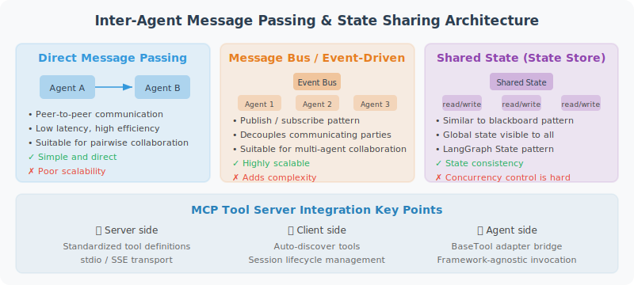

# Inter-Agent Message Passing and State Sharing

> **Section Goal**: Learn how to implement message passing between Agents, and deepen understanding through a hands-on MCP tool integration exercise.



---

## Production-Grade MCP Tool Server

```python
# production_mcp_server.py
"""
A complete production-grade MCP tool server
Includes: file operations, database queries, HTTP requests
"""

from mcp.server import Server
from mcp.server.stdio import stdio_server
from mcp.types import Tool, TextContent, CallToolResult, ListToolsResult
import json
import os
import sqlite3
import requests
import asyncio

server = Server("production-tools-server")

# ============================
# Tool Definitions
# ============================

TOOLS = [
    Tool(
        name="read_file",
        description="Read local file contents. Supports .txt .md .py .json .csv formats.",
        inputSchema={
            "type": "object",
            "properties": {
                "path": {"type": "string", "description": "Relative file path"}
            },
            "required": ["path"]
        }
    ),
    Tool(
        name="write_file",
        description="Write content to a file (overwrite).",
        inputSchema={
            "type": "object",
            "properties": {
                "path": {"type": "string", "description": "File path"},
                "content": {"type": "string", "description": "File content"}
            },
            "required": ["path", "content"]
        }
    ),
    Tool(
        name="query_database",
        description="Query a SQLite database (only SELECT statements allowed).",
        inputSchema={
            "type": "object",
            "properties": {
                "db_path": {"type": "string", "description": "Database file path"},
                "sql": {"type": "string", "description": "SELECT SQL statement"}
            },
            "required": ["db_path", "sql"]
        }
    ),
    Tool(
        name="http_get",
        description="Send an HTTP GET request to retrieve data.",
        inputSchema={
            "type": "object",
            "properties": {
                "url": {"type": "string", "description": "Request URL"},
                "headers": {"type": "object", "description": "Request headers (optional)"}
            },
            "required": ["url"]
        }
    )
]

@server.list_tools()
async def list_tools() -> ListToolsResult:
    return ListToolsResult(tools=TOOLS)

@server.call_tool()
async def call_tool(name: str, arguments: dict) -> CallToolResult:
    try:
        if name == "read_file":
            path = arguments["path"]
            # Security check: prevent path traversal
            abs_path = os.path.abspath(path)
            if not abs_path.startswith(os.getcwd()):
                raise PermissionError("Access to files outside the current directory is not allowed")
            
            with open(abs_path, 'r', encoding='utf-8') as f:
                content = f.read()
            
            return CallToolResult(
                content=[TextContent(type="text", text=content[:10000])]
            )
        
        elif name == "write_file":
            path = arguments["path"]
            content = arguments["content"]
            
            os.makedirs(os.path.dirname(os.path.abspath(path)), exist_ok=True)
            with open(path, 'w', encoding='utf-8') as f:
                f.write(content)
            
            return CallToolResult(
                content=[TextContent(type="text", text=f"Wrote {len(content)} characters to {path}")]
            )
        
        elif name == "query_database":
            db_path = arguments["db_path"]
            sql = arguments["sql"].strip()
            
            # Security check: only allow SELECT; block dangerous keywords
            sql_upper = sql.upper()
            if not sql_upper.startswith("SELECT"):
                raise PermissionError("Only SELECT queries are allowed")
            
            # Check for dangerous operations (prevent executing other statements after a semicolon)
            dangerous_keywords = [
                "DROP", "DELETE", "UPDATE", "INSERT", 
                "ALTER", "CREATE", "TRUNCATE", "EXEC",
            ]
            for keyword in dangerous_keywords:
                if keyword in sql_upper:
                    raise PermissionError(f"SQL contains a forbidden keyword: {keyword}")
            
            # Disallow multi-statement execution (semicolon-separated)
            if ";" in sql.rstrip(";"):
                raise PermissionError("Executing multiple SQL statements is not allowed")
            
            conn = sqlite3.connect(db_path)
            conn.row_factory = sqlite3.Row
            cursor = conn.cursor()
            cursor.execute(sql)
            rows = cursor.fetchmany(100)  # Maximum 100 rows
            conn.close()
            
            result = [dict(row) for row in rows]
            return CallToolResult(
                content=[TextContent(type="text", text=json.dumps(result, indent=2))]
            )
        
        elif name == "http_get":
            url = arguments["url"]
            headers = arguments.get("headers", {})
            
            response = requests.get(url, headers=headers, timeout=10)
            response.raise_for_status()
            
            content = response.text[:5000]  # Limit return length
            return CallToolResult(
                content=[TextContent(type="text", text=content)]
            )
        
        else:
            return CallToolResult(
                content=[TextContent(type="text", text=f"Unknown tool: {name}")],
                isError=True
            )
    
    except Exception as e:
        return CallToolResult(
            content=[TextContent(type="text", text=f"Tool execution failed: {str(e)}")],
            isError=True
        )

async def main():
    async with stdio_server() as (read_stream, write_stream):
        await server.run(read_stream, write_stream)

if __name__ == "__main__":
    asyncio.run(main())
```

## Using MCP in Claude Desktop

Once the MCP Server is written, it needs to be registered in the client (Host) before it can be used. Taking Claude Desktop as an example, you simply specify the MCP Server's startup command and path in the configuration file. Claude will automatically connect to these servers at startup and display the list of available tools in the conversation.

```json
// ~/.config/claude/claude_desktop_config.json
{
  "mcpServers": {
    "my-tools": {
      "command": "python",
      "args": ["/path/to/production_mcp_server.py"],
      "env": {
        "PYTHONPATH": "/path/to/your/project"
      }
    }
  }
}
```

---

## Chapter Summary

The core of Agent communication protocols:

| Protocol | Role | Main Use Cases |
|----------|------|---------------|
| MCP | LLM ↔ tools/data sources | Standardized tool calls |
| A2A | Agent ↔ Agent | Cross-framework Agent collaboration |

The two are complementary: MCP solves tool integration; A2A solves Agent interoperability.

---

*Next section: [17.5 Practice: MCP-Based Tool Integration](./05_practice_mcp_integration.md)*