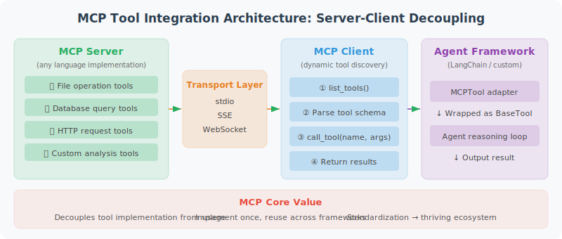

# Practice: Complete MCP-Based Tool Integration

This section demonstrates how to package custom tools as an MCP server and use them in a LangChain Agent.



The core value of MCP lies in **standardization and decoupling**: the implementation of tools (MCP Server) and the use of tools (MCP Client / Agent) are completely separated. This means you can write tool servers in any language, and any Agent framework that supports the MCP protocol can use these tools directly, without needing to adapt separately for each framework.

The code below implements three key components:

1. **MCPTool adapter**: Wraps MCP tools as LangChain `BaseTool` — this is a "bridge" pattern that allows LangChain Agents to seamlessly use MCP tools just like native tools
2. **Dynamic tool loading**: Automatically discovers and loads all available tools from the MCP Server, no manual registration needed
3. **Agent integration**: Injects the loaded MCP tools into a LangChain Agent

### About Session Lifecycle

There is an important design consideration in the code: MCP tools hold a reference to the `ClientSession`, and once the session is closed, the tools can no longer be used. In real projects, you need to ensure the session's lifecycle covers the period during which the tools are in use — the typical approach is to place session management and Agent execution within the same `async with` context.

```python
# mcp_langchain_integration.py
"""
A complete example of integrating MCP tools into a LangChain Agent
"""

import asyncio
import json
from typing import Any
from langchain_core.tools import BaseTool
from langchain_openai import ChatOpenAI
from langchain.agents import AgentExecutor, create_openai_tools_agent  # legacy; new projects should use LangGraph
from langchain_core.prompts import ChatPromptTemplate, MessagesPlaceholder
from mcp import ClientSession, StdioServerParameters
from mcp.client.stdio import stdio_client

# ============================
# 1. MCP Tool Adapter
# ============================

class MCPTool(BaseTool):
    """Wraps an MCP tool as a LangChain Tool"""
    
    name: str
    description: str
    session: Any  # MCP ClientSession
    
    def _run(self, **kwargs) -> str:
        """Synchronous execution (bridged via asyncio)"""
        loop = asyncio.new_event_loop()
        try:
            result = loop.run_until_complete(
                self.session.call_tool(self.name, kwargs)
            )
            if result.content:
                return result.content[0].text
            return "Tool returned no content"
        finally:
            loop.close()
    
    async def _arun(self, **kwargs) -> str:
        """Asynchronous execution"""
        result = await self.session.call_tool(self.name, kwargs)
        if result.content:
            return result.content[0].text
        return "Tool returned no content"


# ============================
# 2. Dynamically Load Tools from MCP Server
# ============================

async def load_mcp_tools(server_command: str, server_args: list) -> list[MCPTool]:
    """Load all tools from an MCP Server
    
    Note: The tools returned by this function must be used while the MCP session is alive.
    In real applications, you should ensure the session's lifecycle covers the tools' usage period.
    The build_mcp_agent() function below demonstrates the correct usage pattern.
    """
    
    server_params = StdioServerParameters(
        command=server_command,
        args=server_args
    )
    
    tools = []
    
    async with stdio_client(server_params) as (read, write):
        async with ClientSession(read, write) as session:
            await session.initialize()
            
            tools_result = await session.list_tools()
            
            for mcp_tool in tools_result.tools:
                lc_tool = MCPTool(
                    name=mcp_tool.name,
                    description=mcp_tool.description or f"Use the {mcp_tool.name} tool",
                    session=session
                )
                tools.append(lc_tool)
            
            # ⚠️ Important: tools hold a reference to the session.
            # Once this context is exited, the session will close and tools will no longer work.
            # In production, session management and agent execution should be
            # placed within the same async with context.
            return tools


# ============================
# 3. Build an Agent Using MCP Tools
# ============================

async def build_mcp_agent():
    """Build an Agent integrated with MCP tools"""
    
    # Load MCP tools
    tools = await load_mcp_tools(
        server_command="python",
        server_args=["production_mcp_server.py"]
    )
    
    print(f"Loaded {len(tools)} MCP tools: {[t.name for t in tools]}")
    
    # Build the Agent
    llm = ChatOpenAI(model="gpt-4o", temperature=0)
    
    prompt = ChatPromptTemplate.from_messages([
        ("system", """You are a powerful Agent that uses standardized tools via the MCP protocol.

You have the following tools available — choose and use them appropriately:
- File read/write operations
- Database queries
- HTTP requests

When you encounter tasks that require these capabilities, proactively use the appropriate tools."""),
        MessagesPlaceholder(variable_name="chat_history"),
        ("human", "{input}"),
        MessagesPlaceholder(variable_name="agent_scratchpad"),
    ])
    
    agent = create_openai_tools_agent(llm, tools, prompt)
    executor = AgentExecutor(agent=agent, tools=tools, verbose=True)
    
    return executor


# ============================
# 4. Usage Examples
# ============================

async def main():
    agent = await build_mcp_agent()
    
    # Test file operations
    result = agent.invoke({
        "input": "Read the README.md file and summarize its main content",
        "chat_history": []
    })
    print(result["output"])
    
    # Test composite operations
    result = agent.invoke({
        "input": "Query the latest 10 sales records from the database ./data/sales.db",
        "chat_history": []
    })
    print(result["output"])

if __name__ == "__main__":
    asyncio.run(main())
```

## MCP Best Practices Summary

Before deploying MCP tools to a production environment, security, error handling, and performance optimization are three dimensions that must be carefully considered. Here are some key best practices:

**Security** is the top priority, because MCP tools typically involve sensitive operations on the filesystem, databases, and other resources — and the parameters for these operations are generated by the LLM, which could be exploited through prompt injection attacks.

**Error handling** ensures that any tool call failure does not crash the entire Agent, but instead returns a clear error message that the LLM can understand and respond to.

**Performance optimization**: For read-only operations like database queries, using caching can significantly reduce the overhead of repeated calls.

```python
# 1. Tool security
security_checklist = [
    "✅ File operations: restrict to working directory, prevent path traversal",
    "✅ Database: only allow SELECT, no DDL/DML",
    "✅ HTTP: whitelist domains, set timeouts",
    "✅ Code execution: use a sandbox (Docker/subprocess)",
    "✅ Sensitive data: do not return full API keys or similar information",
]

# 2. Error handling
def safe_tool_call(func):
    """Safe decorator for tool calls"""
    def wrapper(*args, **kwargs):
        try:
            return func(*args, **kwargs)
        except PermissionError as e:
            return {"error": "Permission denied", "message": str(e)}
        except FileNotFoundError as e:
            return {"error": "File not found", "message": str(e)}
        except Exception as e:
            return {"error": "Tool execution failed", "message": str(e)[:200]}
    return wrapper

# 3. Performance optimization
# Use @lru_cache to cache results of unchanging queries
from functools import lru_cache

@lru_cache(maxsize=100)
def cached_database_query(db_path: str, sql: str) -> str:
    """Database query with caching (only cache read-only queries)"""
    import sqlite3
    
    # Security check
    sql_upper = sql.strip().upper()
    if not sql_upper.startswith("SELECT"):
        raise PermissionError("Only SELECT queries are allowed")
    
    conn = sqlite3.connect(db_path)
    cursor = conn.cursor()
    cursor.execute(sql)
    result = cursor.fetchall()
    conn.close()
    return json.dumps(result)
```

## Chapter Summary

This chapter built a complete MCP tool integration system:
- ✅ MCP Server: standardized tool server
- ✅ MCP Client: connect and call tools
- ✅ LangChain integration: MCPTool adapter
- ✅ Security best practices: permission control and error handling

---

*Next chapter: [Chapter 18: Agent Evaluation and Optimization](../chapter_evaluation/README.md)*