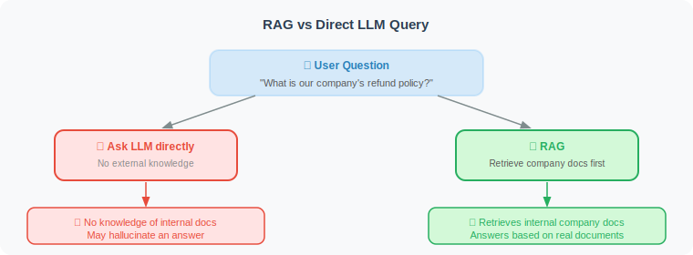

# RAG Concepts and How It Works

RAG (Retrieval-Augmented Generation) is a technical architecture that combines **information retrieval** with **language generation**. It allows LLMs to answer questions based on external knowledge bases, rather than relying solely on knowledge learned during training.

> 📄 **Paper Origin**: The concept of RAG was first proposed by Meta AI (then Facebook AI Research) in the paper *"Retrieval-Augmented Generation for Knowledge-Intensive NLP Tasks"* (Lewis et al., 2020). The original paper jointly trained a retrieval model (DPR) and a generation model (BART) end-to-end, significantly outperforming traditional "retrieve-then-read" approaches on open-domain QA tasks. While today's RAG implementations differ greatly from the original paper (we typically don't do end-to-end training, but instead decouple retrieval and generation), the core idea is identical: **let the model reference external knowledge when generating answers.**

## Why Do We Need RAG?

LLMs have three fundamental limitations:

```python
# Limitation 1: Knowledge cutoff date
question = "What new features does the latest version of GPT-4 have?"
# LLM only knows information up to its training data cutoff

# Limitation 2: Lack of domain knowledge
question = "What is our company's refund policy?"
# LLM doesn't know your company's internal documents

# Limitation 3: Hallucination risk
question = "What papers did Dr. Smith publish in 2023?"
# LLM may fabricate non-existent papers
```

RAG solves these three problems through "retrieve first, then generate":
- ✅ Retrieve the latest documents → solves knowledge cutoff
- ✅ Retrieve internal knowledge bases → solves domain knowledge gaps
- ✅ Generate based on real documents → reduces hallucinations

## RAG Workflow


> 🎬 **Interactive Animation**: Experience the complete five-step RAG pipeline — from document chunking, vectorization, vector space search visualization, to Prompt assembly and token streaming generation, with each step interactive.
>
> <a href="../animations/rag_flow.html" target="_blank" style="display:inline-block;padding:8px 16px;background:#FF9800;color:white;border-radius:6px;text-decoration:none;font-weight:bold;">▶ Open RAG Workflow Interactive Animation</a>

## Core Concepts

### 1. Chunk

Documents are split into text chunks (Chunks), each stored and retrieved independently.

```python
# A document may be split into many Chunks
document = "This is a long article about Python..."

chunks = [
    "Python was created by Guido van Rossum...",          # Chunk 1
    "Python's design philosophy emphasizes readability...", # Chunk 2
    "Python is widely used in AI, including...",           # Chunk 3
    # ...
]
```

### 2. Embedding

Converting text into comparable numerical vectors:

```python
from openai import OpenAI

client = OpenAI()

def embed(text: str) -> list[float]:
    """Convert text to a 1536-dimensional vector"""
    response = client.embeddings.create(
        input=text,
        model="text-embedding-3-small"
    )
    return response.data[0].embedding

# Semantically similar texts have similar vectors
v1 = embed("Python programming language")
v2 = embed("Python is a tool used for programming")
v3 = embed("The weather is nice today")

# Cosine similarity between v1 and v2 > 0.9
# Cosine similarity between v1 and v3 < 0.5
```

### 3. Similarity Retrieval

```python
import chromadb
import numpy as np

# Use cosine similarity to find the most relevant document chunks
def find_relevant_chunks(query: str, collection, n: int = 5) -> list[str]:
    """Find the most relevant document chunks from the vector store"""
    
    query_embedding = embed(query)
    
    results = collection.query(
        query_embeddings=[query_embedding],
        n_results=n,
        include=["documents", "distances"]
    )
    
    chunks = results["documents"][0]
    distances = results["distances"][0]
    
    # Return and print relevance
    for chunk, dist in zip(chunks, distances):
        similarity = 1 - dist  # convert to similarity
        print(f"[{similarity:.2f}] {chunk[:80]}...")
    
    return chunks
```

### 4. Context Injection

Inject the retrieved relevant document chunks into the Prompt:

```python
def answer_with_context(question: str, context_chunks: list[str]) -> str:
    """Answer a question based on context"""
    
    # Build context string
    context = "\n\n---\n\n".join(context_chunks)
    
    prompt = f"""Please answer the question based on the following reference materials.
    
[Reference Materials]
{context}

[Question]
{question}

[Requirements]
- Only use information from the reference materials
- If the materials don't contain relevant information, clearly state so
- Cite specific information to support your answer
"""
    
    response = client.chat.completions.create(
        model="gpt-4o",
        messages=[{"role": "user", "content": prompt}]
    )
    
    return response.choices[0].message.content

# Complete flow
question = "When was Python created?"
relevant_chunks = find_relevant_chunks(question, collection)
answer = answer_with_context(question, relevant_chunks)
print(answer)
```

## RAG vs. Direct LLM Query



```python
def compare_approaches(question: str, has_relevant_docs: bool = True):
    """Compare the effectiveness of RAG vs. direct querying"""
    
    # Approach 1: Ask LLM directly (may hallucinate)
    direct_response = client.chat.completions.create(
        model="gpt-4o",
        messages=[{"role": "user", "content": question}]
    )
    
    print("=== Direct LLM Query ===")
    print(direct_response.choices[0].message.content[:300])
    
    # Approach 2: RAG (document-based)
    if has_relevant_docs:
        chunks = find_relevant_chunks(question, collection)
        rag_answer = answer_with_context(question, chunks)
        
        print("\n=== RAG Answer ===")
        print(rag_answer[:300])

# Especially suitable for internal knowledge base queries
compare_approaches("What is our company's product refund process?")
```

---

## Summary

The core value of RAG:
- **Solves knowledge limitations**: plug in any knowledge base
- **Reduces hallucinations**: generates based on real documents
- **Real-time updates**: updating documents updates knowledge
- **Traceable**: every answer has a document source

### RAG's Limitations and Challenges

RAG is not a silver bullet. In practice, you may encounter the following challenges:

| Challenge | Description | Mitigation Strategy |
|-----------|-------------|-------------------|
| **Retrieval quality bottleneck** | If irrelevant documents are retrieved, even the best LLM can't generate a correct answer | Optimize embedding model, use hybrid retrieval, reranking (see Section 7.4) |
| **Long context dilution** | Retrieving too many documents "dilutes" key information, reducing answer quality | Control retrieval count (top_k), compress document summaries |
| **Cross-document reasoning difficulty** | When answers are spread across multiple documents, LLMs struggle to integrate them effectively | Use Map-Reduce strategy, step-by-step reasoning |
| **Data freshness** | Vector indexes need periodic updates, otherwise they contain outdated information | Design incremental update mechanisms, add timestamp filtering |
| **Unfriendly to structured data** | RAG handles tables and databases less effectively than unstructured text | Combine with Text-to-SQL approaches (see Chapter 22) |

Understanding these limitations helps you realistically assess RAG's applicability in real projects and choose the right optimization direction.

> 📖 **Want to dive deeper into the academic frontiers of RAG?** Read [7.6 Paper Readings: Frontiers in RAG](./06_paper_readings.md), covering in-depth analyses of the original RAG paper, Self-RAG, CRAG, GraphRAG, Modular RAG, and more, as well as the complete evolution from Naive RAG to Agentic RAG.
>
> 💡 **Frontier Trend: Agentic RAG**: Since 2025, RAG has been evolving from a static "retrieve-generate" pipeline to a dynamic **Agentic RAG** paradigm [2] — Agents not only retrieve documents but can also judge when to retrieve, what to retrieve, and automatically rewrite queries or switch data sources when unsatisfied with results. This essentially upgrades RAG from a "pipeline" to a "thinking retrieval Agent".

---

## References

[1] LEWIS P, PEREZ E, PIKTUS A, et al. Retrieval-augmented generation for knowledge-intensive NLP tasks[C]//NeurIPS. 2020.

[2] ASAI A, WU Z, WANG Y, et al. Self-RAG: Learning to retrieve, generate, and critique through self-reflection[C]//ICLR. 2024.

[3] GUAN X, LIU Y, LIN H, et al. CRAG — Comprehensive RAG benchmark[R]. arXiv preprint arXiv:2406.04744, 2024.

---

*Next: [7.2 Document Loading and Text Splitting](./02_document_loading.md)*