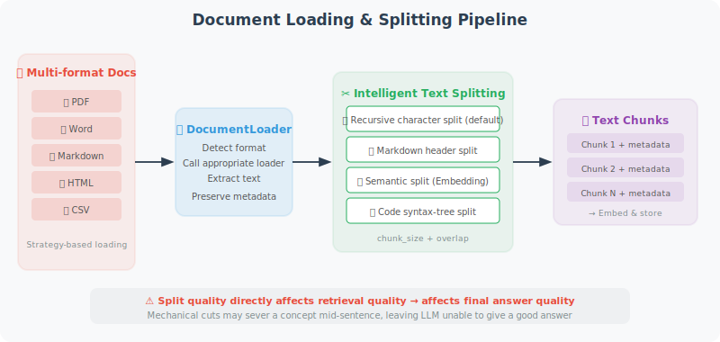

# Document Loading and Text Splitting

The first step in RAG is loading documents and splitting them into chunks appropriately. This step may seem simple, but it is actually the most underestimated part of the entire RAG pipeline — **the quality of text splitting directly affects retrieval effectiveness, which in turn determines the quality of the final answers.**

An intuitive way to understand this: if you mechanically cut a book into chunks of 500 characters each, you'll likely cut in the middle of a sentence or even in the middle of an explanation of a concept. When a user asks a question, the retrieved chunk may be an incomplete fragment, and the LLM naturally won't be able to give a good answer.

This section first introduces loading solutions for various document formats, then focuses on intelligent splitting strategies.



## Document Loading

The core challenge of document loading is **format diversity** — PDF, Word, Markdown, and web pages all have completely different internal structures. Below we implement a loading function for each common format, then integrate them with a unified `DocumentLoader` class.

This "strategy pattern" design gives the system good extensibility — to support a new format, simply add a new loading function and register it in the `LOADERS` dictionary.

```python
from pathlib import Path
import os

# ============================
# Plain Text Document Loading
# ============================

def load_text_file(path: str) -> str:
    """Load a plain text file"""
    with open(path, 'r', encoding='utf-8') as f:
        return f.read()

def load_markdown(path: str) -> str:
    """Load a Markdown file"""
    content = load_text_file(path)
    return content  # Markdown is already plain text

# ============================
# PDF Document Loading
# ============================

def load_pdf(path: str) -> str:
    """Load a PDF document"""
    # pip install pypdf
    try:
        from pypdf import PdfReader
        
        reader = PdfReader(path)
        text_parts = []
        
        for i, page in enumerate(reader.pages):
            text = page.extract_text()
            if text.strip():
                text_parts.append(f"[Page {i+1}]\n{text}")
        
        return "\n\n".join(text_parts)
    
    except ImportError:
        raise ImportError("Please install pypdf: pip install pypdf")

# ============================
# Word Document Loading
# ============================

def load_word(path: str) -> str:
    """Load a Word document"""
    # pip install python-docx
    try:
        from docx import Document
        
        doc = Document(path)
        paragraphs = [p.text for p in doc.paragraphs if p.text.strip()]
        
        # Also extract table content
        tables_text = []
        for table in doc.tables:
            for row in table.rows:
                row_text = " | ".join([cell.text for cell in row.cells])
                tables_text.append(row_text)
        
        full_text = "\n\n".join(paragraphs)
        if tables_text:
            full_text += "\n\n[Table Data]\n" + "\n".join(tables_text)
        
        return full_text
    
    except ImportError:
        raise ImportError("Please install python-docx: pip install python-docx")

# ============================
# Web Page Loading
# ============================

def load_webpage(url: str) -> str:
    """Load web page content and extract plain text"""
    # pip install requests beautifulsoup4
    import requests
    from bs4 import BeautifulSoup
    
    headers = {
        "User-Agent": "Mozilla/5.0 (compatible; RAGBot/1.0)"
    }
    
    response = requests.get(url, headers=headers, timeout=10)
    response.raise_for_status()
    
    soup = BeautifulSoup(response.text, 'html.parser')
    
    # Remove unwanted elements
    for tag in soup(["script", "style", "nav", "footer", "header", "aside"]):
        tag.decompose()
    
    # Extract main content
    main_content = soup.find("main") or soup.find("article") or soup.find("body")
    
    if main_content:
        text = main_content.get_text(separator="\n", strip=True)
    else:
        text = soup.get_text(separator="\n", strip=True)
    
    # Clean up extra blank lines
    lines = [line.strip() for line in text.split("\n") if line.strip()]
    return "\n".join(lines)

# ============================
# Unified Document Loader
# ============================

class DocumentLoader:
    """Unified document loader"""
    
    LOADERS = {
        ".txt": load_text_file,
        ".md": load_markdown,
        ".pdf": load_pdf,
        ".docx": load_word,
    }
    
    @classmethod
    def load(cls, source: str) -> dict:
        """
        Load a document, automatically detecting format.
        
        Args:
            source: file path or URL
        
        Returns:
            {"content": str, "source": str, "type": str}
        """
        if source.startswith("http://") or source.startswith("https://"):
            content = load_webpage(source)
            doc_type = "webpage"
        else:
            path = Path(source)
            suffix = path.suffix.lower()
            
            loader = cls.LOADERS.get(suffix)
            if not loader:
                raise ValueError(f"Unsupported file format: {suffix}")
            
            content = loader(str(path))
            doc_type = suffix[1:]  # remove the dot
        
        return {
            "content": content,
            "source": source,
            "type": doc_type,
            "char_count": len(content),
            "word_count": len(content.split())
        }
    
    @classmethod
    def load_directory(cls, dir_path: str, extensions: list = None) -> list[dict]:
        """Load all supported documents in a directory"""
        extensions = extensions or list(cls.LOADERS.keys())
        documents = []
        
        for path in Path(dir_path).rglob("*"):
            if path.suffix.lower() in extensions:
                try:
                    doc = cls.load(str(path))
                    documents.append(doc)
                    print(f"✅ Loaded: {path.name} ({doc['char_count']} characters)")
                except Exception as e:
                    print(f"❌ Failed: {path.name} - {e}")
        
        return documents
```

## Text Splitting Strategies

Text splitting is critical to RAG quality. Good splitting should preserve semantic integrity — ideally, each Chunk should be a "self-contained" unit of information that can be understood on its own.

The `TextSplitter` below implements three splitting strategies:

1. **Recursive separator splitting** (`split_by_separator`): The most commonly used general-purpose approach. It tries different separators in a priority list — first paragraph breaks (`\n\n`), then line breaks (`\n`), then punctuation like periods, and finally spaces. This cuts text at the most natural breakpoints.

2. **Token-count splitting** (`split_by_tokens`): Used when you need precise control over the number of tokens in each Chunk. This is especially useful in token-billing scenarios or when the embedding model has a maximum token limit.

3. **Markdown structure splitting** (`split_markdown`): Specifically designed for Markdown documents. It splits the document into semantic sections by heading level, and adds a "breadcrumb path" to each Chunk (e.g., `[Python Intro > Data Types]`), so even when a Chunk is retrieved in isolation, you can tell which part of the document it belongs to.

Note the `chunk_overlap` parameter — it creates some overlap between adjacent Chunks. This prevents important information from being cut off exactly at a split point: if a key sentence spans the boundary between two Chunks, the overlap ensures at least one Chunk contains the complete sentence.

```python
class TextSplitter:
    """Intelligent text splitter"""
    
    def __init__(
        self,
        chunk_size: int = 500,     # maximum characters per Chunk
        chunk_overlap: int = 50,    # overlapping characters between adjacent Chunks
    ):
        self.chunk_size = chunk_size
        self.chunk_overlap = chunk_overlap
    
    def split_by_separator(self, text: str, separators: list[str] = None) -> list[str]:
        """
        Recursively split by separator.
        Prioritizes cutting at natural breakpoints (paragraphs, sentences, words).
        """
        if separators is None:
            separators = ["\n\n", "\n", ".", "!", "?", " "]
        
        chunks = []
        
        def split_recursive(text: str, sep_idx: int = 0) -> list[str]:
            if len(text) <= self.chunk_size:
                return [text] if text.strip() else []
            
            if sep_idx >= len(separators):
                # Force split by size
                result = []
                for i in range(0, len(text), self.chunk_size - self.chunk_overlap):
                    result.append(text[i:i + self.chunk_size])
                return result
            
            sep = separators[sep_idx]
            parts = text.split(sep)
            
            result = []
            current_chunk = ""
            
            for part in parts:
                part = part + sep if sep != " " else part + " "
                
                if len(current_chunk) + len(part) <= self.chunk_size:
                    current_chunk += part
                else:
                    if current_chunk:
                        if len(current_chunk) > self.chunk_size:
                            # Current chunk is still too large, recursively split
                            result.extend(split_recursive(current_chunk, sep_idx + 1))
                        else:
                            result.append(current_chunk.strip())
                    current_chunk = part
            
            if current_chunk.strip():
                result.append(current_chunk.strip())
            
            return result
        
        return split_recursive(text)
    
    def split_by_tokens(self, text: str, model: str = "gpt-4o") -> list[str]:
        """Split by token count (more precise control)"""
        import tiktoken
        
        encoding = tiktoken.encoding_for_model(model)
        tokens = encoding.encode(text)
        
        max_tokens = self.chunk_size  # here chunk_size represents token count
        
        chunks = []
        start = 0
        
        while start < len(tokens):
            end = min(start + max_tokens, len(tokens))
            chunk_tokens = tokens[start:end]
            chunk_text = encoding.decode(chunk_tokens)
            chunks.append(chunk_text)
            
            # Add overlap
            start = end - self.chunk_overlap
        
        return chunks
    
    def split_markdown(self, text: str) -> list[str]:
        """
        Split by Markdown structure.
        Divides the document into meaningful sections by heading level.
        """
        import re
        
        chunks = []
        current_section = []
        current_headers = []
        
        lines = text.split("\n")
        
        for line in lines:
            # Detect headings
            header_match = re.match(r'^(#{1,6})\s+(.+)$', line)
            
            if header_match:
                # Save current section
                if current_section:
                    content = "\n".join(current_section).strip()
                    if content:
                        # Add breadcrumb path
                        header_path = " > ".join(current_headers)
                        full_content = f"[{header_path}]\n{content}" if header_path else content
                        
                        # If too long, further split
                        if len(full_content) > self.chunk_size * 2:
                            sub_chunks = self.split_by_separator(full_content)
                            chunks.extend(sub_chunks)
                        else:
                            chunks.append(full_content)
                
                # Update heading stack
                level = len(header_match.group(1))
                title = header_match.group(2)
                current_headers = current_headers[:level-1] + [title]
                current_section = [line]
            else:
                current_section.append(line)
        
        # Handle the last section
        if current_section:
            content = "\n".join(current_section).strip()
            if content:
                chunks.append(content)
        
        return [c for c in chunks if c.strip()]


# Usage example
splitter = TextSplitter(chunk_size=500, chunk_overlap=50)

sample_text = """
# Python Beginner's Guide

## What is Python?

Python is a high-level programming language created by Guido van Rossum in 1991.
Python's core design philosophy emphasizes code readability and simplicity.

### Python's Features

Python has the following main features:
1. Clean and clear syntax, suitable for beginners
2. Dynamic type system
3. Powerful standard library

## Python Use Cases

Python is widely used in:
- Data science and machine learning
- Web development (Django, FastAPI)
- Automation scripts
- AI Agent development
"""

# Split by Markdown structure
md_chunks = splitter.split_markdown(sample_text)
print(f"Markdown split: {len(md_chunks)} Chunks")
for i, chunk in enumerate(md_chunks):
    print(f"\nChunk {i+1} ({len(chunk)} characters):\n{chunk[:150]}...")

# Split by characters
char_chunks = splitter.split_by_separator(sample_text)
print(f"\nCharacter split: {len(char_chunks)} Chunks")
```

## Choosing Chunk Size

Chunk size is one of the most important hyperparameters in a RAG system, and there is no universally optimal value. The core principle for choosing is: **the Chunk size should match the granularity of information you expect to retrieve.**

For example: if users tend to ask specific questions like "How do I write a for loop in Python?", small Chunks (300–500 characters) are more appropriate because they contain more focused information with less noise during retrieval. But if users tend to ask "Summarize the main findings of this report", large Chunks (1000–2000 characters) are better because they contain more complete context.

```
Chunk Size Trade-offs

Small Chunks (200–500 characters)
Pros: Precise retrieval, high relevance
Cons: May lose context, requires more Chunks

Large Chunks (1000–2000 characters)
Pros: Complete context
Cons: Introduces irrelevant information, more retrieval noise

Recommendations:
- Q&A tasks: 300–500 characters
- Summarization tasks: 800–1500 characters
- Code tasks: split by function/class
```

---

## Summary

Key points for document processing:
- Support multiple document formats (PDF, Word, web pages, etc.)
- Choose the appropriate splitting strategy (by paragraph/heading/token)
- Set appropriate overlap (to ensure context continuity)
- Adjust Chunk size based on task type

---

*Next: [7.3 Vector Embeddings and Vector Databases](./03_embeddings_vectordb.md)*