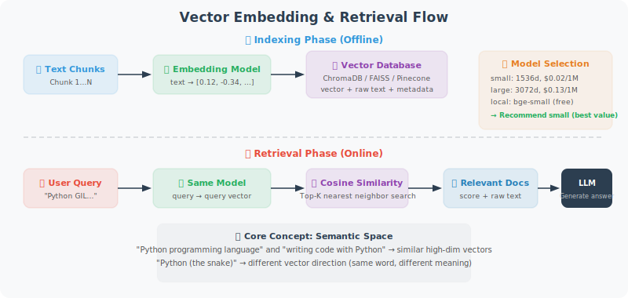

# Vector Embeddings and Vector Databases

Vector embeddings and vector databases are the core technologies of a RAG system. This section provides an in-depth look at how to efficiently store and retrieve vectors.



## Choosing an Embedding Model

When choosing an embedding model, you need to balance three factors: **performance** (embedding quality), **cost** (API pricing or local compute resources), and **dimensions** (vector size, which affects storage and retrieval speed).

OpenAI currently offers three embedding models. For most scenarios, `text-embedding-3-small` offers the best cost-performance ratio — its performance is close to the `large` model at only 1/6 the price. If your application has strict privacy requirements or you don't want to depend on an external API, you can also use a local open-source model such as `BAAI/bge-small-en-v1.5`, which is completely free.

The code below demonstrates two approaches: the OpenAI cloud API and a local `sentence-transformers` model.

```python
from openai import OpenAI
import numpy as np
from typing import List

client = OpenAI()

# ============================
# OpenAI Embedding Models
# ============================

# Available model comparison
EMBEDDING_MODELS = {
    "text-embedding-3-small": {
        "dimensions": 1536,
        "price_per_1m": 0.02,  # USD
        "performance": "good"
    },
    "text-embedding-3-large": {
        "dimensions": 3072,
        "price_per_1m": 0.13,
        "performance": "best"
    },
    "text-embedding-ada-002": {
        "dimensions": 1536,
        "price_per_1m": 0.10,
        "performance": "legacy"
    }
}

def get_embedding(text: str, model: str = "text-embedding-3-small") -> List[float]:
    """Get the embedding vector for a single text"""
    # Clean text
    text = text.replace("\n", " ").strip()
    if not text:
        raise ValueError("Text cannot be empty")
    
    response = client.embeddings.create(
        input=text,
        model=model
    )
    return response.data[0].embedding

def get_embeddings_batch(texts: List[str], model: str = "text-embedding-3-small",
                          batch_size: int = 100) -> List[List[float]]:
    """Batch-get embeddings (reduces number of API calls)"""
    all_embeddings = []
    
    for i in range(0, len(texts), batch_size):
        batch = texts[i:i + batch_size]
        # Clean text
        batch = [t.replace("\n", " ").strip() for t in batch]
        
        response = client.embeddings.create(
            input=batch,
            model=model
        )
        
        embeddings = [item.embedding for item in response.data]
        all_embeddings.extend(embeddings)
        
        print(f"  Batch {i//batch_size + 1}: {len(batch)} texts embedded")
    
    return all_embeddings

# ============================
# Local Embedding Model (Free!)
# ============================

def get_local_embedding(text: str) -> List[float]:
    """Use a local model (sentence-transformers), no API key required"""
    # pip install sentence-transformers
    try:
        from sentence_transformers import SentenceTransformer
        
        # A good English embedding model
        model = SentenceTransformer('BAAI/bge-small-en-v1.5')
        embedding = model.encode(text)
        return embedding.tolist()
    
    except ImportError:
        raise ImportError("Please install: pip install sentence-transformers")
```

## ChromaDB: Local Vector Database

With an embedding model, we also need a place to store and retrieve these vectors. ChromaDB is the top choice for local development — it's an embedded vector database that doesn't require a separate server, persists data in local files, and has a usage experience similar to SQLite.

The `VectorStore` class below wraps ChromaDB's core operations. A few design points worth noting:

- **HNSW index parameters**: `construction_ef` and `M` control the trade-off between retrieval precision and speed. Larger values mean higher retrieval precision but slower index construction.
- **Batch processing**: The `add_documents` method adds documents in batches to avoid memory overflow from passing too many documents at once.
- **Minimum relevance threshold**: The `min_relevance` parameter in the `search` method filters out results with too-low similarity, reducing noise.

```python
import chromadb
from chromadb.config import Settings
import json
import uuid

class VectorStore:
    """
    ChromaDB-based vector store.
    Supports adding, retrieving, and deleting documents.
    """
    
    def __init__(self, collection_name: str, persist_dir: str = "./chroma_db"):
        # Persistent client (data survives restarts)
        self.client = chromadb.PersistentClient(path=persist_dir)
        
        self.collection = self.client.get_or_create_collection(
            name=collection_name,
            metadata={
                "hnsw:space": "cosine",  # use cosine similarity
                "hnsw:construction_ef": 200,
                "hnsw:M": 16,
            }
        )
        
        print(f"Vector store '{collection_name}' loaded, contains {self.collection.count()} documents")
    
    def add_documents(
        self,
        documents: List[str],
        metadatas: List[dict] = None,
        ids: List[str] = None,
        batch_size: int = 50
    ) -> List[str]:
        """
        Add documents to the vector store.
        
        Args:
            documents: list of documents
            metadatas: list of metadata (can include source, section, etc.)
            ids: list of document IDs (auto-generated if not provided)
            batch_size: batch processing size
        
        Returns:
            list of document IDs
        """
        if ids is None:
            ids = [str(uuid.uuid4()) for _ in documents]
        
        if metadatas is None:
            metadatas = [{}] * len(documents)
        
        # Batch-generate embeddings
        print(f"Embedding {len(documents)} documents...")
        embeddings = get_embeddings_batch(documents)
        
        # Batch-add to ChromaDB
        for i in range(0, len(documents), batch_size):
            batch_end = min(i + batch_size, len(documents))
            
            self.collection.add(
                ids=ids[i:batch_end],
                documents=documents[i:batch_end],
                embeddings=embeddings[i:batch_end],
                metadatas=metadatas[i:batch_end]
            )
        
        print(f"✅ Successfully added {len(documents)} documents")
        return ids
    
    def search(
        self,
        query: str,
        n_results: int = 5,
        where: dict = None,
        min_relevance: float = 0.3
    ) -> List[dict]:
        """
        Semantic search.
        
        Returns:
            [{document, metadata, relevance_score}]
        """
        query_embedding = get_embedding(query)
        
        kwargs = {
            "query_embeddings": [query_embedding],
            "n_results": min(n_results, self.collection.count()),
            "include": ["documents", "metadatas", "distances"]
        }
        
        if where:
            kwargs["where"] = where
        
        if self.collection.count() == 0:
            return []
        
        results = self.collection.query(**kwargs)
        
        # Format results
        formatted = []
        if results["documents"] and results["documents"][0]:
            for doc, meta, dist in zip(
                results["documents"][0],
                results["metadatas"][0],
                results["distances"][0]
            ):
                relevance = 1 - dist
                if relevance >= min_relevance:
                    formatted.append({
                        "document": doc,
                        "metadata": meta,
                        "relevance": round(relevance, 4)
                    })
        
        return sorted(formatted, key=lambda x: x["relevance"], reverse=True)
    
    def delete_by_source(self, source: str):
        """Delete all documents from a specific source"""
        self.collection.delete(where={"source": source})
        print(f"Deleted documents with source '{source}'")
    
    def get_stats(self) -> dict:
        """Get statistics"""
        return {
            "total_documents": self.collection.count(),
            "collection_name": self.collection.name
        }


# ============================
# Complete Document Indexing Flow
# ============================

def index_documents_to_vectorstore(
    documents: List[dict],  # [{"content": str, "source": str, ...}]
    collection_name: str,
    chunk_size: int = 500,
    chunk_overlap: int = 50
) -> VectorStore:
    """
    Complete flow for processing documents and storing them in a vector store.
    """
    from document_loading import TextSplitter  # assumed to be defined in the project
    
    splitter = TextSplitter(chunk_size=chunk_size, chunk_overlap=chunk_overlap)
    store = VectorStore(collection_name)
    
    all_chunks = []
    all_metadatas = []
    
    for doc in documents:
        content = doc["content"]
        source = doc.get("source", "unknown")
        
        # Split document
        chunks = splitter.split_by_separator(content)
        
        for i, chunk in enumerate(chunks):
            if chunk.strip():
                all_chunks.append(chunk)
                all_metadatas.append({
                    "source": source,
                    "chunk_index": i,
                    "total_chunks": len(chunks),
                    "char_count": len(chunk)
                })
    
    print(f"Total {len(all_chunks)} Chunks, starting indexing...")
    store.add_documents(all_chunks, all_metadatas)
    
    return store


# ============================
# Quick Usage Example
# ============================

# 1. Prepare knowledge base content
knowledge = [
    {"content": "Python was created by Guido van Rossum and first released in 1991. The name Python comes from the British comedy group Monty Python.", "source": "python_intro"},
    {"content": "FastAPI is a modern, high-performance Python web framework based on Python 3.7+ type annotations. It was created by Sebastián Ramírez.", "source": "fastapi_intro"},
    {"content": "LangChain is a framework for building LLM applications, providing components such as tool chains, Agents, and RAG.", "source": "langchain_intro"},
]

# 2. Create vector store
store = VectorStore("knowledge_base")
for item in knowledge:
    # Add directly (no splitting)
    store.add_documents(
        [item["content"]],
        [{"source": item["source"]}]
    )

# 3. Search
query = "When was Python first released?"
results = store.search(query, n_results=3)

print(f"\nQuery: {query}")
for r in results:
    print(f"\n[{r['relevance']:.3f}] {r['document'][:100]}...")
    print(f"  Source: {r['metadata']['source']}")
```

---

## Summary

Core technologies for vector storage:
- **Embedding model**: `text-embedding-3-small` (recommended), or local model (free)
- **ChromaDB**: top choice for local development, persistent storage
- **Cosine similarity**: standard metric for measuring semantic relevance
- **Batch processing**: reduces API calls, improves efficiency

---

*Next: [7.4 Retrieval Strategies and Reranking](./04_retrieval_strategies.md)*
