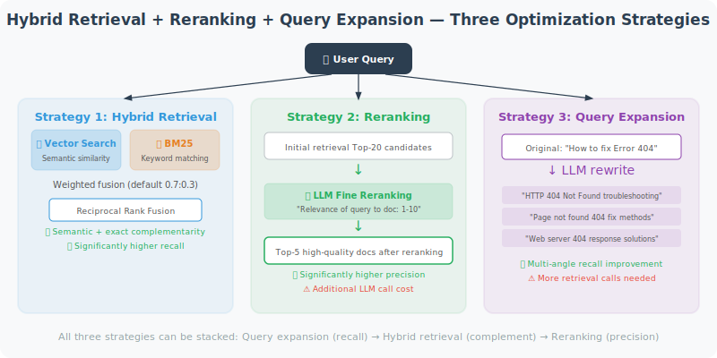

# Retrieval Strategies and Reranking

Basic vector retrieval is not always optimal. This section introduces several advanced retrieval strategies that significantly improve the accuracy of RAG systems.

Pure vector retrieval has two common problems:

1. **Semantic drift**: Vector retrieval is good at capturing semantic similarity but is not sensitive enough to exact keyword matches. For example, if a user asks "How do I fix Error 404?", vector retrieval might return a general introduction to "HTTP errors" rather than a document containing the specific keyword "404".

2. **Insufficient recall**: A user's question may be expressed in many different ways, and a single query may miss some relevant documents.

To address these issues, the industry has developed three main optimization strategies: **hybrid retrieval** (combining vectors and keywords), **reranking** (using an LLM to re-sort initial results), and **query expansion** (expanding a single query into multiple variants).



## Hybrid Retrieval: Vector + Keyword

The core idea of hybrid retrieval is "two legs to walk on": use vector retrieval to capture semantic similarity, use BM25 keyword retrieval to ensure exact matches, and then merge the results from both retrieval methods by weight.

BM25 is a classic information retrieval algorithm that evaluates document-query relevance based on term frequency (TF) and inverse document frequency (IDF). It is very effective for exact keyword matching but doesn't understand synonyms and semantic relationships.

The strengths and weaknesses of the two retrieval methods complement each other perfectly: vector retrieval understands that "Python programming language" and "writing code in Python" mean the same thing, but may not be sensitive enough to proper nouns; BM25 can precisely match proper nouns like "FastAPI" but doesn't understand the semantic relationship between "high-performance web framework" and "FastAPI".

The `HybridRetriever` below combines both, with a default weight of 0.7:0.3 (vector:keyword) that you can adjust based on your use case:

```python
from openai import OpenAI
import chromadb
from rank_bm25 import BM25Okapi  # pip install rank-bm25
import numpy as np
from typing import List

client = OpenAI()

class HybridRetriever:
    """Hybrid retrieval: vector similarity + BM25 keyword matching"""
    
    def __init__(self, collection, documents: List[str]):
        self.collection = collection
        self.documents = documents
        
        # Initialize BM25 (term-frequency-based keyword retrieval)
        tokenized_docs = [doc.lower().split() for doc in documents]
        self.bm25 = BM25Okapi(tokenized_docs)
    
    def _vector_search(self, query: str, n: int = 10) -> dict:
        """Vector semantic search"""
        from openai import OpenAI
        response = client.embeddings.create(
            input=query,
            model="text-embedding-3-small"
        )
        query_embedding = response.data[0].embedding
        
        results = self.collection.query(
            query_embeddings=[query_embedding],
            n_results=min(n, self.collection.count()),
            include=["documents", "distances", "ids"]
        )
        
        scores = {}
        if results["documents"] and results["documents"][0]:
            for doc_id, doc, dist in zip(
                results["ids"][0],
                results["documents"][0],
                results["distances"][0]
            ):
                scores[doc_id] = {
                    "document": doc,
                    "vector_score": 1 - dist
                }
        return scores
    
    def _keyword_search(self, query: str, n: int = 10) -> dict:
        """BM25 keyword search"""
        tokens = query.lower().split()
        scores = self.bm25.get_scores(tokens)
        
        # Normalize scores
        max_score = max(scores) if max(scores) > 0 else 1
        
        results = {}
        top_indices = np.argsort(scores)[::-1][:n]
        
        for idx in top_indices:
            if scores[idx] > 0:
                results[f"doc_{idx}"] = {
                    "document": self.documents[idx],
                    "keyword_score": scores[idx] / max_score,
                    "doc_idx": idx
                }
        
        return results
    
    def retrieve(self, query: str, n: int = 5,
                  vector_weight: float = 0.7, keyword_weight: float = 0.3) -> List[dict]:
        """
        Hybrid retrieval, merging results from both methods.
        
        Args:
            vector_weight: weight for vector scores (0-1)
            keyword_weight: weight for keyword scores (0-1)
        """
        vector_results = self._vector_search(query, n=n*2)
        keyword_results = self._keyword_search(query, n=n*2)
        
        # Merge scores
        combined = {}
        
        for doc_id, data in vector_results.items():
            combined[doc_id] = {
                "document": data["document"],
                "vector_score": data["vector_score"],
                "keyword_score": 0,
                "combined_score": data["vector_score"] * vector_weight
            }
        
        for doc_id, data in keyword_results.items():
            if doc_id in combined:
                combined[doc_id]["keyword_score"] = data["keyword_score"]
                combined[doc_id]["combined_score"] += data["keyword_score"] * keyword_weight
            else:
                combined[doc_id] = {
                    "document": data["document"],
                    "vector_score": 0,
                    "keyword_score": data["keyword_score"],
                    "combined_score": data["keyword_score"] * keyword_weight
                }
        
        # Sort by combined score
        sorted_results = sorted(
            combined.values(),
            key=lambda x: x["combined_score"],
            reverse=True
        )
        
        return sorted_results[:n]
```

## Reranking

Initial retrieval (whether vector or hybrid) typically returns a batch of "roughly relevant" candidate documents. But the ranking of these documents may not be accurate — the truly most relevant document might be ranked 3rd or 5th.

Reranking performs a "second-pass precision ranking" on the initial retrieval results. It works by passing the query and all candidate documents together to a stronger model (e.g., GPT-4o-mini), having the model evaluate the relevance of each document to the query one by one, and then re-sorting by relevance.

This two-stage "coarse filter then precision rank" architecture is standard practice in search engines — the first stage pursues **recall** (not missing relevant documents), and the second stage pursues **precision** (putting the most relevant results first).

```python
class Reranker:
    """Use an LLM to rerank initial retrieval results"""
    
    def __init__(self, model: str = "gpt-4o-mini"):
        self.model = model
    
    def rerank(self, query: str, candidates: List[str], top_k: int = 3) -> List[dict]:
        """
        Rerank candidate documents.
        
        Args:
            query: user query
            candidates: list of candidate documents
            top_k: return top K results
        
        Returns:
            reranked list of documents
        """
        if len(candidates) <= top_k:
            return [{"document": c, "rank": i+1, "relevant": True} for i, c in enumerate(candidates)]
        
        # Have the LLM evaluate the relevance of each candidate document
        numbered_candidates = "\n\n".join([
            f"[{i+1}] {doc[:300]}" for i, doc in enumerate(candidates)
        ])
        
        response = client.chat.completions.create(
            model=self.model,
            messages=[
                {
                    "role": "user",
                    "content": f"""Rank the following candidate documents by relevance to the query.

Query: {query}

Candidate documents:
{numbered_candidates}

Please rank by relevance from highest to lowest, return in JSON format:
{{
  "ranked_indices": [3, 1, 5, 2, 4],  // document numbers sorted by relevance (1-indexed)
  "top_{top_k}_reason": "reason for selecting the top {top_k}"
}}"""
                }
            ],
            response_format={"type": "json_object"}
        )
        
        import json
        result = json.loads(response.choices[0].message.content)
        ranked_indices = result.get("ranked_indices", list(range(1, len(candidates)+1)))
        
        reranked = []
        for i, idx in enumerate(ranked_indices[:top_k]):
            if 1 <= idx <= len(candidates):
                reranked.append({
                    "document": candidates[idx-1],
                    "rank": i + 1,
                    "original_rank": idx,
                    "relevant": True
                })
        
        return reranked
```

## Query Expansion

Query expansion addresses the problem that "users may express themselves in a very limited way."

Suppose the knowledge base contains a document: "Python decorators are a design pattern that uses `@` syntax sugar to modify function behavior." A user might ask "how to use the `@` symbol", "decorator pattern", or "function modification" — these expressions are all semantically close, but a single query might only match one of them.

The approach of query expansion is: use an LLM to "rewrite" the user's original query into multiple variants that express the same information need from different angles, then retrieve with all variants separately, and merge and deduplicate to get a more comprehensive set of candidate documents.

```python
class QueryExpander:
    """Improve recall by generating multiple query variants"""
    
    def expand(self, query: str, n_variations: int = 3) -> List[str]:
        """Generate multiple variants of a query"""
        response = client.chat.completions.create(
            model="gpt-4o-mini",
            messages=[
                {
                    "role": "user",
                    "content": f"""Generate {n_variations} different variants of the following query
to improve information retrieval recall. Variants should express the same information need from different angles.

Original query: {query}

Return in JSON format:
{{"variations": ["variant 1", "variant 2", "variant 3"]}}"""
                }
            ],
            response_format={"type": "json_object"}
        )
        
        import json
        result = json.loads(response.choices[0].message.content)
        variations = result.get("variations", [])
        
        # Original query + variants
        return [query] + variations[:n_variations]


# Usage example
expander = QueryExpander()
expanded = expander.expand("How do Python decorators work?")
print("Query expansion:")
for q in expanded:
    print(f"  - {q}")
```

## Complete Advanced Retrieval Pipeline

Finally, we combine the three strategies above into a complete retrieval pipeline. Its processing flow is: **query expansion → multi-query retrieval → result merging → reranking**. Each step builds the foundation for the next: expansion ensures recall, multi-query further expands the candidate set, merging removes duplicates, and reranking ensures the precision of the final results.

```python
class AdvancedRAGPipeline:
    """Advanced RAG retrieval pipeline"""
    
    def __init__(self, vector_store):
        self.store = vector_store
        self.reranker = Reranker()
        self.query_expander = QueryExpander()
    
    def retrieve(self, query: str, n_final: int = 3) -> List[dict]:
        """Complete retrieval flow"""
        print(f"Query: {query}")
        
        # Step 1: Query expansion
        expanded_queries = self.query_expander.expand(query, n_variations=2)
        
        # Step 2: Multi-query retrieval (retrieve separately for each variant)
        all_candidates = {}
        for q in expanded_queries:
            results = self.store.search(q, n_results=5)
            for r in results:
                doc = r["document"]
                if doc not in all_candidates:
                    all_candidates[doc] = r["relevance"]
                else:
                    all_candidates[doc] = max(all_candidates[doc], r["relevance"])
        
        # Step 3: Reranking
        candidate_docs = list(all_candidates.keys())
        print(f"Initial candidates: {len(candidate_docs)} documents")
        
        reranked = self.reranker.rerank(query, candidate_docs, top_k=n_final)
        
        return reranked
```

---

## Summary

Advanced retrieval strategy key points:
- **Hybrid retrieval**: semantic + keyword, complementary improvement of recall
- **Reranking**: LLM second-pass evaluation, improves precision
- **Query expansion**: multi-angle retrieval, reduces missed results

---

*Next: [7.5 Practice: Intelligent Document Q&A Agent](./05_practice_qa_agent.md)*