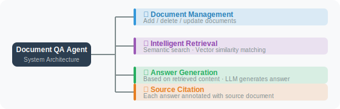

# Practice: Intelligent Document Q&A Agent

Combining the knowledge from this chapter, we'll build an intelligent Q&A system that can answer questions about any collection of documents.

## System Architecture



## Complete Implementation

```python
# doc_qa_agent.py
import os
import json
import uuid
import datetime
import chromadb
from pathlib import Path
from openai import OpenAI
from dotenv import load_dotenv
from typing import Optional, List
from rich.console import Console
from rich.panel import Panel
from rich.markdown import Markdown

load_dotenv()

client = OpenAI()
console = Console()


class DocumentQAAgent:
    """Intelligent Document Q&A Agent"""
    
    def __init__(self, name: str = "Document Assistant", persist_dir: str = "./qa_db"):
        self.name = name
        
        # Initialize vector store
        self.chroma = chromadb.PersistentClient(path=persist_dir)
        self.collection = self.chroma.get_or_create_collection(
            name="documents",
            metadata={"hnsw:space": "cosine"}
        )
        
        # Conversation history
        self.chat_history = []
        
        count = self.collection.count()
        console.print(f"[dim]{name} started, knowledge base contains {count} document fragments[/dim]")
    
    # =====================
    # Document Management
    # =====================
    
    def add_text(self, text: str, source: str = "manual", chunk_size: int = 400):
        """Add text to the knowledge base"""
        chunks = []
        # Split by paragraphs first to preserve semantic integrity
        paragraphs = text.split('\n\n')
        current_chunk = ""
        
        for para in paragraphs:
            para = para.strip()
            if not para:
                continue
            # If adding the new paragraph doesn't exceed chunk_size, merge
            if len(current_chunk) + len(para) + 1 <= chunk_size:
                current_chunk = current_chunk + "\n" + para if current_chunk else para
            else:
                # Save current chunk (if it has content)
                if current_chunk:
                    chunks.append(current_chunk)
                # If a single paragraph exceeds chunk_size, split by sentence-ending punctuation
                if len(para) > chunk_size:
                    import re
                    sentences = re.split(r'(?<=[.!?])\s+', para)
                    current_chunk = ""
                    for sentence in sentences:
                        if not sentence.strip():
                            continue
                        if len(current_chunk) + len(sentence) <= chunk_size:
                            current_chunk += sentence
                        else:
                            if current_chunk:
                                chunks.append(current_chunk)
                            current_chunk = sentence
                else:
                    current_chunk = para
        
        if current_chunk:
            chunks.append(current_chunk)
        
        if not chunks:
            return
        
        # Batch embed
        embeddings_response = client.embeddings.create(
            input=chunks,
            model="text-embedding-3-small"
        )
        embeddings = [e.embedding for e in embeddings_response.data]
        
        # Store
        ids = [str(uuid.uuid4()) for _ in chunks]
        self.collection.add(
            ids=ids,
            documents=chunks,
            embeddings=embeddings,
            metadatas=[{
                "source": source,
                "chunk_index": i,
                "added_at": datetime.datetime.now().isoformat()
            } for i in range(len(chunks))]
        )
        
        console.print(f"[green]✅ Added {len(chunks)} fragments (source: {source})[/green]")
    
    def add_file(self, file_path: str):
        """Load a file and add it to the knowledge base"""
        path = Path(file_path)
        
        if not path.exists():
            console.print(f"[red]❌ File not found: {file_path}[/red]")
            return
        
        try:
            with open(path, 'r', encoding='utf-8') as f:
                content = f.read()
            
            self.add_text(content, source=path.name)
            
        except Exception as e:
            console.print(f"[red]❌ Load failed: {e}[/red]")
    
    def list_sources(self) -> List[str]:
        """List all sources in the knowledge base"""
        if self.collection.count() == 0:
            return []
        
        results = self.collection.get(include=["metadatas"])
        sources = list(set(
            m.get("source", "unknown") 
            for m in results["metadatas"]
        ))
        return sources
    
    # =====================
    # Q&A
    # =====================
    
    def _retrieve(self, query: str, n: int = 5) -> List[dict]:
        """Retrieve relevant documents"""
        if self.collection.count() == 0:
            return []
        
        response = client.embeddings.create(
            input=query.replace("\n", " "),
            model="text-embedding-3-small"
        )
        query_embedding = response.data[0].embedding
        
        results = self.collection.query(
            query_embeddings=[query_embedding],
            n_results=min(n, self.collection.count()),
            include=["documents", "metadatas", "distances"]
        )
        
        chunks = []
        if results["documents"] and results["documents"][0]:
            for doc, meta, dist in zip(
                results["documents"][0],
                results["metadatas"][0],
                results["distances"][0]
            ):
                relevance = 1 - dist
                if relevance > 0.3:
                    chunks.append({
                        "content": doc,
                        "source": meta.get("source", "unknown"),
                        "relevance": round(relevance, 3)
                    })
        
        return chunks
    
    def ask(self, question: str) -> str:
        """Ask a question to the knowledge base"""
        
        # Retrieve relevant documents
        chunks = self._retrieve(question)
        
        if not chunks:
            return "Sorry, I couldn't find any information related to this question in my knowledge base. Please add relevant documents first."
        
        # Build context
        context_parts = []
        for i, chunk in enumerate(chunks[:3], 1):
            context_parts.append(
                f"[Document Fragment {i}] (Source: {chunk['source']}, Relevance: {chunk['relevance']})\n"
                f"{chunk['content']}"
            )
        
        context = "\n\n".join(context_parts)
        
        # Build messages (including conversation history)
        messages = [
            {
                "role": "system",
                "content": f"""You are {self.name}, a Q&A assistant based on the user's document knowledge base.

Answer requirements:
1. Only answer based on the provided reference documents
2. If the reference documents don't contain relevant information, clearly state so
3. Cite specific sources (e.g., "According to document X...")
4. Keep answers concise and accurate; avoid fabricating information

[Reference Documents]
{context}"""
            }
        ] + self.chat_history[-6:] + [  # keep the last 3 rounds of conversation
            {"role": "user", "content": question}
        ]
        
        response = client.chat.completions.create(
            model="gpt-4o",
            messages=messages,
            max_tokens=800
        )
        
        answer = response.choices[0].message.content
        
        # Update conversation history
        self.chat_history.append({"role": "user", "content": question})
        self.chat_history.append({"role": "assistant", "content": answer})
        
        return answer


# ============================
# Main Program
# ============================

def main():
    agent = DocumentQAAgent("Intelligent Document Assistant")
    
    # Add sample knowledge base
    sample_docs = [
        ("Python Basics", """
Python is a high-level programming language known for its clean and readable syntax. Python was created by Guido van Rossum in 1991.
Python supports object-oriented programming, functional programming, and procedural programming.
Python's package manager is pip; the recommended virtual environment tools are venv or conda.
"""),
        ("FastAPI Introduction", """
FastAPI is a modern, high-performance Python web framework.
FastAPI is based on Python 3.7+ type annotations and automatically generates API documentation.
FastAPI's performance is close to NodeJS and Go, making it one of the fastest Python web frameworks available.
It uses uvicorn as the ASGI server. Command: uvicorn main:app --reload
"""),
        ("LangChain Overview", """
LangChain is an open-source framework for building LLM applications.
LangChain provides: Chain (processing pipelines), Agent (intelligent agents), Memory, RAG, and other components.
LangChain supports multiple LLM providers including OpenAI, Anthropic, and local models.
The latest version LangChain 0.3 uses LCEL (LangChain Expression Language) as the standard way to build chains.
"""),
    ]
    
    for title, content in sample_docs:
        agent.add_text(content, source=title)
    
    console.print(Panel(
        f"[bold]📚 {agent.name} is ready[/bold]\n"
        f"Knowledge base contains {len(sample_docs)} topics\n\n"
        "Commands:\n"
        "  sources → view knowledge base sources\n"
        "  add <file path> → add a file\n"
        "  quit → exit",
        title="System Started",
        border_style="blue"
    ))
    
    while True:
        user_input = input("\n❓ Your question: ").strip()
        
        if not user_input:
            continue
        
        if user_input.lower() == "quit":
            break
        
        if user_input.lower() == "sources":
            sources = agent.list_sources()
            console.print(f"[cyan]Knowledge base sources ({len(sources)}):[/cyan]")
            for s in sources:
                console.print(f"  • {s}")
            continue
        
        if user_input.lower().startswith("add "):
            file_path = user_input[4:].strip()
            agent.add_file(file_path)
            continue
        
        # Answer the question
        answer = agent.ask(user_input)
        console.print(f"\n[bold green]📖 Answer:[/bold green]")
        console.print(Markdown(answer))


if __name__ == "__main__":
    main()
```

## Sample Conversation

```
❓ Your question: What server does FastAPI use?

📖 Answer:
According to the "FastAPI Introduction" document, FastAPI uses **uvicorn** as its ASGI server.

The startup command is:
```bash
uvicorn main:app --reload
```

❓ Your question: What is the relationship between LangChain and FastAPI?

📖 Answer:
Based on the information in the documents:
- **LangChain** is a framework for building LLM applications, providing AI components like Agents and RAG
- **FastAPI** is a high-performance Python web framework for building API services

The two can be used together: use LangChain to build AI logic, and use FastAPI to expose it as an API interface.
However, the documents don't directly describe how to integrate the two; please refer to relevant tutorials for details.
```

---

## Chapter Summary

This chapter built a complete RAG system from scratch:

| Stage | Key Technologies |
|-------|----------------|
| Document loading | Multi-format support (PDF/Word/web/text) |
| Text splitting | Split by semantics/headings/tokens, set overlap |
| Vector embedding | OpenAI/local models, batch processing |
| Vector storage | ChromaDB persistent storage |
| Retrieval strategies | Hybrid retrieval, reranking, query expansion |
| Answer generation | Context injection + source citation |

---

*Next chapter: [Chapter 8: Context Engineering](../chapter_context_engineering/README.md)*
