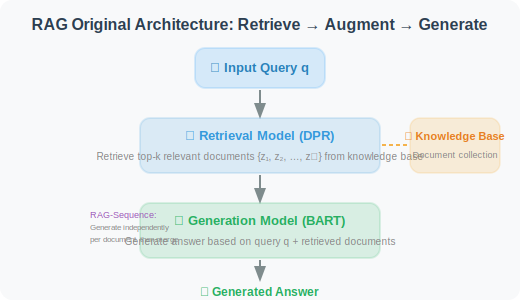
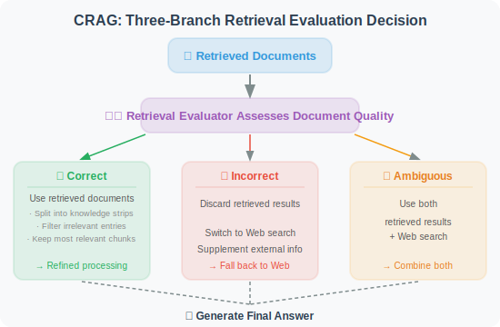
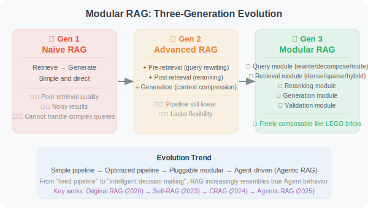
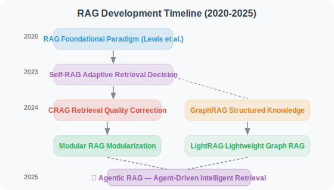

# 7.6 Paper Readings: Frontiers in RAG

> 📖 *"RAG has been one of the fastest-evolving technology directions over the past two years."*  
> *From Naive RAG to Agentic RAG, this section provides in-depth analyses of the key papers driving this evolution.*

---

## The Original RAG Paper: Where It All Began

**Paper**: *Retrieval-Augmented Generation for Knowledge-Intensive NLP Tasks*  
**Authors**: Lewis et al., Meta AI (Facebook AI Research)  
**Published**: 2020 | [arXiv:2005.11401](https://arxiv.org/abs/2005.11401)

### Core Problem

Pre-trained language models implicitly encode knowledge in their parameters, which creates three problems:
1. Knowledge cannot be easily updated (requires retraining)
2. Insufficient coverage of rare and long-tail knowledge
3. Knowledge sources cannot be traced

### Method

The original RAG approach involves **end-to-end training** of both the retrieval model and the generation model:



The paper proposes two variants:
- **RAG-Sequence**: each document independently generates a complete answer, then all answers are weighted
- **RAG-Token**: when generating each token, different documents can be referenced

### Differences from Today's Practice

While today's RAG implementations differ greatly from the original paper (we typically don't do end-to-end training, but instead decouple retrieval and generation), the core idea is identical: **let the model reference external knowledge when generating answers.**

| Dimension | Original RAG (2020) | Modern RAG (2024–2025) |
|-----------|---------------------|----------------------|
| Retrieval model | DPR (end-to-end trained) | General embedding models (e.g., OpenAI text-embedding-3) |
| Generation model | BART | GPT-4o / Claude, etc. |
| Training approach | End-to-end joint training | Decoupled (retrieval and generation independent) |
| Vector database | FAISS | ChromaDB / Pinecone / Weaviate |

---

## Self-RAG: Adaptive Retrieval

**Paper**: *Self-RAG: Learning to Retrieve, Generate, and Critique through Self-Reflection*  
**Authors**: Asai et al.  
**Published**: 2023 | [arXiv:2310.11511](https://arxiv.org/abs/2310.11511)

### Core Problem

A fundamental flaw of traditional RAG is: **retrieval is performed for every question**. But in practice:
- Some questions the model can answer on its own — retrieval only introduces noise
- Some questions require multiple rounds of retrieval — one retrieval is not enough
- Retrieved documents vary in quality and need to be filtered

### Method

Self-RAG trains the model to generate four types of **Reflection Tokens**:

```
1. [Retrieve]: Is retrieval needed?
   → "Yes" / "No" / "Continue" (continue generating, retrieve later)

2. [IsRel]: Is the retrieved document relevant?
   → "Relevant" / "Irrelevant"

3. [IsSup]: Is the generated content supported by the document?
   → "Fully Supported" / "Partially Supported" / "No Support"

4. [IsUse]: Is the generated answer useful?
   → Score from 1 to 5
```

### Workflow

```
User question: "What are the new features in Python 3.12?"
    ↓
Model thinks → [Retrieve: Yes] (retrieval needed, as this is time-sensitive information)
    ↓
Retrieve → return documents
    ↓
Model evaluates → [IsRel: Relevant] (document is relevant)
    ↓
Generate answer
    ↓
Model self-checks → [IsSup: Fully Supported] (answer is supported by documents)
                    [IsUse: 5] (answer is useful)
```

### Implications for Agent Development

Self-RAG's adaptive retrieval idea can be directly applied to Agent development:
- **Not all requests need RAG**: Agents should first determine whether retrieval is needed
- **Retrieval quality verification**: after retrieving documents, evaluate their relevance — don't use them blindly
- **Generation quality self-check**: after generating an answer, verify whether it is supported by documents

---

## CRAG: Error Correction for Retrieval Results

**Paper**: *Corrective Retrieval Augmented Generation*  
**Authors**: Yan et al.  
**Published**: 2024 | [arXiv:2401.15884](https://arxiv.org/abs/2401.15884)

### Core Problem

Another pain point of traditional RAG: **what to do when low-quality documents are retrieved?**
- High vector similarity doesn't necessarily mean truly relevant
- Retrieved documents may be outdated, incomplete, or incorrect
- Once low-quality context is injected, the LLM's answer quality also degrades

### Method

CRAG introduces a **lightweight retrieval evaluator** that takes different strategies based on retrieval quality:



### Implications for Agent Development

1. **Retrieval is not the endpoint**: after retrieving documents, quality evaluation and filtering are still needed
2. **Fallback strategy**: when the internal knowledge base is insufficient, fall back to web search
3. **Fine-grained processing**: a large document may only have a few relevant sentences — key information needs to be extracted

---

## GraphRAG: Knowledge Graph-Enhanced RAG

**Paper**: *From Local to Global: A Graph RAG Approach to Query-Focused Summarization*  
**Authors**: Edge et al., Microsoft Research  
**Published**: 2024 | [arXiv:2404.16130](https://arxiv.org/abs/2404.16130)

### Core Problem

Traditional RAG retrieves independent text chunks, which is suitable for answering **local questions** ("What is X?") but struggles with **global questions** ("What are the collaboration relationships between all teams in this project?" or "What are the main themes across the entire document collection?").

### Method

GraphRAG adds a knowledge graph layer on top of traditional RAG:

```
Indexing phase:
1. Text chunking → regular text Chunks
2. Entity and relationship extraction → use LLM to extract entities (people, organizations, concepts) and relationships from text
3. Build knowledge graph → entities as nodes, relationships as edges
4. Community detection → hierarchical clustering of the graph (Leiden algorithm)
5. Community summarization → generate descriptive summaries for each community

Query phase (two modes):
- Local Search: start from entities most relevant to the query, traverse their neighbor relationships
- Global Search: use community summaries to answer global questions (Map-Reduce approach)
```

### Experimental Results

On global questions (requiring understanding of the entire document collection), GraphRAG improved answer quality by **30–70%** compared to naive RAG.

### Implications for Agent Development

1. **The value of structured knowledge**: pure text retrieval has natural limitations in relational reasoning — knowledge graphs can compensate
2. **Hierarchical retrieval strategy**: use vector retrieval for local questions, graph retrieval for global questions
3. **Indexing cost**: GraphRAG's indexing phase requires many LLM calls to extract entities and relationships, which is costly

---

## Modular RAG: A Modular RAG Architecture

**Paper**: *Modular RAG: Transforming RAG Systems into LEGO-like Reconfigurable Frameworks*  
**Authors**: Gao et al.  
**Published**: 2024

### Core Contribution

Modular RAG is not a specific method but a **systematic classification framework** that divides the evolution of RAG systems into three stages:



### Summary of RAG Paradigm Evolution

| Paradigm | Characteristics | Representative Work |
|----------|----------------|-------------------|
| Naive RAG | Retrieve → Generate, simple and direct | Original RAG (Lewis et al., 2020) |
| Advanced RAG | Pre-retrieval optimization + post-retrieval optimization | Section 7.4 of this book |
| Modular RAG | Modular, pluggable, adaptive | Self-RAG, CRAG |
| Agentic RAG | Agent-driven retrieval decisions, supports multi-round retrieval | LangGraph + RAG workflows |

---

## LightRAG: Lightweight Graph-Enhanced RAG

**Paper**: *LightRAG: Simple and Fast Retrieval-Augmented Generation*  
**Authors**: Guo et al., University of Hong Kong  
**Published**: 2024 | [arXiv:2410.05779](https://arxiv.org/abs/2410.05779)

### Core Problem

While GraphRAG (Microsoft) improved the ability to answer global questions through knowledge graphs, it has serious **cost and efficiency problems**:
- The indexing phase requires many LLM calls, consuming enormous tokens
- Community detection and summary generation are time-consuming
- Adding new documents requires rebuilding the entire graph

### Method

LightRAG significantly reduces costs while maintaining the advantages of graph enhancement:

```
GraphRAG's cost:
  Indexing 1000 documents → may require $50-100 in LLM API fees
  Adding 10 new documents → requires rebuilding the entire community structure

LightRAG's improvements:
  1. Simplified entity/relationship extraction (fewer LLM calls)
  2. Dual-layer retrieval mechanism:
     - Low-level retrieval: precise retrieval based on specific entities and relationships
     - High-level retrieval: abstract retrieval based on topics and concepts
  3. Incremental updates: new documents only need to extract new entities and merge into the existing graph
  
  Cost comparison:
  GraphRAG: $100+ / 1M Token indexing
  LightRAG:  $5-10 / 1M Token indexing (10-20x reduction)
```

### Key Findings

1. **Graph structure + dual-layer retrieval**: outperforms both GraphRAG and naive RAG across multiple datasets
2. **Incremental update capability**: can add new documents without rebuilding the graph, suitable for dynamic knowledge bases
3. **Dramatically reduced costs**: indexing and retrieval costs are 10–20x lower than GraphRAG

### Implications for Agent Development

For Agents that need RAG capabilities, LightRAG provides a more practical choice than GraphRAG — maintaining the advantages of graph enhancement while dramatically reducing deployment and operational costs. Especially suitable for scenarios where the knowledge base is frequently updated.

---

## RAG Meets Reasoning: Agentic RAG

**Survey**: *Agentic RAG: Boosting the Generative AI Capabilities with Autonomous RAG*  
**Trend Survey**: Multiple papers (2024–2025)

### Core Concept

Agentic RAG is not a single paper but the most important evolution direction in the RAG field in 2024–2025 — upgrading RAG from a "passive pipeline" to "Agent-driven intelligent retrieval":

```
Traditional RAG (passive pipeline):
  User question → Retrieve → Generate → Return
  (fixed flow, one retrieval, regardless of whether it's sufficient)

Agentic RAG (Agent-driven):
  User question → Agent thinks
    ↓
  "Does this question need retrieval?" → No → Answer directly
    ↓ Yes
  "What query to use for retrieval?" → Rewrite query
    ↓
  Retrieve → "Are the retrieval results good enough?"
    ↓ Not enough
  "Try a different query/data source"
    ↓ Good enough
  "Is more information needed?" → Yes → Continue retrieving
    ↓ No
  Synthesize all information → Generate answer
    ↓
  "Is the answer factually supported?" → Self-verify → Return
```

### Key Technical Components

| Component | Academic Source | Function |
|-----------|----------------|---------|
| Adaptive retrieval | Self-RAG (2023) | Determine whether retrieval is needed |
| Retrieval correction | CRAG (2024) | Evaluate retrieval quality and fall back |
| Query rewriting | HyDE, Query Rewriting | Optimize retrieval queries |
| Multi-source retrieval | Modular RAG (2024) | Dynamically select data sources |
| Iterative retrieval | IRCoT (2023) | Multi-round retrieval for progressive depth |
| Reasoning integration | LangGraph Workflows | Embed retrieval into reasoning loops |

### Implications for Agent Development

Agentic RAG is one of the most practical architectural patterns in Agent development in 2025. LangGraph is the ideal framework for implementing Agentic RAG (see Chapter 12) — retrieval decisions, query rewriting, quality evaluation, and other steps can be orchestrated as nodes in a state graph.

---

## Paper Comparison and Development Timeline

| Paper | Year | Core Problem Solved | Key Innovation |
|-------|------|--------------------|--------------| 
| Original RAG | 2020 | LLM knowledge is limited | Fusion of retrieval + generation |
| Self-RAG | 2023 | When to retrieve | Reflection tokens for adaptation |
| CRAG | 2024 | Unstable retrieval quality | Retrieval evaluator + fallback strategy |
| GraphRAG | 2024 | Global questions are hard to answer | Knowledge graph + community summaries |
| Modular RAG | 2024 | RAG systems lack flexibility | Modular architecture framework |
| **LightRAG** | **2024** | **GraphRAG is too costly** | **Lightweight graph indexing + incremental updates** |
| **Agentic RAG** | **2025** | **RAG pipeline lacks intelligence** | **Agent-driven retrieval decisions** |

**Development Timeline**:



> 💡 **Frontier Trends (2025–2026)**: Three major trends in the RAG field: ① **Agentic RAG becomes mainstream**: no longer a simple "retrieve→generate" pipeline, but a complete reasoning loop where Agents dynamically decide retrieval strategies, query rewriting, multi-source switching, and result verification; ② **Graph-enhanced RAG becomes practical**: lightweight solutions like LightRAG solve GraphRAG's cost problem, enabling large-scale production deployment of graph-enhanced RAG; ③ **RAG + reasoning models**: the combination of reasoning models like o3/R1 with RAG is being explored — reasoning models can more intelligently decompose retrieval needs and evaluate retrieval quality.

---

*Back to: [Chapter 7: Retrieval-Augmented Generation](./README.md)*
