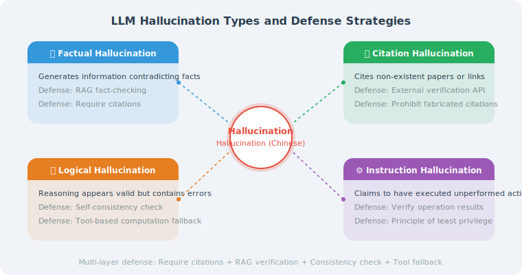

# Hallucination and Factuality Assurance

> **Section Goal**: Understand the causes of LLM hallucinations and master practical techniques to reduce hallucinations and improve factuality.

---

## What Is Hallucination?



Hallucination refers to LLM-generated content that looks fluent and reasonable but is actually incorrect or fabricated. It's like a "knowledgeable" friend who, when they don't know the answer, doesn't say "I don't know" — instead, they confidently make up an answer that sounds right.

### Types of Hallucination

| Type | Description | Example |
|------|-------------|---------|
| Factual hallucination | Generates information that contradicts facts | "Python was released in 1995" (actually 1991) |
| Citation hallucination | Cites non-existent papers or links | "According to Smith et al. (2023)..." (paper doesn't exist) |
| Logical hallucination | Reasoning appears sound but is actually flawed | Math calculation shows correct process but wrong result |
| Instruction hallucination | Claims to have performed an action but didn't | "I've sent the email for you" (no email-sending capability) |

---

## Strategies to Reduce Hallucinations

### Strategy 1: Require Citations

Force the Agent to cite sources; declare uncertainty when no source is available:

```python
ANTI_HALLUCINATION_PROMPT = """
## Factuality Requirements (Must Be Followed)

1. **Only say what you know**: Only provide information you are confident is correct
2. **Cite sources**: When stating specific facts or data, cite the source
3. **Admit uncertainty**: For uncertain content, clearly say "I'm not sure; I recommend you verify this"
4. **Distinguish facts from opinions**: Use declarative sentences for facts; use "I think" or "generally speaking" for opinions

### Examples
✅ "Python 3.12 was released in October 2023, introducing better error messages."
✅ "I'm not very sure about the specific numbers for this question; I recommend checking the official documentation."
❌ "The latest version of this library is 5.2.1." (if you're not sure of the version number)
"""
```

### Strategy 2: RAG Fact-Checking

Use retrieved documents to verify the Agent's answers:

```python
class FactChecker:
    """RAG-based fact checker"""
    
    def __init__(self, retriever, llm):
        self.retriever = retriever
        self.llm = llm
    
    def check(self, claim: str) -> dict:
        """Check the factuality of a claim"""
        
        # 1. Retrieve relevant documents
        docs = self.retriever.invoke(claim)
        
        if not docs:
            return {
                "verdict": "unverifiable",
                "confidence": 0.0,
                "explanation": "No relevant documents found to verify this claim"
            }
        
        # 2. Let the LLM judge
        context = "\n\n".join(doc.page_content for doc in docs[:3])
        
        check_prompt = f"""Based on the following reference documents, determine whether this claim is correct.

Claim: {claim}

Reference documents:
{context}

Please reply in JSON format:
{{
    "verdict": "supported" or "contradicted" or "unverifiable",
    "confidence": 0.0-1.0,
    "explanation": "basis for judgment"
}}"""
        
        response = self.llm.invoke(check_prompt)
        import json
        return json.loads(response.content)
    
    def check_response(self, response: str) -> list[dict]:
        """Check key claims in an entire response"""
        
        # First extract key claims
        extract_prompt = f"""Extract all verifiable factual claims from the following response.
One claim per line; only extract objective facts, not opinions.

Response:
{response}

List of claims:"""
        
        claims_response = self.llm.invoke(extract_prompt)
        claims = [
            c.strip().lstrip("- ·•")
            for c in claims_response.content.strip().split("\n")
            if c.strip()
        ]
        
        # Check each one
        results = []
        for claim in claims:
            result = self.check(claim)
            result["claim"] = claim
            results.append(result)
        
        return results
```

### Strategy 3: Self-Consistency Check

Have the Agent answer the same question multiple times; if answers are inconsistent, hallucination may be present:

```python
async def self_consistency_check(
    question: str,
    llm,
    num_samples: int = 3,
    temperature: float = 0.7
) -> dict:
    """Self-consistency check: generate multiple times and compare"""
    import asyncio
    
    # Generate multiple answers
    tasks = []
    for _ in range(num_samples):
        tasks.append(llm.ainvoke(
            question,
            temperature=temperature
        ))
    
    responses = await asyncio.gather(*tasks)
    answers = [r.content for r in responses]
    
    # Let the LLM judge consistency
    consistency_prompt = f"""The following are {num_samples} answers to the same question.
Please determine whether they are consistent.

Question: {question}

""" + "\n\n".join(
        f"Answer {i+1}: {a}" for i, a in enumerate(answers)
    ) + """

Please reply with:
1. Consistency score (0–1)
2. Which answer is most reliable
3. Specific areas of inconsistency
"""
    
    analysis = await llm.ainvoke(consistency_prompt)
    
    return {
        "answers": answers,
        "analysis": analysis.content,
        "num_samples": num_samples
    }
```

### Strategy 4: Tool Grounding

For scenarios requiring precise data, force the use of tools rather than memory:

```python
def create_grounded_agent(llm, tools):
    """Create a 'grounded' Agent — prioritize using tools to obtain facts"""
    
    system_prompt = """You are a rigorous assistant.

## Core Principle: Tools First
- For specific data (prices, dates, quantities, etc.), you must use tools to query
- For real-time information (weather, news, stock prices, etc.), you must use tools to query
- Only use your knowledge when tools cannot obtain the information
- When answering from knowledge, you must note "Based on my knowledge"

## Prohibited Behaviors
- Do not fabricate specific numbers, dates, or links
- Do not pretend to have performed an action (e.g., "Email sent")
- Do not cite uncertain sources
"""
    
    # Build Agent using LangChain
    from langchain.agents import create_openai_tools_agent, AgentExecutor  # legacy; new projects should use LangGraph
    from langchain_core.prompts import ChatPromptTemplate, MessagesPlaceholder
    
    prompt = ChatPromptTemplate.from_messages([
        ("system", system_prompt),
        MessagesPlaceholder("chat_history", optional=True),
        ("human", "{input}"),
        MessagesPlaceholder("agent_scratchpad"),
    ])
    
    agent = create_openai_tools_agent(llm, tools, prompt)
    return AgentExecutor(agent=agent, tools=tools, verbose=True)
```

---

## Frontier Methods (2025–2026)

> The following methods represent the latest advances in hallucination mitigation as of early 2026, providing stronger factuality guarantees from three levels: model capability, training strategy, and system architecture.

### Strategy 5: Reasoning Models — "Think Before You Speak"

Reasoning models such as OpenAI o1/o3 and DeepSeek-R1 perform self-verification before generating answers through internalized Chain-of-Thought, significantly reducing hallucination rates.

```
Traditional model:
  Question → Directly generate answer → May "confidently make mistakes"

Reasoning model:
  Question → Internal reasoning chain:
    "Let me analyze this... Am I sure about this information?"
    "I'm not very sure about this date; let me verify from another angle..."
    "This might be wrong; let me reconsider..."
  → Verified answer → Hallucinations significantly reduced

Empirical data (SimpleQA benchmark):
  GPT-4o:   38.2% error rate
  o1:       16.0% error rate (58% reduction)
  o3-mini:  12.8% error rate (66% reduction)
```

Best practices for using reasoning models in Agents:

```python
def create_reasoning_agent(task_type: str):
    """Select the appropriate model based on task type"""
    
    # Use reasoning models for high-risk tasks to reduce hallucinations
    HIGH_RISK_TASKS = ["medical", "legal", "financial", "safety"]
    
    if task_type in HIGH_RISK_TASKS:
        # Reasoning model: higher factuality, but higher latency and cost
        model = "o3-mini"  # or deepseek-reasoner
        system_note = "Please carefully reason and verify each factual claim before answering."
    else:
        # Regular model: faster and cheaper, suitable for low-risk scenarios
        model = "gpt-4o"
        system_note = "Please ensure the accuracy of your answer; state when uncertain."
    
    return {"model": model, "system_note": system_note}
```

> ⚠️ **Reasoning models are not a silver bullet**: At the boundaries of knowledge not covered by training data, reasoning models still hallucinate. **Reasoning model + RAG** is the most reliable combination currently.

### Strategy 6: Calibration Training — Teaching Models to Say "I Don't Know"

A core problem with traditional LLMs is **overconfidence** — even when they don't know the answer, they generate a seemingly reasonable response. Calibration training aligns the model's "confidence level" with its "actual accuracy rate."

```python
CALIBRATED_PROMPT = """
## Confidence Annotation Requirements

For each of your factual claims, please annotate the confidence level:

- 🟢 **High confidence**: You are very certain this is correct (e.g., widely known facts)
- 🟡 **Medium confidence**: You think it's probably correct, but recommend the user verify
- 🔴 **Low confidence**: You are uncertain; clearly inform the user they need to verify
- ⚪ **Cannot determine**: Beyond your knowledge; simply say "I don't know"

### Examples
✅ "Python was created by Guido van Rossum 🟢, first released in 1991 🟢."
✅ "The latest version of this library may be 3.2 🟡; I recommend checking the official documentation to confirm."
✅ "I cannot confirm the specific revenue figures for this company ⚪; I recommend consulting their financial reports."
"""


class CalibratedAgent:
    """Agent with confidence calibration"""
    
    def __init__(self, llm, retriever=None):
        self.llm = llm
        self.retriever = retriever
    
    def answer(self, question: str) -> dict:
        """Generate an answer with confidence annotations"""
        
        # Step 1: Generate initial answer (with confidence annotations)
        response = self.llm.invoke(
            CALIBRATED_PROMPT + f"\n\nUser question: {question}"
        )
        
        # Step 2: For low-confidence content, try RAG supplementation
        if self.retriever and ("🟡" in response.content or "🔴" in response.content):
            docs = self.retriever.invoke(question)
            if docs:
                context = "\n".join(d.page_content for d in docs[:3])
                # Re-answer the low-confidence parts using retrieved documents
                refined = self.llm.invoke(
                    f"Based on the following reference materials, re-answer the parts you were uncertain about:\n\n"
                    f"Reference materials:\n{context}\n\n"
                    f"Original answer:\n{response.content}\n\n"
                    f"Please only correct the low-confidence parts; keep the high-confidence content."
                )
                return {"answer": refined.content, "rag_enhanced": True}
        
        return {"answer": response.content, "rag_enhanced": False}
```

### Strategy 7: Chain-of-Verification (CoVe)

CoVe was proposed by Meta in 2023 and widely adopted in 2024–2025. The core idea is: **after generating an answer, automatically generate verification questions, independently answer those questions, and then use the verification results to correct the original answer.**

```python
class ChainOfVerification:
    """Chain of Verification: Generate → Verify → Correct"""
    
    def __init__(self, llm):
        self.llm = llm
    
    async def generate_and_verify(self, question: str) -> dict:
        """Complete CoVe process"""
        
        # Step 1: Generate initial answer
        initial = await self.llm.ainvoke(
            f"Please answer the following question:\n{question}"
        )
        
        # Step 2: Generate verification questions
        verification_qs = await self.llm.ainvoke(
            f"The following is an answer. Please generate a verification question for each factual claim in it.\n\n"
            f"Answer: {initial.content}\n\n"
            f"Please generate 3–5 verification questions, one per line:"
        )
        questions = [
            q.strip().lstrip("0123456789.-) ")
            for q in verification_qs.content.strip().split("\n")
            if q.strip()
        ]
        
        # Step 3: Independently answer verification questions
        # (Key: do NOT show the model the initial answer, to avoid confirmation bias)
        import asyncio
        verify_tasks = [
            self.llm.ainvoke(f"Please answer concisely: {q}")
            for q in questions
        ]
        verify_answers = await asyncio.gather(*verify_tasks)
        
        # Step 4: Use verification results to correct the initial answer
        verification_context = "\n".join(
            f"Verification question: {q}\nVerification result: {a.content}"
            for q, a in zip(questions, verify_answers)
        )
        
        final = await self.llm.ainvoke(
            f"Original question: {question}\n\n"
            f"Initial answer: {initial.content}\n\n"
            f"The following are fact verification results for the initial answer:\n{verification_context}\n\n"
            f"Please correct any errors in the initial answer based on the verification results (if any), and output the final answer:"
        )
        
        return {
            "initial_answer": initial.content,
            "verification_questions": questions,
            "final_answer": final.content
        }
```

### Strategy 8: Structured Output Constraints

By forcing the LLM to output structured formats (JSON Schema, Pydantic models), hallucinations can be reduced at the structural level — the model must provide explicit values for each field, rather than being vague in free text.

```python
from pydantic import BaseModel, Field
from enum import Enum


class ConfidenceLevel(str, Enum):
    HIGH = "high"        # Certain it's correct
    MEDIUM = "medium"    # Probably correct
    LOW = "low"          # Uncertain
    UNKNOWN = "unknown"  # Don't know


class FactClaim(BaseModel):
    """A factual claim"""
    statement: str = Field(description="The content of the factual claim")
    confidence: ConfidenceLevel = Field(description="Confidence level")
    source: str | None = Field(
        default=None,
        description="Source of information; null if no clear source"
    )


class StructuredAnswer(BaseModel):
    """Structured answer with mandatory source and confidence annotations"""
    summary: str = Field(description="Answer summary")
    facts: list[FactClaim] = Field(description="List of factual claims in the answer")
    caveats: list[str] = Field(
        default_factory=list,
        description="Notes and disclaimers"
    )
    needs_verification: bool = Field(
        description="Whether the user is recommended to verify further"
    )


# Use OpenAI's structured output feature
from openai import OpenAI

client = OpenAI()

def get_structured_answer(question: str) -> StructuredAnswer:
    """Get a structured answer with confidence annotations"""
    
    response = client.beta.chat.completions.parse(
        model="gpt-4o-2024-08-06",
        messages=[
            {"role": "system", "content": (
                "You are a rigorous assistant. For each factual claim, "
                "you must annotate the confidence level and source. "
                "Mark uncertain content as low or unknown."
            )},
            {"role": "user", "content": question}
        ],
        response_format=StructuredAnswer,
    )
    
    return response.choices[0].message.parsed
```

### Strategy 9: Multi-Agent Cross-Verification

Drawing on the academic "peer review" mechanism, having multiple Agents check each other significantly improves factuality:

```python
class CrossVerificationSystem:
    """Multi-Agent cross-verification system"""
    
    def __init__(self, models: list[str]):
        """
        Use different models as different "review experts"
        Different models have different knowledge biases, making cross-verification more effective
        """
        from openai import OpenAI
        self.client = OpenAI()
        self.models = models  # e.g., ["gpt-4o", "claude-3-opus", "deepseek-chat"]
    
    async def cross_verify(self, question: str) -> dict:
        """Multi-model cross-verification"""
        import asyncio
        
        # Step 1: Each model answers independently
        async def get_answer(model: str) -> str:
            response = self.client.chat.completions.create(
                model=model,
                messages=[
                    {"role": "system", "content": "Please answer the question rigorously; clearly annotate uncertain content."},
                    {"role": "user", "content": question}
                ]
            )
            return response.choices[0].message.content
        
        answers = await asyncio.gather(
            *[get_answer(m) for m in self.models]
        )
        
        # Step 2: Let one model act as "arbitrator" to synthesize all answers
        all_answers = "\n\n".join(
            f"[{model}'s answer]:\n{answer}"
            for model, answer in zip(self.models, answers)
        )
        
        synthesis = self.client.chat.completions.create(
            model="gpt-4o",
            messages=[
                {"role": "system", "content": (
                    "You are a fact-checking arbitrator. The following are answers from multiple AI models to the same question.\n"
                    "Please:\n"
                    "1. Find facts that all models agree on (high credibility)\n"
                    "2. Find contradictions between models (needs verification)\n"
                    "3. Synthesize and provide the most reliable answer"
                )},
                {"role": "user", "content": (
                    f"Question: {question}\n\nModel answers:\n{all_answers}"
                )}
            ]
        )
        
        return {
            "individual_answers": dict(zip(self.models, answers)),
            "synthesized_answer": synthesis.choices[0].message.content
        }
```

### Strategy 10: Real-Time Retrieval Augmentation (Real-time RAG + Web Search)

Traditional RAG relies on an offline-built knowledge base, but for time-sensitive questions (news, stock prices, latest version numbers, etc.), real-time web search must be combined:

```python
class RealtimeFactAgent:
    """Factuality Agent combining real-time search"""
    
    def __init__(self, llm, search_tool, local_retriever=None):
        self.llm = llm
        self.search_tool = search_tool        # Web search tool
        self.local_retriever = local_retriever  # Local knowledge base (optional)
    
    def answer(self, question: str) -> dict:
        """First determine if real-time information is needed, then decide retrieval strategy"""
        
        # Step 1: Classify the question type
        classification = self.llm.invoke(
            f"Determine whether the following question requires real-time/latest information "
            f"(such as current date, latest version, recent events, etc.). "
            f"Reply only with 'realtime' or 'static'.\n\nQuestion: {question}"
        ).content.strip().lower()
        
        # Step 2: Choose retrieval strategy based on type
        if "realtime" in classification:
            # Real-time search
            search_results = self.search_tool.invoke(question)
            context_source = "Real-time web search"
            context = search_results
        elif self.local_retriever:
            # Local knowledge base retrieval
            docs = self.local_retriever.invoke(question)
            context_source = "Local knowledge base"
            context = "\n\n".join(d.page_content for d in docs[:3])
        else:
            context_source = "Model internal knowledge"
            context = ""
        
        # Step 3: Generate answer based on retrieved results
        if context:
            answer = self.llm.invoke(
                f"Answer the question based on the following reference information. "
                f"If the reference information is insufficient, please clearly state so.\n\n"
                f"Reference information (source: {context_source}):\n{context}\n\n"
                f"Question: {question}"
            )
        else:
            answer = self.llm.invoke(
                f"Please answer the following question. If uncertain, please clearly state so.\n\nQuestion: {question}"
            )
        
        return {
            "answer": answer.content,
            "source": context_source,
            "has_grounding": bool(context)
        }
```

---

## Strategy Combination: Building a Multi-Layer Factuality Defense

In production environments, a single strategy is often insufficient. Recommended combinations based on scenario:

```
                    ┌─────────────────────────────────┐
                    │         User Question             │
                    └──────────┬──────────────────────┘
                               │
                    ┌──────────▼──────────────────────┐
                    │  Layer 1: Real-time RAG (S10)    │
                    │  Determine if real-time info     │
                    │  needed → Search/RAG             │
                    └──────────┬──────────────────────┘
                               │
                    ┌──────────▼──────────────────────┐
                    │  Layer 2: Reasoning Model (S5)   │
                    │  Use reasoning model + retrieved │
                    │  results to generate answer      │
                    └──────────┬──────────────────────┘
                               │
                    ┌──────────▼──────────────────────┐
                    │  Layer 3: Structured Output (S8) │
                    │  Force annotation of confidence  │
                    │  and sources                     │
                    └──────────┬──────────────────────┘
                               │
                    ┌──────────▼──────────────────────┐
                    │  Layer 4: CoVe Correction (S7)   │
                    │  Auto-generate verification      │
                    │  questions → Correct errors      │
                    └──────────┬──────────────────────┘
                               │
                    ┌──────────▼──────────────────────┐
                    │  Final Answer (with confidence)  │
                    └─────────────────────────────────┘
```

Recommended combinations for different scenarios:

| Scenario | Recommended Strategy Combination | Notes |
|----------|----------------------------------|-------|
| Medical/legal consultation | Reasoning model + RAG + CoVe + multi-Agent verification | Highest reliability; higher latency acceptable |
| Customer service Q&A | RAG + structured output + tool grounding | Balance accuracy and response speed |
| Data analysis | Tool grounding + self-consistency | Data must come from tools, not memory |
| Knowledge base Q&A | RAG + citation + calibration prompt | Ensure answers are evidence-based |
| Real-time information queries | Real-time search + tool grounding | Timeliness is the priority |

---

## Summary

| Strategy | Purpose | Use Cases | Frontier Level |
|----------|---------|-----------|---------------|
| Require citations | Force model to find evidence for information | Knowledge Q&A | Basic |
| RAG fact-checking | Verify answers with retrieved documents | Document Q&A | Basic |
| Self-consistency | Detect uncertainty through multiple generations | High-risk decisions | Basic |
| Tool grounding | Use tools to obtain precise data | Data queries | Basic |
| Reasoning models | "Think before speaking," internalized verification | High-risk tasks | ⭐ 2024–2025 |
| Calibration training | Teach models to say "I don't know" | General scenarios | ⭐ 2024–2025 |
| Chain-of-Verification (CoVe) | Auto-verify and correct after generation | Long-form generation | ⭐ 2024–2025 |
| Structured output constraints | Force annotation of sources and confidence | Structured Q&A | ⭐ 2024–2025 |
| Multi-Agent cross-verification | Multiple models check each other | Critical decisions | ⭐ 2025–2026 |
| Real-time retrieval augmentation | Combine web search for latest information | Time-sensitive questions | ⭐ 2025–2026 |

> 📖 **Want to dive deeper into the academic frontiers of hallucination detection and mitigation?** Read [19.6 Paper Readings: Frontier Research in Security and Reliability](./06_paper_readings.md), which covers in-depth analysis of core papers including FActScore, SelfCheckGPT, Self-Consistency, and CoVe.

> **Preview of next section**: Agents need not only to "say the right things" but also to "act safely" — permission control is crucial.

---

[Next section: 19.3 Permission Control and Sandbox Isolation →](./03_permission_sandbox.md)
