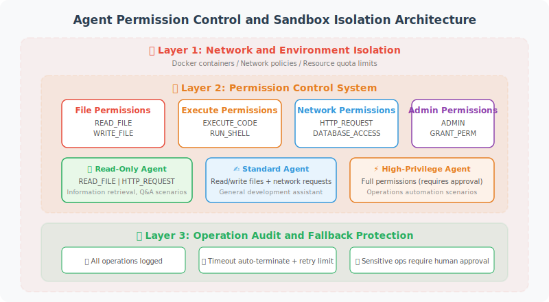

# Permission Control and Sandbox Isolation

> **Section Goal**: Learn how to design a least-privilege system and a secure execution environment for Agents.

---

## Principle of Least Privilege

An Agent should only have the minimum permissions required to complete its task — just as a company shouldn't give every employee a master key.



```python
from enum import Flag, auto
from dataclasses import dataclass

class Permission(Flag):
    """Agent permission definitions"""
    NONE = 0
    READ_FILE = auto()       # Read files
    WRITE_FILE = auto()      # Write files
    EXECUTE_CODE = auto()    # Execute code
    NETWORK_ACCESS = auto()  # Network access
    DATABASE_READ = auto()   # Read database
    DATABASE_WRITE = auto()  # Write database
    SEND_EMAIL = auto()      # Send email
    
    # Predefined permission combinations
    READONLY = READ_FILE | DATABASE_READ
    STANDARD = READONLY | WRITE_FILE | NETWORK_ACCESS
    FULL = STANDARD | EXECUTE_CODE | DATABASE_WRITE | SEND_EMAIL


@dataclass
class PermissionPolicy:
    """Permission policy"""
    agent_name: str
    permissions: Permission
    allowed_paths: list[str] = None     # Allowed file paths
    allowed_domains: list[str] = None   # Allowed network domains
    max_file_size: int = 10 * 1024 * 1024  # Max file size (10MB)
    
    def check(self, action: str, resource: str = None) -> bool:
        """Check if permission exists for an action"""
        perm_map = {
            "read_file": Permission.READ_FILE,
            "write_file": Permission.WRITE_FILE,
            "execute": Permission.EXECUTE_CODE,
            "http_request": Permission.NETWORK_ACCESS,
            "db_read": Permission.DATABASE_READ,
            "db_write": Permission.DATABASE_WRITE,
            "send_email": Permission.SEND_EMAIL,
        }
        
        required = perm_map.get(action)
        if required is None:
            return False
        
        if not (self.permissions & required):
            return False
        
        # Check resource-level permissions
        if action in ("read_file", "write_file") and resource:
            if self.allowed_paths:
                return any(
                    resource.startswith(p) for p in self.allowed_paths
                )
        
        if action == "http_request" and resource:
            if self.allowed_domains:
                from urllib.parse import urlparse
                domain = urlparse(resource).hostname
                return domain in self.allowed_domains
        
        return True


# Usage example
customer_service_policy = PermissionPolicy(
    agent_name="customer_service",
    permissions=Permission.READONLY | Permission.NETWORK_ACCESS,
    allowed_paths=["/data/faq/", "/data/products/"],
    allowed_domains=["api.internal.com"]
)

# Check permissions
print(customer_service_policy.check("read_file", "/data/faq/guide.md"))  # True
print(customer_service_policy.check("write_file", "/etc/passwd"))  # False
print(customer_service_policy.check("execute"))  # False
```

---

## Secure Tool Wrapper

Add security checks before and after tool execution:

```python
import functools

def secure_tool(policy: PermissionPolicy):
    """Secure tool decorator — adds permission checks to tools"""
    
    def decorator(func):
        @functools.wraps(func)
        def wrapper(*args, **kwargs):
            tool_name = func.__name__
            
            # Permission check
            action = _infer_action(tool_name)
            resource = kwargs.get("path") or kwargs.get("url")
            
            if not policy.check(action, resource):
                return {
                    "error": f"Insufficient permission: {tool_name} requires {action} permission",
                    "allowed": False
                }
            
            # Execute tool
            try:
                result = func(*args, **kwargs)
                
                # Record audit log
                _log_tool_execution(
                    agent=policy.agent_name,
                    tool=tool_name,
                    args=kwargs,
                    success=True
                )
                
                return result
                
            except Exception as e:
                _log_tool_execution(
                    agent=policy.agent_name,
                    tool=tool_name,
                    args=kwargs,
                    success=False,
                    error=str(e)
                )
                raise
        
        return wrapper
    return decorator


def _infer_action(tool_name: str) -> str:
    """Infer required permission from tool name"""
    action_keywords = {
        "read": "read_file",
        "write": "write_file",
        "save": "write_file",
        "execute": "execute",
        "run": "execute",
        "fetch": "http_request",
        "search": "http_request",
        "query": "db_read",
        "insert": "db_write",
        "delete": "db_write",
        "email": "send_email",
    }
    
    for keyword, action in action_keywords.items():
        if keyword in tool_name.lower():
            return action
    
    return "unknown"


def _log_tool_execution(**kwargs):
    """Record tool execution log (simplified)"""
    import json, datetime
    log_entry = {
        "timestamp": datetime.datetime.now().isoformat(),
        **kwargs
    }
    print(f"[AUDIT] {json.dumps(log_entry, ensure_ascii=False)}")
```

---

## Code Execution Sandbox

If an Agent needs to execute code, it must run in an isolated environment:

```python
import subprocess
import tempfile
import os

class CodeSandbox:
    """Code execution sandbox"""
    
    def __init__(
        self,
        timeout: int = 10,
        max_memory_mb: int = 256,
        allowed_imports: list[str] = None
    ):
        self.timeout = timeout
        self.max_memory_mb = max_memory_mb
        self.allowed_imports = allowed_imports or [
            "math", "json", "datetime", "re",
            "collections", "itertools", "functools",
            "statistics", "random", "string"
        ]
    
    def validate_code(self, code: str) -> tuple[bool, str]:
        """Validate code safety before execution"""
        import ast
        
        try:
            tree = ast.parse(code)
        except SyntaxError as e:
            return False, f"Syntax error: {e}"
        
        # Check for dangerous operations
        dangerous_calls = {
            "eval", "exec", "compile",
            "__import__", "globals", "locals",
            "getattr", "setattr", "delattr",
        }
        
        dangerous_modules = {
            "os", "sys", "subprocess", "shutil",
            "socket", "http", "urllib",
        }
        
        for node in ast.walk(tree):
            # Check function calls
            if isinstance(node, ast.Call):
                if isinstance(node.func, ast.Name):
                    if node.func.id in dangerous_calls:
                        return False, f"Forbidden call: {node.func.id}()"
            
            # Check imports
            if isinstance(node, ast.Import):
                for alias in node.names:
                    module_name = alias.name.split(".")[0]
                    if module_name in dangerous_modules:
                        return False, f"Forbidden import: {module_name}"
                    if (self.allowed_imports and 
                        module_name not in self.allowed_imports):
                        return False, f"Not in whitelist: {module_name}"
            
            if isinstance(node, ast.ImportFrom):
                if node.module:
                    module_name = node.module.split(".")[0]
                    if module_name in dangerous_modules:
                        return False, f"Forbidden import: {module_name}"
        
        return True, "Code validation passed"
    
    def execute(self, code: str) -> dict:
        """Execute code in sandbox"""
        
        # Validate first
        is_safe, message = self.validate_code(code)
        if not is_safe:
            return {
                "success": False,
                "error": message,
                "output": ""
            }
        
        # Create temporary file
        with tempfile.NamedTemporaryFile(
            mode='w', suffix='.py', delete=False
        ) as f:
            f.write(code)
            temp_path = f.name
        
        try:
            # Execute in subprocess (with resource limits)
            result = subprocess.run(
                ["python3", temp_path],
                capture_output=True,
                text=True,
                timeout=self.timeout,
                env={
                    "PATH": "/usr/bin:/usr/local/bin",
                    "HOME": tempfile.gettempdir(),
                }
            )
            
            return {
                "success": result.returncode == 0,
                "output": result.stdout,
                "error": result.stderr if result.returncode != 0 else "",
            }
            
        except subprocess.TimeoutExpired:
            return {
                "success": False,
                "error": f"Execution timed out ({self.timeout}s)",
                "output": ""
            }
        finally:
            os.unlink(temp_path)


# Usage example
sandbox = CodeSandbox(timeout=5)

# Safe code
result = sandbox.execute("""
import math
print(f"Pi = {math.pi:.10f}")
print(f"sqrt(2) = {math.sqrt(2):.10f}")
""")
print(result)  # {"success": True, "output": "Pi = ...\n", "error": ""}

# Dangerous code is blocked
result = sandbox.execute("""
import os
os.system("rm -rf /")
""")
print(result)  # {"success": False, "error": "Forbidden import: os", "output": ""}
```

---

## Summary

| Concept | Description |
|---------|-------------|
| Least Privilege | Agent only has the minimum permissions needed to complete the task |
| Permission Policy | Defines allowed operations and accessible resources |
| Secure Wrapper | Adds permission checks and audit logs before/after tool execution |
| Code Sandbox | Executes untrusted code in an isolated environment |
| Code Validation | Checks for dangerous operations via AST analysis before execution |

> **Next Section Preview**: Agents may access users' sensitive data — how do we protect it?

---

[Next: 17.4 Sensitive Data Protection →](./04_data_protection.md)
