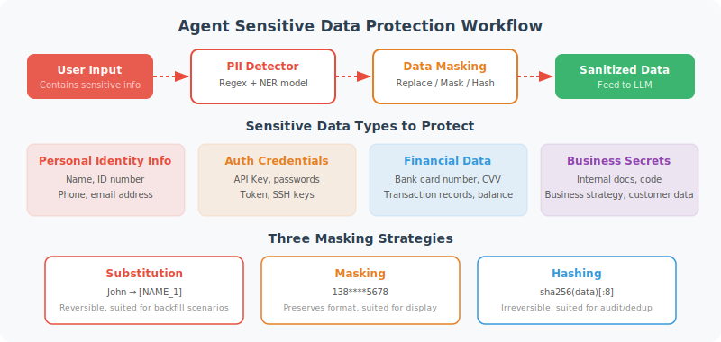

# Sensitive Data Protection

> **Section Goal**: Learn to identify and protect sensitive data in Agent interactions to prevent data leakage.



---

## Data Risks Facing Agents

During interactions with users and task execution, Agents may encounter various types of sensitive data:

| Data Type | Examples | Risk |
|-----------|----------|------|
| Personally Identifiable Information (PII) | Name, ID number, phone number | Privacy breach |
| Authentication credentials | API Key, password, token | Account theft |
| Financial data | Bank card number, transaction records | Financial loss |
| Business secrets | Internal documents, code, policies | Commercial loss |

---

## PII Detection and Masking

```python
import re
from dataclasses import dataclass

@dataclass
class PIIEntity:
    """Personally Identifiable Information entity"""
    type: str       # Type
    value: str      # Original value
    masked: str     # Masked value
    start: int      # Start position in text
    end: int        # End position


class PIIDetector:
    """PII Detector"""
    
    PATTERNS = {
        "phone": {
            "regex": r"1[3-9]\d{9}",
            "mask": lambda m: m[:3] + "****" + m[-4:]
        },
        "id_card": {
            "regex": r"\d{17}[\dXx]",
            "mask": lambda m: m[:6] + "********" + m[-4:]
        },
        "email": {
            "regex": r"[a-zA-Z0-9._%+-]+@[a-zA-Z0-9.-]+\.[a-zA-Z]{2,}",
            "mask": lambda m: m[0] + "***@" + m.split("@")[1]
        },
        "bank_card": {
            "regex": r"\d{4}[\s-]?\d{4}[\s-]?\d{4}[\s-]?\d{4}",
            "mask": lambda m: re.sub(r'\d', '*', m[:-4]) + m[-4:]
        },
        "api_key": {
            "regex": r"(sk|pk|api)[_-][a-zA-Z0-9]{20,}",
            "mask": lambda m: m[:6] + "*" * (len(m) - 10) + m[-4:]
        }
    }
    
    def detect(self, text: str) -> list[PIIEntity]:
        """Detect PII in text"""
        entities = []
        
        for pii_type, config in self.PATTERNS.items():
            for match in re.finditer(config["regex"], text):
                entities.append(PIIEntity(
                    type=pii_type,
                    value=match.group(),
                    masked=config["mask"](match.group()),
                    start=match.start(),
                    end=match.end()
                ))
        
        return entities
    
    def mask(self, text: str) -> tuple[str, list[PIIEntity]]:
        """Detect and mask PII in text"""
        entities = self.detect(text)
        
        # Replace from back to front to avoid position offset
        masked_text = text
        for entity in sorted(entities, key=lambda e: e.start, reverse=True):
            masked_text = (
                masked_text[:entity.start] + 
                entity.masked + 
                masked_text[entity.end:]
            )
        
        return masked_text, entities


# Usage example
detector = PIIDetector()

text = "User John's phone number is 13812345678, email is john@example.com"
masked, entities = detector.mask(text)

print(masked)
# User John's phone number is 138****5678, email is j***@example.com

print(f"Found {len(entities)} PII items:")
for e in entities:
    print(f"  [{e.type}] {e.value} → {e.masked}")
```

---

## Agent Conversation Data Protection

```python
class SecureConversationManager:
    """Secure conversation manager — masks data before storage"""
    
    def __init__(self):
        self.pii_detector = PIIDetector()
        self.conversations = {}  # session_id -> messages
    
    def add_message(self, session_id: str, role: str, content: str):
        """Add message (automatically masked before storage)"""
        
        # Masking
        masked_content, entities = self.pii_detector.mask(content)
        
        if entities:
            print(f"⚠️ Detected {len(entities)} sensitive items, masked")
        
        if session_id not in self.conversations:
            self.conversations[session_id] = []
        
        self.conversations[session_id].append({
            "role": role,
            "content": masked_content,  # Store masked content
            "has_pii": len(entities) > 0,
            "pii_types": list(set(e.type for e in entities))
        })
    
    def get_history(self, session_id: str) -> list[dict]:
        """Get conversation history (already masked)"""
        return self.conversations.get(session_id, [])
```

---

## Data Minimization Principle

Only collect and process data that is strictly necessary to complete the task:

```python
class DataMinimizer:
    """Data minimization processor"""
    
    @staticmethod
    def minimize_for_llm(data: dict, task: str) -> dict:
        """Pass only necessary data fields to LLM based on task type"""
        
        # Fields required for different tasks
        task_fields = {
            "order_query": ["order_id", "status", "create_time"],
            "product_recommend": ["preferences", "budget"],
            "complaint": ["issue_type", "description"],
        }
        
        # Fields that should not be passed to LLM
        sensitive_fields = {
            "password", "credit_card", "id_number",
            "bank_account", "ssn", "api_key"
        }
        
        allowed = task_fields.get(task, list(data.keys()))
        
        return {
            k: v for k, v in data.items()
            if k in allowed and k not in sensitive_fields
        }
```

---

## Summary

| Concept | Description |
|---------|-------------|
| PII Detection | Identify sensitive information using regex and other methods |
| Data Masking | Replace sensitive information with masked form |
| Conversation Protection | Automatically mask before storage |
| Data Minimization | Only pass the minimum data needed to complete the task |

> **Next Section Preview**: Finally, let's discuss how to ensure Agent behavior aligns with human expectations and values.

---

[Next: 17.5 Agent Behavior Controllability and Alignment →](./05_alignment.md)
