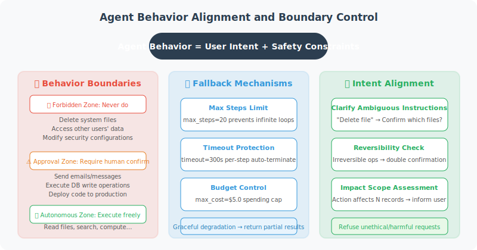

# Agent Behavior Controllability and Alignment

> **Section Goal**: Understand the importance of Agent alignment, and learn how to design behavioral boundaries and fallback mechanisms.



---

## What is Alignment?

Alignment means ensuring that an Agent's behavior conforms to the intentions and values of its designers and users. A well-aligned Agent:

- ✅ Does what users truly need, not just what they literally asked for
- ✅ Proactively confirms when uncertain, rather than acting unilaterally
- ✅ Stops and waits for approval when actions may have irreversible consequences
- ✅ Refuses to execute unethical or harmful requests

---

## Behavioral Boundary Design

```python
from enum import Enum
from dataclasses import dataclass

class ActionRisk(Enum):
    """Action risk levels"""
    LOW = "low"          # Read-only operations, no side effects
    MEDIUM = "medium"    # Has side effects but reversible
    HIGH = "high"        # Irreversible operations
    CRITICAL = "critical"  # May cause significant impact

@dataclass
class ActionBoundary:
    """Behavioral boundary definition"""
    action: str
    risk_level: ActionRisk
    requires_confirmation: bool
    max_daily_count: int = None
    description: str = ""

class BehaviorGuard:
    """Behavior guard — ensures Agent acts within safe boundaries"""
    
    def __init__(self):
        self.boundaries = {}
        self.action_counts = {}  # Action counters
        
        # Register default behavioral boundaries
        self._register_defaults()
    
    def _register_defaults(self):
        """Register default behavioral boundaries"""
        defaults = [
            ActionBoundary("search", ActionRisk.LOW, False,
                          description="Search for information"),
            ActionBoundary("read_file", ActionRisk.LOW, False,
                          description="Read file"),
            ActionBoundary("write_file", ActionRisk.MEDIUM, False,
                          max_daily_count=100,
                          description="Write file"),
            ActionBoundary("send_email", ActionRisk.HIGH, True,
                          max_daily_count=20,
                          description="Send email"),
            ActionBoundary("delete_data", ActionRisk.CRITICAL, True,
                          max_daily_count=5,
                          description="Delete data"),
            ActionBoundary("execute_code", ActionRisk.HIGH, True,
                          max_daily_count=50,
                          description="Execute code"),
        ]
        
        for boundary in defaults:
            self.boundaries[boundary.action] = boundary
    
    def check_action(self, action: str) -> dict:
        """Check if an action is allowed"""
        boundary = self.boundaries.get(action)
        
        if boundary is None:
            return {
                "allowed": False,
                "reason": f"Unregistered action: {action}"
            }
        
        # Check daily limit
        if boundary.max_daily_count:
            count = self.action_counts.get(action, 0)
            if count >= boundary.max_daily_count:
                return {
                    "allowed": False,
                    "reason": f"Daily limit reached ({boundary.max_daily_count})"
                }
        
        # Actions requiring human confirmation
        if boundary.requires_confirmation:
            return {
                "allowed": True,
                "needs_confirmation": True,
                "risk_level": boundary.risk_level.value,
                "message": f"Action '{boundary.description}' requires your confirmation"
            }
        
        # Update counter
        self.action_counts[action] = self.action_counts.get(action, 0) + 1
        
        return {
            "allowed": True,
            "needs_confirmation": False,
            "risk_level": boundary.risk_level.value
        }
```

---

## Refusal Policy

Agents need to know when to say "no":

```python
REFUSAL_GUIDELINES = """
## When to Refuse

### Must Refuse
- User requests potentially illegal operations
- User requests disclosure of other users' private information
- User requests bypassing security checks

### Should Confirm Before Executing
- Irreversible operations (delete data, send email)
- Operations involving money (place order, transfer)
- Large-scale operations (mass messaging, bulk modifications)

### Should Warn But Can Execute
- User's request may have a better alternative
- Operation result may not match user's expectation

## How to Refuse
- Politely but firmly
- Explain the reason
- Provide alternatives if possible
"""

class RefusalHandler:
    """Graceful refusal handler"""
    
    TEMPLATES = {
        "security": (
            "Sorry, for security reasons I cannot perform this operation. "
            "{reason}. If you have special requirements, please contact the administrator."
        ),
        "scope": (
            "This request is beyond my capabilities. "
            "{reason}. I suggest you {suggestion}."
        ),
        "confirmation": (
            "This operation {description}. "
            "To ensure safety, your explicit confirmation is required. Continue? (Yes/No)"
        ),
        "alternative": (
            "I understand your need, however {reason}. "
            "As an alternative, I can {alternative}. What do you think?"
        )
    }
    
    @classmethod
    def refuse(
        cls,
        refusal_type: str,
        **kwargs
    ) -> str:
        """Generate a polite refusal message"""
        template = cls.TEMPLATES.get(refusal_type, cls.TEMPLATES["security"])
        return template.format(**kwargs)
```

---

## Progressive Autonomy

Gradually increase Agent autonomy based on trust level:

```python
class TrustLevel(Enum):
    """Trust levels"""
    NEW_USER = 1        # New user: all operations require confirmation
    REGULAR = 2         # Regular user: only high-risk operations require confirmation
    TRUSTED = 3         # Trusted user: only critical operations require confirmation
    ADMIN = 4           # Admin: fully autonomous

class ProgressiveAutonomy:
    """Progressive autonomy management"""
    
    def __init__(self, initial_trust: TrustLevel = TrustLevel.NEW_USER):
        self.trust_level = initial_trust
        self.interaction_count = 0
        self.error_count = 0
    
    def needs_confirmation(self, action_risk: ActionRisk) -> bool:
        """Determine if confirmation is needed based on trust level"""
        confirmation_matrix = {
            TrustLevel.NEW_USER: {
                ActionRisk.LOW: False,
                ActionRisk.MEDIUM: True,
                ActionRisk.HIGH: True,
                ActionRisk.CRITICAL: True,
            },
            TrustLevel.REGULAR: {
                ActionRisk.LOW: False,
                ActionRisk.MEDIUM: False,
                ActionRisk.HIGH: True,
                ActionRisk.CRITICAL: True,
            },
            TrustLevel.TRUSTED: {
                ActionRisk.LOW: False,
                ActionRisk.MEDIUM: False,
                ActionRisk.HIGH: False,
                ActionRisk.CRITICAL: True,
            },
            TrustLevel.ADMIN: {
                ActionRisk.LOW: False,
                ActionRisk.MEDIUM: False,
                ActionRisk.HIGH: False,
                ActionRisk.CRITICAL: False,
            },
        }
        
        return confirmation_matrix[self.trust_level][action_risk]
    
    def update_trust(self, success: bool):
        """Update trust level based on interaction results"""
        self.interaction_count += 1
        
        if not success:
            self.error_count += 1
        
        # Upgrade condition: enough successful interactions, low error rate
        error_rate = self.error_count / max(self.interaction_count, 1)
        
        if (self.interaction_count >= 50 
            and error_rate < 0.05 
            and self.trust_level.value < TrustLevel.TRUSTED.value):
            self.trust_level = TrustLevel(self.trust_level.value + 1)
            print(f"🆙 Trust level upgraded to: {self.trust_level.name}")
```

---

## Summary

| Concept | Description |
|---------|-------------|
| Alignment | Ensuring Agent behavior conforms to human intentions and values |
| Behavioral Boundaries | Define risk levels and restrictions for each type of operation |
| Refusal Policy | Politely but firmly refuse inappropriate requests |
| Progressive Autonomy | Gradually increase autonomy based on trust level |

> 🎓 **Chapter Summary**: Security and reliability are the key step from an Agent being "usable" to "trustworthy". Prompt injection defense, hallucination control, permission management, data protection, and behavioral alignment form the five lines of defense for Agent security.

---

[Next Chapter: Chapter 18 Deployment and Production →](../chapter_deployment/README.md)
