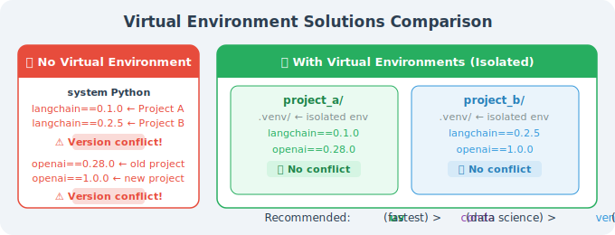

# Python Environment & Dependency Management

Agent projects depend on many third-party libraries, and version conflicts are a common headache. Using virtual environments creates an isolated dependency space for each project, completely eliminating conflicts.

## Why Do You Need a Virtual Environment?



## Option 1: uv (Recommended — The New Standard for Python Package Management)

`uv` is an ultra-fast Python package manager written in Rust, 10–100× faster than `pip`:

```bash
# Install uv
curl -LsSf https://astral.sh/uv/install.sh | sh
# Windows:
# powershell -c "irm https://astral.sh/uv/install.ps1 | iex"

# Verify installation
uv --version

# Create a new project
mkdir my_agent_project && cd my_agent_project
uv init

# Create virtual environment (automatically uses .venv in the project directory)
uv venv

# Activate the virtual environment
source .venv/bin/activate    # Linux/Mac
# .venv\Scripts\activate      # Windows

# Install dependencies (much faster than pip!)
uv add openai langchain python-dotenv

# List installed packages
uv pip list

# Generate a lock file (ensures consistent environments across the team)
uv lock

# Install from lock file (for CI/CD or team collaboration)
uv sync
```

**uv's pyproject.toml:**

```toml
# pyproject.toml (auto-generated by uv init)
[project]
name = "my-agent-project"
version = "0.1.0"
description = "My first Agent project"
requires-python = ">=3.11"
dependencies = [
    "openai>=1.60.0",
    "langchain>=0.3.0",
    "python-dotenv>=1.0.0",
]

[project.optional-dependencies]
dev = [
    "pytest>=8.0.0",
    "ruff>=0.8.0",
]
```

## Option 2: conda (Data Science Friendly)

If you're already using Anaconda/Miniconda:

```bash
# Create a dedicated environment
conda create -n agent_dev python=3.11

# Activate the environment
conda activate agent_dev

# Install packages
conda install -c conda-forge openai
pip install langchain python-dotenv  # Use pip for packages not in conda

# Export environment configuration
conda env export > environment.yml

# Recreate environment from config file (for team collaboration)
conda env create -f environment.yml
```

## Option 3: venv (Built-in, No Installation Required)

```bash
# Create virtual environment
python -m venv .venv

# Activate
source .venv/bin/activate    # Linux/Mac
# .venv\Scripts\activate.bat  # Windows cmd
# .venv\Scripts\Activate.ps1  # Windows PowerShell

# Install dependencies
pip install openai langchain python-dotenv

# Save dependency list
pip freeze > requirements.txt

# Install from file
pip install -r requirements.txt
```

## Recommended Project Structure

```
my_agent_project/
├── .venv/                  # Virtual environment (don't commit to git)
├── .env                    # API Keys (don't commit to git!)
├── .env.example            # Key template (commit to git)
├── .gitignore              # Exclude .venv and .env
├── pyproject.toml          # Project config (uv)
├── requirements.txt        # Dependency list (pip)
├── src/
│   ├── __init__.py
│   ├── agent.py            # Agent main logic
│   ├── tools.py            # Tool definitions
│   └── config.py           # Configuration management
├── tests/
│   └── test_agent.py
└── notebooks/
    └── experiments.ipynb   # Experimental code
```

**Standard .gitignore:**

```gitignore
# Virtual environments
.venv/
venv/
env/

# API Keys (important!)
.env
.env.local
*.env

# Python cache
__pycache__/
*.pyc
*.pyo
.pytest_cache/

# Editors
.vscode/settings.json
.idea/

# Data files
*.db
*.sqlite
data/raw/
```

## Python Version Management

For developers who need to manage multiple Python versions:

```bash
# Using pyenv (recommended)
# Install pyenv
curl https://pyenv.run | bash

# Install specific versions
pyenv install 3.12.8
pyenv install 3.13.2

# Set global/local version
pyenv global 3.12.8         # Global
pyenv local 3.13.2          # Current directory

# uv also supports automatic Python version management
uv python install 3.13
uv python pin 3.13  # Pin version for the current project
```

## Quick Environment Verification

```python
# check_env.py: Run this script to verify the environment is set up correctly
import sys
import pkg_resources

print(f"Python version: {sys.version}")
print(f"Python path: {sys.executable}")
print()

required_packages = [
    "openai",
    "langchain",
    "python-dotenv",
]

print("Dependency check:")
for package in required_packages:
    try:
        version = pkg_resources.get_distribution(package).version
        print(f"  ✅ {package} {version}")
    except pkg_resources.DistributionNotFound:
        print(f"  ❌ {package} not installed")

# Verify API Key
import os
from dotenv import load_dotenv
load_dotenv()

api_key = os.getenv("OPENAI_API_KEY")
if api_key:
    # Only show the first few characters, don't expose the full key
    print(f"\n✅ OPENAI_API_KEY is set ({api_key[:8]}...)")
else:
    print("\n❌ OPENAI_API_KEY is not set. Please check your .env file.")
```

```bash
# Run the check
python check_env.py
```

---

## Summary

| Tool | Best For | Speed |
|------|---------|-------|
| `uv` | New projects, speed-focused | ⚡⚡⚡⚡⚡ |
| `conda` | Data science, non-Python dependencies | ⚡⚡ |
| `venv` | Simple projects, no extra tools | ⚡⚡⚡ |

Recommended: use `uv` — it's fast, simple, and modern, and is becoming the new standard for Python package management.

---

*Next section: [2.2 Key Library Installation: LangChain, OpenAI SDK, etc.](./02_install_libs.md)*
