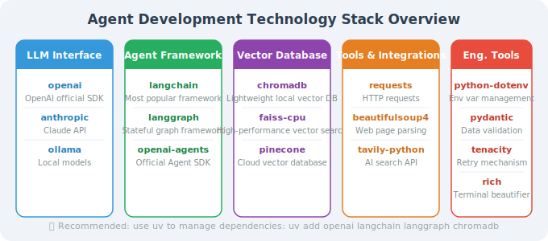

# Key Library Installation: LangChain, OpenAI SDK, and More

This section introduces the most important libraries in the Agent development ecosystem, explaining their purpose and how to install them.

## Agent Development Core Library Overview



## One-Command Install: Agent Development Standard Suite

```bash
# Create and activate virtual environment
uv venv && source .venv/bin/activate

# Core dependencies (required)
uv add openai langchain langchain-openai langchain-community python-dotenv pydantic

# LangGraph (stateful Agents)
uv add langgraph

# OpenAI Agents SDK (lightweight multi-agent framework)
uv add openai-agents

# Vector database (chromadb is sufficient for local development)
uv add chromadb

# Utility libraries
uv add requests beautifulsoup4 wikipedia-api

# MCP protocol support
uv add mcp

# Engineering libraries
uv add tenacity rich
```

Or using pip:

```bash
pip install openai langchain langchain-openai langchain-community langgraph \
            openai-agents chromadb mcp python-dotenv pydantic tenacity rich
```

## Library Details

### OpenAI SDK

```python
# Install: pip install openai
# Purpose: Call GPT series models

from openai import OpenAI

client = OpenAI()
response = client.chat.completions.create(
    model="gpt-4o-mini",
    messages=[{"role": "user", "content": "Hello!"}]
)
print(response.choices[0].message.content)

# Verify installation
import openai
print(f"OpenAI SDK version: {openai.__version__}")  # Should be >= 1.0.0
```

### LangChain

```python
# Install: pip install langchain langchain-openai
# Purpose: Agent framework, chain calls, tool integration

from langchain_openai import ChatOpenAI
from langchain_core.messages import HumanMessage

# Basic model call
llm = ChatOpenAI(model="gpt-4o-mini")
response = llm.invoke([HumanMessage(content="Hello!")])
print(response.content)

# Verify installation
import langchain
print(f"LangChain version: {langchain.__version__}")  # Should be >= 0.3.0
```

### LangGraph

```python
# Install: pip install langgraph
# Purpose: Build stateful Agent workflows

from langgraph.graph import StateGraph, END

# Covered in detail in later chapters; verify import for now
import langgraph
print(f"LangGraph version: {langgraph.__version__}")
```

### ChromaDB (Vector Database)

```python
# Install: pip install chromadb
# Purpose: Local vector storage for RAG scenarios

import chromadb

# Create a local vector database
client = chromadb.Client()
collection = client.create_collection("test")

# Add documents
collection.add(
    documents=["Python is an interpreted programming language", "LangChain is an Agent framework"],
    ids=["doc1", "doc2"]
)

# Query similar documents
results = collection.query(
    query_texts=["How do I learn Python?"],
    n_results=1
)
print(results)

import chromadb
print(f"ChromaDB version: {chromadb.__version__}")
```

### Pydantic (Data Validation)

```python
# Install: pip install pydantic
# Purpose: Data model definition, input validation, Agent output parsing

from pydantic import BaseModel, Field
from typing import Optional, List

class TaskInfo(BaseModel):
    """Task information model"""
    title: str = Field(..., description="Task title")
    priority: str = Field(default="medium", pattern="^(high|medium|low)$")
    tags: List[str] = Field(default_factory=list)
    deadline: Optional[str] = None
    
    class Config:
        json_schema_extra = {
            "example": {
                "title": "Complete project report",
                "priority": "high",
                "tags": ["work", "report"],
                "deadline": "2024-12-31"
            }
        }

# Validate data
task = TaskInfo(title="Write code", priority="high", tags=["development"])
print(task.model_dump())
print(task.model_dump_json())

import pydantic
print(f"Pydantic version: {pydantic.__version__}")  # Should be >= 2.0
```

### Rich (Beautiful Terminal Output)

```python
# Install: pip install rich
# Purpose: Beautiful terminal output — very useful when debugging Agents

from rich.console import Console
from rich.panel import Panel
from rich.syntax import Syntax
from rich.table import Table

console = Console()

# Print colored messages
console.print("[bold green]✅ Agent started successfully[/bold green]")
console.print("[yellow]⚠️ Warning: High token consumption[/yellow]")
console.print("[red]❌ Tool call failed[/red]")

# Display code
code = """
def hello_agent():
    return "Hello, World!"
"""
syntax = Syntax(code, "python", theme="monokai")
console.print(Panel(syntax, title="Agent Code"))

# Display a table
table = Table(title="Tool List")
table.add_column("Tool Name", style="cyan")
table.add_column("Description", style="green")
table.add_column("Status", style="yellow")

table.add_row("search", "Search the internet", "✅ Available")
table.add_row("calculator", "Math calculations", "✅ Available")
table.add_row("email", "Send emails", "❌ Not configured")

console.print(table)
```

### Tenacity (Retry Mechanism)

```python
# Install: pip install tenacity
# Purpose: Retry logic for API calls — essential for production environments

from tenacity import (
    retry,
    stop_after_attempt,
    wait_exponential,
    retry_if_exception_type
)
from openai import RateLimitError, APIError

@retry(
    stop=stop_after_attempt(3),           # Retry up to 3 times
    wait=wait_exponential(min=1, max=10), # Exponential backoff: 1s, 2s, 4s...
    retry=retry_if_exception_type((RateLimitError, APIError)),
    reraise=True
)
def robust_api_call(messages: list) -> str:
    """API call with retry"""
    from openai import OpenAI
    client = OpenAI()
    response = client.chat.completions.create(
        model="gpt-4o-mini",
        messages=messages
    )
    return response.choices[0].message.content

# Automatically handles rate limits and transient errors
result = robust_api_call([{"role": "user", "content": "Hello"}])
```

## Complete Installation Verification Script

Create the following script to verify all dependencies at once:

```python
# verify_installation.py
"""Run this script to verify all dependencies are correctly installed"""

import sys
from rich.console import Console
from rich.table import Table

console = Console()

def check_package(package_name: str, import_name: str = None) -> tuple:
    """Check if a package is installed"""
    import_name = import_name or package_name.replace("-", "_")
    try:
        import importlib
        module = importlib.import_module(import_name)
        version = getattr(module, '__version__', 'unknown')
        return True, version
    except ImportError:
        return False, None

# Check list
packages = [
    ("openai", "openai"),
    ("langchain", "langchain"),
    ("langchain-openai", "langchain_openai"),
    ("langgraph", "langgraph"),
    ("chromadb", "chromadb"),
    ("pydantic", "pydantic"),
    ("python-dotenv", "dotenv"),
    ("tenacity", "tenacity"),
    ("rich", "rich"),
    ("requests", "requests"),
    ("beautifulsoup4", "bs4"),
]

table = Table(title="Dependency Installation Check", show_header=True)
table.add_column("Package", style="cyan")
table.add_column("Version", style="yellow")
table.add_column("Status", style="green")

all_ok = True
for pkg_name, import_name in packages:
    installed, version = check_package(pkg_name, import_name)
    status = "✅ Installed" if installed else "❌ Not installed"
    version_str = version if installed else "-"
    table.add_row(pkg_name, version_str, status)
    if not installed:
        all_ok = False

console.print(table)

if all_ok:
    console.print("\n[bold green]🎉 All dependencies are correctly installed! Ready to start Agent development.[/bold green]")
else:
    console.print("\n[bold red]⚠️ Some dependencies are missing. Run: pip install <missing package>[/bold red]")

# Check Python version
python_version = sys.version_info
if python_version >= (3, 10):
    console.print(f"[green]✅ Python {python_version.major}.{python_version.minor} - Version requirement met[/green]")
else:
    console.print(f"[red]❌ Python {python_version.major}.{python_version.minor} - Requires >= 3.10[/red]")
```

Run the verification:

```bash
python verify_installation.py
```

---

## Summary

Core dependencies for Agent development:

| Category | Recommended Library | Purpose |
|----------|--------------------|---------| 
| LLM Interface | `openai` | Call GPT models |
| Agent Framework | `langchain` + `langgraph` | Build Agent logic |
| Vector Storage | `chromadb` | RAG document retrieval |
| Data Validation | `pydantic` | Structured output |
| Engineering Tools | `tenacity` + `rich` | Retry + beautiful logging |

---

*Next section: [2.3 API Key Management & Security Best Practices](./03_api_key_management.md)*