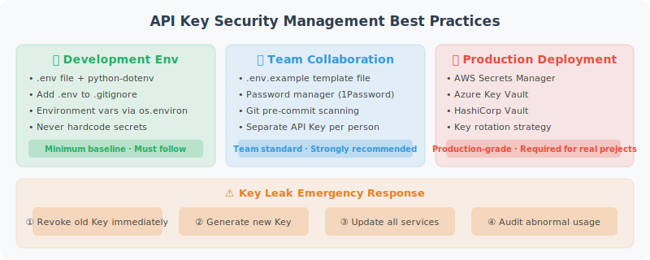

# API Key Management & Security Best Practices

API Keys are credentials for accessing LLM services. If leaked, they can result in serious financial losses. This section explains how to manage API Keys securely.



## Never Do This

```python
# ❌ Never do this!
client = OpenAI(api_key="sk-proj-abc123xyz...")  # Hardcoded in the source code

# ❌ Don't commit it to Git either
# Even in a private repository, develop good habits
```

Once an API Key is committed to GitHub, even if deleted immediately, it may have already been discovered by automated scanning tools. GitHub itself has a Secret Scanning feature that detects and notifies OpenAI to revoke leaked keys.

## The Right Approach: Use a .env File

```bash
# Create a .env file (do not commit to version control)
cat > .env << EOF
# LLM API Keys
OPENAI_API_KEY=sk-proj-your-key-here
ANTHROPIC_API_KEY=your-anthropic-key
DASHSCOPE_API_KEY=your-qwen-key

# Other configuration
DEFAULT_MODEL=gpt-4o-mini
MAX_TOKENS=2000
EOF

# Make sure .gitignore includes .env
echo ".env" >> .gitignore
echo ".env.local" >> .gitignore
```

```python
# config.py: Centralized configuration management
import os
from dotenv import load_dotenv
from pathlib import Path

# Load .env file
# Searches upward from the current directory for .env
load_dotenv()

class Config:
    """Application configuration"""
    
    # LLM configuration
    OPENAI_API_KEY: str = os.getenv("OPENAI_API_KEY", "")
    ANTHROPIC_API_KEY: str = os.getenv("ANTHROPIC_API_KEY", "")
    
    # Model configuration
    DEFAULT_MODEL: str = os.getenv("DEFAULT_MODEL", "gpt-4o-mini")
    MAX_TOKENS: int = int(os.getenv("MAX_TOKENS", "2000"))
    TEMPERATURE: float = float(os.getenv("TEMPERATURE", "0.7"))
    
    @classmethod
    def validate(cls):
        """Validate that required configuration exists"""
        required_keys = ["OPENAI_API_KEY"]
        missing = [k for k in required_keys if not getattr(cls, k)]
        
        if missing:
            raise ValueError(
                f"Missing required environment variables: {', '.join(missing)}\n"
                f"Please check your .env file or set the environment variables."
            )
        return True

# Validate at application startup
config = Config()
config.validate()
```

## Create a .env.example Template

Commit `.env.example` to Git so other developers know which keys are needed:

```bash
# .env.example (commit to Git, without real values)
# Copy this file to .env and fill in your real API Keys

# OpenAI API Key
# Get it at: https://platform.openai.com/api-keys
OPENAI_API_KEY=your-openai-api-key-here

# Anthropic API Key (optional)
# Get it at: https://console.anthropic.com/
ANTHROPIC_API_KEY=your-anthropic-api-key-here

# Alibaba Cloud Qwen (optional)
DASHSCOPE_API_KEY=your-dashscope-api-key-here

# DeepSeek (optional, excellent cost-performance ratio)
# Get it at: https://platform.deepseek.com/
DEEPSEEK_API_KEY=your-deepseek-api-key-here

# Default model configuration
DEFAULT_MODEL=gpt-4o-mini
MAX_TOKENS=2000
```

## Multi-Environment Configuration Management

```python
# settings.py: Configuration management supporting multiple environments
from pydantic_settings import BaseSettings
from typing import Optional

class Settings(BaseSettings):
    """
    Use pydantic-settings to manage configuration.
    Automatically reads from environment variables with type validation.
    """
    
    # API Keys
    openai_api_key: str
    anthropic_api_key: Optional[str] = None
    dashscope_api_key: Optional[str] = None
    
    # Model configuration
    default_model: str = "gpt-4o-mini"
    max_tokens: int = 2000
    temperature: float = 0.7
    
    # Application configuration
    debug: bool = False
    log_level: str = "INFO"
    
    class Config:
        env_file = ".env"
        env_file_encoding = "utf-8"
        case_sensitive = False  # OPENAI_API_KEY = openai_api_key

# Install: pip install pydantic-settings
settings = Settings()
print(f"Using model: {settings.default_model}")
```

## API Key Management Best Practices in Real Development

### 1. Request Different Keys for Different Purposes

```
Development Key  → For local development, set a low usage limit
Test Key         → For CI/CD testing
Production Key   → Highest privilege, only accessible in production
```

### 2. Set Usage Alerts

Set usage limits and alerts in the OpenAI dashboard:
- Monthly Hard Limit: Prevents overspending
- Alert Threshold: Early warning

### 3. Key Rotation

```python
# Support multiple key rotation to avoid single points of failure
import itertools
import os

class APIKeyRotator:
    """API Key rotation manager"""
    
    def __init__(self):
        # Read multiple keys from environment variables
        keys = []
        for i in range(1, 6):  # Up to 5 keys
            key = os.getenv(f"OPENAI_API_KEY_{i}")
            if key:
                keys.append(key)
        
        # Also accept a single key
        single_key = os.getenv("OPENAI_API_KEY")
        if single_key:
            keys.append(single_key)
        
        if not keys:
            raise ValueError("No API Keys found")
        
        self._key_cycle = itertools.cycle(keys)
        self._key_count = len(keys)
    
    def get_next_key(self) -> str:
        """Get the next key (rotation)"""
        return next(self._key_cycle)
    
    @property
    def key_count(self) -> int:
        return self._key_count

# Usage
rotator = APIKeyRotator()
print(f"Loaded {rotator.key_count} API Key(s)")
```

### 4. Production Environment: Use a Secrets Management Service

```python
# Production environments should NOT use .env files
# Instead, use a professional secrets management service

# Option 1: AWS Secrets Manager
import boto3
import json

def get_secret_from_aws(secret_name: str, region: str = "us-east-1") -> dict:
    """Retrieve a secret from AWS Secrets Manager"""
    client = boto3.client("secretsmanager", region_name=region)
    response = client.get_secret_value(SecretId=secret_name)
    return json.loads(response["SecretString"])

# Usage:
# secrets = get_secret_from_aws("prod/openai-keys")
# OPENAI_API_KEY = secrets["api_key"]

# Option 2: Alibaba Cloud KMS
# Option 3: HashiCorp Vault
# Option 4: Kubernetes Secrets
```

## Validate That a Key Is Working

```python
# key_validator.py
from openai import OpenAI, AuthenticationError

def validate_openai_key(api_key: str) -> bool:
    """Validate whether an OpenAI API Key is valid"""
    try:
        client = OpenAI(api_key=api_key)
        # Validate the key in the cheapest way possible
        client.models.list()
        return True
    except AuthenticationError:
        return False
    except Exception as e:
        print(f"Error during validation: {e}")
        return False

# Validate at application startup
import os
from dotenv import load_dotenv
load_dotenv()

key = os.getenv("OPENAI_API_KEY")
if validate_openai_key(key):
    print("✅ API Key is valid")
else:
    print("❌ API Key is invalid. Please check.")
```

## Hide Sensitive Information in Logs

```python
import logging
import re

class SensitiveDataFilter(logging.Filter):
    """Filter sensitive information from logs"""
    
    # Match OpenAI Key format
    PATTERNS = [
        (r'sk-[a-zA-Z0-9]{20,}', 'sk-***REDACTED***'),
        (r'Bearer [a-zA-Z0-9\-._~+/]+=*', 'Bearer ***REDACTED***'),
    ]
    
    def filter(self, record: logging.LogRecord) -> bool:
        record.msg = self._redact(str(record.msg))
        return True
    
    def _redact(self, text: str) -> str:
        for pattern, replacement in self.PATTERNS:
            text = re.sub(pattern, replacement, text)
        return text

# Configure logging
logger = logging.getLogger(__name__)
logger.addFilter(SensitiveDataFilter())

# Test: even if a key is accidentally printed, it will be filtered
logger.info("Using key: sk-proj-abc123xyz789...")
# Output: Using key: sk-***REDACTED***
```

---

## Security Checklist

Before each code commit, confirm the following:

- [ ] `.env` file is in `.gitignore`
- [ ] No hardcoded API Keys in the code
- [ ] `.env.example` template has been created
- [ ] Usage limits have been set in the OpenAI dashboard
- [ ] Logs do not output the full API Key

---

*Next section: [2.4 Your First Agent: Hello Agent!](./04_hello_agent.md)*