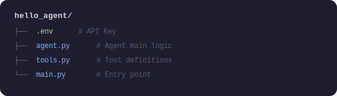
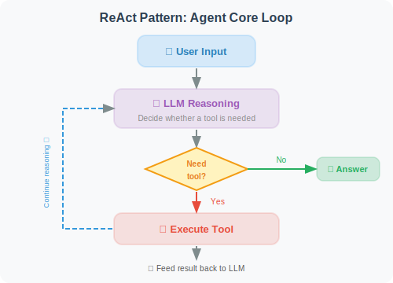

# Your First Agent: Hello Agent!

The exciting moment has finally arrived — let's build our first real Agent! It can use tools, reason, and complete actual tasks.

## What Counts as a Real Agent?

The simplest Agent must have the following capabilities:
1. **Perceive**: Receive user input
2. **Reason**: Understand what needs to be done
3. **Act**: Call tools to execute operations
4. **Observe**: Get tool results
5. **Respond**: Provide the final answer

Simply calling an LLM to generate text does not count as an Agent. The ability to **autonomously decide which tools to call** is what makes it an Agent.

## Project Structure



## Step 1: Define Tools

```python
# tools.py
import math
import datetime
import requests
from typing import Annotated

def calculator(expression: Annotated[str, "A math expression, e.g. '2 + 3 * 4'"]) -> str:
    """
    Evaluate a mathematical expression.
    Supports basic operations (+,-,*,/) and math functions (sqrt, pow, sin, cos, etc.).
    """
    try:
        # Safely evaluate the math expression
        # Only allow math operations to prevent code injection
        allowed_names = {
            'sqrt': math.sqrt,
            'pow': math.pow,
            'sin': math.sin,
            'cos': math.cos,
            'tan': math.tan,
            'log': math.log,
            'pi': math.pi,
            'e': math.e,
            'abs': abs,
            'round': round,
        }
        result = eval(expression, {"__builtins__": {}}, allowed_names)
        return f"Result: {expression} = {result}"
    except Exception as e:
        return f"Calculation error: {str(e)}"


def get_current_time(
    timezone: Annotated[str, "Timezone name, e.g. 'America/New_York' or 'UTC'"] = "UTC"
) -> str:
    """Get the current time"""
    import zoneinfo
    try:
        tz = zoneinfo.ZoneInfo(timezone)
        now = datetime.datetime.now(tz)
    except (KeyError, Exception):
        # If timezone is invalid, use local time
        now = datetime.datetime.now()
    return f"Current time ({timezone}): {now.strftime('%Y-%m-%d %H:%M:%S')}"


def search_wikipedia(
    query: Annotated[str, "Keywords to search for"]
) -> str:
    """
    Search for information on Wikipedia.
    Suitable for querying historical events, people, geography, scientific concepts, etc.
    """
    try:
        # Use the Wikipedia API
        url = "https://en.wikipedia.org/api/rest_v1/page/summary/" + query
        response = requests.get(url, timeout=5)
        
        if response.status_code == 200:
            data = response.json()
            return f"Wikipedia - {data.get('title', query)}:\n{data.get('extract', 'No summary found.')[:500]}"
        else:
            return f"No Wikipedia page found for '{query}'"
    except Exception as e:
        return f"Search failed: {str(e)}"


def remember_note(
    content: Annotated[str, "The note content to save"],
    title: Annotated[str, "Note title"] = "Untitled"
) -> str:
    """Save information as a note for later use"""
    import json
    import os
    
    notes_file = "agent_notes.json"
    
    # Read existing notes
    if os.path.exists(notes_file):
        with open(notes_file, 'r', encoding='utf-8') as f:
            notes = json.load(f)
    else:
        notes = []
    
    # Add new note
    note = {
        "title": title,
        "content": content,
        "time": datetime.datetime.now().isoformat()
    }
    notes.append(note)
    
    # Save
    with open(notes_file, 'w', encoding='utf-8') as f:
        json.dump(notes, f, ensure_ascii=False, indent=2)
    
    return f"✅ Note saved: '{title}'"
```

## Step 2: Build the Agent

```python
# agent.py
import os
import json
from openai import OpenAI
from dotenv import load_dotenv
from tools import calculator, get_current_time, search_wikipedia, remember_note
from rich.console import Console
from rich.panel import Panel

load_dotenv()

console = Console()
client = OpenAI()

# Tool registry: map Python functions to OpenAI tool format
TOOLS_REGISTRY = {
    "calculator": calculator,
    "get_current_time": get_current_time,
    "search_wikipedia": search_wikipedia,
    "remember_note": remember_note,
}

# Tool definitions in OpenAI Function Calling format
TOOLS_DEFINITION = [
    {
        "type": "function",
        "function": {
            "name": "calculator",
            "description": "Evaluate mathematical expressions, supporting basic operations and math functions (sqrt, sin, cos, etc.)",
            "parameters": {
                "type": "object",
                "properties": {
                    "expression": {
                        "type": "string",
                        "description": "Math expression, e.g. '2 + 3 * 4' or 'sqrt(16)'"
                    }
                },
                "required": ["expression"]
            }
        }
    },
    {
        "type": "function",
        "function": {
            "name": "get_current_time",
            "description": "Get the current date and time",
            "parameters": {
                "type": "object",
                "properties": {
                    "timezone": {
                        "type": "string",
                        "description": "Timezone, default UTC",
                        "default": "UTC"
                    }
                },
                "required": []
            }
        }
    },
    {
        "type": "function",
        "function": {
            "name": "search_wikipedia",
            "description": "Search Wikipedia for information — suitable for encyclopedic knowledge queries",
            "parameters": {
                "type": "object",
                "properties": {
                    "query": {
                        "type": "string",
                        "description": "Search keywords"
                    }
                },
                "required": ["query"]
            }
        }
    },
    {
        "type": "function",
        "function": {
            "name": "remember_note",
            "description": "Save important information as a note",
            "parameters": {
                "type": "object",
                "properties": {
                    "content": {
                        "type": "string",
                        "description": "Note content"
                    },
                    "title": {
                        "type": "string",
                        "description": "Note title",
                        "default": "Untitled"
                    }
                },
                "required": ["content"]
            }
        }
    }
]


class HelloAgent:
    """
    Your first Agent: Hello Agent!
    Equipped with tool use, multi-turn conversation, and reasoning capabilities.
    """
    
    def __init__(self, model: str = "gpt-4o-mini"):
        self.model = model
        self.messages = [
            {
                "role": "system",
                "content": """You are an intelligent assistant that can use various tools to help users.

You have access to the following tools:
- calculator: Solve math problems
- get_current_time: Get the current time
- search_wikipedia: Look up encyclopedic knowledge
- remember_note: Save important information

When using tools, first analyze the user's needs, choose the appropriate tool, execute it, and then provide a clear answer.
If no tool is needed, answer directly."""
            }
        ]
    
    def _execute_tool(self, tool_name: str, tool_args: dict) -> str:
        """Execute a tool call"""
        tool_func = TOOLS_REGISTRY.get(tool_name)
        if not tool_func:
            return f"Error: Unknown tool '{tool_name}'"
        
        try:
            result = tool_func(**tool_args)
            return str(result)
        except Exception as e:
            return f"Tool execution failed: {str(e)}"
    
    def chat(self, user_message: str) -> str:
        """
        Chat with the Agent.
        Implements the complete ReAct loop: Reason → Act → Observe
        """
        # Add user message
        self.messages.append({"role": "user", "content": user_message})
        
        console.print(f"\n[bold blue]User:[/bold blue] {user_message}")
        
        # Agent loop (max 10 iterations to prevent infinite loops)
        max_iterations = 10
        for iteration in range(max_iterations):
            
            # Call the LLM
            response = client.chat.completions.create(
                model=self.model,
                messages=self.messages,
                tools=TOOLS_DEFINITION,
                tool_choice="auto"  # Let the model decide whether to use tools
            )
            
            message = response.choices[0].message
            finish_reason = response.choices[0].finish_reason
            
            # Add model response to history
            self.messages.append(message)
            
            # If the model decides to answer directly (no tool use)
            if finish_reason == "stop":
                console.print(f"[bold green]Agent:[/bold green] {message.content}")
                return message.content
            
            # If the model decides to use tools
            if finish_reason == "tool_calls" and message.tool_calls:
                for tool_call in message.tool_calls:
                    tool_name = tool_call.function.name
                    tool_args = json.loads(tool_call.function.arguments)
                    
                    # Display tool call (debug info)
                    console.print(
                        Panel(
                            f"Tool: [yellow]{tool_name}[/yellow]\n"
                            f"Args: {tool_args}",
                            title="🔧 Tool Call",
                            border_style="yellow"
                        )
                    )
                    
                    # Execute the tool
                    result = self._execute_tool(tool_name, tool_args)
                    
                    console.print(f"[dim]Tool result: {result}[/dim]")
                    
                    # Add tool result to history
                    self.messages.append({
                        "role": "tool",
                        "tool_call_id": tool_call.id,
                        "content": result
                    })
            
        return "Sorry, processing timed out. Please try again."
    
    def reset(self):
        """Reset conversation history"""
        self.messages = self.messages[:1]  # Keep only the system prompt
        console.print("[dim]Conversation reset[/dim]")
```

## Step 3: Run It!

```python
# main.py
from agent import HelloAgent
from rich.console import Console
from rich.panel import Panel

console = Console()

def main():
    console.print(Panel(
        "[bold]🤖 Hello Agent is running![/bold]\n"
        "I can help you: do math, check the time, search Wikipedia, and save notes.\n"
        "Type 'quit' to exit, 'reset' to clear the conversation.",
        title="Agent Started",
        border_style="green"
    ))
    
    agent = HelloAgent()
    
    while True:
        user_input = input("\nYou: ").strip()
        
        if not user_input:
            continue
        
        if user_input.lower() == "quit":
            console.print("[bold]Goodbye![/bold]")
            break
        
        if user_input.lower() == "reset":
            agent.reset()
            continue
        
        agent.chat(user_input)

if __name__ == "__main__":
    main()
```

## Sample Output

```bash
$ python main.py

╭──────────────────────────────────────────╮
│  🤖 Hello Agent is running!              │
│  I can help you: do math, check time...  │
╰──────────────────────────────────────────╯

You: What time is it right now?

User: What time is it right now?
╭── 🔧 Tool Call ──╮
│ Tool: get_current_time    │
│ Args: {}                  │
╰───────────────────╯
Tool result: Current time (UTC): 2026-03-12 06:30:22

Agent: The current time is 06:30 UTC on March 12, 2026.

You: Calculate (123 * 456 + 789) / 3

User: Calculate (123 * 456 + 789) / 3
╭── 🔧 Tool Call ──╮
│ Tool: calculator          │
│ Args: {'expression': '(123 * 456 + 789) / 3'}    │
╰───────────────────╯
Tool result: Result: (123 * 456 + 789) / 3 = 18945.0

Agent: The result is 18,945.
Step by step: 123 × 456 = 56,088; plus 789 = 56,877; divided by 3 = 18,945.

You: Search for information about "artificial intelligence"

(Automatically calls the search_wikipedia tool and returns a Wikipedia summary)
```

## Code Analysis: The Agent's Core Loop

This simple Agent demonstrates a complete implementation of the **ReAct pattern**:



This loop continues until the LLM determines it can provide a final answer.

---

## Summary

Congratulations! You've successfully built your first Agent! This Agent demonstrates:

- ✅ **Tool registration**: Exposing Python functions to the LLM
- ✅ **Autonomous decision-making**: The LLM decides when to use tools
- ✅ **Iterative reasoning**: Continuous reasoning until the task is complete
- ✅ **Multi-turn conversation**: Remembering conversation history

Subsequent chapters will build on this foundation to construct more powerful Agent systems.

---

*Next chapter: [Chapter 3: LLM Fundamentals](../chapter_llm/README.md)*