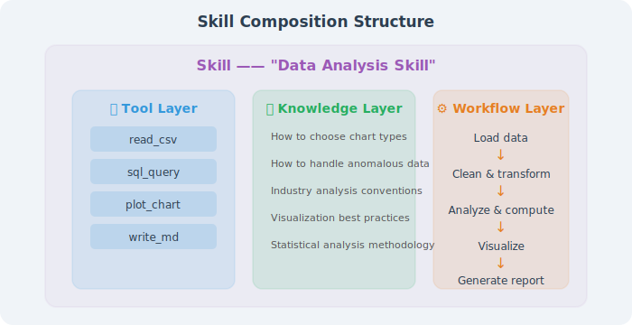
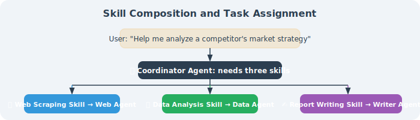
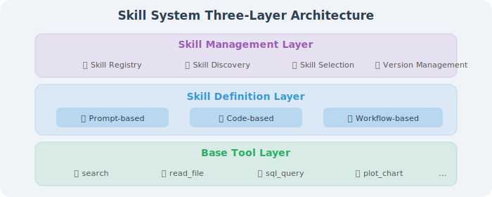
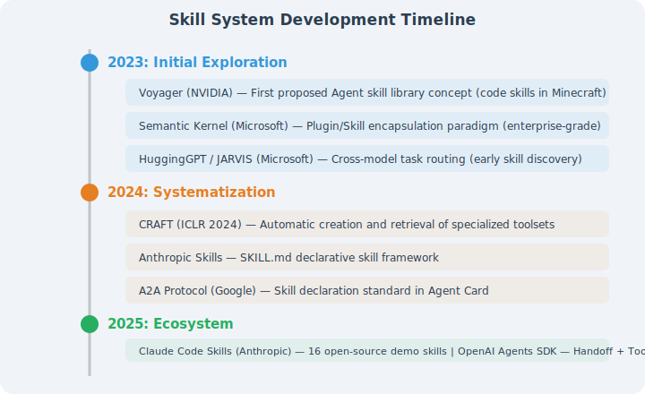

# Skill System Overview

## Skill vs Tool: A Key Distinction

In Chapter 4, we learned how to make Agents call tools — searching the web, executing code, reading and writing files. These tools are like a craftsman's hammer, saw, and ruler. But what makes an excellent craftsman able to create beautiful furniture is not just having tools, but having **woodworking skills** — knowing when to use which tool, in what order to operate, and how to handle problems when they arise.



Let's use a concrete example to feel this difference:

```python
# ❌ Tools only, no skills — Agent needs step-by-step guidance
user: "Help me analyze the sales data in this CSV file"
agent: "Sure, I can use the read_csv tool to read the file."
       # After reading, just displays raw data
       # Doesn't know what analysis to do
       # Doesn't know how to handle missing values
       # Doesn't know what charts to use

# ✅ Tools + Skills — Agent works like a data analyst
user: "Help me analyze the sales data in this CSV file"
agent: # Automatically executes complete analysis workflow:
       # 1. Read CSV and check data quality
       # 2. Handle missing values and outliers
       # 3. Calculate key metrics (total sales, growth rate, top products)
       # 4. Choose appropriate charts (line chart for trends, pie chart for proportions)
       # 5. Generate structured analysis report
```

## Three Core Characteristics of Skills

### Characteristic 1: Skills Are Reusable

Tool calls are "one-time" — each time you need to tell the Agent what to do. Skills are "learn once, use repeatedly":

```python
# Tool calling: detailed guidance needed every time
messages = [
    {"role": "system", "content": """You need to do the following:
    1. First use read_csv to read the file
    2. Check for null values, fill with median
    3. Calculate mean and standard deviation for each column
    4. Use plot_chart to generate a line chart
    5. Use write_report to generate a Markdown report
    ...(detailed 20-line instructions)"""},
]

# Skill invocation: simple one sentence
messages = [
    {"role": "system", "content": "You have data analysis skills."},
    {"role": "user", "content": "Analyze the sales trends in sales.csv"},
]
# Agent automatically executes the complete analysis workflow
```

### Characteristic 2: Skills Contain Domain Knowledge

Tools themselves are "general" and don't contain business knowledge. Skills encode domain knowledge:

```python
# Tools only know "how to do it"
def execute_sql(query: str) -> str:
    """Execute SQL query"""
    return db.execute(query)

# Skills also know "what to do" and "why"
DATA_ANALYSIS_SKILL = """
You are a professional data analyst. When analyzing data:

Data Quality Checks:
- Columns with more than 30% missing values should be considered for deletion
- Detect numerical outliers using the IQR method (1.5× interquartile range)
- Check date columns for continuity

Analysis Method Selection:
- Time series data → trend analysis + seasonal decomposition
- Categorical data → frequency distribution + cross-tabulation
- Numerical data → descriptive statistics + correlation analysis

Visualization Best Practices:
- Trends → line charts
- Comparisons → bar charts
- Proportions → pie/donut charts
- Distributions → histograms/box plots
- Relationships → scatter plots
"""
```

### Characteristic 3: Skills Can Be Discovered and Combined

In multi-Agent systems, each Agent has different skills. When an Agent receives a complex task, it can discover and invoke other Agents' skills:



## Three-Layer Skill Architecture

We divide the skill system into three levels:



### Layer 1: Basic Tool Layer

This is the content already introduced in Chapter 4 — individual callable tool functions.

### Layer 2: Skill Definition Layer

Encapsulates tools, knowledge, and processes into reusable skill units. There are three main encapsulation methods:

| Encapsulation Method | Principle | Representative | Applicable Scenarios |
|---------------------|-----------|----------------|---------------------|
| **Prompt-based** | Inject domain knowledge and behavioral guidelines via carefully designed system prompts | Anthropic Skills, Claude Code | Knowledge-intensive tasks |
| **Code-based** | Implement skills as executable code modules | Voyager skill library, Semantic Kernel Plugin | Tasks requiring precise control |
| **Workflow-based** | Orchestrate skills as state graphs or workflows | LangGraph Subgraph, CrewAI Task | Multi-step process tasks |

### Layer 3: Skill Management Layer

Manages skill registration, discovery, selection, and version control. This is especially important in multi-Agent systems — each Agent needs to declare what skills it has, and other Agents need to be able to discover and invoke those skills.

## The Development Trajectory of Skill Systems



## Section Summary

| Concept | Tool | Skill |
|---------|------|-------|
| **Granularity** | Single operation | Complete solution for a class of problems |
| **Contains** | Function + parameter description | Tools + knowledge + process + experience |
| **Reusability** | General (usable in any scenario) | Domain-specific (specific types of tasks) |
| **Analogy** | Hammer, saw | Woodworking skill, data analysis skill |
| **Definition method** | Function definition + JSON Schema | Prompt / code / workflow |

> 💡 **Core Insight**: **Tools are components of Skills**. A skill typically contains combined use of multiple tools, specialized domain knowledge, standardized processing workflows, and best practices accumulated from experience. As Agent application scenarios become increasingly complex, skill systems are becoming an indispensable layer in Agent architecture.

---

*Next section: [10.2 Skill Definition and Encapsulation](./02_skill_definition.md)*