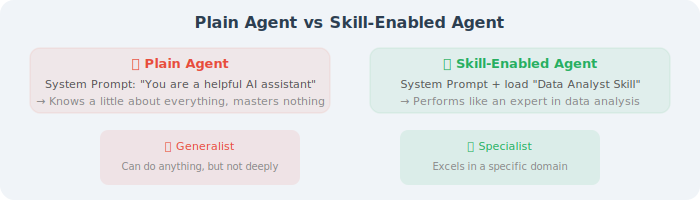
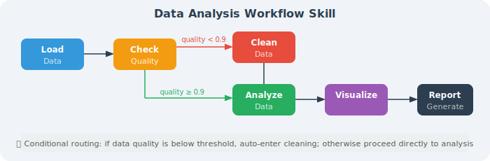
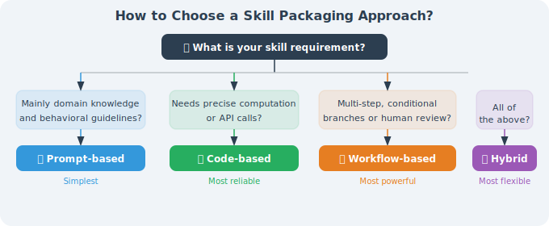

# Skill Definition and Encapsulation

In the previous section, we understood the concept of skills. This section dives deep into three mainstream skill encapsulation methods, from simplest to most complex, each with its applicable scenarios.

## Method 1: Prompt-based Skill

This is the simplest and most popular skill encapsulation method — **injecting domain knowledge and behavioral guidelines into the Agent using structured Prompts**.

### Basic Principle



### Anthropic Skills Framework

In 2025, Anthropic open-sourced the [Agent Skills](https://github.com/anthropics/skills) framework, defining skills using `SKILL.md` files. This is currently the most concise and elegant prompt-based skill solution.

A Skill's directory structure:

```
my-skill/
├── SKILL.md          # Skill definition file (core)
├── examples/         # Example files (optional)
│   ├── example1.md
│   └── example2.md
└── templates/        # Template files (optional)
    └── report.md
```

Structure of `SKILL.md`:

```markdown
---
name: data-analyst
description: Professional data analysis skill that automatically completes data cleaning, analysis, and visualization
---

# Data Analyst Skill

## Your Role
You are a professional data analyst. When users provide data or make analysis requests,
you automatically execute the complete analysis workflow.

## Workflow
1. **Data Understanding**: Check data structure, types, missing values
2. **Data Cleaning**: Handle outliers and missing data
3. **Exploratory Analysis**: Calculate descriptive statistics, discover data patterns
4. **Visualization**: Choose appropriate chart types
5. **Insight Summary**: Provide actionable business recommendations

## Key Rules
- For columns with more than 30% missing values, prioritize deletion over imputation
- Detect numerical outliers using the IQR method (1.5× interquartile range)
- Always provide a data quality report at the beginning of the analysis
- Every visualization must have a clear title and description

## Visualization Selection Guide
| Data Type | Analysis Goal | Recommended Chart |
|-----------|--------------|-------------------|
| Time series | Trend | Line chart |
| Categorical | Comparison | Bar chart |
| Numerical | Distribution | Histogram/Box plot |
| Two numerical | Relationship | Scatter plot |
| Proportions | Composition | Pie/Donut chart |
```

### Hierarchical Mechanism of Prompt-based Skills

Skills can be nested and combined to form a hierarchical structure:

```
project-level-skills/
├── SKILL.md                    # Project-level skill
├── code-review/
│   └── SKILL.md                # Code review sub-skill
├── data-analysis/
│   ├── SKILL.md                # Data analysis sub-skill
│   └── visualization/
│       └── SKILL.md            # Visualization sub-skill (finer granularity)
└── report-writing/
    └── SKILL.md                # Report writing sub-skill
```

### Progressive Disclosure

Good skill design should follow the **progressive disclosure** principle — not stuffing all knowledge into the context at once, but loading on demand:

```python
class SkillManager:
    """Progressive skill loading manager"""
    
    def __init__(self):
        self.skills = {}
        self.loaded_skills = set()
    
    def register_skill(self, name: str, skill_path: str):
        """Register a skill (without immediately loading content)"""
        self.skills[name] = {
            "path": skill_path,
            "summary": self._extract_summary(skill_path),  # Only load summary
        }
    
    def get_skill_summaries(self) -> str:
        """Return brief summaries of all skills (for LLM decision-making)"""
        summaries = []
        for name, skill in self.skills.items():
            summaries.append(f"- {name}: {skill['summary']}")
        return "\n".join(summaries)
    
    def load_skill(self, name: str) -> str:
        """Load full skill content on demand"""
        if name not in self.skills:
            raise ValueError(f"Unknown skill: {name}")
        
        skill_path = self.skills[name]["path"]
        with open(skill_path, "r") as f:
            content = f.read()
        
        self.loaded_skills.add(name)
        return content
    
    def build_system_prompt(self, base_prompt: str, task: str) -> str:
        """Dynamically build system prompt based on task"""
        # Step 1: Let LLM see summaries of all skills
        prompt = f"""{base_prompt}

You have the following skills:
{self.get_skill_summaries()}

Current task: {task}

Please first determine which skills are needed, then I will load the detailed skill guides.
"""
        return prompt
```

### Pros and Cons of Prompt-based Skills

| Pros | Cons |
|------|------|
| Zero code, pure text definition | Limited by context window length |
| Cross-model universal (GPT, Claude, open-source models) | Complex logic is difficult to precisely control |
| Easy version management (Git) | Model may not fully follow guidelines |
| Fast iteration | High token cost when loading many skills |

---

## Method 2: Code-based Skill

Code-based skills implement skills as **executable code modules** — instead of telling the Agent what to do through Prompts, directly provide runnable code.

### Basic Principle

```python
# Code-based skill: encapsulate analysis workflow as executable code
class DataAnalysisSkill:
    """Data analysis skill"""
    
    def __init__(self):
        self.name = "data_analysis"
        self.description = "Automated data analysis: cleaning, statistics, visualization, report generation"
    
    def analyze(self, file_path: str, analysis_type: str = "auto") -> dict:
        """Execute complete data analysis workflow"""
        # 1. Load data
        df = self._load_data(file_path)
        
        # 2. Data quality check
        quality_report = self._check_quality(df)
        
        # 3. Auto analysis
        if analysis_type == "auto":
            analysis_type = self._detect_analysis_type(df)
        
        results = self._run_analysis(df, analysis_type)
        
        # 4. Generate visualizations
        charts = self._create_visualizations(df, results)
        
        # 5. Generate report
        report = self._generate_report(quality_report, results, charts)
        
        return {
            "quality_report": quality_report,
            "analysis_results": results,
            "charts": charts,
            "report": report
        }
    
    def _check_quality(self, df) -> dict:
        """Data quality check"""
        return {
            "total_rows": len(df),
            "missing_values": df.isnull().sum().to_dict(),
            "duplicates": df.duplicated().sum(),
            "dtypes": df.dtypes.to_dict()
        }
    
    def _detect_analysis_type(self, df) -> str:
        """Auto-detect analysis type"""
        has_date = any(df[col].dtype == 'datetime64[ns]' for col in df.columns)
        numeric_cols = df.select_dtypes(include=['number']).columns
        
        if has_date and len(numeric_cols) > 0:
            return "time_series"
        elif len(numeric_cols) >= 2:
            return "correlation"
        else:
            return "descriptive"
    
    # ... more internal methods
```

### Voyager's Code Skill Library

Voyager (2023, NVIDIA) is a classic example of code-based skills. In the Minecraft game, it lets Agents save learned behaviors as JavaScript code skills:

```javascript
// Voyager auto-generated skill example
// Skill name: mineWoodLog
// Description: Mine wood logs and collect lumber
async function mineWoodLog(bot) {
  // Find the nearest tree
  const woodBlock = bot.findBlock({
    matching: block => block.name.includes('log'),
    maxDistance: 32
  });
  
  if (!woodBlock) {
    bot.chat("No trees found nearby");
    return false;
  }
  
  // Walk to the tree
  await bot.pathfinder.goto(woodBlock.position);
  
  // Mine the wood
  await bot.dig(woodBlock);
  
  bot.chat("Successfully obtained wood!");
  return true;
}
```

Skill library management:

```python
# Core logic of Voyager skill library (simplified)
class SkillLibrary:
    """Voyager-style code skill library"""
    
    def __init__(self, embedding_model):
        self.skills = {}           # skill name → skill code
        self.descriptions = {}     # skill name → skill description
        self.embeddings = {}       # skill name → description vector embedding
        self.embedding_model = embedding_model
    
    def add_skill(self, name: str, code: str, description: str):
        """Add a new skill to the library"""
        self.skills[name] = code
        self.descriptions[name] = description
        self.embeddings[name] = self.embedding_model.embed(description)
        print(f"✅ New skill added: {name}")
    
    def retrieve_skills(self, task: str, top_k: int = 5) -> list:
        """Retrieve most relevant skills based on task description"""
        task_embedding = self.embedding_model.embed(task)
        
        # Calculate similarity with all skills
        similarities = {}
        for name, emb in self.embeddings.items():
            similarities[name] = cosine_similarity(task_embedding, emb)
        
        # Return top_k most relevant skills
        sorted_skills = sorted(similarities.items(), 
                              key=lambda x: x[1], reverse=True)
        
        return [
            {"name": name, "code": self.skills[name], 
             "description": self.descriptions[name]}
            for name, _ in sorted_skills[:top_k]
        ]
```

### Semantic Kernel's Plugin Pattern

Microsoft's Semantic Kernel has treated "skills" (later renamed Plugins) as a core concept from the start:

```python
# Semantic Kernel Plugin example
from semantic_kernel import Kernel
from semantic_kernel.functions import kernel_function

class WeatherPlugin:
    """Weather query skill"""
    
    @kernel_function(
        name="get_weather",
        description="Get current weather information for a specified city"
    )
    def get_weather(self, city: str) -> str:
        # Call weather API
        weather = call_weather_api(city)
        return f"Current weather in {city}: {weather['condition']}, " \
               f"temperature {weather['temp']}°C"
    
    @kernel_function(
        name="get_forecast",
        description="Get weather forecast for a specified city for the next few days"
    )
    def get_forecast(self, city: str, days: int = 3) -> str:
        forecast = call_forecast_api(city, days)
        return format_forecast(forecast)

# Register to Kernel
kernel = Kernel()
kernel.add_plugin(WeatherPlugin(), plugin_name="weather")
```

### Pros and Cons of Code-based Skills

| Pros | Cons |
|------|------|
| Precise and reliable execution | Requires coding ability |
| Testable and debuggable | Cross-platform adaptation is complex |
| Good performance (no LLM token consumption) | Less flexible than Prompt-based |
| Can handle complex business logic | Higher update and maintenance cost |

---

## Method 3: Workflow-based Skill

Workflow-based skills orchestrate skills as **stateful processing flows** — defining nodes (steps) and edges (transition conditions) to form a complete workflow.

### Basic Principle

```python
# Define workflow-based skill using LangGraph
from langgraph.graph import StateGraph, END
from typing import TypedDict, Annotated

class AnalysisState(TypedDict):
    """State of the analysis workflow"""
    file_path: str
    raw_data: dict
    clean_data: dict
    analysis_results: dict
    charts: list
    report: str
    quality_score: float

def load_data(state: AnalysisState) -> AnalysisState:
    """Step 1: Load data"""
    df = pd.read_csv(state["file_path"])
    return {"raw_data": df.to_dict()}

def check_quality(state: AnalysisState) -> AnalysisState:
    """Step 2: Check data quality"""
    df = pd.DataFrame(state["raw_data"])
    missing_ratio = df.isnull().sum().sum() / df.size
    quality_score = 1 - missing_ratio
    return {"quality_score": quality_score}

def should_clean(state: AnalysisState) -> str:
    """Conditional routing: does data need cleaning?"""
    if state["quality_score"] < 0.9:
        return "clean"      # Quality insufficient → needs cleaning
    else:
        return "analyze"     # Quality sufficient → analyze directly

def clean_data(state: AnalysisState) -> AnalysisState:
    """Step 3a: Data cleaning"""
    df = pd.DataFrame(state["raw_data"])
    df = df.fillna(df.median(numeric_only=True))
    df = df.drop_duplicates()
    return {"clean_data": df.to_dict()}

def analyze(state: AnalysisState) -> AnalysisState:
    """Step 3b/4: Data analysis"""
    data = state.get("clean_data") or state["raw_data"]
    df = pd.DataFrame(data)
    results = {
        "mean": df.mean(numeric_only=True).to_dict(),
        "std": df.std(numeric_only=True).to_dict(),
        "correlation": df.corr(numeric_only=True).to_dict()
    }
    return {"analysis_results": results}

def visualize(state: AnalysisState) -> AnalysisState:
    """Step 5: Generate visualizations"""
    # Generate charts
    return {"charts": ["trend.png", "distribution.png"]}

def generate_report(state: AnalysisState) -> AnalysisState:
    """Step 6: Generate report"""
    report = format_report(state["analysis_results"], state["charts"])
    return {"report": report}

# Build workflow
workflow = StateGraph(AnalysisState)

# Add nodes
workflow.add_node("load", load_data)
workflow.add_node("check", check_quality)
workflow.add_node("clean", clean_data)
workflow.add_node("analyze", analyze)
workflow.add_node("visualize", visualize)
workflow.add_node("report", generate_report)

# Add edges
workflow.set_entry_point("load")
workflow.add_edge("load", "check")
workflow.add_conditional_edges("check", should_clean, {
    "clean": "clean",
    "analyze": "analyze"
})
workflow.add_edge("clean", "analyze")
workflow.add_edge("analyze", "visualize")
workflow.add_edge("visualize", "report")
workflow.add_edge("report", END)

# Compile into executable skill
data_analysis_skill = workflow.compile()

# Use the skill
result = data_analysis_skill.invoke({
    "file_path": "sales.csv"
})
print(result["report"])
```

### Visualization of Workflow-based Skills



### Pros and Cons of Workflow-based Skills

| Pros | Cons |
|------|------|
| Visualizable workflow, clear logic | Higher architectural complexity |
| Supports conditional branching and loops | Requires learning workflow frameworks |
| Can include human-in-the-loop nodes | Harder to debug than pure code |
| Naturally supports state management and error recovery | May be over-engineered for simple tasks |

---

## Comparison and Selection of Three Methods

| Dimension | Prompt-based | Code-based | Workflow-based |
|-----------|-------------|------------|---------------|
| **Definition method** | Markdown / text | Python / JS code | State graph / DAG |
| **Complexity** | Low | Medium | High |
| **Precision** | Medium (depends on LLM understanding) | High | High |
| **Flexibility** | High (natural language) | Medium | Medium |
| **Testability** | Low | High | High |
| **Applicable scenarios** | Knowledge-intensive, creative | Precise computation, API integration | Multi-step processes, approval needed |
| **Representative framework** | Anthropic Skills | Semantic Kernel | LangGraph |
| **Token cost** | High (occupies context) | Low | Low |

### Selection Recommendations



### Hybrid Usage Example

In real projects, all three methods are often used together:

```python
# Hybrid skill: Prompt + Code + Workflow
class HybridDataAnalystSkill:
    
    # Prompt-based: inject analysis methodology
    SYSTEM_PROMPT = """
    You are a senior data analyst.
    Analysis principle: first check data quality, then do exploratory analysis, finally give recommendations.
    """
    
    # Code-based: precise data processing
    def clean_data(self, df):
        """Code ensures precision of data cleaning"""
        df = df.dropna(thresh=len(df) * 0.7, axis=1)
        for col in df.select_dtypes(include=['number']):
            q1, q3 = df[col].quantile([0.25, 0.75])
            iqr = q3 - q1
            df = df[(df[col] >= q1 - 1.5 * iqr) & 
                     (df[col] <= q3 + 1.5 * iqr)]
        return df
    
    # Workflow-based: multi-step process orchestration
    def build_workflow(self):
        """State graph ensures process controllability"""
        graph = StateGraph(AnalysisState)
        graph.add_node("load", self.load_data)
        graph.add_node("quality_check", self.check_quality)
        graph.add_node("clean", self.clean_data)
        graph.add_node("llm_analyze", self.llm_analyze)  # LLM + Prompt
        graph.add_node("code_visualize", self.visualize)  # Code generates charts
        # ... orchestration
        return graph.compile()
```

## Section Summary

- **Prompt-based Skills** are best for knowledge-intensive tasks — quickly define domain knowledge and behavioral guidelines using Markdown files
- **Code-based Skills** are best for tasks requiring precise control — implement reliable skill logic with executable code
- **Workflow-based Skills** are best for complex multi-step processes — orchestrate workflows with conditional branching using state graphs
- **Mixing all three methods** is best practice in real projects

> 💡 **Practical Advice**: Beginners are recommended to start with Prompt-based Skills — define your first skill using a `SKILL.md` file. When more precise control is needed, gradually introduce Code-based and Workflow-based skills.

---

*Next section: [10.3 Skill Learning and Acquisition](./03_skill_learning.md)*
