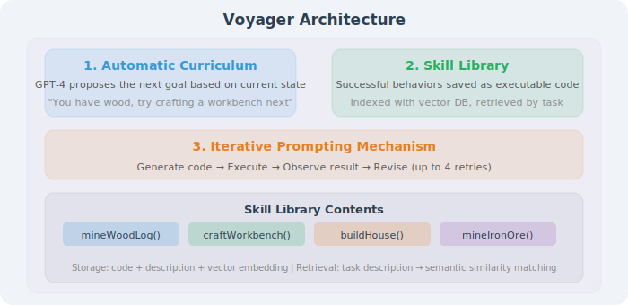
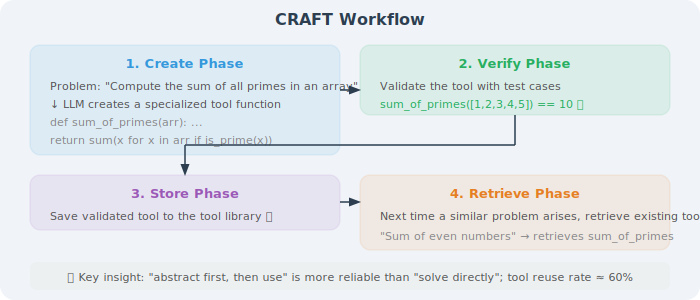
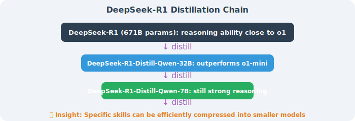

# Skill Learning and Acquisition

The previous section introduced how to **manually define** skills. But the more exciting question is: **Can Agents autonomously learn new skills?**

This section explores three paradigms for Agent skill learning: learning from experience, creating from tools, and acquiring through distillation.

## Paradigm 1: Learning from Experience — The Voyager Pattern

### Core Idea

Voyager (NVIDIA, 2023) is a milestone work in autonomous Agent skill learning. It demonstrates an amazing capability cycle in the Minecraft game:

```
Explore → Try → Succeed → Save as skill → Reuse skill → Explore more complex tasks
```

Just like a human learning to ride a bicycle — fall a few times, master balance, and it becomes "muscle memory" (a skill), which can then be executed automatically without relearning each time.

### Voyager's Three Core Components



### Complete Skill Learning Workflow

```python
# Voyager skill learning workflow (simplified Python pseudocode)

class VoyagerAgent:
    def __init__(self):
        self.skill_library = SkillLibrary()
        self.curriculum = AutoCurriculum()
        self.code_generator = CodeGenerator()  # GPT-4
        self.critic = TaskCritic()  # GPT-4
    
    def learning_loop(self):
        """Core learning loop"""
        while True:
            # 1. Curriculum system proposes next task
            task = self.curriculum.propose_next_task(
                completed_tasks=self.completed_tasks,
                current_state=self.get_env_state()
            )
            print(f"📋 New task: {task}")
            
            # 2. Retrieve relevant skills from skill library
            relevant_skills = self.skill_library.retrieve(task, top_k=5)
            print(f"📚 Found {len(relevant_skills)} relevant skills")
            
            # 3. Generate code (combining existing skills)
            success = False
            for attempt in range(4):  # Maximum 4 attempts
                code = self.code_generator.generate(
                    task=task,
                    relevant_skills=relevant_skills,
                    env_state=self.get_env_state(),
                    previous_errors=self.errors if attempt > 0 else None
                )
                
                # 4. Execute code
                result = self.execute(code)
                
                # 5. Self-verification
                success, critique = self.critic.check(
                    task=task,
                    result=result,
                    env_state=self.get_env_state()
                )
                
                if success:
                    break
                else:
                    self.errors = critique
                    print(f"  ❌ Attempt {attempt + 1} failed: {critique}")
            
            # 6. If successful, save as new skill
            if success:
                skill_name = self.extract_skill_name(task)
                description = self.generate_description(task, code)
                self.skill_library.add(skill_name, code, description)
                self.curriculum.mark_completed(task)
                print(f"  ✅ New skill acquired: {skill_name}")
            else:
                print(f"  ⚠️ Task failed, skipping")
```

### Key Insights from Voyager

1. **Skills are composable**: simple skills combine into complex skills
   ```
   "Mine wood" + "Craft planks" + "Craft workbench" 
     → "Build basic infrastructure" (composite skill)
   ```

2. **Skills are transferable**: reused in different scenarios
   ```
   "Mine wood" skill can transfer to "Mine stone" (similar operation pattern)
   ```

3. **Skill library grows continuously**: new skills build on old skills
   ```
   Hour 1:  10 basic skills
   Hour 5:  50+ skills (including composite skills)
   Hour 20: 100+ skills (covering most game behaviors)
   ```

### From Voyager to General Agents

Voyager's ideas can be generalized to general Agent development:

```python
# Skill learning system for general Agents
class LearningAgent:
    """General Agent that can learn skills from experience"""
    
    def __init__(self):
        self.skill_library = SkillLibrary()
    
    def execute_task(self, task: str):
        """Execute task and extract skills from successful experiences"""
        
        # Retrieve existing skills
        skills = self.skill_library.retrieve(task)
        
        # Use LLM + existing skills to complete task
        result = self.llm_execute(task, skills)
        
        # If task succeeds, evaluate whether worth saving as new skill
        if result.success and self._is_reusable(task, result):
            self._save_as_skill(task, result)
    
    def _is_reusable(self, task: str, result) -> bool:
        """Determine if experience is worth saving as a skill"""
        # Conditions:
        # 1. Task completed successfully
        # 2. Solution contains multiple steps (not a simple single-step operation)
        # 3. Similar tasks may occur again
        # 4. No highly similar skill in the skill library
        return (result.success 
                and result.steps > 2 
                and not self.skill_library.has_similar(task))
    
    def _save_as_skill(self, task: str, result):
        """Save successful experience as a skill"""
        skill = {
            "name": self._generate_skill_name(task),
            "description": self._generate_description(task, result),
            "procedure": result.steps,  # Execution steps
            "tools_used": result.tools,  # Tools used
            "preconditions": self._extract_preconditions(task),
            "success_criteria": self._extract_criteria(task, result)
        }
        self.skill_library.add(skill)
```

---

## Paradigm 2: Creating from Tools — The CRAFT Pattern

### Core Idea

CRAFT (ICLR 2024) proposes a different approach from Voyager: **not only using existing tools, but also creating new tools**.

```
Traditional approach:
  Problem → Solve with existing tools → Get stuck if no suitable tool

CRAFT approach:
  Problem → First create specialized tools for this type of problem → Solve with new tools
  If similar problem encountered next time → Directly retrieve already-created tools
```

### CRAFT's Workflow



```
1. Create Phase
   Problem: "Calculate the sum of all prime numbers in a given array"
     ↓
   LLM creates specialized tool function:
   def sum_of_primes(arr):
       def is_prime(n):
           if n < 2: return False
           for i in range(2, int(n**0.5)+1):
               if n % i == 0: return False
           return True
       return sum(x for x in arr if is_prime(x))
   
2. Verify Phase
   Verify tool correctness with test cases
   sum_of_primes([1,2,3,4,5]) == 10  ✅
   
3. Store Phase
   Save verified tool to tool library
   
4. Retrieve Phase
   Next time a similar problem is encountered, retrieve existing tools
   "Calculate sum of all even numbers in array" → retrieves sum_of_primes
   → Reference its structure to create sum_of_evens
```

### CRAFT Python Implementation

```python
class CRAFTSystem:
    """CRAFT: Create and Retrieve Adaptive Function Tools"""
    
    def __init__(self, llm):
        self.llm = llm
        self.tool_library = {}  # tool name → (code, description, tests)
        self.embeddings = {}
    
    def solve(self, problem: str) -> str:
        """Solve problem: first retrieve/create tools, then use tools to solve"""
        
        # 1. Retrieve existing tools
        relevant_tools = self._retrieve_tools(problem)
        
        if relevant_tools:
            # Solve with existing tools
            return self._solve_with_tools(problem, relevant_tools)
        
        # 2. No suitable tools → create new tool
        new_tool = self._create_tool(problem)
        
        # 3. Verify new tool
        if self._verify_tool(new_tool):
            self._store_tool(new_tool)
            return self._solve_with_tools(problem, [new_tool])
        else:
            # Tool verification failed, fall back to direct solving
            return self._direct_solve(problem)
    
    def _create_tool(self, problem: str) -> dict:
        """Let LLM create a specialized tool"""
        prompt = f"""Analyze the following problem and create a reusable Python tool function to solve this type of problem.

Problem: {problem}

Requirements:
1. The function should be generalized to solve this class of problems (not just this specific instance)
2. Provide a clear function signature and docstring
3. Provide at least 3 test cases

Please return:
- function_name: function name
- code: complete Python code
- description: functionality description
- test_cases: list of test cases
"""
        result = self.llm.generate(prompt)
        return parse_tool_response(result)
    
    def _verify_tool(self, tool: dict) -> bool:
        """Verify tool with test cases"""
        try:
            exec(tool["code"])
            func = eval(tool["function_name"])
            for test in tool["test_cases"]:
                assert func(*test["input"]) == test["expected"]
            return True
        except Exception as e:
            print(f"Tool verification failed: {e}")
            return False
```

### CRAFT vs Voyager

| Dimension | Voyager | CRAFT |
|-----------|---------|-------|
| **Learning scenario** | Embodied environment (Minecraft) | General problem solving |
| **Skill type** | Action sequences (behavioral skills) | Tool functions (computational skills) |
| **Learning signal** | Environment feedback (success/failure) | Test case verification |
| **Combination method** | Sequential composition | Function call composition |
| **Key innovation** | Auto curriculum + skill library | Create + retrieve + verify |

---

## Paradigm 3: Skill Distillation — From Large to Small Models

### Core Idea

Large models (like GPT-4, Claude) naturally have rich "implicit skills," but deployment costs are high. **Skill distillation** transfers large model skills to smaller, more efficient models:

```
Skill distillation process:
  1. Have large model (GPT-4) execute many tasks
  2. Record the "thinking process" and "action sequences" of each execution
  3. Fine-tune small model (e.g., Qwen-7B) with this data
  4. Small model acquires skills in specific domains
  
Analogy:
  Large model = experienced master craftsman
  Execution records = video recordings of master's operations
  Fine-tuning training = apprentice watching recordings to learn
  Small model = apprentice who has learned specific crafts
```

### Practical Application

```python
# Data collection process for skill distillation
def collect_skill_demonstrations(
    teacher_model,  # GPT-4
    tasks: list,
    skill_name: str
):
    """Collect skill demonstration data from large model"""
    demonstrations = []
    
    for task in tasks:
        # Have large model execute task, record complete reasoning and actions
        result = teacher_model.execute(
            task=task,
            return_reasoning=True,  # Return thinking process
            return_actions=True     # Return action sequence
        )
        
        if result.success:
            demonstrations.append({
                "task": task,
                "reasoning": result.reasoning,
                "actions": result.actions,
                "output": result.output,
                "skill": skill_name
            })
    
    return demonstrations

# Fine-tune small model with collected data
def distill_skill(
    student_model,  # Qwen-7B
    demonstrations: list
):
    """Distill skill into small model"""
    training_data = []
    for demo in demonstrations:
        training_data.append({
            "messages": [
                {"role": "system", "content": f"You are an Agent with {demo['skill']} skills."},
                {"role": "user", "content": demo["task"]},
                {"role": "assistant", "content": f"<think>{demo['reasoning']}</think>\n{demo['output']}"}
            ]
        })
    
    # Fine-tune small model
    student_model.fine_tune(training_data)
```

### Insights from DeepSeek-R1 Distillation

DeepSeek-R1's (2025) distillation experiments proved the enormous potential of skill distillation:



---

## Skill Evolution: From Simple to Complex

Regardless of the learning paradigm, skills follow an evolutionary path from simple to complex:

```
Level 1: Atomic Skills
  Single tool calls or simple operations
  Examples: read file, send HTTP request, format text

Level 2: Composite Skills
  Sequential combination of multiple atomic skills
  Example: data loading → cleaning → analysis (3 atomic skills combined)

Level 3: Strategic Skills
  Complex skills with conditional logic and branching
  Example: automatically select analysis method based on data type

Level 4: Meta Skills
  Advanced skills that manage and combine other skills
  Example: auto-decompose task → select appropriate skills → orchestrate execution order

Level 5: Self-Evolving Skills
  Skills that can self-improve and create new skills
  Example: Voyager's learning loop, CRAFT's tool creation
```

## Section Summary

| Learning Paradigm | Representative | Core Mechanism | Applicable Scenarios |
|------------------|---------------|----------------|---------------------|
| **Experience learning** | Voyager | Try → Succeed → Save | Exploratory tasks, embodied intelligence |
| **Tool creation** | CRAFT | Analyze → Create → Verify → Store | Problem solving, algorithmic tasks |
| **Skill distillation** | DeepSeek-R1 | Large model demonstration → Data collection → Fine-tuning | Cost optimization, edge deployment |

> 💡 **Core Insight**: The ultimate goal of Agent skill learning is **Lifelong Learning** — Agents continuously accumulate new skills through ongoing interaction with the environment, with the skill library growing continuously. Voyager demonstrates this possibility: starting from scratch, through hours of autonomous exploration, learning 100+ skills. Future Agents will learn and grow on the job, just like humans.

---

*Next section: [10.4 Skill Discovery and Registration](./04_skill_discovery.md)*
