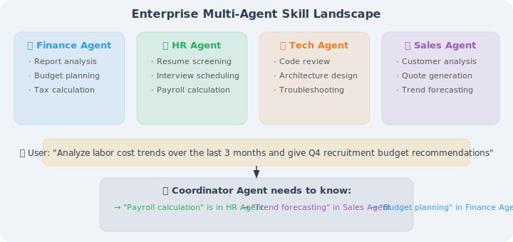
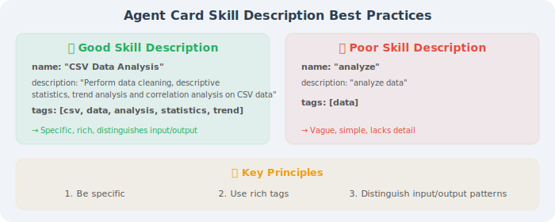
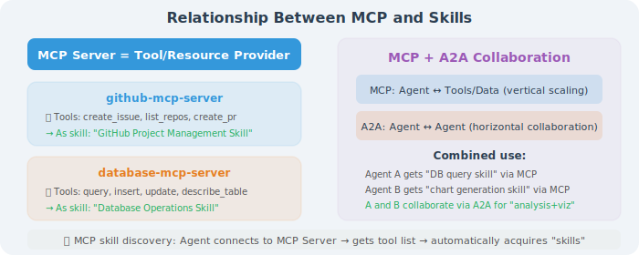

# Skill Discovery and Registration

In the previous sections, we learned how to define and learn skills. But in multi-Agent systems, there's another key problem to solve: **How does an Agent know what skills other Agents have? How does it find and invoke the right skills?**

This is the problem that skill discovery and registration mechanisms solve.

## Why Is Skill Discovery Needed?



Without a skill discovery mechanism, the coordinating Agent doesn't know who to find or what capabilities they have.

## Method 1: Agent Card — Static Skill Declaration

### Skill Declaration in the A2A Protocol

In Google's A2A (Agent-to-Agent) protocol, each Agent declares its skills through an **Agent Card**:

```json
{
  "name": "Data Analysis Agent",
  "description": "Professional data analysis and visualization service",
  "url": "https://data-agent.example.com",
  "version": "2.0",
  "skills": [
    {
      "id": "csv-analysis",
      "name": "CSV Data Analysis",
      "description": "Data cleaning, statistical analysis, and trend identification for CSV files",
      "input_modes": ["text", "file"],
      "output_modes": ["text", "file", "image"],
      "tags": ["data", "analysis", "csv", "statistics"]
    },
    {
      "id": "data-visualization",
      "name": "Data Visualization",
      "description": "Automatically select appropriate chart types based on data and generate visualizations",
      "input_modes": ["text", "file"],
      "output_modes": ["image", "file"],
      "tags": ["visualization", "chart", "plot"]
    },
    {
      "id": "report-generation",
      "name": "Analysis Report Generation",
      "description": "Generate structured Markdown or PDF reports based on analysis results",
      "input_modes": ["text"],
      "output_modes": ["text", "file"],
      "tags": ["report", "document", "summary"]
    }
  ],
  "authentication": {
    "type": "bearer_token"
  }
}
```

### Skill Discovery Workflow

```python
# A2A skill discovery workflow
class AgentRegistry:
    """Agent Registry"""
    
    def __init__(self):
        self.agents = {}  # agent_url → agent_card
    
    def register(self, agent_url: str):
        """Register Agent: fetch its Agent Card"""
        card = self._fetch_agent_card(agent_url)
        self.agents[agent_url] = card
        print(f"✅ Registration successful: {card['name']} "
              f"(skills: {[s['name'] for s in card['skills']]})")
    
    def discover_by_skill(self, skill_query: str) -> list:
        """Discover suitable Agents based on skill description"""
        results = []
        for url, card in self.agents.items():
            for skill in card["skills"]:
                # Match skill description or tags
                if (skill_query.lower() in skill["description"].lower() or
                    any(skill_query.lower() in tag for tag in skill["tags"])):
                    results.append({
                        "agent_name": card["name"],
                        "agent_url": url,
                        "skill": skill
                    })
        return results
    
    def _fetch_agent_card(self, url: str) -> dict:
        """Fetch Agent Card from Agent's well-known endpoint"""
        import requests
        response = requests.get(f"{url}/.well-known/agent.json")
        return response.json()

# Usage example
registry = AgentRegistry()
registry.register("https://data-agent.example.com")
registry.register("https://finance-agent.example.com")

# Discover Agents that can do "data analysis"
agents = registry.discover_by_skill("data analysis")
# → [{"agent_name": "Data Analysis Agent", "skill": {...}}]
```

### Best Practices for Agent Cards



```
✅ Good skill description:
  {
    "name": "CSV Data Analysis",
    "description": "Perform data cleaning (missing value handling, outlier detection),
                    descriptive statistics (mean, median, standard deviation),
                    trend analysis, and correlation analysis on CSV tabular data",
    "tags": ["csv", "data", "analysis", "statistics", "trend"]
  }

❌ Poor skill description:
  {
    "name": "Analysis",
    "description": "Analyze data",
    "tags": ["data"]
  }

Key principles:
  1. Be specific in description — explain input, processing, output
  2. Use rich tags — cover synonyms and related concepts
  3. Distinguish input/output modes — text, file, image, etc.
```

---

## Method 2: Semantic Retrieval — Dynamic Skill Discovery

Agent Cards are static and require skills to be predefined. **Semantic retrieval** enables more flexible dynamic discovery — searching the skill library for semantically matching skills based on task descriptions.

### Basic Principle

```
Static discovery (keyword matching):
  Query: "Analyze customer churn rate"
  Match: tags containing "analysis" → finds 3 Agents
  Problem: not precise enough, may return irrelevant "text analysis" Agents

Dynamic discovery (semantic retrieval):
  Query: "Analyze customer churn rate"
  Embed query vector → calculate similarity with all skill description vectors
  → Precisely matches "customer behavior analysis" skill (similarity 0.92)
  → Rather than "text sentiment analysis" skill (similarity 0.45)
```

### Implementation

```python
from sentence_transformers import SentenceTransformer
import numpy as np

class SemanticSkillDiscovery:
    """Skill discovery based on semantic retrieval"""
    
    def __init__(self):
        self.model = SentenceTransformer('all-MiniLM-L6-v2')
        self.skills = []
        self.embeddings = []
    
    def register_skill(self, skill: dict):
        """Register skill and compute embedding"""
        # Concatenate skill name, description, and tags
        text = f"{skill['name']}: {skill['description']}. " \
               f"Tags: {', '.join(skill.get('tags', []))}"
        embedding = self.model.encode(text)
        
        self.skills.append(skill)
        self.embeddings.append(embedding)
    
    def discover(self, task: str, top_k: int = 3) -> list:
        """Discover best-matching skills based on task description"""
        task_embedding = self.model.encode(task)
        
        # Calculate cosine similarity
        similarities = []
        for i, emb in enumerate(self.embeddings):
            sim = np.dot(task_embedding, emb) / (
                np.linalg.norm(task_embedding) * np.linalg.norm(emb)
            )
            similarities.append((i, sim))
        
        # Sort and return top_k
        similarities.sort(key=lambda x: x[1], reverse=True)
        
        results = []
        for idx, sim in similarities[:top_k]:
            results.append({
                "skill": self.skills[idx],
                "similarity": float(sim)
            })
        
        return results

# Usage example
discovery = SemanticSkillDiscovery()

# Register skills
discovery.register_skill({
    "name": "Customer Churn Analysis",
    "description": "Analyze customer behavior data, predict churn risk, provide retention strategies",
    "agent_url": "https://crm-agent.example.com",
    "tags": ["customer", "churn", "prediction", "retention"]
})

discovery.register_skill({
    "name": "Text Sentiment Analysis",
    "description": "Analyze the sentiment tendency of text: positive, negative, neutral",
    "agent_url": "https://nlp-agent.example.com",
    "tags": ["NLP", "sentiment", "text"]
})

# Discover skills
results = discovery.discover("I want to see which customers might be about to churn")
# → [{"skill": {"name": "Customer Churn Analysis", ...}, "similarity": 0.92}]
```

---

## Method 3: MCP and the Skill Ecosystem

Chapter 15 will cover the MCP protocol in detail. Here we first understand how MCP supports the skill ecosystem:



### MCP and A2A Collaboration

The collaborative relationship between MCP and A2A is shown in the diagram above: MCP handles vertical expansion between Agents and tools/data, while A2A handles horizontal collaboration between Agents. Together they implement a complete skill ecosystem.

---

## Skill Version Management

In production environments, skills need version management — new versions of skills may change behavior and require compatibility handling:

```python
class VersionedSkillRegistry:
    """Skill registry with version management support"""
    
    def __init__(self):
        self.skills = {}  # skill_name → {version → skill_definition}
    
    def register(self, name: str, version: str, definition: dict):
        """Register a specific version of a skill"""
        if name not in self.skills:
            self.skills[name] = {}
        self.skills[name][version] = definition
    
    def get_skill(self, name: str, version: str = "latest") -> dict:
        """Get skill (supports version specification)"""
        if name not in self.skills:
            raise ValueError(f"Skill not found: {name}")
        
        if version == "latest":
            versions = sorted(self.skills[name].keys())
            version = versions[-1]
        
        return self.skills[name][version]
    
    def list_versions(self, name: str) -> list:
        """List all versions of a skill"""
        return sorted(self.skills[name].keys())

# Usage
registry = VersionedSkillRegistry()
registry.register("data_analysis", "1.0", {
    "description": "Basic data analysis",
    "capabilities": ["descriptive_stats"]
})
registry.register("data_analysis", "2.0", {
    "description": "Advanced data analysis",
    "capabilities": ["descriptive_stats", "predictive_modeling", "anomaly_detection"]
})
```

---

## Skill Orchestration: From Discovery to Invocation

Putting it all together — a complete skill orchestration workflow:

```python
class SkillOrchestrator:
    """Skill orchestrator: discover → select → invoke → combine"""
    
    def __init__(self, discovery: SemanticSkillDiscovery, llm):
        self.discovery = discovery
        self.llm = llm
    
    def execute(self, task: str) -> dict:
        """Execute task: automatically discover and orchestrate skills"""
        
        # 1. Task decomposition
        subtasks = self._decompose_task(task)
        
        # 2. Discover skills for each subtask
        skill_plan = []
        for subtask in subtasks:
            candidates = self.discovery.discover(subtask, top_k=3)
            best_skill = self._select_best(subtask, candidates)
            skill_plan.append({
                "subtask": subtask,
                "skill": best_skill
            })
        
        # 3. Execute in sequence
        results = []
        for step in skill_plan:
            result = self._invoke_skill(
                step["skill"], 
                step["subtask"],
                context=results  # Pass results from previous steps
            )
            results.append(result)
        
        # 4. Integrate results
        return self._combine_results(task, results)
    
    def _decompose_task(self, task: str) -> list:
        """Use LLM to decompose task"""
        prompt = f"Decompose the following task into 2-5 subtasks:\n{task}"
        return self.llm.generate(prompt)
    
    def _select_best(self, subtask: str, candidates: list) -> dict:
        """Select the most suitable skill"""
        if not candidates:
            return None
        # Select the one with highest similarity
        return candidates[0]["skill"]
```

## Section Summary

| Discovery Method | Mechanism | Pros | Cons |
|-----------------|-----------|------|------|
| **Agent Card** | Static declaration | Standardized, reliable | Requires predefinition |
| **Semantic retrieval** | Vector similarity | Flexible, intelligent | Depends on embedding quality |
| **MCP ecosystem** | Protocol discovery | Tools as skills | Requires MCP Server |
| **Hybrid approach** | Combination of above | Most comprehensive | Higher complexity |

> 💡 **Industry Trend**: In 2025, skill discovery is being standardized. Google's A2A protocol defines the skill declaration format in Agent Cards, Anthropic's SKILL.md defines the skill description format, and the community project [add-skill](https://add-skill.org/) provides cross-platform skill installation tools. In the future, the Agent skill ecosystem may form a standardized discovery, installation, and sharing system similar to today's npm/pip package management.

---

*Next section: [10.5 Practice: Building a Reusable Skill System](./05_practice_skill_system.md)*