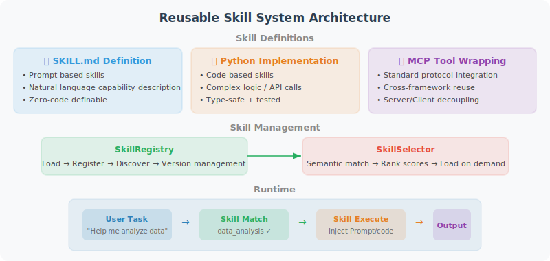

# Practice: Building a Reusable Skill System

This section puts the concepts learned earlier into practice — building a complete Agent skill system. This system supports skill definition, loading, discovery, and invocation.



## Project Goals

Build a **skill-driven Agent framework** with the following capabilities:

1. Define skills using SKILL.md files (Prompt-based)
2. Implement skills using Python code (Code-based)
3. Load and discover skills on demand
4. Automatically select appropriate skills based on user tasks

## Project Structure

```
skill_agent/
├── main.py                    # Main entry point
├── skill_manager.py           # Skill manager
├── agent.py                   # Agent core logic
├── skills/                    # Skills directory
│   ├── data_analyst/
│   │   ├── SKILL.md           # Data analysis skill definition
│   │   └── tools.py           # Associated tool code
│   ├── code_reviewer/
│   │   ├── SKILL.md           # Code review skill definition
│   │   └── tools.py
│   └── report_writer/
│       ├── SKILL.md           # Report writing skill definition
│       └── templates/
│           └── report.md      # Report template
└── requirements.txt
```

## Step 1: Define Skills

### Data Analyst Skill (SKILL.md)

```markdown
---
name: data-analyst
description: Professional data analysis: data cleaning, statistical analysis, visualization, report generation
version: "1.0"
tags: [data, analysis, csv, statistics, visualization]
tools: [read_csv, compute_stats, create_chart]
---

# Data Analyst Skill

## Role Definition
You are a professional data analyst. When users provide data files or make analysis requests,
you will automatically execute the complete analysis workflow.

## Workflow

### 1. Data Understanding (Must execute first)
- Use the read_csv tool to load data
- Report: number of rows, columns, data types, missing value ratio
- If missing values > 30%, alert the user about data quality issues

### 2. Data Cleaning
- Missing values in numerical columns: fill with median
- Missing values in text columns: mark as "Unknown"
- Outlier detection: IQR method (1.5× interquartile range)
- Remove completely duplicate rows

### 3. Analysis and Insights
- Descriptive statistics: mean, median, standard deviation, quartiles
- If there is a time column: trend analysis
- If there are categorical columns: grouped statistics
- If there are multiple numerical columns: correlation analysis

### 4. Visualization
Use the create_chart tool, selecting charts based on data characteristics:
| Scenario | Chart Type |
|----------|-----------|
| Time trend | Line chart |
| Category comparison | Bar chart |
| Distribution | Histogram |
| Proportions | Pie chart |
| Relationship | Scatter plot |

### 5. Report
- Use structured Markdown format
- Support each finding with data
- Provide 2-3 actionable recommendations at the end of the report
```

### Code Reviewer Skill (SKILL.md)

```markdown
---
name: code-reviewer
description: Professional code review: code quality, security vulnerabilities, performance optimization suggestions
version: "1.0"
tags: [code, review, security, quality, optimization]
tools: [read_file, analyze_code]
---

# Code Reviewer Skill

## Role Definition
You are a senior code reviewer with security awareness and performance optimization experience.

## Review Dimensions

### 1. Code Quality
- Naming conventions (variables, functions, classes)
- Function length (functions over 50 lines need splitting)
- Nesting depth (over 3 levels needs refactoring)
- Duplicate code detection

### 2. Security Review (High Priority)
- SQL injection risks
- Hardcoded keys or passwords
- Unvalidated user input
- Insecure deserialization

### 3. Performance Optimization
- Unnecessary loops or repeated calculations
- Memory leak risks
- Database query optimization
- Caching recommendations

## Output Format
Use the following format for review results:
- 🔴 Critical: security or correctness issues that must be fixed
- 🟡 Warning: quality issues recommended for improvement
- 🟢 Suggestion: optional optimization recommendations
- ✅ Strengths: good practices worth acknowledging
```

## Step 2: Implement the Skill Manager

```python
# skill_manager.py
import os
import yaml
import hashlib
from pathlib import Path
from openai import OpenAI


class Skill:
    """Skill data class"""
    
    def __init__(self, name, description, content, 
                 version="1.0", tags=None, tools=None, path=None):
        self.name = name
        self.description = description
        self.content = content  # Full content of SKILL.md
        self.version = version
        self.tags = tags or []
        self.tools = tools or []
        self.path = path
    
    def __repr__(self):
        return f"Skill(name='{self.name}', version='{self.version}')"


class SkillManager:
    """Skill manager: load, register, discover, select"""
    
    def __init__(self, skills_dir: str = "skills"):
        self.skills_dir = Path(skills_dir)
        self.skills: dict[str, Skill] = {}
        self._load_all_skills()
    
    def _load_all_skills(self):
        """Scan skills directory and load all skills"""
        if not self.skills_dir.exists():
            print(f"⚠️ Skills directory does not exist: {self.skills_dir}")
            return
        
        for skill_dir in self.skills_dir.iterdir():
            if skill_dir.is_dir():
                skill_file = skill_dir / "SKILL.md"
                if skill_file.exists():
                    skill = self._parse_skill_file(skill_file)
                    self.skills[skill.name] = skill
                    print(f"  📦 Loaded skill: {skill.name} (v{skill.version})")
    
    def _parse_skill_file(self, path: Path) -> Skill:
        """Parse SKILL.md file"""
        content = path.read_text(encoding="utf-8")
        
        # Parse YAML frontmatter
        metadata = {}
        if content.startswith("---"):
            parts = content.split("---", 2)
            if len(parts) >= 3:
                metadata = yaml.safe_load(parts[1])
                body = parts[2].strip()
            else:
                body = content
        else:
            body = content
        
        return Skill(
            name=metadata.get("name", path.parent.name),
            description=metadata.get("description", ""),
            content=body,
            version=metadata.get("version", "1.0"),
            tags=metadata.get("tags", []),
            tools=metadata.get("tools", []),
            path=str(path)
        )
    
    def get_skill(self, name: str) -> Skill:
        """Get a specified skill"""
        if name not in self.skills:
            raise ValueError(f"Skill not found: {name}. Available skills: {list(self.skills.keys())}")
        return self.skills[name]
    
    def list_skills(self) -> list[dict]:
        """List summaries of all skills"""
        return [
            {
                "name": skill.name,
                "description": skill.description,
                "version": skill.version,
                "tags": skill.tags
            }
            for skill in self.skills.values()
        ]
    
    def discover(self, task: str) -> list[Skill]:
        """Discover relevant skills based on task description (simple version: keyword matching)"""
        task_lower = task.lower()
        scored_skills = []
        
        for skill in self.skills.values():
            score = 0
            # Check description match
            if any(word in skill.description.lower() 
                   for word in task_lower.split()):
                score += 2
            # Check tag match
            for tag in skill.tags:
                if tag.lower() in task_lower:
                    score += 3
            # Check skill name match
            if skill.name.replace("-", " ") in task_lower:
                score += 5
            
            if score > 0:
                scored_skills.append((skill, score))
        
        # Sort by score in descending order
        scored_skills.sort(key=lambda x: x[1], reverse=True)
        return [skill for skill, _ in scored_skills]
    
    def get_skill_summaries_prompt(self) -> str:
        """Generate skill summary text (for LLM decision-making)"""
        lines = ["You have the following skills. Please select the most appropriate skill based on the user's task:\n"]
        for skill in self.skills.values():
            lines.append(f"- **{skill.name}**: {skill.description}")
            lines.append(f"  Tags: {', '.join(skill.tags)}")
            lines.append("")
        return "\n".join(lines)
```

## Step 3: Implement Agent Core Logic

```python
# agent.py
from openai import OpenAI
from skill_manager import SkillManager


class SkillAgent:
    """Skill-driven Agent"""
    
    def __init__(self, skill_manager: SkillManager, model: str = "gpt-4o"):
        self.skill_manager = skill_manager
        self.client = OpenAI()
        self.model = model
        self.conversation_history = []
    
    def chat(self, user_message: str) -> str:
        """Process user message"""
        
        # 1. Skill selection (let LLM decide which skill to use)
        selected_skill = self._select_skill(user_message)
        
        # 2. Build system prompt (load selected skill)
        system_prompt = self._build_system_prompt(selected_skill)
        
        # 3. Call LLM
        self.conversation_history.append(
            {"role": "user", "content": user_message}
        )
        
        response = self.client.chat.completions.create(
            model=self.model,
            messages=[
                {"role": "system", "content": system_prompt},
                *self.conversation_history
            ]
        )
        
        assistant_message = response.choices[0].message.content
        self.conversation_history.append(
            {"role": "assistant", "content": assistant_message}
        )
        
        return assistant_message
    
    def _select_skill(self, task: str) -> str:
        """Let LLM select the most appropriate skill"""
        skill_summaries = self.skill_manager.get_skill_summaries_prompt()
        
        selection_prompt = f"""Based on the user's task, select the most appropriate skill.
Only return the skill name, no other content.
If no suitable skill exists, return "none".

{skill_summaries}

User task: {task}
Selected skill:"""

        response = self.client.chat.completions.create(
            model=self.model,
            messages=[{"role": "user", "content": selection_prompt}],
            max_tokens=50,
            temperature=0
        )
        
        skill_name = response.choices[0].message.content.strip().lower()
        
        if skill_name != "none" and skill_name in self.skill_manager.skills:
            print(f"  🎯 Selected skill: {skill_name}")
            return skill_name
        
        # LLM selection failed, try keyword matching
        discovered = self.skill_manager.discover(task)
        if discovered:
            print(f"  🔍 Discovered skill: {discovered[0].name}")
            return discovered[0].name
        
        print("  ℹ️ No specific skill matched, using general mode")
        return None
    
    def _build_system_prompt(self, skill_name: str = None) -> str:
        """Build system prompt"""
        base_prompt = "You are an intelligent Agent assistant."
        
        if skill_name:
            skill = self.skill_manager.get_skill(skill_name)
            return f"""{base_prompt}

Currently activated skill: {skill.name} (v{skill.version})

{skill.content}

Please strictly follow the above skill guidelines to complete the user's task.
"""
        
        return base_prompt
```

## Step 4: Main Program

```python
# main.py
from skill_manager import SkillManager
from agent import SkillAgent


def main():
    print("=" * 60)
    print("  🤖 Skill-Driven Agent System")
    print("=" * 60)
    
    # 1. Initialize skill manager
    print("\n📂 Loading skills...")
    manager = SkillManager(skills_dir="skills")
    
    # 2. Display available skills
    print(f"\n✅ Loaded {len(manager.skills)} skills:")
    for skill_info in manager.list_skills():
        print(f"  - {skill_info['name']}: {skill_info['description']}")
    
    # 3. Initialize Agent
    agent = SkillAgent(manager)
    
    # 4. Interaction loop
    print("\n" + "-" * 60)
    print("Start conversation (type 'quit' to exit, 'skills' to view skill list)")
    print("-" * 60)
    
    while True:
        user_input = input("\n🧑 You: ").strip()
        
        if user_input.lower() == "quit":
            print("👋 Goodbye!")
            break
        elif user_input.lower() == "skills":
            for skill_info in manager.list_skills():
                print(f"  📦 {skill_info['name']}: {skill_info['description']}")
            continue
        elif not user_input:
            continue
        
        response = agent.chat(user_input)
        print(f"\n🤖 Agent: {response}")


if __name__ == "__main__":
    main()
```

## Running Output

```
============================================================
  🤖 Skill-Driven Agent System
============================================================

📂 Loading skills...
  📦 Loaded skill: data-analyst (v1.0)
  📦 Loaded skill: code-reviewer (v1.0)
  📦 Loaded skill: report-writer (v1.0)

✅ Loaded 3 skills:
  - data-analyst: Professional data analysis: data cleaning, statistical analysis, visualization, report generation
  - code-reviewer: Professional code review: code quality, security vulnerabilities, performance optimization suggestions
  - report-writer: Structured report writing: technical reports, analysis reports

------------------------------------------------------------
Start conversation (type 'quit' to exit, 'skills' to view skill list)
------------------------------------------------------------

🧑 You: Help me analyze the sales trends in sales_data.csv
  🎯 Selected skill: data-analyst

🤖 Agent: ## Data Analysis Report

### 1. Data Overview
- Data contains 1,245 records, 8 fields
- Time range: 2024-01 to 2025-12
- Missing values: 3.2% (filled with median)
...(automatically executes complete analysis workflow according to skill guidelines)

🧑 You: Help me review this Python code
  🎯 Selected skill: code-reviewer

🤖 Agent: ## Code Review Report

🔴 **Critical (1)**
- Line 23: SQL query uses string concatenation, SQL injection risk

🟡 **Warning (2)**  
- Line 45: Function exceeds 80 lines, recommend splitting
...(executes multi-dimensional review according to skill guidelines)
```

## Extension Directions

This basic framework can be further extended:

| Extension Direction | Implementation Approach |
|--------------------|------------------------|
| **Semantic discovery** | Replace keyword matching with embedding model |
| **Code tool integration** | Auto-register tools.py in each skill directory as Function Calling tools |
| **Skill learning** | After Agent completes a task, automatically extract experience and save as new skill |
| **Multi-Agent collaboration** | Each skill corresponds to an expert Agent, coordinating Agent handles orchestration |
| **Skill marketplace** | Similar to npm, support skill publishing, searching, and installation |

## Section Summary

Through this hands-on project, we built a complete skill-driven Agent system:

1. **Skill definition**: Define skill knowledge and behavioral guidelines using SKILL.md files
2. **Skill management**: Automatically scan, parse, and load skills
3. **Skill discovery**: Automatically match the most appropriate skill based on task description
4. **Skill injection**: Inject selected skill content into the system prompt

> 💡 **Hands-on Exercise**: Try creating your own skill! Create a new folder under `skills/`, write a `SKILL.md`, and define a skill in a domain you're good at (such as "Python debugging skill", "API design skill", "technical writing skill", etc.), then test whether the Agent can correctly identify and use it.

---

*Next section: [10.6 Paper Readings: Frontier Research in Skill Systems](./06_paper_readings.md)*