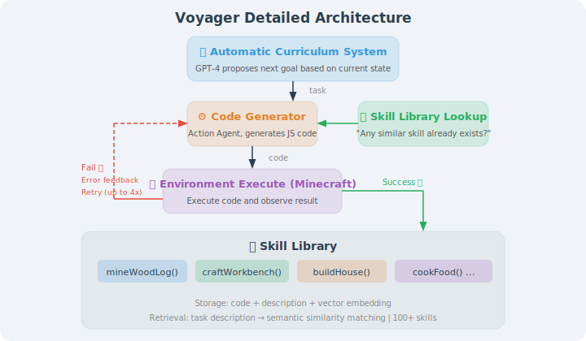
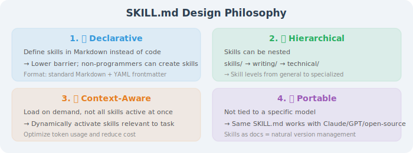
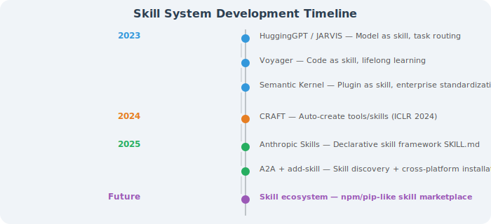

# Paper Readings: Frontier Research in Skill Systems

This section reviews core papers related to Agent skill systems, covering three directions: skill learning, tool creation, and skill ecosystems.

---

## Voyager: LLM-Powered Lifelong Learning Agent

**Paper**: *Voyager: An Open-Ended Embodied Agent with Large Language Models*  
**Authors**: Wang et al., NVIDIA & Caltech  
**Published**: 2023 | [arXiv:2305.16291](https://arxiv.org/abs/2305.16291)

### Core Problem

In open-world environments, can Agents **continuously explore and learn new skills** like humans, rather than only completing predefined tasks?

### Method Principles

Voyager builds a complete closed loop for Agent skill learning in the Minecraft game:



### Key Findings

1. **Skill library is key to lifelong learning**: Agents without a skill library stagnate after 50 iterations, while Voyager with a skill library continues to improve
2. **Temporal scalability of skills**: Simple skills learned early can be reused by complex tasks later, forming a positive cycle
3. **Auto curriculum > fixed curriculum**: GPT-4-generated adaptive curriculum is 4.2× more efficient than human-designed fixed curriculum
4. **Code as skill representation**: Representing skills as executable code is more precise and reliable than natural language descriptions

### Experimental Comparison

| Metric | Voyager | ReAct | Reflexion | AutoGPT |
|--------|---------|-------|-----------|---------|
| Unique items obtained | **63** | 41 | 43 | 22 |
| Tech tree coverage | **15.3/36** | 8.5/36 | 9.2/36 | 5.4/36 |
| Distance explored (blocks) | **2,252** | 1,086 | 1,225 | 892 |

### Implications for Agent Development

Voyager proves a key architectural pattern — **skill library + auto curriculum + iterative improvement** can enable Agents to achieve lifelong learning. This pattern can be generalized to any Agent application:
- Customer service Agents can extract "conversation skills" from each successful dialogue
- Programming Agents can extract "coding skills" from each successful code modification
- Research Agents can extract "research skills" from each successful investigation

---

## CRAFT: Creating and Retrieving Specialized Toolsets

**Paper**: *CRAFT: Customizing LLMs by Creating and Retrieving from Specialized Toolsets*  
**Authors**: Yuan et al., Peking University  
**Published**: 2024 | ICLR 2024 | [arXiv:2309.17428](https://arxiv.org/abs/2309.17428)

### Core Problem

Traditional Agents can only use **predefined tools** to solve problems. But what if a new type of problem arises with no ready-made tool? CRAFT proposes: **let LLMs create their own tools**.

### Method Principles

```
Traditional approach (direct solving):
  Problem → LLM directly generates code to solve → may have errors

CRAFT approach (create tools first, then solve):
  Problem → Phase 1: Create tools
             LLM analyzes problem patterns
             Abstracts reusable tool functions
             Validates tools with test cases
           → Phase 2: Use tools
             Retrieve appropriate tools from tool library
             Combine tools to solve specific problem

Key insight:
  "Abstraction first" makes LLMs less error-prone
  Creating a "sum" tool + calling it
  is more reliable than directly writing a long sum calculation
```

### CRAFT vs Direct Code Generation

```python
# Direct code generation (error-prone)
def solve_directly(problem):
    """
    Problem: Calculate the determinant of the following matrix
    [[1, 2, 3], [4, 5, 6], [7, 8, 9]]
    """
    # LLM directly writes complete determinant calculation code
    # Long code, easy to have bugs
    matrix = [[1, 2, 3], [4, 5, 6], [7, 8, 9]]
    det = (matrix[0][0] * (matrix[1][1] * matrix[2][2] - ...)
           - matrix[0][1] * (...))  # Easy to get wrong!
    return det

# CRAFT approach (create tool first, then call it)
def craft_approach():
    # Phase 1: Create a general determinant calculation tool
    def determinant(matrix):
        """Calculate the determinant of any n×n matrix"""
        n = len(matrix)
        if n == 1: return matrix[0][0]
        if n == 2: return matrix[0][0]*matrix[1][1] - matrix[0][1]*matrix[1][0]
        det = 0
        for j in range(n):
            minor = [row[:j] + row[j+1:] for row in matrix[1:]]
            det += ((-1)**j) * matrix[0][j] * determinant(minor)
        return det
    # Verify: determinant([[2,1],[1,2]]) == 3  ✅
    
    # Phase 2: Call tool to solve specific problem
    result = determinant([[1, 2, 3], [4, 5, 6], [7, 8, 9]])
    return result  # More reliable
```

### Key Findings

1. **"Abstract first, then use" outperforms "direct solving"**: CRAFT significantly outperforms direct code generation on mathematical reasoning and visual question answering tasks
2. **High tool reuse rate**: approximately 60% of new problems can directly use already-created tools
3. **Tool combination capability**: multiple simple tools combined can solve complex problems
4. **Quality verification is key**: tools without test case validation have 3× higher error rates

### Implications for Agent Development

CRAFT provides an important design philosophy — Agents should not be limited to using predefined tools, but should be able to **create new tools on demand**. In real projects:
- When an Agent repeatedly encounters similar data processing needs, it can automatically create a specialized tool
- Created tools are saved to the tool library after verification, for direct reuse next time
- This shares the same spirit as Voyager's skill library concept, just applied in different scenarios

---

## Anthropic Skills Ecosystem

**Project**: *Anthropic Agent Skills*  
**Author**: Anthropic  
**Released**: 2025 | [github.com/anthropics/skills](https://github.com/anthropics/skills)

### Core Contribution

Anthropic open-sourced a complete **declarative skill framework**, defining Agent skills using `SKILL.md` files. This is the first systematic definition of Agent skill standards in the industry.

### Framework Design



### Domains Covered by 16 Demonstration Skills

| Category | Demo Skills | Use Cases |
|----------|------------|-----------|
| Document processing | Document analysis, content generation | Handle documents in various formats |
| Creative design | Theme factory, canvas design | Generate brand materials and design solutions |
| Development technology | Code review, architecture design | Assist software development workflows |
| Enterprise applications | Business communication, data analysis | Daily office automation |

### Implications for Agent Development

Anthropic Skills' greatest contribution is **lowering the barrier to skill creation** — you don't need to write code, just write a structured Markdown document to add new skills to an Agent. The community project [add-skill](https://add-skill.org/) further provides cross-platform skill installation tools, supporting Claude Code, Cursor, OpenCode, and other mainstream AI programming tools.

---

## Paper Comparison and Development Timeline

| Paper/Project | Year | Skill Type | Core Innovation | Applicable Scenarios |
|--------------|------|-----------|----------------|---------------------|
| HuggingGPT/JARVIS | 2023 | Model routing | Cross-model task distribution | Multimodal tasks |
| **Voyager** | **2023** | **Code skills** | **Skill library + lifelong learning** | Embodied intelligence/exploration |
| Semantic Kernel | 2023 | Plugin | Enterprise-grade skill encapsulation | Enterprise applications |
| **CRAFT** | **2024** | **Tool creation** | **Create + retrieve + verify** | Problem solving |
| **Anthropic Skills** | **2025** | **Declarative skills** | **SKILL.md standardization** | General Agents |
| A2A Agent Card | 2025 | Skill declaration | Multi-Agent skill discovery | Multi-Agent collaboration |

**Development Timeline**:



```
HuggingGPT / JARVIS (2023, model as skill, task routing)
    ↓
Voyager (2023, code as skill, lifelong learning)
    ↓
Semantic Kernel (2023, Plugin as skill, enterprise standardization)
    ↓
CRAFT (2024, auto-create tools/skills, ICLR 2024)
    ↓
Anthropic Skills (2025, declarative skill framework, SKILL.md)
    ↓
A2A + add-skill (2025, skill discovery + cross-platform installation)
    ↓
Skill ecosystem (future, skill marketplace like npm/pip)
```

> 💡 **Frontier Trends (2025–2026)**: Agent skill systems are undergoing a transformation from "manual definition" to "ecosystem-based." Three major trends: ① **Skill standardization**: Anthropic's SKILL.md and Google's A2A Agent Card are becoming industry standards for skill description; ② **Skill marketization**: community tools like the add-skill CLI allow skills to be installed and shared like npm packages; ③ **Skill self-evolution**: Voyager and CRAFT demonstrate the possibility of Agents autonomously learning and creating skills — future Agents will be able to continuously accumulate new skills on the job, with the skill library growing continuously.

---

*Back to: [Agent Skill System](./README.md)*

*Next chapter: [Chapter 11 Agentic RL: Training Agents with Reinforcement Learning](../chapter_agentic_rl/README.md)*
