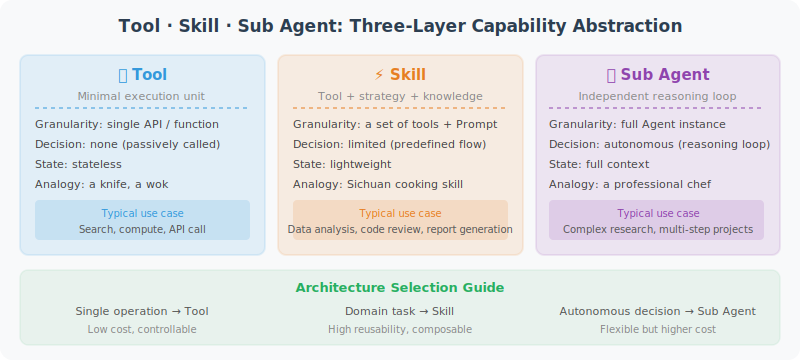

# Tool, Skill, and Sub Agent: Three Layers of Capability Abstraction

> 🎯 *"Tools are hands, Skills are abilities, Sub Agents are team members — understanding the relationship between the three is key to designing good Agent architectures."*

In previous chapters, we learned about tool calling (Chapter 4), skill systems (Chapter 10), and multi-Agent collaboration (Chapter 14). This section brings them together for a **unified comparison and review** — helping you make the right architectural choices in real development.



## An Intuitive Analogy

| Concept | Restaurant Analogy | Software Analogy |
|---------|-------------------|-----------------|
| **Tool** | Chef's knife, wok, oven | A single API call, a function |
| **Skill** | "Sichuan cooking", "French pastry making" | A set of tools + strategy + knowledge encapsulation |
| **Sub Agent** | A professional chef | An independent Agent with its own reasoning loop |

- **Tools** are the smallest execution units — a knife doesn't cook by itself
- **Skills** are methods for combining tools — knowing when to use which tool and how
- **Sub Agents** are independent decision-makers with skills — a chef can autonomously decide the cooking process

## Three-Layer Capability Model

```python
# ──────────── Layer 1: Tool ────────────
# Smallest execution unit: input → execute → output, stateless, no decision-making
def search_web(query: str) -> list[str]:
    """Search the web, return list of results"""
    return search_engine.search(query)

def read_file(path: str) -> str:
    """Read file contents"""
    return open(path).read()

def execute_sql(query: str) -> list[dict]:
    """Execute SQL query"""
    return database.execute(query)


# ──────────── Layer 2: Skill ────────────
# Combination of tools + strategy + knowledge encapsulation
class DataAnalysisSkill:
    """Data analysis skill: encapsulates multiple tools + analysis strategy + domain knowledge"""
    tools = [execute_sql, create_chart, calculate_statistics]
    
    system_prompt = """You are a data analysis expert. Follow these strategies when analyzing data:
    1. First understand data structure and data quality
    2. Choose appropriate analysis methods based on problem type
    3. Use visualization to help explain conclusions"""
    
    def execute(self, task: str) -> str:
        """Execute one data analysis (usually a single LLM call + tool combination)"""
        return llm.chat(system=self.system_prompt, tools=self.tools,
                       messages=[{"role": "user", "content": task}])


# ──────────── Layer 3: Sub Agent ────────────
# Independent reasoning loop: has its own memory, planning, decision-making capabilities
class DataAnalystAgent:
    """Data analyst Agent: has skill library + independent memory + autonomous planning"""
    skills = [DataAnalysisSkill(), ReportWritingSkill(), DataCleaningSkill()]
    memory = WorkingMemory()
    
    def run(self, objective: str) -> str:
        """Autonomously execute multi-step tasks with a complete reasoning loop"""
        plan = self.plan(objective)
        for step in plan:
            skill = self.select_skill(step)
            result = skill.execute(step)
            self.memory.store(step, result)
            if self.should_replan(result):
                plan = self.replan(objective, self.memory)
        return self.synthesize(self.memory)
```

## Core Differences: Comparison Across Five Dimensions

| Dimension | Tool | Skill | Sub Agent |
|-----------|------|-------|-----------|
| **Abstraction level** | Lowest — single operation | Middle — operation combination | Highest — autonomous entity |
| **Decision-making** | ❌ No decision, pure execution | ⚠️ Limited decisions (within strategy) | ✅ Fully autonomous decisions |
| **State management** | Stateless | Lightweight state | Independent memory + working state |
| **Reasoning loop** | None | Usually single-pass | Multi-step loop (Plan-Act-Observe) |
| **Composability** | Called by skills and Agents | Called by Agents | Orchestrated by parent Agents |

### Progressive Decision-Making Capability

```
Tool:       input → output                (deterministic mapping)
Skill:      input → [strategy selection] → output     (limited conditional branching)
Sub Agent:  objective → [plan→act→reflect→adjust]* → output  (autonomous reasoning loop)
```

A practical example to feel this progression:

```python
# Task: Prepare a quarterly sales report for the user

# ── Using only Tools ──
# Agent must make all decisions itself, calling tools one by one
result1 = execute_sql("SELECT * FROM sales WHERE quarter = 'Q4'")
result2 = calculate_statistics(result1)
result3 = create_chart(result2, chart_type="bar")
result4 = format_report(result2, result3)
# The Agent itself bears all "how to do it" decisions

# ── Using Skills ──
# Agent only needs to specify "what to do", Skill handles "how to do it" internally
report = data_analysis_skill.execute("Generate Q4 sales report with trend analysis and charts")

# ── Using Sub Agent ──
# Main Agent only states the "objective", Sub Agent autonomously completes everything
report = data_analyst_agent.run(
    "Comprehensively analyze Q4 sales data, identify problems and opportunities, write management report"
)
# Sub Agent plans steps, selects skills, handles exceptions, iterates multiple times
```

## When to Use What? Decision Framework

```python
def choose_abstraction(task_requirements: dict) -> str:
    """Choose the appropriate capability abstraction level"""
    complexity = task_requirements.get("complexity")
    autonomy = task_requirements.get("autonomy_needed")
    steps = task_requirements.get("estimated_steps")
    
    if complexity == "simple" and steps <= 1:
        return "Tool"      # Search web, read file, call API
    
    if complexity == "medium" or (steps <= 5 and autonomy == "medium"):
        return "Skill"     # Data analysis, code review, document generation
    
    if complexity == "complex" or autonomy == "high" or steps > 5:
        return "Sub Agent"  # Autonomous research, project planning, cross-system coordination
    
    return "Tool"
```

### Selection Guide for Real Scenarios

| Scenario | Recommended Abstraction | Reason |
|----------|------------------------|--------|
| Call a weather API | **Tool** | Single, deterministic operation |
| Query database and return results | **Tool** | Clear input/output |
| Analyze a dataset and generate visualizations | **Skill** | Needs to combine multiple tools + analysis strategy |
| Translate a document into 3 languages | **Skill** | Fixed process, tools + domain knowledge |
| Autonomously complete code review and submit PR | **Sub Agent** | Needs to understand code, make judgments, multi-step operations |
| Manage an entire data analysis project | **Sub Agent** | Needs to orchestrate multiple subtasks and sub-Agents |

## Composition Pattern: Hierarchical Architecture

In real Agent systems, the three layers of abstraction are typically **used in a nested fashion**:

```
Orchestrator Agent
├── Research Sub Agent
│   ├── Web Search Skill
│   │   ├── search_web()    [Tool]
│   │   ├── fetch_page()    [Tool]
│   │   └── extract_text()  [Tool]
│   └── Summary Skill
│       ├── chunk_text()    [Tool]
│       └── summarize()     [Tool]
│
├── Coding Sub Agent
│   ├── Code Analysis Skill
│   │   ├── read_file()     [Tool]
│   │   └── search_code()   [Tool]
│   └── Code Edit Skill
│       ├── write_file()    [Tool]
│       └── run_tests()     [Tool]
│
└── Report Sub Agent
    └── Report Writing Skill
        ├── create_chart()  [Tool]
        └── render_pdf()    [Tool]
```

```python
class ProductionAgent:
    """Code implementation of hierarchical architecture"""
    def __init__(self):
        self.sub_agents = {
            "researcher": ResearchAgent(skills=[WebSearchSkill(), SummarySkill()]),
            "coder": CodingAgent(skills=[CodeAnalysisSkill(), CodeEditSkill()]),
            "reporter": ReportAgent(skills=[ReportWritingSkill()]),
        }
    
    def handle_task(self, task: str):
        plan = self.plan(task)
        for step in plan:
            agent_name = self.route(step)
            result = self.sub_agents[agent_name].run(step)
            self.collect_result(step, result)
        return self.synthesize_results()
```

## Common Pitfalls and Best Practices

### ❌ Pitfall 1: Using Sub Agents for Everything

```python
# Anti-pattern: creating a full Sub Agent for a simple search
class OverEngineeredSearchAgent:
    """Don't do this! Searching the web only needs a Tool"""
    def __init__(self):
        self.memory = WorkingMemory()   # Not needed
        self.planner = Planner()        # Not needed
    def run(self, query):
        plan = self.planner.plan(f"Search: {query}")
        # Just to call one search() function? Way too heavy!
```

### ❌ Pitfall 2: Stuffing Complex Logic into a Single Tool

```python
# Anti-pattern: a "tool" containing too much logic
def analyze_and_report(data_path, output_format, language, chart_type, ...):
    """This is not a Tool — it should be a Skill or Sub Agent! Tools should be atomic operations with single responsibility"""
    data = load(data_path)
    cleaned = clean_data(data)
    analyzed = run_analysis(cleaned)
    chart = create_chart(analyzed, chart_type)
    report = write_report(analyzed, chart, language)
    return export(report, output_format)
```

### ✅ Best Practice: Progressive Upgrade

```python
# Phase 1: Start with Tools for quick validation
tools = [search_web, read_file, execute_sql]
agent = SimpleReActAgent(tools=tools)
# When Prompt is full of "if...then..." conditional logic → upgrade to Skill

# Phase 2: Encapsulate recurring patterns as Skills
data_skill = DataAnalysisSkill(tools=[execute_sql, calculate, create_chart])
code_skill = CodeReviewSkill(tools=[read_file, search_code, lint])
agent = SkillBasedAgent(skills=[data_skill, code_skill])
# When a single Agent's Prompt exceeds 4K tokens → consider splitting into Sub Agents

# Phase 3: Split independent functional domains into Sub Agents
analyst = DataAnalystAgent(skills=[data_skill])
reviewer = CodeReviewAgent(skills=[code_skill])
orchestrator = OrchestratorAgent(sub_agents=[analyst, reviewer])
```

## Relationship with Communication Protocols

The three layers of abstraction are closely related to the communication protocols we learn in Chapter 15:

| Abstraction Layer | Typical Communication Protocol | Description |
|------------------|-------------------------------|-------------|
| **Tool** | **MCP** (Model Context Protocol) | MCP defines the standard interface between Agents and tools |
| **Skill** | Framework internal interface | Skills are usually in the same process, no cross-process protocol needed |
| **Sub Agent** | **A2A** (Agent-to-Agent) | Sub Agents communicate and coordinate via A2A protocol |

```python
# Complete picture of MCP connecting tools → A2A connecting Agents
#
# [Orchestrator Agent]
#     │
#     ├── A2A ──→ [Research Agent]
#     │               ├── MCP ──→ [Web Search Server]
#     │               └── MCP ──→ [Database Server]
#     │
#     └── A2A ──→ [Coding Agent]
#                     ├── MCP ──→ [File System Server]
#                     └── MCP ──→ [Git Server]
```

---

## Section Summary

| Key Point | Description |
|-----------|-------------|
| **Three-layer progression** | Tool (atomic operation) → Skill (strategy encapsulation) → Sub Agent (autonomous entity) |
| **Core difference** | Different levels of decision-making capability and autonomy |
| **Selection principle** | Start with the simplest, upgrade as needed — don't over-engineer |
| **Composition pattern** | Three-layer nesting is a common architecture for production-grade Agents |
| **Progressive evolution** | Tools first for validation → Skills for encapsulation and reuse → Sub Agents for splitting and autonomy |

> 📖 *Understanding the relationship between these three layers of abstraction is the key leap from "being able to write an Agent" to "being able to design an Agent system."*

---

*Related chapters: [Chapter 4 Tool Calling](../chapter_tools/README.md) · [Chapter 10 Skill System](./README.md) · [Chapter 14 Multi-Agent Collaboration](../chapter_multi_agent/README.md) · [Chapter 15 Agent Communication Protocols](../chapter_protocol/README.md)*
