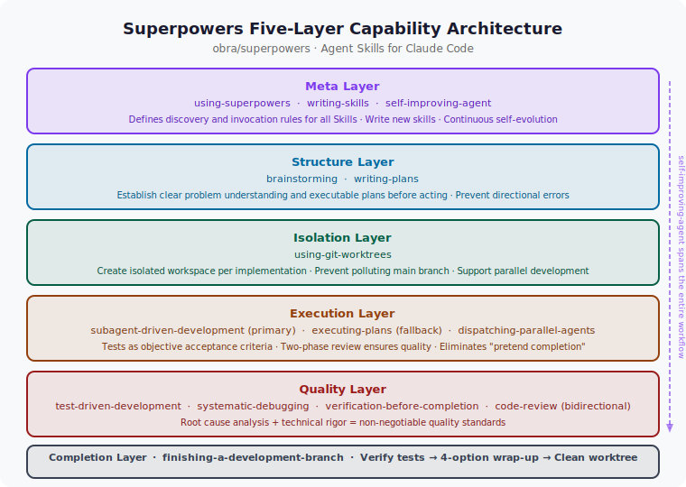

# The Skills Bible: Superpowers Engineering Practice Guide

> 🎯 *"Tools give Agents the ability to act; Skills give Agents engineering discipline. What Superpowers does is turn the best practices in software development that are hardest to maintain into non-negotiable execution standards for AI."*

---

## 1. What Is Superpowers

### Project Positioning

[obra/superpowers](https://github.com/obra/superpowers) is a collection of **Agent Skills** designed specifically for Claude Code, with 70k+ Stars on GitHub. Its goal is not to add new capabilities to AI, but to add **engineering discipline** to AI's behavioral patterns — covering the complete software development lifecycle, from requirements exploration to branch completion.

### Core Design Philosophy: On-Demand SKILL.md Loading

Each Skill in Superpowers is essentially a `SKILL.md` file. This file is not an ordinary README, but a **structured expert knowledge document** containing:

- Precise operational workflows (Checklists)
- Non-negotiable mandatory constraints (MUST / NEVER / FORBIDDEN)
- Common anti-patterns and Red Flags
- Collaborative relationships with other Skills

When Claude Code determines that the current task requires a certain capability, it **loads the corresponding Skill's context on demand**. This design solves a core contradiction:

```
❌ Traditional approach: stuff all specifications into the main System Prompt
   → Context too long → Model degradation → AI forgets to follow specifications

✅ Superpowers approach: SKILL.md injected on demand
   → Only load the Skill needed for the current task → Focused context → Specifications effectively executed
```

### Installation

```bash
npx skills add obra/superpowers -g -y
```

### Complete Skills Overview

| Skill Name | Phase | Core Function |
|-----------|-------|--------------|
| `brainstorming` | Requirements exploration | Structured thinking, generate design specification documents |
| `writing-plans` | Design planning | Output executable plan.md |
| `test-driven-development` | Development implementation | Red-green-refactor cycle, TDD constraints |
| `using-git-worktrees` | Pre-implementation | Create isolated workspaces |
| `executing-plans` | Development implementation | Serial plan execution (non-subagent environments) |
| `subagent-driven-development` | Development implementation | Subagent-driven execution, dual-phase review |
| `dispatching-parallel-agents` | Debugging/development | Concurrent investigation of independent problem domains |
| `systematic-debugging` | Debugging | Four-phase root cause investigation |
| `verification-before-completion` | Completion | Mandatory execution of verification commands |
| `finishing-a-development-branch` | Completion | Standardized branch merge/PR/discard workflow |
| `requesting-code-review` | Review | Initiate high-quality code reviews |
| `receiving-code-review` | Review | Properly handle review feedback |
| `writing-skills` | Meta-skill | Write new SKILL.md files |
| `self-improving-agent` | Meta-skill | Continuously self-evolve from experience |

---

## 2. Meta-Rule: using-superpowers

Among all Skills, `using-superpowers` plays the role of **meta-skill** — it specifies how AI Agents discover and use all other Skills. Think of it as the "operating system" of the entire Superpowers system.

### Instruction Priority

```
User instructions (CLAUDE.md, direct requests)
    ↓ higher than
Superpowers Skills
    ↓ higher than
Default system prompt
```

This priority design ensures users always retain ultimate control. If you write "this project does not use TDD" in `CLAUDE.md`, then even if the `test-driven-development` Skill says "must use TDD," the AI will follow your instruction.

### Core Principle: 1% Probability Must Invoke

> **If you think a Skill has even a 1% chance of being applicable to the current task, you MUST invoke it. This is non-negotiable, non-optional, and there is no reason to bypass it.**

This rule sounds strict, but its design motivation is clear: AI always tends to take shortcuts and skip steps. The 1% threshold prevents AI from using "this Skill probably isn't useful" as a reason to avoid discipline through an extremely low trigger threshold.

### Skill Invocation Workflow

```
Receive user message
    ↓
About to enter EnterPlanMode?
    └─ Already Brainstormed?
           ├─ No → First invoke brainstorming skill
           └─ Yes → Continue

Any possibly applicable Skill (even 1%)?
    ├─ Yes → Invoke Skill tool
    │       ↓
    │   Announce: "Using [skill] to [purpose]"
    │       ↓
    │   Skill has checklist?
    │       ├─ Yes → Create TodoWrite item for each item
    │       └─ No → Execute strictly per Skill
    │
    └─ Absolutely none → Respond directly
```

### Red Flags: You're Making Excuses

When AI has the following thoughts, it's using self-deceptive reasons to avoid discipline:

| AI's Thought | Truth |
|-------------|-------|
| "This is just a simple problem" | Simple problems are still tasks; check Skills first |
| "I need more context" | Skill check precedes clarifying questions |
| "Let me explore the codebase first" | Skills tell you **how** to explore; check first |
| "I remember the content of this Skill" | Skills evolve; must read the current version |
| "This feels efficient" | Undisciplined action wastes time; Skills prevent this |

### Skill Types

- **Rigid**: such as TDD, Debugging — must be strictly followed regardless of context; execution discipline cannot be adjusted due to "special circumstances"
- **Flexible**: such as design patterns — adapt the Skill's principles to specific situations; some adjustment within a defined range is allowed

---

## 3. Complete Workflow

One of Superpowers' core values is providing an **end-to-end software development pipeline**. Each Skill plays a specific role in the pipeline, and the connections between Skills are carefully designed:

```
Brainstorm → Write Plans → Setup Worktree
    → Subagent-Driven Dev (or Execute Plans)
        → Debug (if needed) → Verify → Code Review
            → Finish Branch
```

| Phase | Skill | Output | Problem Prevented |
|-------|-------|--------|------------------|
| Exploration | `brainstorming` | Design specification document | Starting to code without analysis |
| Planning | `writing-plans` | plan.md | Non-executable plans, missing test constraints |
| Isolation | `using-git-worktrees` | Independent workspace | Main branch contamination, inability to develop in parallel |
| Implementation | `subagent-driven-development` | Commits with dual-phase review | Quality loss, pretending to complete |
| Implementation (alt) | `executing-plans` | Verified commits | Alternative when no subagent available |
| Debugging | `systematic-debugging` | Root cause fix | Symptom Fix (treating symptoms, not causes) |
| Accelerated debugging | `dispatching-parallel-agents` | Concurrent fix results | Wasting time processing independent bugs serially |
| Verification | `verification-before-completion` | Real verification evidence | Pretending to complete, overconfidence |
| Review | `requesting/receiving-code-review` | Review report | Code quality blind spots |
| Completion | `finishing-a-development-branch` | Clean branch state | Disorderly merging, leftover debris |

> 💡 **Core Value**: The biggest problem with traditional AI programming is that AI easily "pretends to complete," skips tests, and uses surface fixes to cover real problems. Superpowers **internalizes software engineering discipline as AI's execution standards**, rather than relying on programmers to check after the fact.

---

## 4. Five-Layer Capability Architecture

From a higher level, Superpowers' 14 Skills form a **five-layer architecture**:



```
┌──────────────────────────────────────────────────┐
│                  Meta Layer                       │
│   using-superpowers · writing-skills              │
│   · self-improving-agent                          │
│   Define invocation rules · Write new Skills      │
│   · Continuous self-evolution                     │
├──────────────────────────────────────────────────┤
│                  Structure Layer                  │
│   brainstorming → writing-plans                   │
│   Establish clear problem understanding and       │
│   executable plans before starting                │
├──────────────────────────────────────────────────┤
│                  Isolation Layer                  │
│   using-git-worktrees                             │
│   Create independent workspace for each           │
│   implementation, prevent main branch pollution   │
├──────────────────────────────────────────────────┤
│                  Execution Layer                  │
│   subagent-driven-development (preferred)         │
│   executing-plans (alternative)                   │
│   dispatching-parallel-agents (parallel)          │
│   Tests as objective acceptance criteria,         │
│   dual-phase review ensures quality               │
├──────────────────────────────────────────────────┤
│                  Quality Layer                    │
│   TDD · systematic-debugging · verification       │
│   · code-review (bidirectional)                   │
│   Root cause analysis + technical rigor =         │
│   non-negotiable quality standards                │
├──────────────────────────────────────────────────┤
│                  Completion Layer                 │
│   finishing-a-development-branch                  │
│   Verify tests → 4-option completion              │
│   → Clean up Worktree                             │
└──────────────────────────────────────────────────┘
              ↑ self-improving-agent runs throughout ↑
```

---

## 5. Core Skills in Detail

### 5.1 Structure Layer: Brainstorming + Writing Plans

#### Brainstorming: Hard Gate

The `brainstorming` Skill addresses the most common mistake in AI programming: **starting to write code without sufficient analysis**.

> ⚠️ **HARD-GATE**: Never invoke any implementation Skill, write any code, or scaffold anything before presenting a design and getting user approval. This applies to **ALL** projects, no matter how simple they appear on the surface.

Complete Brainstorming contains 9 sequentially executed steps, each requiring a TodoWrite task to be created for tracking:

1. **Explore project context**: check files, documentation, recent commits
2. **Provide visual aids** (when visual design is involved): send separately, don't merge with questions
3. **Ask clarifying questions one at a time**: ask only one question at a time, understand purpose, constraints, success criteria
4. **Propose 2-3 options**: with trade-off analysis and recommendation rationale
5. **Present design section by section**: ask user to confirm each section
6. **Write design specification document**: save to `docs/superpowers/specs/YYYY-MM-DD-<topic>-design.md` and commit
7. **Specification self-check**: scan for TBD/TODO, internal contradictions, ambiguous statements
8. **Wait for user to review specification**: get approval before continuing
9. **Transition to implementation**: invoke `writing-plans` Skill

```
Brainstorming (divergent)              Writing Plans (convergent)
      ↓                                      ↓
Thinking process, option comparison,  →  Executable task list + test plan
design specification
```

Design principles: **ask only one question at a time** (multiple choice preferred over open-ended), **ruthless YAGNI execution** (remove unnecessary features).

#### Writing Plans: Five Elements of plan.md

`writing-plans` transforms the design specification output from Brainstorming into a directly executable plan.md:

1. **Goal**: the final deliverable of this implementation
2. **Tasks**: atomic subtasks, each with clear completion criteria
3. **Test Plan**: test cases corresponding to each subtask (mandatory TDD constraint)
4. **Dependencies**: prerequisite dependencies between tasks
5. **ADR (Architecture Decision Records)**: key design decisions and their rationale

> 💡 **Key Value**: Writing Plans transforms TDD from an "optional discipline" into a "non-bypassable step" — any implementation task must first have corresponding test cases.

---

### 5.2 Isolation Layer: Using Git Worktrees

Git Worktrees allow maintaining multiple independent working directories under the same repository simultaneously, without switching branches back and forth.

**When it must be used**:
- After design approval in `brainstorming` Phase 4, before entering implementation
- Before `subagent-driven-development` or `executing-plans` executes any task

**Creation workflow (5 steps)**:

```bash
# Step 1: Confirm directory (priority: .worktrees/ > worktrees/ > ask user)

# Step 2: Safety verification (directory must be in .gitignore; if not ignored, add and commit first)
git check-ignore -v .worktrees/

# Step 3: Create Worktree
git worktree add .worktrees/<feature-name> -b <branch-name>

# Step 4: Auto-detect and run project initialization
# npm install / cargo build / pip install / go mod download

# Step 5: Verify clean baseline (confirm no pre-existing failures)
npm test  # or other test commands
```

**Key safety rules**:
- Never skip `.gitignore` verification (otherwise Worktree contents may be accidentally committed)
- Never start development when tests are failing (can't distinguish new bugs from pre-existing issues)

> 💡 **Pairing relationship**: `using-git-worktrees` (create isolated workspace) and `finishing-a-development-branch` (clean up workspace) are a pair of Skills used together — the former opens, the latter closes.

---

### 5.3 Execution Layer: Subagent-Driven Development

`subagent-driven-development` is the **most core implementation strategy** in Superpowers. Its core idea is:

**Dispatch independent subagent for each task + dual-phase review = high quality, fast iteration**

Subagents have **isolated context** — they don't inherit the main session's history; the coordinator precisely constructs the minimum necessary context for them. This ensures both the subagent's focus and prevents the main session's context from being exhausted.

**Complete execution workflow**:

```
Read plan, extract all tasks, create TodoWrite
    ↓
(Loop for each task)
    ├─ Dispatch implementation subagent (provide complete task text + context)
    │         ↓
    │     Subagent implements, tests, commits, self-reviews
    │         ↓
    │     ┌─ Dispatch specification review subagent ←────────────────┐
    │     │         ↓                                               │ Issues found, fix and re-review
    │     │     Spec compliant? No → Implementation subagent fixes ──┘
    │     │         ↓ Yes
    │     │     ┌─ Dispatch code quality review subagent ←──────────┐
    │     │     │         ↓                                         │ Issues found, fix and re-review
    │     │     │     Quality pass? No → Fix quality ───────────────┘
    │     │     │         ↓ Yes
    │     │     │     Mark task complete
    │
(All tasks complete)
    ↓
Dispatch final code review subagent
    ↓
Invoke finishing-a-development-branch
```

**Comparison with executing-plans**:

| Dimension | subagent-driven-development | executing-plans |
|-----------|----------------------------|-----------------|
| Session | Same session, creates sub-agents | Independent session |
| Context management | Fresh sub-agent per task, precise injection | Continuously accumulates, may degrade |
| Review mechanism | Automatic dual-phase review | No built-in review |
| Applicable conditions | Platform supports sub-agents (e.g., Claude Code) | When no sub-agent support |
| Recommendation | ⭐⭐⭐⭐⭐ Use first | ⭐⭐⭐ Alternative |

**Model selection strategy**:

| Task Type | Recommended Model |
|-----------|------------------|
| Isolated function implementation (1-2 files, clear spec) | Fastest/cheapest model |
| Multi-file coordination, pattern matching, debugging | Standard model |
| Architecture design, code review | Most capable model |

**Red Flags (never do)**:
- Start implementation directly on main/master branch (without explicit consent)
- Skip any review phase
- Let sub-agents self-review instead of real review
- Do code quality review before spec review (wrong order)
- Let sub-agents read the plan file themselves (coordinator should provide complete text)

---

### 5.4 Quality Layer

#### TDD: Test-Driven Development

The red-green-refactor three phases are the cornerstone of Superpowers' quality assurance:

| Phase | Action | Mandatory Constraint |
|-------|--------|---------------------|
| **Red** | Write tests describing expected behavior first | Tests **MUST fail** (implementation doesn't exist yet) |
| **Green** | Write minimal implementation code | Only make tests pass, **not one line more** |
| **Refactor** | Optimize code structure, eliminate duplication | Tests must remain passing |

> ⚠️ **Most common misconception**: The "Red" phase requires **runnable and failing automated tests**, not comments, not pseudocode, not TODOs. Skipping the "Red" phase (writing implementation first, then adding tests) loses TDD's most core value: **tests drive design, not just verify implementation**.

In AI programming, TDD's value is especially unique:

```
Traditional programming: TDD is a discipline (relies on engineer's self-discipline)
AI programming: TDD is a constraint mechanism (enforced through Skills)

AI code generation without tests = recursion without a termination condition
——AI can infinitely generate "seemingly reasonable" but actually incorrect code
——Tests are the only objective acceptance criterion
```

#### Systematic Debugging: Four-Phase Root Cause Investigation

> **"NO FIXES WITHOUT ROOT CAUSE INVESTIGATION FIRST."**
>
> Random fixes waste time and introduce new bugs. Quick patches mask underlying problems. **Must find root cause first, then implement fix. Symptom Fix is failure.**

Four non-skippable phases:

1. **Root cause investigation**: collect complete error information, stack traces, reproduction steps; analyze the precise context in which the bug appears
2. **Pattern analysis**: identify which category of known error pattern the bug belongs to (off-by-one? race condition? type error?)
3. **Hypothesis validation**: before making changes, validate hypotheses with minimal experiments (add logging, write targeted test cases)
4. **Minimal implementation**: implement only the minimal fix for the verified root cause; don't make "while I'm at it" other changes

> ⚠️ **Escalation threshold**: If debugging the same problem fails **3 or more times**, must escalate to architectural level for re-examination — does this bug point to a deeper design flaw? Does the module boundary need to be reconsidered? Should not continue "patching" at the wrong architectural level.

#### Verification Before Completion

> **"NO COMPLETION CLAIMS WITHOUT FRESH VERIFICATION EVIDENCE."**

Before declaring a task complete, must **actually run verification commands** and speak based on actual command output — not based on "feelings" about code logic.

This Skill specifically combats AI's tendency to "pretend to complete": AI very easily ends a task with "this implementation should be correct" without actually running the code.

#### Code Review: Bidirectional Mechanism

Superpowers designs Code Review as a **bidirectional skill**, targeting both the requesting side and the receiving side:

**Requesting side (Requesting Code Review) — Five-dimensional review checklist**:

1. **Code Quality**: separation of concerns, error handling, DRY principle, edge case coverage
2. **Architecture**: design decision reasonableness, scalability, security risks
3. **Testing**: tests cover real logic (not just Mocks), boundary coverage
4. **Requirements**: satisfies all requirements in the plan, no scope creep
5. **Production Readiness**: database migration strategy, backward compatibility, documentation completeness

> Without context, Code Review can only review code style; Reviewer cannot judge whether the code truly solves the business problem. Standard review context template must include: what was implemented (WHAT_WAS_IMPLEMENTED), original requirements document, Base SHA and Head SHA.

**Receiving side (Receiving Code Review) — Performative Agreement anti-pattern**:

Code Review is a technical evaluation of objective code, not a social performance to please the Reviewer.

> ⚠️ **Performative Agreement anti-pattern**: To appear "cooperative" or "positive," blindly agreeing to and executing Reviewer suggestions without verifying technical feasibility. This is not humility; this is irresponsibility.

Four principles for the receiving side:
1. **Technical rigor**: decisions based on facts, test results, and system status — not authority or social pressure
2. **Verify before executing**: after receiving feedback, strictly forbidden to immediately say "You're absolutely right! Let me fix it..." — first verify in the codebase
3. **YAGNI principle rebuttal**: when Reviewer suggests adding functionality that the current system doesn't call at all, rebut with YAGNI
4. **Well-reasoned technical rebuttal**: when discovering a suggestion would break existing functionality, must rebut with technical reasoning

---

### 5.5 Meta-Skills: Writing Skills + Self-Improving Agent

#### Writing Skills: How to Write SKILL.md

`writing-skills` is Superpowers' self-extension mechanism — the Skill for writing new Skills.

Three core principles for writing high-quality SKILL.md:

1. **Solve problems, don't describe processes**: good SKILL.md gives specific, directly executable steps, not narratives of "usually should..."

2. **Mandatory constraints, not suggestions**:
   ```
   ❌ "You should consider running tests before merging."
   ✅ "NEVER merge without passing tests. This is FORBIDDEN."
   ```
   AI doesn't execute suggestions, only rules. Use MUST, NEVER, FORBIDDEN — not should, consider.

3. **Reusable Patterns**: distill the process of solving problems into reusable patterns, not one-time scripts

The existence of `writing-skills` gives Superpowers **self-extension** capability: when a team encounters recurring problem patterns, they can encode the solution as a new `SKILL.md`, crystallizing it as shared knowledge to be reused by all members and AI Agents.

#### Self-Improving Agent: Three-Layer Memory Architecture

`self-improving-agent` is a **general self-evolution system**, built on 2025 lifelong learning research (SimpleMem, Multi-Memory Survey, Lifelong Learning LLM Agents):

```
┌──────────────────────────────────────────────────┐
│                Multi-Memory System                │
├──────────────┬───────────────┬───────────────────┤
│  Semantic    │   Episodic    │    Working         │
│  Memory      │   Memory      │    Memory          │
│ (patterns/   │ (specific     │  (current          │
│  rules)      │  experiences) │   session)         │
│ semantic/    │ episodic/     │ working/           │
│ patterns.json│ YYYY-MM-DD-  │ session.json       │
│              │   *.json     │                    │
└──────────────┴───────────────┴───────────────────┘
```

**Automatic trigger mechanisms (Hooks)**:

| Event | Trigger Timing | Action |
|-------|---------------|--------|
| `before_start` | Before any Skill starts | Record session start, load working memory |
| `after_complete` | After any Skill completes | Extract patterns, update Skill files |
| `on_error` | Bash returns non-zero exit code | Capture error context, trigger self-correction |

**Four phases of self-evolution**:

1. **Experience extraction**: record what happened, what worked, what failed, what the root cause was

2. **Pattern abstraction**: transform specific experiences into reusable rules
   ```
   Specific experience        →    Abstract pattern         →    Update target Skill
   "User forgot to save PRD"  →  "Persist thinking process" →    prd-planner
   "Missed SQL injection check" → "Add security checklist"  →    code-reviewer
   ```
   Abstraction rules: same experience repeated **3+ times** → mark as key pattern; user rating ≤ 4/10 → add to "avoid" list

3. **Skill updates**: use evolution markers to track change sources
   ```markdown
   <!-- Evolution: 2025-01-12 | source: ep-2025-01-12-001 | skill: debugger -->
   ```

4. **Memory consolidation**: update semantic memory, manage confidence levels, prune low-confidence patterns (prevent accumulation of incorrect experiences)

**Manual trigger**: say "self-improve", "self-evolve", or "learn from experience" to trigger manually.

---

## 6. Key Connections and Collaborative Relationships

Superpowers' 14 Skills don't exist in isolation — there are 6 key collaborative relationships between them:

| Skill Pair | Collaboration Method | Problem Solved |
|-----------|---------------------|----------------|
| `using-git-worktrees` ↔ `finishing-a-development-branch` | Used in pairs: former creates isolation, latter cleans up | Every development has a clean start and end state |
| `subagent-driven-dev` ↔ `dispatching-parallel-agents` | Former for serial tasks (with dual-phase review), latter for concurrent independent problem domains | Optimal balance between quality assurance and efficiency |
| `TDD` ↔ `code-review` | TDD ensures each subtask has objective completion criteria (green tests), Review checks design quality on top of that | Quality double insurance: objectively correct first, then elegantly compliant |
| `systematic-debugging` ↔ `verification-before-completion` | Former solves "how to fix when something goes wrong," latter solves "how to prove it's done" | Prevent Symptom Fix + prevent pretending to complete |
| `brainstorming` ↔ `writing-plans` | Former diverges, latter converges, forming a complete "think→execute" preparation phase | Prevent directional errors and missing plans |
| `writing-skills` ↔ `self-improving-agent` | Former explicitly creates new Skills, latter automatically evolves existing Skills from experience | Self-evolution capability of the Superpowers ecosystem |

---

## 7. Getting Started Immediately

```bash
# Step 1: Install Superpowers (global, auto-accept all prompts)
npx skills add obra/superpowers -g -y

# Step 2: Complete development pipeline (new feature development)
# In Claude Code, naturally trigger in the following order:

# 2.1 Requirements exploration (hard gate, cannot be skipped)
# → Triggers brainstorming skill
# → Generates docs/superpowers/specs/YYYY-MM-DD-<topic>-design.md

# 2.2 Planning
# → Triggers writing-plans skill
# → Generates plan.md (with TDD constraints)

# 2.3 Create isolated workspace
git worktree add .worktrees/feature-name -b feature/name
# → Or trigger using-git-worktrees skill to execute automatically

# 2.4 Subagent-driven implementation (with dual-phase review)
# → Triggers subagent-driven-development skill

# 2.5 Complete development
# → Triggers finishing-a-development-branch skill
# → Choose: local merge / create PR / keep / discard

# Step 3: Encountering multiple independent bugs (concurrent processing)
# → Triggers dispatching-parallel-agents skill
# → Dispatch dedicated agent for each independent problem domain concurrently

# Step 4: Let the system continuously evolve
# → Say "self-improve" in conversation to trigger manually, or trigger automatically via Hooks
# → self-improving-agent extracts patterns from all Skill usage experiences
```

> 💡 **Usage Recommendation**: You don't need to use all 14 Skills from day one. Recommended onboarding order: start with `brainstorming` (experience the value of the hard gate) → `writing-plans` (develop the habit of planning first) → `systematic-debugging` (break the habit of Symptom Fix) → gradually introduce other Skills.

---

## Section Summary

| Dimension | Core Content |
|-----------|-------------|
| **Project positioning** | obra/superpowers, 14 Skills, covering the complete software development lifecycle |
| **Design philosophy** | SKILL.md loaded on demand, focused context, not placed in main System Prompt |
| **Meta-rule** | 1% probability must invoke; user instructions > Skills > default system prompt |
| **Complete workflow** | Brainstorm → Plans → Worktree → Dev → Debug → Verify → Review → Finish |
| **Five-layer architecture** | Meta / Structure / Isolation / Execution / Quality / Completion layers |
| **Most critical Skill** | `subagent-driven-development` (dual-phase review is the quality core) |
| **Most easily overlooked Skill** | `receiving-code-review` (Performative Agreement anti-pattern is very common) |
| **Self-evolution** | `self-improving-agent` continuously evolves the entire Skills ecosystem through three-layer memory architecture |

> ⚠️ **Open Questions to Consider**:
> - Are Superpowers' Skills applicable to projects of different scales? Is it worth using all of them for small personal projects?
> - As AI capabilities improve, which Skills' rigid constraints will become too strict? How should Skills evolve accordingly?
> - How does `self-improving-agent`'s memory architecture avoid "experience corruption" — accumulation of incorrect patterns — after long-term use?
> - How do `dispatching-parallel-agents` and `subagent-driven-development` collaborate within the same complex task?

---

*Chapter complete. Back to: [Chapter 10 Index](./README.md)*
