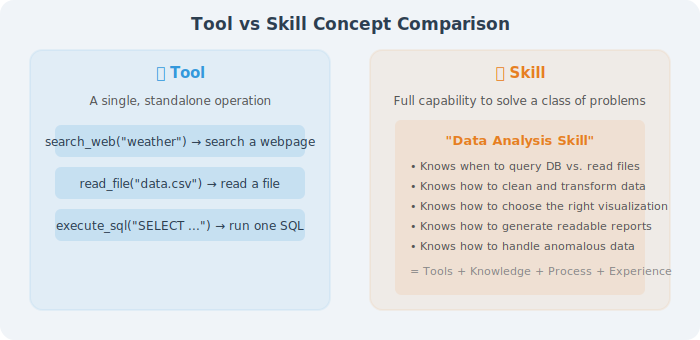

# Chapter 10 Agent Skill System

> 🎯 *"Tools let an Agent do one thing; skills let an Agent do a class of things well. A skill is an organic combination of tools, prompts, processes, and experience."*

---

## Chapter Overview

In previous chapters, we learned how to make Agents call tools. But "knowing how to use a hammer" and "knowing how to do carpentry" are two different things — **tools are individual actions, while skills are complete capabilities for solving a class of problems**. This chapter introduces the complete system of Agent skill systems: what skills are, how to define and encapsulate skills, how Agents can autonomously learn new skills, and how to discover and share skills in multi-Agent systems.

## Why a Dedicated Chapter?

You might ask: isn't tool calling enough?

A skill typically contains: combined use of multiple tools, prompt knowledge in specialized domains, specific processing workflows, and best practices accumulated from experience.

## Chapter Goals

After completing this chapter, you will be able to:

- ✅ Understand the core differences and hierarchical relationship between Skills and Tools
- ✅ Master three skill encapsulation methods: Prompt-based, Code-based, Workflow-based
- ✅ Understand how Agents autonomously learn new skills from experience (Voyager paradigm)
- ✅ Master skill discovery and registration mechanisms (A2A Agent Card, MCP, etc.)
- ✅ Build a reusable skill system in practice

## Chapter Structure

| Section | Content | Difficulty |
|---------|---------|------------|
| 10.1 Skill System Overview | Skill vs Tool, three-layer skill architecture | ⭐⭐ |
| 10.2 Skill Definition and Encapsulation | Three encapsulation methods with practice | ⭐⭐⭐ |
| 10.3 Skill Learning and Acquisition | Voyager, CRAFT, autonomous skill evolution | ⭐⭐⭐ |
| 10.4 Skill Discovery and Registration | A2A Skill declaration, dynamic discovery | ⭐⭐⭐ |
| 10.5 Practice: Building a Reusable Skill System | Complete project implementation | ⭐⭐⭐⭐ |
| 10.6 Paper Readings: Frontier Research in Skill Systems | Voyager, CRAFT and other paper readings | ⭐⭐⭐ |
| 10.7 Tool, Skill, and Sub-Agent: Three-Layer Capability Abstraction | Three-layer capability model and collaboration patterns | ⭐⭐⭐ |
| 10.8 The Skills Bible: Superpowers Engineering Practice Guide | obra/superpowers complete workflow | ⭐⭐⭐⭐ |

## ⏱️ Estimated Study Time

Approximately **90–120 minutes** (including hands-on exercises)

## 💡 Prerequisites

- Completed Chapter 4 (Tool Calling / Function Calling)
- Familiar with JSON Schema and Python decorators
- Basic understanding of Agent workflows

## 🔗 Learning Path

> **Prerequisites**: [Chapter 4 Tool Calling](../chapter_tools/README.md)
>
> **Recommended Next**:
> - 👉 [Chapter 14 Multi-Agent Collaboration](../chapter_multi_agent/README.md) — sharing and discovering skills in multi-Agent systems
> - 👉 [Chapter 15 Communication Protocols](../chapter_protocol/README.md) — skill declaration mechanisms in MCP/A2A

---

*Next section: [10.1 Skill System Overview](./01_skill_overview.md)*
