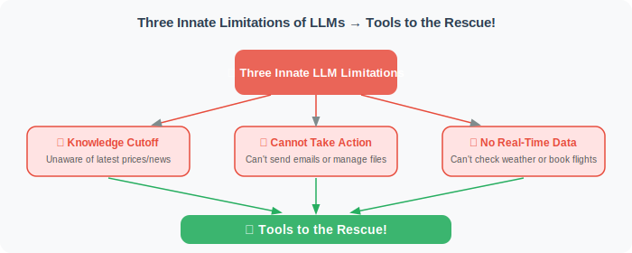
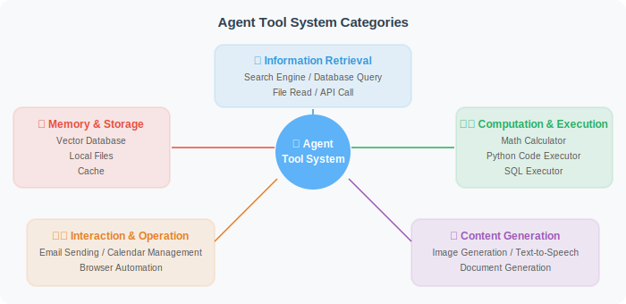

# Why Do Agents Need Tools?

LLMs are powerful on their own, but they have three fundamental limitations: **knowledge cutoff**, **inability to act**, and **inability to access real-time information**. Tools exist precisely to break through these three limitations.

## The Limitations of LLMs



```python
# Suppose you ask an LLM directly
response = "What is Apple's stock price today?"
# The LLM might say:
# "I cannot query Apple's (AAPL) stock price in real time.
#  Based on my training data, it was approximately $150–190 in early 2024..."

# Problems:
# 1. Data is not real-time (may be very outdated)
# 2. Accuracy cannot be confirmed
# 3. Cannot perform any actions
```

Tools allow Agents to:

| Capability | Tool Type | Examples |
|-----------|-----------|---------|
| Access real-time information | Search tools | Tavily, Bing Search |
| Perform calculations | Calculation tools | Python executor |
| Operate files | File tools | Read, write, create files |
| Access databases | Database tools | SQL queries |
| Call external services | API tools | Weather, maps, email |
| Control browsers | Browser tools | Playwright |
| Execute code | Code tools | Python REPL |

## Tool Classification System



## The Essence of Tools: The Bridge Between LLMs and the Real World

```python
# LLM without tools: spinning in the world of text
def llm_without_tools(question: str) -> str:
    # Can only answer based on training data
    # Cannot access real-time information
    # Cannot perform any actions
    return "Based on my knowledge, I believe..."

# Agent with tools: can perceive and influence the real world
def agent_with_tools(question: str) -> str:
    # Analyze what tools the question requires
    if "weather" in question:
        weather_data = call_weather_api(location)  # Real data!
    if "calculate" in question:
        result = execute_calculation(expression)   # Precise calculation!
    if "latest" in question:
        news = search_internet(query)              # Real-time information!
    # Give an answer based on real data
    return generate_answer(question, tool_results)
```

## How a Tool Expands an Agent's Capability Boundary

Let's use a concrete example to feel the power of tools:

```python
# Scenario: Analyze a competitor
# What can an LLM without tools do?
# → Can only give generic advice, cannot access real-time data

# With these tools, what can an Agent do?
tools = [
    "search",           # Search for the latest news and information
    "web_scraper",      # Scrape web page content
    "python_executor",  # Data analysis
    "chart_generator",  # Generate visualization charts
    "file_writer",      # Save reports to files
]

# The Agent can:
# 1. Search for the competitor's latest developments
# 2. Scrape the competitor's website for product information
# 3. Analyze data and calculate market share
# 4. Generate comparison charts
# 5. Output a complete analysis report to PDF
```

## Tool Safety: With Great Power Comes Great Responsibility

Tools give Agents powerful capabilities, but also bring risks:

```python
# ⚠️ Dangerous tools (require caution)
dangerous_tools = {
    "file_deleter": "Can delete any file",
    "email_sender": "Can send emails on your behalf",
    "payment_api": "Can initiate payments",
    "code_executor": "Can execute arbitrary code",
}

# Safety measures:
# 1. Sandbox isolation (code execution in an isolated environment)
# 2. Least privilege (only grant necessary permissions)
# 3. Confirmation mechanism (dangerous operations require user confirmation)
# 4. Audit logs (record all tool calls)
```

---

## Summary

Tools are the key to breaking through LLM limitations for Agents:
- LLMs have inherent limitations: knowledge cutoff and inability to act
- Tools allow Agents to access real-time information and perform operations
- Tools fall into five categories: information retrieval, computation execution, content generation, interactive operations, and memory storage
- Powerful tools require accompanying safety mechanisms

> 📖 **Want to dive deeper into the academic frontier of tool learning?** Read [4.6 Paper Readings: Frontier Advances in Tool Learning](./06_paper_readings.md), covering in-depth analysis of three foundational papers: Toolformer, Gorilla, and ToolLLM.

---

*Next section: [4.2 Function Calling Mechanism Explained](./02_function_calling.md)*
