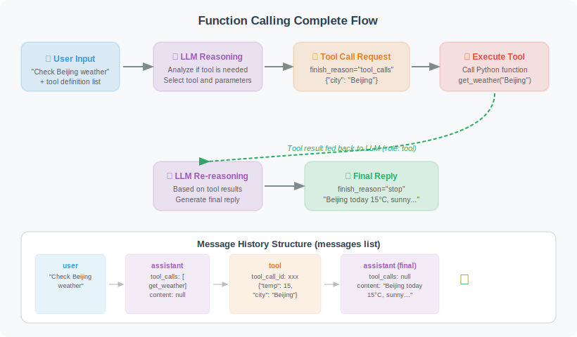
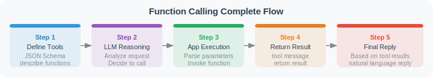

# Function Calling Mechanism Explained

Function Calling is an important feature introduced by OpenAI in June 2023, allowing models to output structured function call instructions. In August 2024, OpenAI further introduced **Structured Outputs**, using the `strict: true` parameter to ensure that model-generated parameters 100% conform to JSON Schema, greatly improving reliability in production environments. Understanding its complete mechanism is the foundation for building reliable Agents.

In traditional LLM usage, models can only output plain text. But many real-world tasks — checking weather, sending emails, querying databases — require interaction with external systems. Function Calling solves exactly this problem: **it lets LLMs not just "say" things, but also "do" things.**

The core idea is actually quite simple: we tell the model "what tools you have available," and after analyzing the user's question, if the model decides it needs to use a tool, it outputs a structured JSON telling us "please call this function with these parameters." The model itself doesn't execute the function — execution is done by our code — and then the result is fed back to the model so it can compose the final answer.

## The Complete Function Calling Flow



> 🎬 **Interactive Animation**: Watch the complete message-passing process between the user, LLM, and tool engine — including the full 5-step communication protocol for multi-turn tool calls, to understand how Function Calling transforms an LLM from "only talking" to "getting things done."
>
> <a href="../animations/function_calling.html" target="_blank" style="display:inline-block;padding:8px 16px;background:#9C27B0;color:white;border-radius:6px;text-decoration:none;font-weight:bold;">▶ Open Function Calling Interactive Animation</a>

The entire process is divided into 5 steps:

1. **Define tools**: Describe the function's name, parameters, and purpose using JSON Schema
2. **Send request**: Send the user message and tool list together to the LLM
3. **Model decision**: The LLM analyzes and decides whether to answer directly or call a tool
4. **Execute tool**: Our code executes the function specified by the model and gets the result
5. **Generate answer**: Return the tool result to the LLM, which generates the final reply

This process may loop multiple times — for example, if the user asks "What's the weather in Beijing? If it's raining, send me an email reminder," the model will first call the weather tool, then decide based on the result whether to call the email tool.



> The diagram above shows the complete message flow for multi-turn tool calls: in each loop, tool results are appended to the history as `role: "tool"` messages, and the LLM decides based on the full context whether to continue calling tools or give the final answer.

## Complete Code Implementation

Below is a complete Function Calling example. We define two tools (check weather and send email), then implement an execution loop that allows the Agent to automatically call these tools.

```python
import json
from openai import OpenAI
import requests

client = OpenAI()

# ========== Step 1: Define tool functions ==========

def get_weather(city: str, unit: str = "celsius") -> dict:
    """Get city weather (simulated implementation)"""
    # In a real project, call an actual weather API
    weather_data = {
        "Beijing": {"temp": 15, "condition": "Sunny", "humidity": 40},
        "Shanghai": {"temp": 18, "condition": "Cloudy", "humidity": 65},
        "Guangzhou": {"temp": 25, "condition": "Light Rain", "humidity": 80},
    }
    
    data = weather_data.get(city, {"temp": 20, "condition": "Unknown", "humidity": 50})
    
    if unit == "fahrenheit":
        data["temp"] = data["temp"] * 9/5 + 32
        data["unit"] = "°F"
    else:
        data["unit"] = "°C"
    
    return {
        "city": city,
        "temperature": f"{data['temp']}{data['unit']}",
        "condition": data["condition"],
        "humidity": f"{data['humidity']}%"
    }

def send_email(to: str, subject: str, body: str) -> dict:
    """Send email (simulated implementation)"""
    # In a real project, call an email API
    print(f"[Simulated] Sending email to {to}")
    print(f"Subject: {subject}")
    print(f"Body: {body[:50]}...")
    
    return {
        "status": "success",
        "message_id": "MSG-12345",
        "recipient": to
    }

# ========== Step 2: Define OpenAI tool format ==========
# Note: The description field is crucial — the model uses it to judge "when to use this tool."
# The more precise the description (including applicable scenarios, parameter meanings, return content),
# the more accurate the model's calling decisions will be.
# strict: True enables structured output, ensuring model-generated parameters 100% conform to JSON Schema
# (recommended for production environments)

tools = [
    {
        "type": "function",
        "function": {
            "name": "get_weather",
            "description": "Get the current real-time weather information for a specified city, including temperature, weather conditions, and humidity. Only use this for querying current weather, not for forecasting future weather.",
            "strict": True,
            "parameters": {
                "type": "object",
                "properties": {
                    "city": {
                        "type": "string",
                        "description": "City name, e.g.: Beijing, Shanghai, Guangzhou"
                    },
                    "unit": {
                        "type": "string",
                        "enum": ["celsius", "fahrenheit"],
                        "description": "Temperature unit: celsius or fahrenheit"
                    }
                },
                "required": ["city", "unit"],
                "additionalProperties": False
            }
        }
    },
    {
        "type": "function",
        "function": {
            "name": "send_email",
            "description": "Send an email to a specified address. Only call this when the user explicitly requests sending an email. Do not send automatically without user confirmation.",
            "strict": True,
            "parameters": {
                "type": "object",
                "properties": {
                    "to": {
                        "type": "string",
                        "description": "Recipient email address"
                    },
                    "subject": {
                        "type": "string",
                        "description": "Email subject"
                    },
                    "body": {
                        "type": "string",
                        "description": "Email body content"
                    }
                },
                "required": ["to", "subject", "body"],
                "additionalProperties": False
            }
        }
    }
]

# Tool function mapping
tool_functions = {
    "get_weather": get_weather,
    "send_email": send_email,
}

# ========== Step 3: Implement the Agent execution loop ==========

def run_agent(user_message: str) -> str:
    """Run the Agent, handling the tool call loop"""
    
    messages = [{"role": "user", "content": user_message}]
    
    print(f"\nUser: {user_message}")
    
    while True:
        # Call the LLM
        response = client.chat.completions.create(
            model="gpt-4o",
            messages=messages,
            tools=tools,
            tool_choice="auto"
        )
        
        message = response.choices[0].message
        finish_reason = response.choices[0].finish_reason
        
        # Add assistant message to history
        messages.append(message)
        
        # Case 1: Model answers directly, no tools needed
        if finish_reason == "stop":
            print(f"\nAssistant: {message.content}")
            return message.content
        
        # Case 2: Model requests tool calls
        if finish_reason == "tool_calls":
            # Handle all tool calls (may call multiple simultaneously)
            for tool_call in message.tool_calls:
                func_name = tool_call.function.name
                func_args = json.loads(tool_call.function.arguments)
                
                print(f"\n[Tool Call] {func_name}({func_args})")
                
                # Execute tool (with error handling: feed error info back to model on failure,
                # letting it decide what to do next)
                func = tool_functions.get(func_name)
                if func:
                    try:
                        result = func(**func_args)
                        result_str = json.dumps(result, ensure_ascii=False)
                    except Exception as e:
                        result_str = json.dumps({"error": str(e), "status": "failed"})
                else:
                    result_str = json.dumps({"error": f"Unknown tool {func_name}", "status": "failed"})
                
                print(f"[Tool Result] {result_str}")
                
                # Add tool result to message history
                messages.append({
                    "role": "tool",
                    "tool_call_id": tool_call.id,
                    "content": result_str
                })
            
            # Continue the loop, let the LLM process the tool results
            continue
        
        # Other cases (timeout, etc.)
        break
    
    return "Processing failed"

# ========== Tests ==========

# Test 1: Query weather
run_agent("What's the weather like in Beijing and Shanghai today?")

# Test 2: Composite task
run_agent("Check the weather in Beijing. If the temperature is below 10°C, send an email to boss@company.com reminding them to bring an umbrella.")
```

Let's step through the key design decisions in the code above:

**Tool definition JSON Schema**: Notice the format of each tool in the `tools` list — `name` is the function name, `description` tells the model "when to use this tool," and `parameters` describes parameter types and meanings. This Schema is sent to the LLM along with the request, and the model uses it to understand the capability boundaries of the tool.

**Tool description quality is critical**: The `description` field is the core basis for model decision-making. A good tool description should include: when to use the tool (applicable scenarios), when not to use it (inapplicable scenarios), and the specific meaning and format of each parameter. Vague descriptions lead to the model calling tools incorrectly or missing calls — for example, describing `send_email` as "handle email-related tasks" might cause the model to call it even when the user is just asking "how do I write an email."

**`strict: true` mode**: Adding `"strict": True` to the tool definition enables structured output, ensuring model-generated parameters strictly conform to JSON Schema. When enabled, you also need to set `"additionalProperties": False` and put all parameters in the `required` list. This is strongly recommended in production environments to avoid runtime crashes caused by missing parameters or type errors.

**Error handling**: Tool execution should be wrapped in `try/except`. When a tool call fails, don't throw an exception to interrupt the flow — instead, return the error information in JSON format to the model. The model will then make its own decision, such as retrying with different parameters or informing the user that the operation failed.

**Execution loop (Agent Loop)**: The core of the `run_agent` function is a `while True` loop. In each iteration, we send the complete message history (including previous tool call results) to the LLM. After the model responds, we check `finish_reason`: if it's `"stop"`, the model has given its final answer; if it's `"tool_calls"`, the model needs to use tools. After executing the tools, we append the results as `role: "tool"` messages to the history and continue to the next iteration.

**Tool function mapping**: The `tool_functions` dictionary maps function name strings to actual Python functions. This design decouples tool calling from tool registration — you only need to add a new mapping to the dictionary to give the Agent new capabilities.

## Controlling tool_choice

The `tool_choice` parameter lets you precisely control the model's strategy for using tools. This is very useful in different scenarios:

- **auto** (default): The model decides whether tools are needed — sufficient for most cases
- **none**: Forces the model not to use any tools, suitable when you only want a plain text answer
- **required**: Forces the model to use tools, suitable when you're certain the request requires tools
- **Specify a tool**: Forces use of a specific tool, suitable for testing or highly deterministic scenarios

```python
# tool_choice controls the model's strategy for using tools

# 1. "auto" (default): LLM decides
response = client.chat.completions.create(
    model="gpt-4o",
    messages=messages,
    tools=tools,
    tool_choice="auto"
)

# 2. "none": Prohibit tool use, answer directly
response = client.chat.completions.create(
    model="gpt-4o",
    messages=messages,
    tools=tools,
    tool_choice="none"
)

# 3. "required": Force tool use
response = client.chat.completions.create(
    model="gpt-4o",
    messages=messages,
    tools=tools,
    tool_choice="required"
)

# 4. Specify a particular tool
response = client.chat.completions.create(
    model="gpt-4o",
    messages=messages,
    tools=tools,
    tool_choice={"type": "function", "function": {"name": "get_weather"}}
)
```

## Parallel Tool Calls

When a user makes a request containing multiple independent subtasks — such as "check the weather in Beijing, Shanghai, and Guangzhou simultaneously" — having the model call tools one by one is inefficient. GPT-4 supports **Parallel Tool Calls**, returning multiple tool call instructions in a single request so we can execute them simultaneously.

This feature is critical for performance. Suppose you have 3 independent API calls: sequential execution requires 3× the wait time, while parallel execution only requires the time of the slowest one. The code below uses `concurrent.futures` to achieve true parallel execution:

> ⚠️ **Note**: Parallel calls are suitable for scenarios where tools are **mutually independent**. If there are sequential dependencies between tools (e.g., first check the weather, then decide whether to send an email based on the result), set `parallel_tool_calls=False` to force the model to call tools sequentially, avoiding logic errors when a later tool depends on the result of an earlier one.

```python
def run_parallel_tools(user_message: str) -> str:
    """Agent supporting parallel tool calls"""
    
    messages = [{"role": "user", "content": user_message}]
    
    response = client.chat.completions.create(
        model="gpt-4o",
        messages=messages,
        tools=tools,
        tool_choice="auto",
        parallel_tool_calls=True  # Allow parallel calls
    )
    
    message = response.choices[0].message
    
    if message.tool_calls:
        print(f"Calling {len(message.tool_calls)} tools in parallel:")
        
        # Execute all tools in parallel (can use asyncio for true parallelism)
        import concurrent.futures
        
        def execute_tool(tool_call):
            func_name = tool_call.function.name
            func_args = json.loads(tool_call.function.arguments)
            func = tool_functions.get(func_name)
            result = func(**func_args) if func else "Unknown tool"
            return tool_call.id, json.dumps(result, ensure_ascii=False)
        
        with concurrent.futures.ThreadPoolExecutor() as executor:
            futures = [executor.submit(execute_tool, tc) for tc in message.tool_calls]
            results = [f.result() for f in futures]
        
        messages.append(message)
        
        for tool_call_id, result in results:
            messages.append({
                "role": "tool",
                "tool_call_id": tool_call_id,
                "content": result
            })
        
        # Get the final reply
        final_response = client.chat.completions.create(
            model="gpt-4o",
            messages=messages
        )
        return final_response.choices[0].message.content
    
    return message.content

# Test parallel calls
result = run_parallel_tools("Check the weather in Beijing, Shanghai, and Guangzhou simultaneously")
print(result)

# Disable parallel calls (use when tools have sequential dependencies)
response = client.chat.completions.create(
    model="gpt-4o",
    messages=messages,
    tools=tools,
    parallel_tool_calls=False  # Force sequential calls, suitable for dependent tool chains
)
```

## Auto-generating Tool Schema with Pydantic

You may have noticed that writing JSON Schema by hand is tedious and error-prone — a misspelled parameter name or wrong type can cause model calls to fail. A more elegant approach is to use Pydantic models to auto-generate the Schema.

Pydantic's `model_json_schema()` method can automatically convert Python type annotations into standard JSON Schema, so you only need to define a Pydantic model to describe the tool's input parameters and the Schema is generated automatically. This not only reduces the chance of errors but also makes the code more maintainable — when you modify parameters, you only need to change the Pydantic model and the Schema updates automatically.

```python
from pydantic import BaseModel, Field
from typing import Optional, Literal
import inspect
import json

def create_tool_from_pydantic(
    func,
    input_model: type[BaseModel],
    description: str
) -> dict:
    """Auto-generate tool definition from a Pydantic model"""
    schema = input_model.model_json_schema()
    
    # Remove Pydantic-specific fields
    schema.pop("title", None)
    
    return {
        "type": "function",
        "function": {
            "name": func.__name__,
            "description": description,
            "parameters": schema
        }
    }

# Example
class WeatherInput(BaseModel):
    city: str = Field(..., description="City name")
    unit: Literal["celsius", "fahrenheit"] = Field(
        default="celsius",
        description="Temperature unit"
    )

weather_tool = create_tool_from_pydantic(
    get_weather,
    WeatherInput,
    "Get weather information for a specified city"
)

print(json.dumps(weather_tool, ensure_ascii=False, indent=2))
```

---

## The Relationship Between Function Calling and MCP

After learning Function Calling, you may encounter another concept: **MCP (Model Context Protocol)**, a tool calling protocol introduced by Anthropic in late 2024 that rapidly became an industry standard in 2025. Their relationship can be understood as follows:

| Dimension | Function Calling | MCP |
|-----------|-----------------|-----|
| Positioning | Single-platform tool calling mechanism | Cross-platform standardized protocol |
| Platform dependency | Tied to a specific LLM platform (e.g., OpenAI API) | Platform-agnostic, supports any model |
| Tool reuse | Tool code is tightly coupled to the model | Tools exist as independent services, reusable |
| Applicable scenarios | Quick integration, single-model projects | Multi-model scenarios, tools needing cross-project reuse |
| Learning curve | Low, direct API calls | Slightly higher, requires understanding Client/Server architecture |

Function Calling is the **foundation** for understanding Agent tool calling; MCP is the **standardized evolution** built on top of it. Once you understand the principles of Function Calling, understanding MCP comes naturally — essentially, MCP extracts tool definitions and execution from code into an independent, reusable service.

---

## Summary

Key points of Function Calling:

| Point | Description |
|-------|-------------|
| Tool definition | JSON Schema format, describing function name, parameters, and purpose |
| Description quality | `description` is the core basis for model decisions; must clearly state applicable/inapplicable scenarios |
| strict mode | `strict: true` + `additionalProperties: false`, ensures parameters 100% conform to Schema |
| Execution loop | LLM → tool call request → execute → feed back result → LLM |
| Error handling | Return error JSON to model on tool failure, let model decide to retry or report error |
| tool_choice | Controls tool usage strategy (auto/none/required/specify) |
| Parallel calls | Independent tools can execute in parallel; use `parallel_tool_calls=False` for sequential dependencies |
| MCP | Standardized evolution of Function Calling, enabling cross-platform tool reuse |

---

*Next section: [4.3 Designing and Implementing Custom Tools](./03_custom_tools.md)*