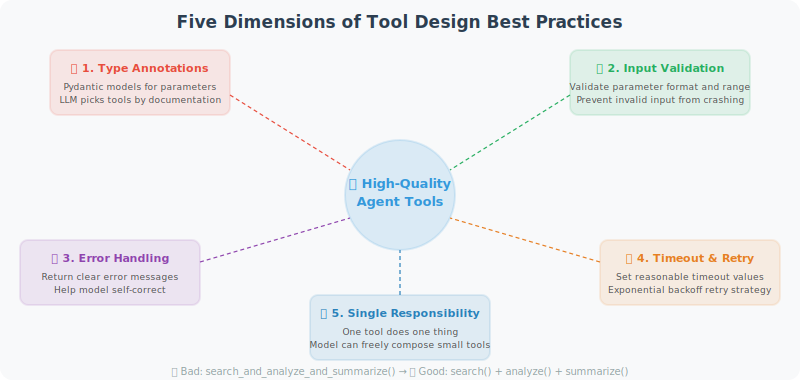

# Designing and Implementing Custom Tools

Good tool design is the key to Agent success. If the LLM is the Agent's "brain," then tools are its "hands and feet" — no matter how smart the brain is, clumsy hands and feet will prevent it from doing things well.

In real development, the root cause of many underperforming Agents is not insufficient model capability, but problems with tool design: vague tool descriptions cause the model to select the wrong tool, missing input validation causes tools to crash, and unclear error messages prevent the model from self-correcting. This section takes a practical perspective to systematically explain how to design high-quality, reliable Agent tools.



## Tool Design Principles

**Single Responsibility**: Each tool does one thing and does it well.

This is not just a software engineering dogma — it has a direct impact on Agent performance. A "large and comprehensive" tool confuses the model: "Which parameters should I pass? What exactly can this tool do?" Multiple small tools with clear responsibilities can be freely combined by the model based on the task, which actually provides greater flexibility.

```python
# ❌ Bad: one tool does too many things
def search_and_analyze_and_summarize(query, analyze=True, summarize=True):
    results = search(query)
    if analyze:
        analysis = analyze_data(results)
    if summarize:
        summary = summarize_text(results)
    return ...

# ✅ Good: split into independent tools
def search_web(query: str) -> list:
    """Only responsible for searching"""
    ...

def analyze_data(data: list) -> dict:
    """Only responsible for analysis"""
    ...

def summarize_text(text: str) -> str:
    """Only responsible for summarization"""
    ...
```

## Tool Development Best Practices

Below we explain tool development best practices across five dimensions, each with complete code examples.

### 1. Complete Type Annotations and Documentation

A tool's type annotations and docstrings are not just for humans — they're for the LLM too. The model uses the tool's description and parameter documentation to decide when to use it and how to pass parameters. A poorly described tool may cause the model to pass parameters in the wrong format, or fail to use the tool when it should.

The following example shows the documentation standards a "qualified" tool function should have — parameter descriptions, return format, and usage examples all included:

```python
from typing import Optional, List, Literal
from pydantic import BaseModel, Field
import datetime

def fetch_stock_price(
    symbol: str,
    start_date: str,
    end_date: Optional[str] = None,
    interval: Literal["1d", "1w", "1mo"] = "1d"
) -> dict:
    """
    Fetch historical stock price data.
    
    Args:
        symbol: Stock ticker symbol, e.g. 'AAPL', '600036.SS' (A-shares with suffix)
        start_date: Start date in 'YYYY-MM-DD' format
        end_date: End date in 'YYYY-MM-DD' format, defaults to today
        interval: Data interval: '1d'=daily, '1w'=weekly, '1mo'=monthly
    
    Returns:
        Dictionary with dates and prices in the format:
        {
            "symbol": "AAPL",
            "data": [{"date": "2024-01-01", "close": 150.0, ...}],
            "currency": "USD"
        }
    
    Examples:
        fetch_stock_price("AAPL", "2024-01-01", "2024-03-01")
        fetch_stock_price("600036.SS", "2024-01-01", interval="1w")
    """
    if end_date is None:
        end_date = datetime.date.today().isoformat()
    
    # Actual implementation (using simulated data here)
    return {
        "symbol": symbol,
        "start": start_date,
        "end": end_date,
        "interval": interval,
        "data": [
            {"date": start_date, "close": 150.0, "volume": 1000000}
        ],
        "currency": "USD" if "." not in symbol else "CNY"
    }
```

### 2. Robust Error Handling

Tool calls in an Agent have one fundamental difference from ordinary function calls: **the tool's error messages will be seen by the LLM, which may decide its next action based on them.** Therefore, tools cannot simply throw exceptions and crash the program — they should return clear error descriptions so the model can understand what happened and respond appropriately — such as retrying with different parameters, or informing the user.

The `ToolResult` dataclass below encapsulates a unified return format: whether success or failure, it always returns a structured result object rather than letting exceptions bubble up to the calling layer.

```python
from enum import Enum
from dataclasses import dataclass
from typing import Union

@dataclass
class ToolResult:
    """Unified format for tool execution results"""
    success: bool
    data: Union[dict, list, str, None] = None
    error: Optional[str] = None
    
    def to_string(self) -> str:
        if self.success:
            import json
            return json.dumps(self.data, ensure_ascii=False, indent=2)
        else:
            return f"Tool execution failed: {self.error}"

def safe_web_request(url: str, method: str = "GET", timeout: int = 10) -> ToolResult:
    """
    Send an HTTP request (with comprehensive error handling)
    
    Args:
        url: Request URL
        method: HTTP method (GET/POST)
        timeout: Timeout in seconds
    """
    import requests
    
    try:
        response = requests.request(
            method=method,
            url=url,
            timeout=timeout,
            headers={"User-Agent": "AgentBot/1.0"}
        )
        
        response.raise_for_status()
        
        return ToolResult(
            success=True,
            data={
                "status_code": response.status_code,
                "content": response.text[:2000],  # Limit length
                "headers": dict(response.headers)
            }
        )
    
    except requests.exceptions.Timeout:
        return ToolResult(success=False, error=f"Request timed out ({timeout}s)")
    
    except requests.exceptions.ConnectionError:
        return ToolResult(success=False, error="Network connection failed")
    
    except requests.exceptions.HTTPError as e:
        return ToolResult(
            success=False, 
            error=f"HTTP error {e.response.status_code}: {e.response.text[:200]}"
        )
    
    except Exception as e:
        return ToolResult(success=False, error=f"Unknown error: {str(e)}")
```

### 3. Input Validation

Parameters generated by LLMs are not always valid. The model may pass a malformed email address, an overly long text, or even a parameter with the wrong type. If we execute without validation, at best we get wrong results, at worst we cause crashes or security issues.

Using Pydantic for input validation is an elegant solution — it provides automatic type conversion and clear error messages. When validation fails, we return a human-readable error description; the model typically sees this and corrects the parameters before retrying.

```python
from pydantic import BaseModel, field_validator, ValidationError
import re

class EmailInput(BaseModel):
    to: str
    subject: str
    body: str
    cc: Optional[List[str]] = None
    
    @field_validator("to")
    @classmethod
    def validate_email(cls, v: str) -> str:
        pattern = r'^[a-zA-Z0-9._%+-]+@[a-zA-Z0-9.-]+\.[a-zA-Z]{2,}$'
        if not re.match(pattern, v):
            raise ValueError(f"Invalid email address: {v}")
        return v
    
    @field_validator("subject")
    @classmethod
    def validate_subject(cls, v: str) -> str:
        if len(v) > 200:
            raise ValueError("Email subject cannot exceed 200 characters")
        return v
    
    @field_validator("body")
    @classmethod
    def validate_body(cls, v: str) -> str:
        if len(v) > 50000:
            raise ValueError("Email body cannot exceed 50,000 characters")
        return v

def send_email_safe(to: str, subject: str, body: str, cc: Optional[List[str]] = None) -> str:
    """Email sending tool with input validation"""
    try:
        # Validate input
        email_input = EmailInput(to=to, subject=subject, body=body, cc=cc)
        
        # Execute sending (simulated here)
        print(f"Sending email to: {email_input.to}")
        
        return f"Email successfully sent to {to}"
    
    except ValidationError as e:
        errors = [f"{err['loc'][0]}: {err['msg']}" for err in e.errors()]
        return f"Input validation failed: {'; '.join(errors)}"
```

### 4. Tool Decorator: Automated Tool Registration

As the number of tools grows, manually writing JSON Schema for each tool becomes increasingly tedious. A better approach is to design a **Tool Registry** — using a decorator to automatically extract parameter information from function signatures and generate the Schema format required by OpenAI.

The core idea of this pattern is: **tool definition and registration should be unified**. You only need to write the function and add the `@registry.register()` decorator, and the system automatically handles Schema generation, function mapping, and tool list management.

```python
from functools import wraps
from typing import Callable, get_type_hints
import inspect

class ToolRegistry:
    """Tool registration center"""
    
    def __init__(self):
        self._tools: dict[str, Callable] = {}
        self._schemas: list[dict] = []
    
    def register(self, description: str = None):
        """Tool registration decorator"""
        def decorator(func: Callable):
            # Auto-generate JSON Schema from function signature
            schema = self._generate_schema(func, description)
            
            self._tools[func.__name__] = func
            self._schemas.append(schema)
            
            @wraps(func)
            def wrapper(*args, **kwargs):
                return func(*args, **kwargs)
            
            return wrapper
        return decorator
    
    def _generate_schema(self, func: Callable, description: str = None) -> dict:
        """Auto-generate OpenAI tool Schema from a function"""
        sig = inspect.signature(func)
        hints = get_type_hints(func)
        docstring = inspect.getdoc(func) or ""
        
        properties = {}
        required = []
        
        for param_name, param in sig.parameters.items():
            if param_name == "self":
                continue
            
            param_type = hints.get(param_name, str)
            type_map = {
                str: "string",
                int: "integer",
                float: "number",
                bool: "boolean",
                list: "array",
                dict: "object",
            }
            
            properties[param_name] = {
                "type": type_map.get(param_type, "string"),
                "description": f"Parameter: {param_name}"
            }
            
            if param.default == inspect.Parameter.empty:
                required.append(param_name)
        
        return {
            "type": "function",
            "function": {
                "name": func.__name__,
                "description": description or docstring.split('\n')[0],
                "parameters": {
                    "type": "object",
                    "properties": properties,
                    "required": required
                }
            }
        }
    
    def execute(self, tool_name: str, **kwargs) -> str:
        """Execute a tool"""
        func = self._tools.get(tool_name)
        if not func:
            return f"Error: tool '{tool_name}' is not registered"
        try:
            result = func(**kwargs)
            return str(result)
        except Exception as e:
            return f"Tool execution error: {str(e)}"
    
    @property
    def schemas(self) -> list:
        return self._schemas

# Usage example
registry = ToolRegistry()

@registry.register("Search the internet for real-time information")
def search_web(query: str) -> str:
    """Search the internet"""
    return f"Search results: latest information about '{query}'..."

@registry.register("Evaluate a mathematical expression")
def calculate(expression: str) -> str:
    """Perform a math calculation"""
    result = eval(expression, {"__builtins__": {}}, {"__import__": None})
    return f"{expression} = {result}"

@registry.register("Get the current date and time")
def get_time() -> str:
    """Get the current time"""
    return datetime.datetime.now().strftime("%Y-%m-%d %H:%M:%S")

# Auto-generated schemas can be passed directly to OpenAI
print(f"{len(registry.schemas)} tools registered")
```

### 5. Tools with Caching (Improve Performance, Reduce Costs)

During reasoning, an Agent may call the same tool multiple times to get the same information. For example, if the user asks "What's the weather in Beijing? Is it suitable for outdoor activities?", the model might query the weather once during analysis and again during the response. If tool calls involve paid APIs or network requests, repeated calls waste time and money.

Adding caching to tools is a common optimization. The `CachedTool` wrapper below implements a file-based caching mechanism with TTL (cache expiration time) — calls with the same parameters return cached results within the TTL without actually executing the tool function.

```python
import hashlib
import pickle
import os
from datetime import datetime, timedelta

class CachedTool:
    """Tool wrapper with caching"""
    
    def __init__(self, tool_func: Callable, ttl_seconds: int = 3600):
        self.tool_func = tool_func
        self.ttl = ttl_seconds
        self.cache_dir = ".tool_cache"
        os.makedirs(self.cache_dir, exist_ok=True)
    
    def _get_cache_key(self, **kwargs) -> str:
        """Generate a cache key"""
        content = f"{self.tool_func.__name__}:{sorted(kwargs.items())}"
        return hashlib.md5(content.encode()).hexdigest()
    
    def _get_cache_path(self, key: str) -> str:
        return os.path.join(self.cache_dir, f"{key}.pkl")
    
    def __call__(self, **kwargs) -> str:
        """Execute the tool (return from cache if available)"""
        key = self._get_cache_key(**kwargs)
        cache_path = self._get_cache_path(key)
        
        # Check cache
        if os.path.exists(cache_path):
            with open(cache_path, 'rb') as f:
                cached = pickle.load(f)
            
            if datetime.now() - cached['time'] < timedelta(seconds=self.ttl):
                print(f"[Cache hit] {self.tool_func.__name__}")
                return cached['result']
        
        # Execute tool
        result = self.tool_func(**kwargs)
        
        # Save to cache
        with open(cache_path, 'wb') as f:
            pickle.dump({'result': result, 'time': datetime.now()}, f)
        
        return result

# Use caching for slow or paid tools
cached_search = CachedTool(search_web, ttl_seconds=3600)  # Cache for 1 hour
```

---

## Summary

Characteristics of high-quality tools:
- ✅ **Single responsibility**: One tool does one thing
- ✅ **Type annotations**: Clear input and output types
- ✅ **Error handling**: All exceptions are caught and return meaningful error messages
- ✅ **Input validation**: Prevents invalid input from causing crashes
- ✅ **Appropriate caching**: Use caching for slow/paid operations

---

*Next section: [4.4 Writing Effective Tool Descriptions](./04_tool_description.md)*
