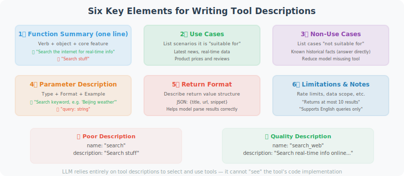

# Writing Effective Tool Descriptions

Tool descriptions are the key information that tells the LLM "what this tool is, when to use it, and how to use it." Description quality directly determines whether the LLM can correctly select and call tools.



## Why Are Tool Descriptions So Important?

LLMs select tools entirely based on tool descriptions — they cannot "see" the tool's code implementation:

```python
# Bad description → LLM may select the wrong tool or pass wrong parameters
{
    "name": "search",
    "description": "Search for things",  # Too vague!
    "parameters": {
        "query": {"type": "string"}  # No explanation of expected format
    }
}

# High-quality description → LLM can accurately understand and use the tool
{
    "name": "search_web",
    "description": """Search the internet for real-time information.
    
    Suitable for:
    - Querying the latest news and current events
    - Getting product prices and reviews
    - Finding content on specific websites
    - Getting real-time data like weather and stock prices
    
    Not suitable for:
    - Known historical knowledge (answer directly instead)
    - Tasks requiring deep analysis (search first, then analyze)""",
    
    "parameters": {
        "query": {
            "type": "string",
            "description": "Search keywords, keep concise and clear. E.g.: 'Beijing 2024 weather forecast' rather than 'I want to know what the weather will be like in Beijing tomorrow'"
        }
    }
}
```

## Six Elements of Writing Tool Descriptions

### 1. Clear Functional Description (One-liner)

The first sentence is the most important — it's the basis for the LLM deciding whether to consider this tool:

```python
# The first sentence should contain: verb + object + core characteristic

# ❌ Vague
"description": "Process text"

# ✅ Clear
"description": "Translate text from any language into a specified target language, preserving the original format and tone"
```

### 2. Applicable Scenarios (When to Use)

```python
good_description = """
Query real-time financial data for a specified company or stock ticker.

Suitable for:
- Getting real-time stock prices and percentage changes
- Querying company fundamentals like market cap and P/E ratio
- Getting recent financial statement data (revenue, profit, etc.)
- Comparing key metrics across multiple stocks

Not suitable for:
- Predicting stock price trends (that requires your analysis; this tool only provides data)
- Getting historical data beyond 5 years (use the get_historical_data tool instead)
"""
```

### 3. Parameter Descriptions (Precise Explanation of Each Parameter)

```python
# Parameter descriptions should include: type, meaning, format requirements, example values

parameters = {
    "type": "object",
    "properties": {
        "symbol": {
            "type": "string",
            "description": """Stock ticker symbol.
            - US stocks: e.g. 'AAPL' (Apple), 'GOOGL' (Google)
            - A-shares: e.g. '600036.SS' (CMB), '000001.SZ' (PAB)
            - HK stocks: e.g. '0700.HK' (Tencent)
            Format requirement: uppercase letters; A-shares require exchange suffix (.SS/.SZ/.HK)"""
        },
        "metric": {
            "type": "string",
            "enum": ["price", "pe", "pb", "market_cap", "revenue"],
            "description": """The metric type to query:
            - price: current stock price
            - pe: price-to-earnings ratio
            - pb: price-to-book ratio
            - market_cap: market capitalization (in 100M)
            - revenue: most recent quarterly revenue (in 100M)"""
        }
    },
    "required": ["symbol", "metric"]
}
```

### 4. Return Value Description

```python
# Tell the LLM what format the tool returns, so it can interpret the results
description = """
...

Return format:
{
    "symbol": "AAPL",
    "name": "Apple Inc.",
    "price": 150.5,
    "currency": "USD",
    "change_percent": "+1.2%",
    "last_updated": "2024-01-15 15:30:00"
}

If the query fails, returns: {"error": "reason for error"}
"""
```

### 5. Limitations and Notes

```python
description = """
Execute SQL queries against the database.

⚠️ Important limitations:
- Only SELECT queries are allowed; INSERT/UPDATE/DELETE are not supported
- Each query returns at most 1,000 records
- Query timeout limit: 30 seconds
- Table names must be known business tables; do not guess

Available tables: users, orders, products, inventory, logs
To learn about table structure, first use the get_table_schema tool
"""
```

### 6. Usage Examples

```python
description = """
Send a WeCom (WeChat Work) message to a specified user or group.

Example usage:
- Send to individual: to="John Smith", message="Meeting starts at 10am"
- Send to group: to="@Product Team", message="New version has been released"
- Send with @mention: to="@All", message="@Jane Doe please review the latest document"

Note: The 'to' field supports usernames or employee IDs (e.g. empXXXX)
"""
```

## Tool Description Template

```python
def create_tool_schema(
    name: str,
    one_liner: str,
    when_to_use: list[str],
    when_not_to_use: list[str],
    parameters: dict,
    returns: str,
    notes: list[str] = None
) -> dict:
    """Generate a tool Schema in standard format"""
    
    description_parts = [one_liner, ""]
    
    if when_to_use:
        description_parts.append("Suitable for:")
        for item in when_to_use:
            description_parts.append(f"- {item}")
        description_parts.append("")
    
    if when_not_to_use:
        description_parts.append("Not suitable for:")
        for item in when_not_to_use:
            description_parts.append(f"- {item}")
        description_parts.append("")
    
    description_parts.append(f"Returns: {returns}")
    
    if notes:
        description_parts.append("")
        description_parts.append("Notes:")
        for note in notes:
            description_parts.append(f"⚠️ {note}")
    
    return {
        "type": "function",
        "function": {
            "name": name,
            "description": "\n".join(description_parts),
            "parameters": {
                "type": "object",
                "properties": parameters,
                "required": [k for k, v in parameters.items() 
                           if not v.get("default")]
            }
        }
    }

# Usage example
email_tool = create_tool_schema(
    name="send_email",
    one_liner="Send an email to a specified address, supporting HTML format and attachments",
    when_to_use=[
        "User requests sending a notification or report",
        "Need to communicate analysis results via email",
        "Scheduled reminder tasks"
    ],
    when_not_to_use=[
        "Real-time notifications (use message push instead)",
        "Sending large amounts of data (use file transfer instead)"
    ],
    parameters={
        "to": {
            "type": "string",
            "description": "Recipient email address; separate multiple addresses with commas"
        },
        "subject": {
            "type": "string",
            "description": "Email subject; keep concise (under 50 characters recommended)"
        },
        "body": {
            "type": "string",
            "description": "Email body; supports plain text or HTML"
        },
        "format": {
            "type": "string",
            "enum": ["plain", "html"],
            "description": "Body format: plain=plain text, html=HTML",
            "default": "plain"
        }
    },
    returns="Returns message ID on success, error message on failure",
    notes=["Sending limit: 100 emails per hour", "Attachments larger than 10MB are not supported"]
)
```

## Description Strategy for Multi-Tool Scenarios

When there are many tools, pay special attention to distinguishing similar tools:

```python
# Distinguishing search-type tools
search_tools = [
    {
        "name": "search_web",
        "description": """General web search, suitable for finding: news, encyclopedia knowledge, product reviews.
        Search results include summaries, not full page content."""
    },
    {
        "name": "search_academic",
        "description": """Academic paper search (Google Scholar/ArXiv), suitable for finding:
        academic research, technical reports, dissertations. Returns paper title, authors, and abstract."""
    },
    {
        "name": "search_code",
        "description": """Code search (GitHub/Stack Overflow), suitable for finding:
        open-source code examples, programming solutions, code snippets."""
    },
    {
        "name": "browse_url",
        "description": """Visit a specified URL and return the full page content.
        Use when you already have a URL and need to read it in detail, not for searching unknown content."""
    }
]
```

## Testing Tool Description Quality

```python
def test_tool_description_quality(tool_schema: dict, test_cases: list) -> None:
    """
    Test tool description quality
    Give the LLM a series of scenarios and see if it correctly selects the tool
    """
    from openai import OpenAI
    
    client = OpenAI()
    
    print(f"Testing tool: {tool_schema['function']['name']}")
    print("=" * 50)
    
    for case in test_cases:
        response = client.chat.completions.create(
            model="gpt-4o-mini",
            messages=[{"role": "user", "content": case["input"]}],
            tools=[tool_schema],
            tool_choice="auto"
        )
        
        message = response.choices[0].message
        if message.tool_calls:
            tool_name = message.tool_calls[0].function.name
            tool_args = message.tool_calls[0].function.arguments
            result = "✅ Correct call" if tool_name == tool_schema["function"]["name"] else "❌ Wrong tool"
            print(f"{result} | Input: {case['input'][:30]}...")
            if case.get("expected_args"):
                print(f"  Expected args: {case['expected_args']}")
                print(f"  Actual args: {tool_args}")
        else:
            expected_call = case.get("should_call", True)
            if not expected_call:
                print(f"✅ Correctly skipped | Input: {case['input'][:30]}...")
            else:
                print(f"❌ Tool not called | Input: {case['input'][:30]}...")

# Test example
test_tool_description_quality(
    tool_schema=email_tool,
    test_cases=[
        {"input": "Send an email to boss@company.com saying the meeting is postponed to 3pm", "should_call": True},
        {"input": "What is the SMTP protocol?", "should_call": False},
        {"input": "Please notify team@xxx.com that the project is complete", "should_call": True},
    ]
)
```

---

## Summary

Key elements of tool descriptions:
1. **One-liner functional description** (LLM's first judgment criterion)
2. **Applicable / inapplicable scenarios** (helps LLM make the right choice)
3. **Precise parameter descriptions** (including format, examples, enum values)
4. **Return value format** (helps LLM interpret results)
5. **Limitations and notes** (prevents incorrect usage)

Good tool descriptions can significantly improve Agent reliability.

---

*Next section: [4.5 Hands-on: Search Engine + Calculator Agent](./05_practice_search_calc.md)*
