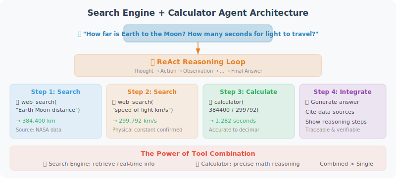

# Hands-on: Search Engine + Calculator Agent

This section builds a practical search and calculation Agent capable of answering complex questions that require real-time information and mathematical reasoning.



## Project Goals

Build an Agent that can:
- 🔍 Search the internet for real-time information
- 🧮 Perform precise mathematical calculations
- 🔗 Combine multiple tools to complete complex tasks
- 📝 Provide answers with cited sources

## Design Approach

The core of this Agent's design is **tool composition**: many real-world problems cannot be solved by a single tool. For example, "How far is the Earth from the Moon? How many seconds would it take light to travel there?" — this requires first searching for the distance data, then using the calculator to divide. Our Agent needs the following capabilities:

1. **Understand intent**: Determine which tools (if any) the user's question requires
2. **Multi-step reasoning**: First gather information, then perform calculations based on that information, then synthesize the answer
3. **Error recovery**: Suggest alternative keywords when search fails, prompt for correct format when calculation errors occur

We design three complementary tools: `search_web` for real-time information, `calculate` for precise computation, and `unit_converter` for unit conversions. The Agent's system prompt guides it on which tool to use in which scenario.

## Complete Implementation

```python
# search_calc_agent.py
import json
import math
import os
from typing import Optional
from openai import OpenAI
from dotenv import load_dotenv
import requests
from rich.console import Console
from rich.panel import Panel
from rich.markdown import Markdown

load_dotenv()

client = OpenAI()
console = Console()

# ============================
# Tool Implementations
# ============================

def search_web(query: str, num_results: int = 5) -> str:
    """
    Search for information using the DuckDuckGo search engine (free, no API key required)
    
    Returns:
        Summary of search results including titles, links, and abstracts
    """
    try:
        # Use DuckDuckGo Instant Answer API
        url = "https://api.duckduckgo.com/"
        params = {
            "q": query,
            "format": "json",
            "no_html": 1,
            "skip_disambig": 1,
        }
        
        response = requests.get(url, params=params, timeout=10)
        data = response.json()
        
        results = []
        
        # Instant answer
        if data.get("AbstractText"):
            results.append(f"**Instant Answer**: {data['AbstractText']}")
            if data.get("AbstractURL"):
                results.append(f"Source: {data['AbstractURL']}")
        
        # Related topics
        for topic in data.get("RelatedTopics", [])[:num_results]:
            if isinstance(topic, dict) and topic.get("Text"):
                results.append(f"• {topic['Text'][:200]}")
        
        if results:
            return "\n".join(results)
        else:
            return f"No direct results found for '{query}'. Try searching with more specific keywords."
            
    except Exception as e:
        return f"Search failed: {str(e)}. Please check your network connection."


def calculate(expression: str) -> str:
    """
    Evaluate a mathematical expression, supporting complex calculations and math functions.
    
    Supported operations:
    - Basic arithmetic: + - * / ** (exponentiation)
    - Math functions: sqrt, sin, cos, tan, log, log10, exp, abs, round, ceil, floor
    - Constants: pi, e
    - Parentheses and operator precedence
    
    Examples:
    - calculate("(1 + 2) * 3") → 9
    - calculate("sqrt(144)") → 12.0
    - calculate("log(e)") → 1.0
    """
    try:
        # Clean input
        expression = expression.strip()
        
        # Safe math environment
        safe_dict = {
            "__builtins__": {},
            "sqrt": math.sqrt,
            "pow": math.pow,
            "sin": math.sin,
            "cos": math.cos,
            "tan": math.tan,
            "asin": math.asin,
            "acos": math.acos,
            "atan": math.atan,
            "log": math.log,
            "log10": math.log10,
            "log2": math.log2,
            "exp": math.exp,
            "abs": abs,
            "round": round,
            "ceil": math.ceil,
            "floor": math.floor,
            "factorial": math.factorial,
            "pi": math.pi,
            "e": math.e,
            "inf": math.inf,
        }
        
        result = eval(expression, safe_dict)
        
        # Format output
        if isinstance(result, float):
            if result == int(result):
                return f"{expression} = {int(result)}"
            else:
                return f"{expression} = {result:.6g}"
        else:
            return f"{expression} = {result}"
            
    except ZeroDivisionError:
        return "Calculation error: division by zero"
    except OverflowError:
        return "Calculation error: result overflow (number too large)"
    except Exception as e:
        return f"Calculation error: {str(e)}. Please verify the expression format is correct."


def unit_converter(value: float, from_unit: str, to_unit: str) -> str:
    """
    Unit conversion tool supporting common unit conversions.
    
    Supported categories:
    - Length: m, km, cm, mm, inch, foot, mile, yard
    - Weight: kg, g, mg, pound, ounce, ton
    - Temperature: celsius, fahrenheit, kelvin
    - Area: m2, km2, cm2, acre, hectare
    """
    # Conversion factors to base SI units
    conversions = {
        # Length (base unit: meter)
        "m": 1.0, "km": 1000.0, "cm": 0.01, "mm": 0.001,
        "inch": 0.0254, "foot": 0.3048, "mile": 1609.344, "yard": 0.9144,
        
        # Weight (base unit: kilogram)
        "kg": 1.0, "g": 0.001, "mg": 0.000001,
        "pound": 0.453592, "ounce": 0.0283495, "ton": 1000.0,
        
        # Area (base unit: square meter)
        "m2": 1.0, "km2": 1000000.0, "cm2": 0.0001,
        "acre": 4046.86, "hectare": 10000.0,
    }
    
    from_unit = from_unit.lower()
    to_unit = to_unit.lower()
    
    # Special handling for temperature
    if from_unit in ["celsius", "fahrenheit", "kelvin"]:
        if from_unit == "celsius" and to_unit == "fahrenheit":
            result = value * 9/5 + 32
        elif from_unit == "fahrenheit" and to_unit == "celsius":
            result = (value - 32) * 5/9
        elif from_unit == "celsius" and to_unit == "kelvin":
            result = value + 273.15
        elif from_unit == "kelvin" and to_unit == "celsius":
            result = value - 273.15
        elif from_unit == "fahrenheit" and to_unit == "kelvin":
            result = (value - 32) * 5/9 + 273.15
        elif from_unit == "kelvin" and to_unit == "fahrenheit":
            result = (value - 273.15) * 9/5 + 32
        else:
            result = value
        return f"{value} {from_unit} = {result:.4g} {to_unit}"
    
    # Other units
    if from_unit not in conversions or to_unit not in conversions:
        return f"Unsupported unit: {from_unit} or {to_unit}"
    
    # Convert
    result = value * conversions[from_unit] / conversions[to_unit]
    return f"{value} {from_unit} = {result:.6g} {to_unit}"


# ============================
# Tool Configuration
# ============================

TOOLS = [
    {
        "type": "function",
        "function": {
            "name": "search_web",
            "description": """Search the internet for real-time information.
            
Suitable for:
- Querying the latest news, events, prices, and other real-time data
- Getting background information on people, places, and events
- Finding technical documentation and tutorials
- Verifying and fact-checking information

Not suitable for:
- Mathematical calculations (use the calculate tool)
- Unit conversions (use the unit_converter tool)
- Questions you already know the answer to""",
            "parameters": {
                "type": "object",
                "properties": {
                    "query": {
                        "type": "string",
                        "description": "Search keywords, keep concise and precise. E.g.: 'Python 3.12 new features' rather than 'I want to know what new features the latest Python version has'"
                    },
                    "num_results": {
                        "type": "integer",
                        "description": "Number of results to return, default 5, max 10",
                        "default": 5
                    }
                },
                "required": ["query"]
            }
        }
    },
    {
        "type": "function",
        "function": {
            "name": "calculate",
            "description": """Precisely evaluate mathematical expressions.
            
Supports: basic arithmetic (+,-,*,/,**), math functions (sqrt/sin/cos/log etc.), constants (pi/e)

Examples:
- "1234 * 5678" → precise multiplication
- "sqrt(2) * pi" → calculation with math constants
- "log(100) / log(10)" → logarithm calculation""",
            "parameters": {
                "type": "object",
                "properties": {
                    "expression": {
                        "type": "string",
                        "description": "Mathematical expression using Python syntax. Use ** for exponentiation, not ^"
                    }
                },
                "required": ["expression"]
            }
        }
    },
    {
        "type": "function",
        "function": {
            "name": "unit_converter",
            "description": "Unit conversion supporting common conversions for length, weight, temperature, area, and more",
            "parameters": {
                "type": "object",
                "properties": {
                    "value": {
                        "type": "number",
                        "description": "The numeric value to convert"
                    },
                    "from_unit": {
                        "type": "string",
                        "description": "Source unit, e.g.: m, km, kg, celsius, pound"
                    },
                    "to_unit": {
                        "type": "string",
                        "description": "Target unit, e.g.: foot, mile, pound, fahrenheit"
                    }
                },
                "required": ["value", "from_unit", "to_unit"]
            }
        }
    }
]

TOOL_FUNCTIONS = {
    "search_web": search_web,
    "calculate": calculate,
    "unit_converter": unit_converter,
}


# ============================
# Agent Class
# ============================

class SearchCalcAgent:
    """Search + Calculation Agent"""
    
    def __init__(self):
        self.messages = [
            {
                "role": "system",
                "content": """You are an intelligent assistant capable of searching and calculating.

You have three tools:
1. search_web: Search the internet for real-time information
2. calculate: Precisely evaluate mathematical expressions
3. unit_converter: Convert between units

Usage strategy:
- Questions requiring real-time data (prices, news, weather, etc.) → search first
- Mathematical calculations → use the calculator directly, do not calculate manually
- Unit conversions → use unit_converter
- Complex problems can combine multiple tools
- When giving answers, indicate the source of information

Answer requirements:
- Concise and accurate, highlight key points
- Numerical calculation results must be precise
- If search results are insufficient, say so honestly
"""
            }
        ]
        self.step_count = 0
    
    def _log_tool_call(self, tool_name: str, args: dict, result: str):
        """Log tool call details"""
        console.print(
            Panel(
                f"[bold]Tool:[/bold] [yellow]{tool_name}[/yellow]\n"
                f"[bold]Args:[/bold] {json.dumps(args, ensure_ascii=False)}\n"
                f"[bold]Result:[/bold] {result[:300]}{'...' if len(result) > 300 else ''}",
                title=f"🔧 Tool Call #{self.step_count}",
                border_style="yellow",
                expand=False
            )
        )
    
    def chat(self, user_message: str) -> str:
        """Chat with the Agent"""
        self.step_count = 0
        self.messages.append({"role": "user", "content": user_message})
        
        console.print(f"\n[bold blue]👤 User:[/bold blue] {user_message}\n")
        
        MAX_STEPS = 8
        
        while self.step_count < MAX_STEPS:
            # Call the LLM
            response = client.chat.completions.create(
                model="gpt-4o",
                messages=self.messages,
                tools=TOOLS,
                tool_choice="auto",
                parallel_tool_calls=True
            )
            
            message = response.choices[0].message
            finish_reason = response.choices[0].finish_reason
            self.messages.append(message)
            
            # Direct answer
            if finish_reason == "stop":
                console.print(f"\n[bold green]🤖 Agent:[/bold green]")
                console.print(Markdown(message.content))
                return message.content
            
            # Tool calls
            if finish_reason == "tool_calls" and message.tool_calls:
                for tool_call in message.tool_calls:
                    self.step_count += 1
                    
                    func_name = tool_call.function.name
                    func_args = json.loads(tool_call.function.arguments)
                    
                    # Execute tool
                    func = TOOL_FUNCTIONS.get(func_name)
                    if func:
                        result = func(**func_args)
                    else:
                        result = f"Error: unknown tool {func_name}"
                    
                    self._log_tool_call(func_name, func_args, str(result))
                    
                    # Add tool result
                    self.messages.append({
                        "role": "tool",
                        "tool_call_id": tool_call.id,
                        "content": str(result)
                    })
        
        return "Maximum step limit reached"
    
    def reset(self):
        """Reset the conversation"""
        self.messages = self.messages[:1]


# ============================
# Main Program
# ============================

def demo():
    """Demonstrate Agent capabilities"""
    agent = SearchCalcAgent()
    
    test_questions = [
        "How far is the Earth from the Moon in kilometers? How many miles is that?",
        "If I save $2,000 per month at an annual interest rate of 3%, how much will I have after 5 years?",
        "What are the important new features in Python 3.12?",
        "How many kilometers is 1 mile? Approximately how many miles is the high-speed rail distance from Beijing to Shanghai?",
    ]
    
    for q in test_questions:
        agent.chat(q)
        agent.reset()
        print("\n" + "="*60 + "\n")


def interactive():
    """Interactive mode"""
    console.print(Panel(
        "[bold]🔍 Search + Calculation Agent[/bold]\n"
        "I can search the internet + perform precise calculations + convert units\n"
        "Type 'quit' to exit, 'reset' to reset the conversation",
        title="Agent Started",
        border_style="green"
    ))
    
    agent = SearchCalcAgent()
    
    while True:
        user_input = input("\n💬 You: ").strip()
        if not user_input:
            continue
        if user_input.lower() == "quit":
            break
        if user_input.lower() == "reset":
            agent.reset()
            console.print("[dim]Conversation reset[/dim]")
            continue
        
        agent.chat(user_input)


if __name__ == "__main__":
    import sys
    if "--demo" in sys.argv:
        demo()
    else:
        interactive()
```

## Key Code Walkthrough

Although the code above looks long, the core architecture is very clear and can be understood in three layers:

**Tool layer** (three independent functions): Each tool follows the pattern "input → process → return string." Note that the `calculate` function uses a restricted `eval` environment — it only exposes functions from the `math` module and does not expose `__builtins__`, which is a trade-off between security and functionality. `search_web` uses the DuckDuckGo free API, which requires no API key, making it suitable for learning and prototyping.

**Schema layer** (TOOLS list): Tool descriptions are the key factor affecting Agent performance. Notice that the `search_web` description not only lists what it's "suitable for," but also explicitly states what it's "not suitable for" — this "both sides" description style effectively reduces the probability of the model misusing tools.

**Agent layer** (SearchCalcAgent class): The `chat` method implements the standard Agent loop and sets a safety limit of `MAX_STEPS = 8` to prevent the model from getting stuck in an infinite loop. The `_log_tool_call` method uses the `rich` library to output beautiful logs, making it easy to observe the Agent's reasoning process during debugging.

## Running the Tests

```bash
# Install dependencies
pip install openai python-dotenv requests rich

# Interactive mode
python search_calc_agent.py

# Demo mode
python search_calc_agent.py --demo
```

## Example Conversation

```
💬 You: How far is the Earth from the Moon? How many seconds would it take to travel there at the speed of light?

🔧 Tool Call #1
Tool: search_web
Args: {"query": "Earth to Moon distance kilometers"}
Result: The average distance from Earth to the Moon is approximately 384,400 km...

🔧 Tool Call #2
Tool: calculate
Args: {"expression": "384400 * 1000 / 299792458"}
Result: 384400 * 1000 / 299792458 = 1.28222

🤖 Agent:
The average distance from Earth to the Moon is approximately **384,400 kilometers**.

The speed of light is 299,792,458 meters per second (approximately 300,000 km/s).

Calculation: 384,400 km × 1,000 m/km ÷ 299,792,458 m/s ≈ **1.28 seconds**

In other words, light takes approximately **1.28 seconds** to travel from Earth to the Moon.
(Source: search results + precise mathematical calculation)
```

---

## Summary

This hands-on section completed a fully functional search + calculation Agent:
- ✅ Three independent tools: search, calculate, unit conversion
- ✅ Parallel tool calls
- ✅ Precise error handling
- ✅ Clear tool descriptions
- ✅ Beautiful terminal output

This Agent can serve as the foundation framework for your future development, continuously expanding its capabilities by adding more tools.

---

*Next section: [4.6 Paper Readings: Frontier Advances in Tool Learning](./06_paper_readings.md)*