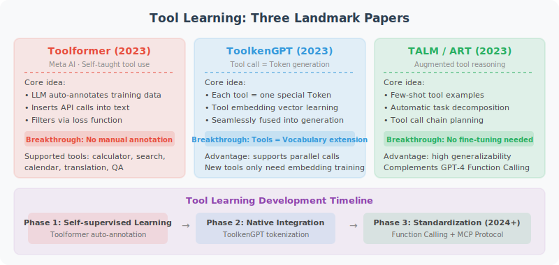

# 4.6 Paper Readings: Frontier Advances in Tool Learning

> 📖 *"The best way to predict the future is to invent it."*  
> *"Teaching LLMs to use tools" is one of the most active directions in Agent research. This section provides in-depth analysis of three foundational papers.*



---

## Toolformer: Teaching Models to Teach Themselves Tool Use

**Paper**: *Toolformer: Language Models Can Teach Themselves to Use Tools*  
**Authors**: Schick et al., Meta AI Research  
**Published**: 2023 | [arXiv:2302.04761](https://arxiv.org/abs/2302.04761)

### Core Problem

Before Toolformer, methods for getting LLMs to use tools typically required large amounts of manually annotated data — labeling "where to call which tool." This approach is not scalable, and human annotations may miss many scenarios where LLMs could benefit from tools.

**Toolformer proposed a groundbreaking idea: let the model learn by itself when and how to use tools.**

### Method

Toolformer's training pipeline consists of three steps:

```
Step 1: Candidate Generation
  Let the LLM automatically insert API call markers into training text
  Example: original text "The population of Toronto is 2,794,356"
  → After insertion: "The population of Toronto is [QA("population of Toronto")] 2,794,356"

Step 2: Filter Useful Calls
  Compare the model's probability of predicting subsequent text
  with and without tool calls
  Only keep calls that "genuinely help predict the next token"
  (If the model already knows the answer, calling a tool is redundant)

Step 3: Fine-tuning
  Fine-tune the model on the filtered data
  The trained model can then autonomously decide where to call which tool
```

### Key Findings

1. **The power of self-supervised learning**: Without human annotation, the model can learn on its own to insert tool calls at appropriate positions
2. **Selective tool use**: The trained model does not "overuse" tools — it only calls them when tools can genuinely provide useful information
3. **Generality**: The same method applies to multiple tools (calculator, search engine, translator, calendar, QA system)

### Implications for Agent Development

Toolformer's ideas profoundly influenced the later design of Function Calling. Today's OpenAI Function Calling and Anthropic Tool Use differ in implementation (based on alignment training rather than self-supervision), but share the same core philosophy: **let the model autonomously judge when tools are needed, which tool to call, and what parameters to pass.**

---

## Gorilla: Precision in Large-Scale API Calls

**Paper**: *Gorilla: Large Language Model Connected with Massive APIs*  
**Authors**: Patil et al., UC Berkeley  
**Published**: 2023 | [arXiv:2305.15334](https://arxiv.org/abs/2305.15334)

### Core Problem

The real world has thousands of APIs (TorchHub, TensorHub, HuggingFace, etc.), and LLMs face a serious problem when calling these APIs: **hallucinated calls** — fabricating non-existent API function names, parameters, or return values.

For example, if you ask an LLM to help you call an image classification model's API, it might generate a function signature that looks reasonable but doesn't actually exist.

### Method

Gorilla's solution is **Retrieval-Augmented Fine-tuning**:

```
1. Build an API documentation library
   Collect 1,645 real API documents (from TorchHub, TensorHub, HuggingFace)
   Each document includes: function name, parameter descriptions, usage examples

2. Retrieval-augmented training
   For each training sample, first retrieve the most relevant API documents
   Use the documents as context to train the model to generate correct API calls

3. At inference time
   Given user requirements → retrieve relevant API documents → generate accurate API call code
```

### Key Findings

1. **Combining API document retrieval can dramatically reduce hallucinated calls**: Accuracy surpasses GPT-4
2. **No retraining needed when documentation changes**: Just update the documents in the retrieval library and the model adapts to new API versions
3. **API selection accuracy**: Faced with thousands of candidate APIs, Gorilla can select the most appropriate one

### Implications for Agent Development

Gorilla's ideas are directly reflected in modern Agent frameworks:

- **Importance of tool descriptions**: Just as Gorilla needs precise API documentation, the quality of Tool Descriptions in Agent frameworks directly affects tool selection accuracy (see Section 4.4)
- **RAG + tool calling**: When the number of available tools is large, you can first retrieve the most relevant tools, then let the LLM select and call them (similar to Gorilla's retrieval-augmented approach)
- **Origin of MCP protocol philosophy**: MCP requires each tool to provide standardized description documents, consistent with Gorilla's API documentation library approach

---

## ToolLLM: The Challenge of 16,000+ Real-World APIs

**Paper**: *ToolLLM: Facilitating Large Language Models to Master 16000+ Real-world APIs*  
**Authors**: Qin et al.  
**Published**: 2023 | [arXiv:2307.16789](https://arxiv.org/abs/2307.16789)

### Core Problem

Previous tool learning research (including Toolformer and Gorilla) used a relatively limited number of tools (dozens to thousands). But the real-world API ecosystem is enormous — RapidAPI alone has over 30,000 APIs. How can LLMs still effectively discover, select, and combine tools at this scale?

### Method

ToolLLM's contributions are multifaceted:

```
1. ToolBench Benchmark
   Collected 16,464 real REST APIs (from 49 categories)
   Built 12,657 tool usage examples
   Each example may require combinations of multiple tools

2. DFSDT Algorithm (Depth-First Search Decision Tree)
   Traditional approach: call tools linearly step by step (prone to dead ends)
   DFSDT: models the tool calling process as a search tree
   - Generate multiple candidate tool calls at each step
   - Evaluate the effectiveness of each candidate
   - If the current path doesn't work, backtrack to the previous node and try other branches

3. ToolEval Evaluation Framework
   Automatically evaluates tool use on two dimensions:
   - Pass Rate: whether the problem was ultimately solved
   - Win Rate: quality compared to reference solutions
```

### Key Findings

1. **The challenge of scale**: As the number of tools increases, LLM tool selection accuracy drops sharply — this remains an open problem
2. **Multi-tool composition**: Many real-world tasks require combinations of 3–5 tools, which is much harder than single-tool calls
3. **Effectiveness of DFSDT**: Compared to linear reasoning, the tree search strategy improves pass rate by approximately 10% in complex tool use scenarios

### Implications for Agent Development

The challenges revealed by ToolLLM still exist in today's Agent development:

- **Hierarchical tool management**: When there are many tools, they need to be organized hierarchically (e.g., grouped by category) rather than putting all tools in the prompt at once
- **Error recovery**: The backtracking idea from DFSDT can be applied to Agent tool calls — if one tool call fails, try other approaches rather than giving up immediately
- **Complexity of tool composition**: When designing Agents, consider the dependencies and calling order between tools

---

## ToolACE: Large-Scale High-Quality Tool Call Data Synthesis

**Paper**: *ToolACE: Winning the Points of LLM Function Calling*  
**Authors**: Liu et al., Huawei Noah's Ark Lab & USTC  
**Published**: 2024 | [arXiv:2409.00920](https://arxiv.org/abs/2409.00920)

### Core Problem

Training high-quality tool-calling models requires large amounts of accurate, diverse tool call data. But in practice:
- Manual annotation is extremely costly and hard to cover long-tail scenarios
- Existing synthetic data methods have shortcomings in **accuracy** and **diversity**
- There is a lack of data covering complex scenarios like multi-tool combinations and nested calls

### Method

ToolACE proposes a unified **self-evolving data synthesis framework**:

```
1. Automated API Library Construction
   Through multi-agent collaboration, automatically generate 26,507 diverse API definitions
   Covering various real-world API categories

2. Multi-Agent Dialogue Generation
   Multiple Agent roles play users and assistants
   Naturally generating tool call requirements and responses through interaction

3. Self-Verification and Filtering
   Automatically verify whether generated tool calls are correct
   Filter out inconsistent or erroneous samples

4. Difficulty Grading
   From simple single-tool calls to complex multi-tool combinations
   Progressively increasing the complexity of training data
```

### Key Findings

1. **Synthetic data can match or exceed the quality of human annotation**: An 8B model trained on ToolACE data reached #1 among open-source models on the Berkeley Function Calling Leaderboard
2. **Data diversity is key**: API diversity matters more than data volume
3. **Self-evolving loop**: Model generates data → training → generates better data, forming a positive cycle

### Implications for Agent Development

- **Tool calling capability can be improved through data engineering**, not necessarily requiring a larger model
- When customizing tool calling capability for a specific domain, the ToolACE synthesis method can be used to generate training data
- Open-source models (e.g., Qwen, Llama) fine-tuned with high-quality tool call data can approach GPT-4o in capability

---

## RAG-MCP: Using Retrieval Augmentation to Solve Tool Bloat

**Paper**: *RAG-MCP: Mitigating Prompt Bloat in LLM Tool Selection via Retrieval-Augmented Generation*  
**Authors**: Gan et al., Beijing University of Posts and Telecommunications & Queen Mary University of London  
**Published**: 2025 | [arXiv:2505.03275](https://arxiv.org/abs/2505.03275)

### Core Problem

As the MCP protocol becomes widespread, the number of tools an Agent can connect to grows rapidly. When the tool list becomes very long:
- **Prompt bloat**: Large amounts of tool descriptions occupy the context window, squeezing out space for task reasoning
- **Selection difficulty**: Faced with hundreds or even thousands of tools, LLM selection accuracy drops
- **Rising costs**: Overly long prompts significantly increase token consumption and latency

### Method

RAG-MCP combines Gorilla's retrieval-augmented ideas with the MCP protocol:

```
User request: "Check tomorrow's weather in Beijing"
    ↓
Retrieval module: retrieve top-k most relevant MCP tools from the tool library
  → Matched: weather_query, location_resolve
    ↓
Only put these 2 tools' descriptions into the Prompt
  (instead of all 500+ tools)
    ↓
LLM precisely selects and calls from the small candidate set
```

### Implications for Agent Development

This paper directly answers the scalability challenge raised by ToolLLM — when the number of tools is very large, **dynamic retrieval + on-demand loading** is the only viable solution. This is also an important engineering practice direction in the MCP ecosystem.

---

## Paper Comparison and Development Trajectory

| Dimension | Toolformer (2023) | Gorilla (2023) | ToolLLM (2023) | ToolACE (2024) | RAG-MCP (2025) |
|-----------|-------------------|----------------|----------------|----------------|----------------|
| **Core Contribution** | Self-supervised tool use learning | Retrieval-augmented hallucination reduction | Large-scale tool discovery and composition | High-quality data synthesis | Retrieval to solve tool bloat |
| **Tool Count** | 5 | 1,645 | 16,464 | 26,507 | MCP ecosystem (open) |
| **Training Method** | Self-supervised fine-tuning | Retrieval-augmented fine-tuning | Instruction fine-tuning | Multi-agent data synthesis | Training-free (RAG) |
| **Key Innovation** | Model autonomously decides when to use tools | API doc retrieval reduces hallucinations | DFSDT search algorithm | Self-evolving synthesis pipeline | Dynamic tool retrieval loading |
| **Limitations** | Few tools | Only covers ML APIs | High computational cost | Depends on synthetic data quality | Retrieval relevance dependency |

**Development Trajectory**:

```
Toolformer (teaching models "when" to use tools)
    ↓
Gorilla (solving precision of "which" tool to call)
    ↓
ToolLLM (solving large-scale tool discovery and composition)
    ↓
ToolACE (solving high-quality tool call training data)
    ↓
MCP + RAG-MCP (industry standardization + dynamic tool discovery)
```

> 💡 **Frontier Trends (2025–2026)**: Three major trends in the tool calling field: ① **MCP ecosystem explosion**: The MCP protocol led by Anthropic has been adopted by OpenAI, Google, Microsoft, and other giants, becoming the industry standard for tool integration (see Chapter 15); ② **Dynamic tool discovery**: Evolving from "predefined tool lists" to RAG-MCP-style "on-demand retrieval, on-demand loading"; ③ **Open-source model catch-up**: Through data synthesis methods like ToolACE, open-source models such as Qwen 3 and Llama 4 have tool calling capabilities approaching GPT-4o.

---

*Back to: [Chapter 4: Tool Calling](./README.md)*

*Next chapter: [Chapter 5: Memory Systems](../chapter_memory/README.md)*
