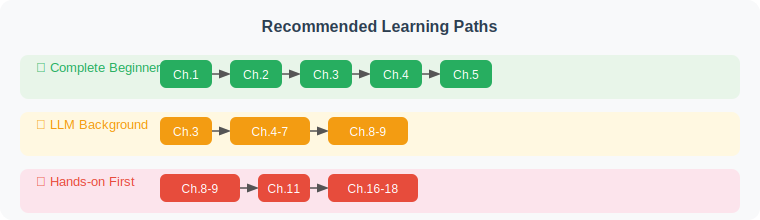

# Preface

> 🤖 *"The future belongs not to those who write code, but to those who can direct AI to write code. And Agent is the bridge connecting human intent with AI capability."*

## Why This Book?

Since 2023, Large Language Models (LLMs) have sparked a technological revolution. But many people have found that simple "conversation" is far from enough — we need AI that can **make autonomous decisions, use tools, and complete complex tasks**. This is the purpose of **Agents (Intelligent Agents)**.

However, learning resources for Agent development are scattered across various papers, blogs, and framework documentation, lacking a **systematic, beginner-friendly, and practice-oriented** learning path. This book is written to fill that gap.

## Who Is This Book For?

- 🐍 **Developers with Python basics** who want to enter the AI Agent field
- 🎓 **Students or researchers interested in LLMs** who want to understand the principles and implementation of Agents
- 💼 **Product managers or tech leads** who want to understand the capability boundaries and application scenarios of Agents
- 🔧 **People already using ChatGPT** and similar tools who want to understand and customize AI capabilities more deeply

## Features of This Book

| Feature | Description |
|---------|-------------|
| 📖 **Progressive Learning** | Starting from "What is an Agent?", gradually deepening into multi-agent systems, reinforcement learning training, and production deployment |
| 🐍 **Python in Practice** | Every chapter includes runnable Python code examples — learn by doing |
| 🎨 **Rich Visuals** | Extensive architecture diagrams, flowcharts, and sequence diagrams to help understand concepts intuitively |
| 🔨 **Project-Driven** | 3 complete comprehensive projects, covering the full workflow from requirements to deployment |
| 🌐 **Cutting-Edge** | Covers LangChain, LangGraph, MCP/A2A/ANP protocols, Context Engineering, Agentic-RL, and other latest technologies |
| 📚 **Academic Tracing** | Each chapter includes authoritative paper citations and references, covering the complete academic spectrum from symbolic AI to LLM-driven approaches |
| 📊 **Evaluation System** | In-depth breakdown of mainstream benchmarks including BFCL, GAIA, AgentBench, and SWE-bench |

## How to Use This Book?

**Chapter Structure**:

1. **Concept Explanation** — Core concepts explained in plain language with analogies
2. **Architecture Diagrams** — Clear diagrams showing system design
3. **Code Practice** — Complete, runnable Python code
4. **Exercise Challenges** — Hands-on exercises to reinforce learning
5. **Further Reading** — Recommended papers and resources

## Technology Stack Overview

This book primarily uses the following technology stack:

- **Programming Language**: Python 3.11+
- **Core Frameworks**: LangChain, LangGraph, OpenAI Agents SDK
- **LLM Services**: OpenAI API (GPT-4o/GPT-5), Anthropic (Claude 4), Open-source models (Llama 4, Qwen 3)
- **Agent Protocols**: MCP (Model Context Protocol), A2A (Agent-to-Agent), ANP (Agent Network Protocol)
- **Vector Databases**: ChromaDB, FAISS
- **Web Framework**: FastAPI
- **Other Tools**: Docker, Pydantic, asyncio, uv

---

*Ready? Let's embark on the Agent development journey together! 🚀*
