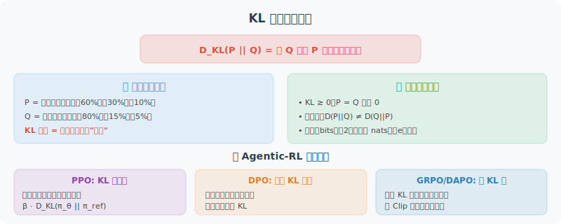

# 附录 E：KL 散度（Kullback-Leibler Divergence）详解

> 本附录为零基础读者提供 KL 散度的完整科普。如果你已经熟悉信息论基础，可以直接跳到 [在 Agentic-RL 中的应用](#在-agentic-rl-中的应用) 部分。

---

## 直觉理解：KL 散度在度量什么？

想象你是一名气象预报员。你建立了一个天气预测模型 $Q$，而真实天气的分布是 $P$。**KL 散度 $D_{KL}(P \| Q)$ 衡量的是：当你用模型 $Q$ 来近似真实分布 $P$ 时，平均会损失多少信息。**

更通俗地说：

> **KL 散度度量两个概率分布之间的"距离"——但这是一种不对称的距离。**

几个关键直觉：

- **$D_{KL}(P \| Q) = 0$**：当且仅当 $P$ 和 $Q$ 完全相同时成立。两个分布越"像"，KL 散度越小。
- **$D_{KL}(P \| Q) \geq 0$**：KL 散度永远非负（由 Gibbs 不等式保证）。
- **$D_{KL}(P \| Q) \neq D_{KL}(Q \| P)$**：不对称性！从 $P$ 看 $Q$ 的"距离"和从 $Q$ 看 $P$ 的"距离"通常不同。这就是为什么 KL 散度不是严格意义上的"度量"（metric），而是一种"散度"（divergence）。

---

## 数学定义

### 离散情形

对于两个离散概率分布 $P$ 和 $Q$（定义在同一事件空间 $\mathcal{X}$ 上）：

$$D_{KL}(P \| Q) = \sum_{x \in \mathcal{X}} P(x) \log \frac{P(x)}{Q(x)}$$

### 连续情形

对于两个连续概率分布（具有概率密度函数 $p(x)$ 和 $q(x)$）：

$$D_{KL}(P \| Q) = \int_{-\infty}^{+\infty} p(x) \log \frac{p(x)}{q(x)} \, dx$$

### 逐项解读

以离散情形为例，展开理解：

$$D_{KL}(P \| Q) = \sum_{x \in \mathcal{X}} P(x) \log \frac{P(x)}{Q(x)} = \sum_{x \in \mathcal{X}} P(x) \left[ \log P(x) - \log Q(x) \right]$$

- $P(x)$：真实分布中事件 $x$ 的概率（权重）
- $\log P(x) - \log Q(x)$：真实分布与近似分布在事件 $x$ 上的"信息差"
- 整体是一个**加权平均**：用真实分布 $P$ 作为权重，对每个事件的信息差求期望

---

## 一个具体的例子

假设有一个 6 面骰子，真实分布 $P$ 和两个模型分布 $Q_1$、$Q_2$ 如下：

| 面 | $P$（真实） | $Q_1$（均匀模型） | $Q_2$（偏斜模型） |
|----|------------|-------------------|-------------------|
| 1 | 1/6 | 1/6 | 1/2 |
| 2 | 1/6 | 1/6 | 1/10 |
| 3 | 1/6 | 1/6 | 1/10 |
| 4 | 1/6 | 1/6 | 1/10 |
| 5 | 1/6 | 1/6 | 1/10 |
| 6 | 1/6 | 1/6 | 1/10 |

计算结果：
- $D_{KL}(P \| Q_1) = 0$（$Q_1$ 与 $P$ 完全一致，没有信息损失）
- $D_{KL}(P \| Q_2) \approx 0.216$ bits（$Q_2$ 偏离了真实分布，产生了信息损失）

这告诉我们：**偏斜模型 $Q_2$ 比均匀模型 $Q_1$ 更"差"**——用 $Q_2$ 来近似真实分布会损失更多信息。

---

## 与信息论的关系

KL 散度可以通过信息论中的两个基本概念来理解：

### 信息熵（Entropy）

$$H(P) = -\sum_{x} P(x) \log P(x)$$

信息熵衡量分布 $P$ 的**不确定性**，也是对 $P$ 中的事件进行最优编码所需的最小平均比特数。

### 交叉熵（Cross-Entropy）

$$H(P, Q) = -\sum_{x} P(x) \log Q(x)$$

交叉熵衡量的是：**如果真实分布是 $P$，但我们使用基于 $Q$ 设计的编码方案，平均需要多少比特来编码一个事件。**

### 三者的关系

$$D_{KL}(P \| Q) = H(P, Q) - H(P)$$

即：**KL 散度 = 交叉熵 − 信息熵 = 使用错误分布编码的额外代价**。

这就是 KL 散度又被称为**相对熵（Relative Entropy）**的原因。

---

## 不对称性的直觉

KL 散度的不对称性在实践中有重要影响：

- **$D_{KL}(P \| Q)$**（前向 KL）：惩罚 $Q$ 在 $P$ 有概率密度的地方给出低概率。效果是 $Q$ 倾向于**覆盖** $P$ 的所有模式（mode-covering），可能导致 $Q$ 过于分散。
- **$D_{KL}(Q \| P)$**（反向 KL）：惩罚 $Q$ 在 $P$ 没有概率密度的地方给出高概率。效果是 $Q$ 倾向于**集中**在 $P$ 的某个模式上（mode-seeking），可能导致 $Q$ 过于集中。

用一个形象的比喻：

> - 前向 KL 像一个"谨慎的人"：宁可多覆盖，也不漏掉任何可能性
> - 反向 KL 像一个"专注的人"：宁可只关注最重要的部分，也不分散注意力

---

## 在 Agentic-RL 中的应用

在 [18.1 什么是 Agentic-RL](../chapter_agentic_rl/01_agentic_rl_overview.md) 中，RL 阶段的损失函数包含一个 KL 散度惩罚项：

$$\mathcal{L}_{RL}(\theta) = -\mathbb{E}_{\tau \sim \pi_\theta} \left[ R(\tau) \right] + \beta \cdot D_{KL}(\pi_\theta \| \pi_{SFT})$$

这里的 $D_{KL}(\pi_\theta \| \pi_{SFT})$ 具体含义是：

### 为什么需要 KL 约束？

在 RL 训练过程中，模型会不断更新参数以最大化奖励。如果没有约束，模型可能会走向两个极端：

1. **奖励黑客（Reward Hacking）**：模型找到钻奖励函数漏洞的方式获得高分，但实际输出质量低下。例如，模型可能学会生成某种特定格式来欺骗奖励模型，而非真正解决问题。
2. **语言退化（Language Degeneration）**：模型的输出不再像自然语言，产生重复、无意义的 Token 序列。

KL 散度惩罚项起到一个"安全绳"的作用：

$$D_{KL}(\pi_\theta \| \pi_{SFT}) = \mathbb{E}_{x \sim \mathcal{D}} \left[ \sum_{t} \pi_\theta(y_t \mid x, y_{<t}) \log \frac{\pi_\theta(y_t \mid x, y_{<t})}{\pi_{SFT}(y_t \mid x, y_{<t})} \right]$$

- 如果当前策略 $\pi_\theta$ 与 SFT 策略 $\pi_{SFT}$ 的输出分布相同，$D_{KL} = 0$，无额外惩罚
- 如果当前策略偏离 SFT 策略过远，$D_{KL}$ 增大，损失函数中的惩罚项增加，将策略"拉回"安全范围

### $\beta$ 的调节作用

超参数 $\beta$ 控制 KL 约束的强度：

| $\beta$ 取值 | 效果 | 适用场景 |
|-------------|------|---------|
| **较大**（如 0.1–0.5） | 策略保守，紧跟 SFT 模型 | 训练初期、任务安全性要求高 |
| **较小**（如 0.001–0.01） | 策略自由，允许大幅探索 | 训练后期、任务有明确客观评估标准 |
| **自适应** | 动态调节，保持 KL 在目标范围 | PPO 中常用 |

在 GRPO（Group Relative Policy Optimization）中，KL 惩罚的具体实现方式会有所不同，详见 [18.5 GRPO：组内相对策略优化与奖励函数设计](../chapter_agentic_rl/05_grpo.md)。

---

## 总结

| 概念 | 一句话描述 |
|------|-----------|
| **KL 散度** | 用分布 $Q$ 近似分布 $P$ 时的平均信息损失 |
| **非负性** | $D_{KL}(P \| Q) \geq 0$，等号当且仅当 $P = Q$ |
| **不对称性** | $D_{KL}(P \| Q) \neq D_{KL}(Q \| P)$ |
| **与交叉熵的关系** | $D_{KL} = $ 交叉熵 $-$ 信息熵 |
| **在 RL 中的作用** | 防止策略偏离参考模型太远，避免奖励黑客和语言退化 |

---

## 延伸阅读

- Kullback S, Leibler R A. On Information and Sufficiency[J]. The Annals of Mathematical Statistics, 1951, 22(1): 79-86.
- Cover T M, Thomas J A. Elements of Information Theory[M]. 2nd ed. Wiley, 2006. （第 2 章详细介绍了 KL 散度的性质）
- Schulman J, et al. Proximal Policy Optimization Algorithms[R]. arXiv:1707.06347, 2017. （PPO 中 KL 约束的工程实践）
