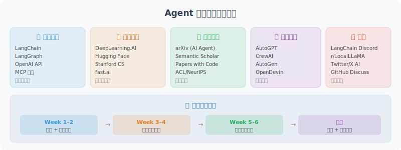

# 附录 C：推荐学习资源与社区

---

## 📚 官方文档

| 资源 | 链接 | 说明 |
|------|------|------|
| LangChain 文档 | [python.langchain.com](https://python.langchain.com/) | 最全面的 Agent 框架文档 |
| LangGraph 文档 | [langchain-ai.github.io/langgraph](https://langchain-ai.github.io/langgraph/) | 有状态 Agent 开发 |
| OpenAI API 文档 | [platform.openai.com/docs](https://platform.openai.com/docs) | 模型 API 使用指南 |
| Anthropic 文档 | [docs.anthropic.com](https://docs.anthropic.com/) | Claude 模型文档 |
| MCP 规范 | [modelcontextprotocol.io](https://modelcontextprotocol.io/) | Agent 工具标准协议 |

---

## 📖 推荐书籍与课程

### 书籍

- **《Building LLM Powered Applications》** —— 实用的 LLM 应用开发指南
- **《Generative AI with LangChain》** —— LangChain 框架深入指南
- **《Designing Autonomous AI Agent Systems》** —— Agent 系统设计原理

### 在线课程

- **DeepLearning.AI** 的 "Building Agentic RAG with LlamaIndex" 系列
- **LangChain Academy** —— LangChain 官方课程（免费）
- **Andrew Ng** 的 "AI Agentic Design Patterns" 系列

---

## 🛠️ 开源项目

| 项目 | 说明 |
|------|------|
| [LangChain](https://github.com/langchain-ai/langchain) | 最流行的 Agent 开发框架 |
| [LangGraph](https://github.com/langchain-ai/langgraph) | 有状态 Agent 工作流 |
| [CrewAI](https://github.com/crewAIInc/crewAI) | 多 Agent 角色扮演框架 |
| [AutoGen](https://github.com/microsoft/autogen) | 微软多 Agent 框架（0.4 事件驱动架构） |
| [Dify](https://github.com/langgenius/dify) | 开源 LLM 应用平台 |
| [mem0](https://github.com/mem0ai/mem0) | Agent 记忆层 |
| [ChromaDB](https://github.com/chroma-core/chroma) | 轻量级向量数据库 |

---

## 🌐 社区与论坛

### 英文社区

- **LangChain Discord** —— 活跃的开发者社区
- **Reddit r/LangChain** —— 讨论和分享
- **GitHub Discussions** —— 各框架的官方讨论区
- **Hugging Face** —— 开源模型社区

### 中文社区

- **掘金 / 稀土掘金** —— 搜索 "Agent 开发"、"LangChain 实战" 等话题，有大量中文实践文章
- **知乎** —— 关注 "AI Agent"、"LLM 应用开发" 话题，跟踪行业讨论和技术分析
- **CSDN** —— Agent 开发教程和踩坑记录
- **B 站 / YouTube 中文频道** —— 搜索 "Agent 开发教程"，有不少优质视频教程
- **微信公众号** —— 推荐关注：机器之心、量子位、AI科技大本营等（跟踪最新 Agent 技术动态）
- **通义千问社区** —— 阿里云的 LLM 开发者社区，适合使用国内模型的开发者

---

## 📄 重要学术论文

以下是本书涉及的核心学术论文，按技术主题分类。每个主题在书中都有对应的**独立论文解读章节**，建议按照学习进度有选择地阅读。

> 💡 **深度解读章节索引**：
> - 工具使用 → [4.6 论文解读：工具学习前沿进展](../chapter_tools/06_paper_readings.md)
> - 记忆系统 → [5.6 论文解读：记忆系统前沿进展](../chapter_memory/06_paper_readings.md)
> - 规划与推理 → [6.6 论文解读：规划与推理前沿研究](../chapter_planning/06_paper_readings.md)
> - RAG → [7.6 论文解读：RAG 前沿进展](../chapter_rag/06_paper_readings.md)
> - 多 Agent → [14.6 论文解读：多 Agent 系统前沿研究](../chapter_multi_agent/06_paper_readings.md)
> - 安全与可靠性 → [17.6 论文解读：安全与可靠性前沿研究](../chapter_security/06_paper_readings.md)

### 提示策略与推理

| 论文 | 作者 | 年份 | 本书章节 | 链接 |
|------|------|------|---------|------|
| Chain-of-Thought Prompting Elicits Reasoning in Large Language Models | Wei et al. (Google Brain) | 2022 | 3.3 | [arXiv:2201.11903](https://arxiv.org/abs/2201.11903) |
| Large Language Models are Zero-Shot Reasoners | Kojima et al. | 2022 | 3.3 | [arXiv:2205.11916](https://arxiv.org/abs/2205.11916) |
| Self-Consistency Improves Chain of Thought Reasoning | Wang et al. (Google Brain) | 2023 | 3.3, 17.2 | [arXiv:2203.11171](https://arxiv.org/abs/2203.11171) |
| Tree of Thoughts: Deliberate Problem Solving with LLMs | Yao et al. (Princeton) | 2023 | 3.3 | [arXiv:2305.10601](https://arxiv.org/abs/2305.10601) |
| ReAct: Synergizing Reasoning and Acting in Language Models | Yao et al. (Princeton) | 2022 | 3.3, 6.2 | [arXiv:2210.03629](https://arxiv.org/abs/2210.03629) |
| Plan-and-Solve Prompting | Wang et al. | 2023 | 6.3 | [arXiv:2305.04091](https://arxiv.org/abs/2305.04091) |

### 工具使用

| 论文 | 作者 | 年份 | 本书章节 | 链接 |
|------|------|------|---------|------|
| Toolformer: Language Models Can Teach Themselves to Use Tools | Schick et al. (Meta) | 2023 | 4.1 | [arXiv:2302.04761](https://arxiv.org/abs/2302.04761) |
| Gorilla: Large Language Model Connected with Massive APIs | Patil et al. (UC Berkeley) | 2023 | 4.1 | [arXiv:2305.15334](https://arxiv.org/abs/2305.15334) |
| ToolLLM: Facilitating LLMs to Master 16000+ Real-world APIs | Qin et al. | 2023 | 4.1 | [arXiv:2307.16789](https://arxiv.org/abs/2307.16789) |
| ToolACE: Winning the Points of LLM Function Calling | Liu et al. (华为诺亚方舟 & 中科大) | 2024 | 4.6 | [arXiv:2409.00920](https://arxiv.org/abs/2409.00920) |
| RAG-MCP: Mitigating Prompt Bloat in LLM Tool Selection | Gan et al. | 2025 | 4.6 | [arXiv:2505.03275](https://arxiv.org/abs/2505.03275) |

### 技能系统

| 论文 | 作者 | 年份 | 本书章节 | 链接 |
|------|------|------|---------|------|
| Voyager: An Open-Ended Embodied Agent with LLMs | Wang et al. (NVIDIA & Caltech) | 2023 | 5.6 | [arXiv:2305.16291](https://arxiv.org/abs/2305.16291) |
| CRAFT: Customizing LLMs by Creating and Retrieving from Specialized Toolsets | Yuan et al. (北京大学) | 2024 | 5.6 | [arXiv:2309.17428](https://arxiv.org/abs/2309.17428) |

### 记忆系统

| 论文 | 作者 | 年份 | 本书章节 | 链接 |
|------|------|------|---------|------|
| Generative Agents: Interactive Simulacra of Human Behavior | Park et al. (Stanford) | 2023 | 5.1 | [arXiv:2304.03442](https://arxiv.org/abs/2304.03442) |
| MemGPT: Towards LLMs as Operating Systems | Packer et al. (UC Berkeley) | 2023 | 5.1 | [arXiv:2310.08560](https://arxiv.org/abs/2310.08560) |
| MemoryBank: Enhancing LLMs with Long-Term Memory | Zhong et al. | 2023 | 5.1 | [arXiv:2305.10250](https://arxiv.org/abs/2305.10250) |
| Cognitive Architectures for Language Agents (CoALA) | Sumers et al. | 2023 | 5.1 | [arXiv:2309.02427](https://arxiv.org/abs/2309.02427) |
| HippoRAG: Neurobiologically Inspired Long-Term Memory for LLMs | Gutiérrez et al. (OSU) | 2024 | 5.6 | [arXiv:2405.14831](https://arxiv.org/abs/2405.14831) |
| Zep: A Temporal Knowledge Graph Architecture for Agent Memory | Rasmussen et al. | 2025 | 5.6 | [arXiv:2501.13956](https://arxiv.org/abs/2501.13956) |

### 反思与自我纠错

| 论文 | 作者 | 年份 | 本书章节 | 链接 |
|------|------|------|---------|------|
| Reflexion: Language Agents with Verbal Reinforcement Learning | Shinn et al. | 2023 | 6.4 | [arXiv:2303.11366](https://arxiv.org/abs/2303.11366) |
| Self-Refine: Iterative Refinement with Self-Feedback | Madaan et al. (CMU) | 2023 | 6.4 | [arXiv:2303.17651](https://arxiv.org/abs/2303.17651) |
| CRITIC: LLMs Can Self-Correct with Tool-Interactive Critiquing | Gou et al. | 2023 | 6.4 | [arXiv:2305.11738](https://arxiv.org/abs/2305.11738) |
| Large Language Models Cannot Self-Correct Reasoning Yet | Huang et al. | 2023 | 6.4 | [arXiv:2310.01798](https://arxiv.org/abs/2310.01798) |

### 检索增强生成（RAG）

| 论文 | 作者 | 年份 | 本书章节 | 链接 |
|------|------|------|---------|------|
| Retrieval-Augmented Generation for Knowledge-Intensive NLP Tasks | Lewis et al. (Meta AI) | 2020 | 7.1 | [arXiv:2005.11401](https://arxiv.org/abs/2005.11401) |
| Self-RAG: Learning to Retrieve, Generate, and Critique | Asai et al. | 2023 | 7.1 | [arXiv:2310.11511](https://arxiv.org/abs/2310.11511) |
| Corrective Retrieval Augmented Generation (CRAG) | Yan et al. | 2024 | 7.1 | [arXiv:2401.15884](https://arxiv.org/abs/2401.15884) |
| From Local to Global: A Graph RAG Approach | Edge et al. (Microsoft) | 2024 | 7.1 | [arXiv:2404.16130](https://arxiv.org/abs/2404.16130) |
| LightRAG: Simple and Fast Retrieval-Augmented Generation | Guo et al. (香港大学) | 2024 | 7.6 | [arXiv:2410.05779](https://arxiv.org/abs/2410.05779) |

### 规划与推理

| 论文 | 作者 | 年份 | 本书章节 | 链接 |
|------|------|------|---------|------|
| ReAct: Synergizing Reasoning and Acting in Language Models | Yao et al. (Princeton) | 2022 | 6.2 | [arXiv:2210.03629](https://arxiv.org/abs/2210.03629) |
| Plan-and-Solve Prompting | Wang et al. | 2023 | 6.3 | [arXiv:2305.04091](https://arxiv.org/abs/2305.04091) |
| Reflexion: Language Agents with Verbal Reinforcement Learning | Shinn et al. | 2023 | 6.4 | [arXiv:2303.11366](https://arxiv.org/abs/2303.11366) |
| Learning to Reason with LLMs (OpenAI o1) | OpenAI | 2024 | 6.6 | [openai.com](https://openai.com/index/learning-to-reason-with-llms/) |
| DeepSeek-R1: Incentivizing Reasoning Capability via RL | DeepSeek-AI | 2025 | 6.6 | [arXiv:2501.12948](https://arxiv.org/abs/2501.12948) |

### 多 Agent 系统

| 论文 | 作者 | 年份 | 本书章节 | 链接 |
|------|------|------|---------|------|
| MetaGPT: Meta Programming for Multi-Agent Collaboration | Hong et al. | 2023 | 14.1 | [arXiv:2308.00352](https://arxiv.org/abs/2308.00352) |
| Communicative Agents for Software Development (ChatDev) | Qian et al. | 2023 | 14.1 | [arXiv:2307.07924](https://arxiv.org/abs/2307.07924) |
| AutoGen: Enabling Next-Gen LLM Applications | Wu et al. (Microsoft) | 2023 | 14.1 | [arXiv:2308.08155](https://arxiv.org/abs/2308.08155) |
| AgentVerse: Facilitating Multi-Agent Collaboration | Chen et al. | 2023 | 14.1 | [arXiv:2308.10848](https://arxiv.org/abs/2308.10848) |
| Magentic-One: A Generalist Multi-Agent System | Fourney et al. (Microsoft) | 2024 | 14.6 | [arXiv:2411.04468](https://arxiv.org/abs/2411.04468) |
| Multi-Agent Collaboration Mechanisms: A Survey of LLMs | Nguyen et al. | 2025 | 14.6 | [arXiv:2501.06322](https://arxiv.org/abs/2501.06322) |

### 安全与可靠性

| 论文 | 作者 | 年份 | 本书章节 | 链接 |
|------|------|------|---------|------|
| Not What You've Signed Up For: Indirect Prompt Injection | Greshake et al. | 2023 | 17.1 | [arXiv:2302.12173](https://arxiv.org/abs/2302.12173) |
| HackAPrompt: Exposing Systemic Weaknesses of LLMs | Schulhoff et al. | 2023 | 17.1 | [arXiv:2311.16119](https://arxiv.org/abs/2311.16119) |
| FActScore: Fine-grained Atomic Evaluation of Factual Precision | Min et al. (UW) | 2023 | 17.2 | [arXiv:2305.14251](https://arxiv.org/abs/2305.14251) |
| A Survey on Hallucination in Large Language Models | Huang et al. | 2023 | 17.2 | [arXiv:2311.05232](https://arxiv.org/abs/2311.05232) |
| InjecAgent: Benchmarking Indirect Prompt Injections in Tool-Integrated Agents | Zhan et al. | 2024 | 17.6 | [arXiv:2403.02691](https://arxiv.org/abs/2403.02691) |
| AgentDojo: Dynamic Environment for Agent Attack/Defense | Debenedetti et al. (ETH Zurich) | 2024 | 17.6 | [arXiv:2406.13352](https://arxiv.org/abs/2406.13352) |
| Agent Security Bench (ASB): Attacks and Defenses in LLM Agents | Zhang et al. | 2025 | 17.6 | [arXiv:2410.02644](https://arxiv.org/abs/2410.02644) |

### Agent 综述

| 论文 | 作者 | 年份 | 说明 | 链接 |
|------|------|------|------|------|
| A Survey on Large Language Model based Autonomous Agents | Wang et al. (人大) | 2023 | 最全面的 LLM Agent 综述 | [arXiv:2308.11432](https://arxiv.org/abs/2308.11432) |
| The Rise and Potential of Large Language Model Based Agents: A Survey | Xi et al. | 2023 | Agent 的崛起与潜力综述 | [arXiv:2309.07864](https://arxiv.org/abs/2309.07864) |
| LLM Powered Autonomous Agents | Lilian Weng (OpenAI) | 2023 | 优秀的技术博客，适合入门 | [lilianweng.github.io](https://lilianweng.github.io/posts/2023-06-23-agent/) |
| Multi-Agent Collaboration Mechanisms: A Survey of LLMs | Nguyen et al. | 2025 | 多 Agent 协作机制综述 | [arXiv:2501.06322](https://arxiv.org/abs/2501.06322) |

> 💡 **阅读建议**：如果时间有限，优先阅读以下 7 篇"必读"论文：① ReAct（Agent 基本范式）② Generative Agents（记忆系统设计）③ RAG 原始论文（知识增强）④ Reflexion（自我改进）⑤ DeepSeek-R1（推理模型，2025）⑥ Magentic-One（通用多 Agent 系统，2024）⑦ A Survey on LLM based Autonomous Agents（全景综述）。

---

## 📰 保持更新

Agent 领域发展很快，建议关注：

- **LangChain Blog** —— 框架更新和最佳实践
- **OpenAI Blog** —— 模型能力更新和 Agents SDK 发展
- **Anthropic Blog** —— Claude 模型和 MCP 协议更新
- **Google AI Blog** —— Gemini 模型和 A2A 协议动态
- **The Batch** (by Andrew Ng) —— AI 行业周报
- **arXiv** —— 最新研究论文（搜索 "LLM Agent"）
- **DeepSeek Blog** —— 开源推理模型的最新进展
