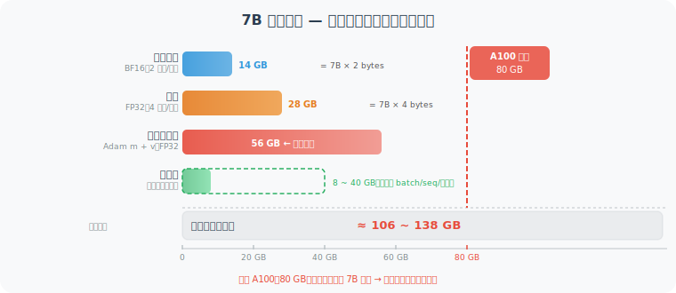
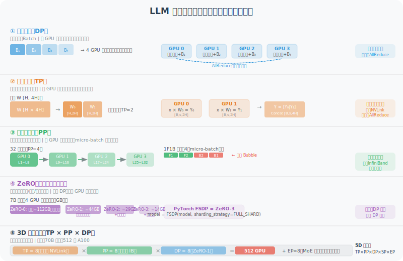
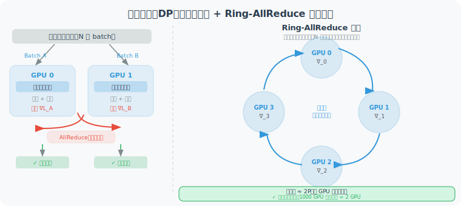
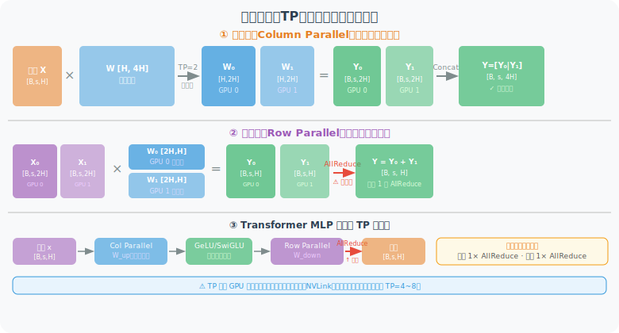
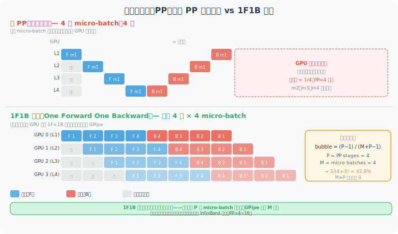
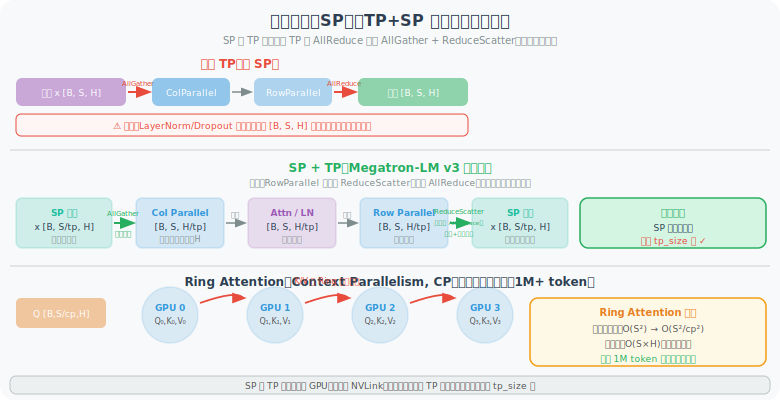
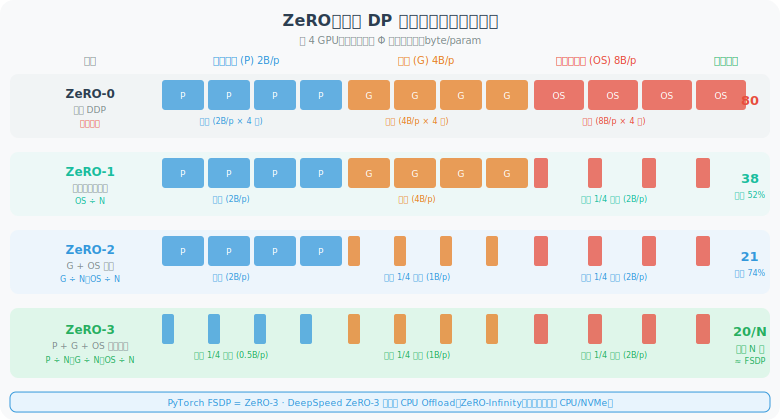
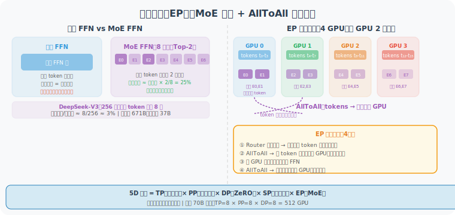
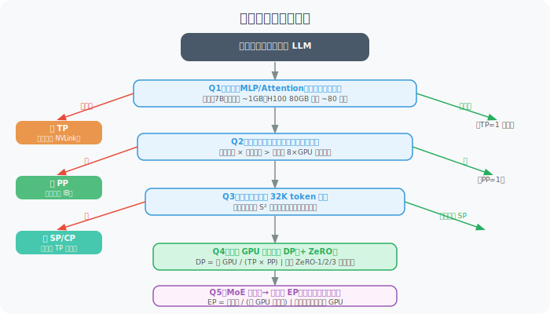

# 11.2b 分布式训练基础：DP / TP / PP / SP / ZeRO

> 🖥️ *"训练一个 70B 参数模型，单卡 A100（80GB 显存）根本放不下——即便放得下，等你训到退休也没训完。分布式训练不是锦上添花，而是大模型存在的前提。"*

---

## 为什么需要分布式训练？

在理解各种并行策略之前，先搞清楚**显存墙**和**算力墙**这两个核心约束。

### 显存墙：一张卡装不下

以训练一个 7B 参数的模型为例，混合精度训练（BF16）时，显存占用来自以下几个部分：



如上图所示，优化器状态（Adam 的 m + v 动量）是最大的开销来源，单项就超过 A100 的全部显存。加上参数、梯度和激活值，7B 模型混合精度训练需要 **106~138 GB**，远超单卡 A100 的 80 GB 上限。

### 算力墙：一张卡等不起

以 Llama-3 70B 为例，训练 1T tokens 大约需要 $6 \times N_{params} \times N_{tokens}$ 次浮点运算：

$$\text{FLOP} = 6 \times 70 \times 10^9 \times 10^{12} = 4.2 \times 10^{23}$$

单张 A100（312 TFLOPS）需要：

$$t = \frac{4.2 \times 10^{23}}{3.12 \times 10^{14}} \approx 1.35 \times 10^9 \text{ 秒} \approx \textbf{42.8 年}$$

用 1000 张 A100 组成集群，仍需 **15 天**，这才是实际训练的时间规模。

分布式训练通过将计算和存储分散到多个 GPU 上，同时解决这两个问题。

---

## 五大并行维度总览

现代 LLM 训练综合使用最多 5 种并行维度，它们针对的是计算图的不同切分轴：



| 并行策略 | 英文 | 缩写 | 切分维度 | 解决的核心问题 |
|---------|------|------|---------|-------------|
| 数据并行 | Data Parallelism | **DP** | Batch 维度 | 训练速度（吞吐量） |
| 张量并行 | Tensor Parallelism | **TP** | 权重矩阵维度 | 单层参数过大 |
| 流水线并行 | Pipeline Parallelism | **PP** | 模型层（深度）维度 | 层数过多 |
| 序列并行 | Sequence Parallelism | **SP** | 序列长度维度 | 长序列激活值过大 |
| 专家并行 | Expert Parallelism | **EP** | MoE 专家数维度 | MoE 模型专家过多 |

ZeRO 是一种**优化器状态分片**技术，配合 DP 使用，严格说不属于新的并行维度，但对显存优化至关重要。

---

## 一、数据并行（DP / DDP）

### 核心思路

数据并行是最简单、最常用的并行策略：**每个 GPU 持有完整的模型副本，但处理不同的数据子集**，最后聚合梯度更新参数。



如上图左侧所示，每个 GPU 拥有完整模型副本，分别对不同的 Batch 做前向 + 反向计算，然后通过 AllReduce 聚合平均梯度，同步更新所有副本的参数。右侧是 **Ring-AllReduce** 的通信方式——各 GPU 排成一个环，梯度片段沿环传递，每张卡的通信量与 GPU 数量无关，实现近似线性扩展。

### DDP vs DP

PyTorch 提供两种数据并行实现：

```python
import torch
import torch.nn as nn
from torch.nn.parallel import DistributedDataParallel as DDP
from torch.nn.parallel import DataParallel as DP

# ─── 方式一：DataParallel（DP）——单机多卡，简单但有瓶颈 ───
# 问题：主卡（GPU 0）负责汇聚梯度，成为通信瓶颈
# 问题：各 GPU 显存不均衡（主卡负担更重）
model = MyModel().cuda()
model = DataParallel(model, device_ids=[0, 1, 2, 3])
output = model(input)   # 自动分发 batch 到各 GPU

# ─── 方式二：DistributedDataParallel（DDP）——推荐！───
# 优点：每个 GPU 独立计算梯度，Ring-AllReduce 均匀通信
# 优点：支持多机多卡，线性扩展性更好
import torch.distributed as dist

def setup(rank, world_size):
    dist.init_process_group("nccl", rank=rank, world_size=world_size)

def train_ddp(rank, world_size, model, dataset):
    setup(rank, world_size)
    
    # 每个进程持有一份模型
    model = model.to(rank)
    model = DDP(model, device_ids=[rank])
    
    # DistributedSampler 保证每个进程看到不同数据
    sampler = torch.utils.data.DistributedSampler(
        dataset, num_replicas=world_size, rank=rank
    )
    loader = DataLoader(dataset, sampler=sampler, batch_size=64)
    
    optimizer = torch.optim.AdamW(model.parameters(), lr=1e-4)
    
    for batch in loader:
        optimizer.zero_grad()
        loss = model(batch)
        loss.backward()          # DDP 自动在 backward 期间触发 AllReduce
        optimizer.step()
```

### AllReduce：梯度聚合的通信算法

DDP 的核心操作是 **Ring-AllReduce**（已在上图右侧展示）：每个 GPU 把自己的梯度片段沿环形逐步传递，经过 2(N-1) 轮通信后，每个 GPU 都拥有完整的平均梯度。关键性质是**通信量与 GPU 数量无关**——即使 1000 张卡，每张卡的通信量仍约等于 2 倍参数量，实现理想线性扩展。

### DP 的局限性

**显存问题**：每个 GPU 都要存储完整模型参数 + 梯度 + 优化器状态。对 70B 模型，即使 DP=1000，每张卡仍需 100GB+。这催生了 ZeRO（见后文）。

**有效 batch size**：`global_batch_size = local_batch_size × world_size`。DP=1000 时，有效 batch 可能过大导致训练不稳定，需要配合 **Gradient Accumulation**：

```python
# Gradient Accumulation：模拟大 batch 而不增加实际 batch size
accumulation_steps = 8  # 累积 8 个 mini-batch 才更新一次

for step, batch in enumerate(loader):
    loss = model(batch) / accumulation_steps  # 缩放损失
    loss.backward()                            # 累积梯度
    
    if (step + 1) % accumulation_steps == 0:
        optimizer.step()                       # 每 8 步才更新
        optimizer.zero_grad()
```

---

## 二、张量并行（TP）

### 核心思路

张量并行将**单个权重矩阵**在 GPU 之间切分，每个 GPU 只持有矩阵的一部分，并行计算矩阵乘法。

这是 Megatron-LM [1] 提出的核心技术，专门针对 Transformer 的两大密集层：



如上图所示，TP 有两种切分方式：

- **列并行（Column Parallel）**：将权重 W 按列切分，各 GPU 独立计算局部输出，最后 Concat 拼接——**前向无需通信**。
- **行并行（Row Parallel）**：将权重按行切分，同时切分输入，各 GPU 独立计算后 AllReduce 求和——**前向需要 1 次 AllReduce**。

实际 Transformer 的 MLP 层由"列并行 + 激活函数 + 行并行"组成（见图底部数据流），每层共需 2 次 AllReduce（前向 1 次 + 反向 1 次）。

**线性层的列并行（Column Parallel Linear）概念：**
- 权重 W [H, 4H] 按列切分为 W₀ [H, 2H] 和 W₁ [H, 2H]
- GPU 0 计算 Y₀ = X × W₀，GPU 1 计算 Y₁ = X × W₁
- 输出 Concat：Y = [Y₀ | Y₁] [B, s, 4H]

**线性层的行并行（Row Parallel Linear）概念：**
- 权重 W [4H, H] 按行切分，输入也相应切分
- GPU 0：X₀ × W₀ = Y₀，GPU 1：X₁ × W₁ = Y₁
- AllReduce：Y = Y₀ + Y₁ [B, s, H]

### MLP 层的 TP 分解

```python
# 标准 FFN 层的 TP 分解（Megatron-LM 风格）
class ColumnParallelLinear(nn.Module):
    """
    权重按列切分：
    W_full [H, 4H] → 每个 GPU 持有 W_local [H, 4H/tp_size]
    """
    def __init__(self, in_features, out_features, tp_size):
        super().__init__()
        self.tp_size = tp_size
        # 每个 GPU 只持有 1/tp_size 的列
        self.weight = nn.Parameter(
            torch.randn(in_features, out_features // tp_size)
        )
    
    def forward(self, x):
        # 局部矩阵乘法，不需要通信
        return F.linear(x, self.weight)  # [B, s, out/tp]


class RowParallelLinear(nn.Module):
    """
    权重按行切分：
    W_full [4H, H] → 每个 GPU 持有 W_local [4H/tp_size, H]
    同时输入 x 也已经是局部的（来自 ColumnParallel 的输出）
    """
    def __init__(self, in_features, out_features, tp_size):
        super().__init__()
        self.tp_size = tp_size
        self.weight = nn.Parameter(
            torch.randn(in_features // tp_size, out_features)
        )
    
    def forward(self, x):
        # 局部矩阵乘法
        local_output = F.linear(x, self.weight)  # [B, s, H]
        # AllReduce 聚合所有 GPU 的部分结果
        dist.all_reduce(local_output, op=dist.ReduceOp.SUM)
        return local_output


class TensorParallelMLP(nn.Module):
    """
    完整 MLP 的 TP 实现：
    FFN(x) = GeLU(x @ W_up) @ W_down
    
    通信模式：
    输入 x → [AllGather] → 列并行W_up → 行并行W_down → [AllReduce] → 输出
    总计：前向 1 次 AllGather + 1 次 AllReduce
         反向 1 次 AllGather + 1 次 AllReduce
    """
    def __init__(self, hidden_size, ffn_size, tp_size):
        super().__init__()
        self.up_proj = ColumnParallelLinear(hidden_size, ffn_size, tp_size)
        self.down_proj = RowParallelLinear(ffn_size, hidden_size, tp_size)
    
    def forward(self, x):
        return self.down_proj(F.gelu(self.up_proj(x)))
```

### 注意力层的 TP

多头注意力（MHA）的 TP 更自然——直接按**注意力头**切分：

```python
# Attention TP：每个 GPU 负责部分注意力头
class TensorParallelAttention(nn.Module):
    """
    假设 n_heads=32，TP=4：
    每个 GPU 负责 8 个头
    
    Q、K、V 投影：列并行（输出切分）
    Output 投影：行并行（输入切分 + AllReduce）
    """
    def __init__(self, d_model, n_heads, tp_size):
        super().__init__()
        self.local_heads = n_heads // tp_size       # 每 GPU 负责的头数
        self.head_dim = d_model // n_heads
        local_d = self.local_heads * self.head_dim  # 本 GPU 的 KQV 维度
        
        # 列并行：每个 GPU 只持有部分 Q/K/V 投影
        self.qkv_proj = ColumnParallelLinear(d_model, 3 * local_d, tp_size=1)
        # 行并行：聚合各 GPU 的注意力输出
        self.out_proj = RowParallelLinear(local_d, d_model, tp_size)
```

### TP 的适用场景与限制

| 特性 | 说明 |
|------|------|
| **通信量** | 每层 2 次 AllReduce（前向 1 次 + 反向 1 次）|
| **通信延迟** | 高——每层必须等通信完成才能继续（同步通信）|
| **推荐 GPU 连接** | **必须在同一节点内**（NVLink），跨节点带宽太低 |
| **适合** | 单层参数量过大（MLP 层 4H×H 权重）|
| **不适合** | 层数多但每层不大；跨节点扩展 |
| **典型规模** | TP=4~8（一台 8 卡服务器内使用）|

---

## 三、流水线并行（PP）

### 核心思路

流水线并行将模型**按层切分**，不同 GPU 负责不同的层组，像工厂流水线一样并行处理：



如上图所示，无 PP 时 GPU 大部分时间空闲等待；1F1B 调度则让每个 GPU 在稳定阶段交替执行前向和反向，显著提升利用率。气泡率公式为：

$$\text{bubble} = \frac{P-1}{M+P-1}$$

其中 P 是 PP_stages（流水线阶段数），M 是 micro_batches 数量。**当 M ≫ P 时，气泡率趋近于零**。

### Bubble（流水线气泡）问题

流水线并行最大的挑战是**气泡（Bubble）**——GPU 等待前一个阶段输出时的空闲时间：

```python
# GPipe 调度策略（朴素 PP）
class GPipe:
    """
    每个 micro-batch 完整前向传播后再反向传播
    气泡率 = (PP_stages - 1) / (micro_batches + PP_stages - 1)
    
    当 micro_batches >> PP_stages 时，气泡率 → 0
    但 micro_batches 太多会增加显存（需要缓存所有激活值）
    """
    def __init__(self, stages=4, micro_batches=8):
        self.stages = stages
        self.micro_batches = micro_batches
        self.bubble_rate = (stages - 1) / (micro_batches + stages - 1)
        print(f"气泡率: {self.bubble_rate:.1%}")  # stages=4, m=8 → 27.3%
```

**1F1B 调度**（Megatron-LM 提出，更优）：

1F1B 的核心改进在于**显存峰值更低**——它只需缓存 `stages` 个 micro-batch 的激活值（而 GPipe 需要缓存所有 M 个），因此在相同气泡率下更节省显存。详见上方甘特图中的调度对比。

```python
class OneFOneB:
    """
    1F1B 调度核心思路：
    稳定状态下，每个时间步都是 1 次前向 + 1 次反向
    避免了 GPipe 需要缓存所有 micro-batch 激活值的问题
    """
    def schedule(self, num_stages, num_micro_batches):
        """
        返回每个 stage 的执行序列
        F = Forward, B = Backward
        数字表示 micro-batch 编号
        """
        schedule = {stage: [] for stage in range(num_stages)}
        
        # Warmup phase: 前 PP_stages 个 micro-batch 只做前向
        for stage in range(num_stages):
            for mb in range(num_stages - stage):
                schedule[stage].append(f"F{mb}")
        
        # Steady state: 每个 GPU 都是 1F1B 交替
        # ...（实际实现见 Megatron-LM 源码）
        
        return schedule
```

### PP 的适用场景与限制

| 特性 | 说明 |
|------|------|
| **通信量** | 只在相邻阶段间传递激活值（点对点，低通信量）|
| **通信延迟** | 相对低（P2P 通信）|
| **推荐 GPU 连接** | 适合**跨节点**（100Gbps IB 即可）|
| **适合** | 模型层数多，单层参数量不大 |
| **缺点** | 流水线气泡；调试复杂；实现难度高 |
| **典型规模** | PP=4~16（多机多卡）|

---

## 四、序列并行（SP）

### 核心思路

序列并行（Sequence Parallelism）沿**序列长度维度**切分，主要解决**长序列下激活值显存爆炸**的问题。

在标准 Transformer 中，激活值的显存占用与序列长度成二次方关系（注意力矩阵 $S \times S$），当序列长度从 2K 增长到 128K 时，这是致命瓶颈。



如上图所示，SP+TP 将标准 TP 的 AllReduce 拆分为 AllGather + ReduceScatter，使序列在 SP 区域（LayerNorm、Dropout 等）始终保持分片状态，从而将这些位置的激活值显存减少 `tp_size` 倍。图中下方的 Ring Attention（Context Parallelism）则可进一步将注意力矩阵的显存从 $O(S^2)$ 降至 $O(S^2/cp^2)$，支持超过 1M token 的超长上下文训练。

### SP + TP 组合（Megatron-LM v3）

SP 通常与 TP **配合使用**（在同一组 GPU 内），共同减少激活值（已在上图中展示完整数据流）。

**关键优化**：将 TP 的 AllReduce 替换为 ReduceScatter + AllGather 组合，可以在序列维度保持分片，减少 50% 的激活值显存。

```python
# SP+TP 的通信模式（比较）
class SequenceParallelism:
    """
    标准 TP 通信：
      前向：AllGather(x) → ColParallel → RowParallel + AllReduce
      反向：AllReduce(∇) → RowParallel → ColParallel + AllGather
    
    SP+TP 通信（激活值始终保持序列分片）：
      前向：AllGather(x) → ColParallel → RowParallel + ReduceScatter
      反向：AllGather(∇) → RowParallel → ColParallel + ReduceScatter
    
    显存节省：序列并行区域（Dropout, LayerNorm）的激活值减少 tp_size 倍
    通信量：与标准 TP 相同（AllGather ≈ AllReduce 通信量）
    """
    pass
```

### Context Parallelism（CP）：Ring Attention

当序列长度超过 SP 能处理的范围时（例如 1M token），还有更激进的 **Context Parallelism**：

```python
# Ring Attention（CP 的核心）
# 将注意力的 Q/K/V 沿序列维度切分，
# 通过 Ring 通信实现分布式注意力计算

class RingAttention:
    """
    核心思路：
    - 每个 GPU 拥有完整 Q 的一段 [B, S/cp, H]
    - K/V 以 Ring 方式在 GPU 间循环传递
    - 每个 GPU 在本地完成部分注意力计算
    - 最终合并得到完整注意力输出
    
    通信量：O(S/cp × H × cp) = O(S × H)，与层数无关
    显存：注意力矩阵从 O(S²) 降至 O(S²/cp²)
    
    典型应用：Apple MLX、Google JAX 超长上下文训练
    """
    def forward(self, q, k, v, cp_group):
        S_local = q.shape[1]  # S / cp
        output = torch.zeros_like(q)
        
        # 本地 K/V
        k_local = k.clone()
        v_local = v.clone()
        
        for step in range(self.cp_size):
            # 计算当前 K/V 块的注意力
            attn_out = flash_attn(q, k_local, v_local, causal=(step == 0))
            output += attn_out
            
            # 通过 Ring 传递 K/V 到下一个 GPU
            k_local = self.ring_send_recv(k_local, cp_group)
            v_local = self.ring_send_recv(v_local, cp_group)
        
        return output
```

---

## 五、ZeRO：消除优化器冗余

### 问题来源

在标准 DDP 中，每个 GPU 存储**完整**的：
- 模型参数（Parameters）：FP16，2 byte/param
- 梯度（Gradients）：FP32，4 byte/param  
- 优化器状态（Optimizer states）：Adam 需要 m + v，FP32，8 byte/param

总计约 **16 byte/param**。对 70B 模型 = **1120 GB**，即使 1000 张 A100 仍需每卡 > 1GB，但实际问题是**每张卡存储了完全相同的优化器状态**——这是巨大的冗余！

### ZeRO 三阶段

**ZeRO（Zero Redundancy Optimizer）** 由微软 DeepSpeed 提出 [2]，通过分片消除冗余：



如上图所示，ZeRO 分三个阶段递进分片，逐步消除优化器状态、梯度、模型参数的冗余：

| 阶段 | 分片内容 | 每卡显存（N=4） | 节省 |
|------|---------|--------------|------|
| ZeRO-0（DDP） | 无分片 | 80 B/param | — |
| ZeRO-1 | 优化器状态 | ~38 B/param | 52% |
| ZeRO-2 | + 梯度 | ~21 B/param | 74% |
| ZeRO-3 | + 模型参数 | 80/N B/param | N 倍 |

$$\text{ZeRO-3 每卡显存} = \frac{16 \text{ byte/param}}{N_{\text{GPUs}}}$$

1000 张 A100 训练 70B 模型，每卡约 1.12GB，轻松放下！

```python
# 使用 DeepSpeed ZeRO 训练
import deepspeed

# ZeRO Stage 配置
ds_config = {
    "zero_optimization": {
        "stage": 3,                      # ZeRO-3：全量分片
        "offload_optimizer": {
            "device": "cpu",             # 可选：将优化器状态卸载到 CPU
            "pin_memory": True,
        },
        "offload_param": {
            "device": "cpu",             # 可选：将参数卸载到 CPU（ZeRO-Infinity）
        },
        "overlap_comm": True,            # 通信与计算重叠
        "contiguous_gradients": True,    # 连续显存提升通信效率
        "sub_group_size": 1e9,
        "reduce_bucket_size": 5e8,
    },
    "bf16": {"enabled": True},
    "gradient_checkpointing": True,
}

# 初始化 DeepSpeed 引擎
model_engine, optimizer, _, _ = deepspeed.initialize(
    model=model,
    config=ds_config,
)

# 训练循环与普通 PyTorch 几乎相同
for batch in dataloader:
    loss = model_engine(batch)
    model_engine.backward(loss)    # 替代 loss.backward()
    model_engine.step()            # 替代 optimizer.step()
```

### ZeRO++ 与 ZeRO-Infinity

**ZeRO++（2023）** 在 ZeRO-3 基础上进一步压缩通信量：
- **qwZ（量化权重）**：AllGather 时将 FP16 量化为 INT8，通信量减少 50%
- **hpZ（层次化分区）**：优先做节点内分区，减少跨节点流量
- **qgZ（量化梯度）**：ReduceScatter 前量化，进一步降低带宽需求

**ZeRO-Infinity** 则将参数/梯度/优化器状态卸载到 CPU RAM 或 NVMe SSD，理论上可训练任意大小的模型，但速度受限于 PCIe 带宽，适合"大模型 + 少量 GPU"的研究场景。

### FSDP（PyTorch 原生 ZeRO）

PyTorch 2.0+ 内置了 **Fully Sharded Data Parallel（FSDP）**，是 ZeRO-3 的原生实现：

```python
from torch.distributed.fsdp import (
    FullyShardedDataParallel as FSDP,
    MixedPrecision,
    BackwardPrefetch,
    ShardingStrategy,
)

# FSDP 配置
fsdp_config = dict(
    sharding_strategy=ShardingStrategy.FULL_SHARD,    # ZeRO-3 等效
    # ShardingStrategy.SHARD_GRAD_OP = ZeRO-2
    # ShardingStrategy.NO_SHARD = 标准 DDP
    
    mixed_precision=MixedPrecision(
        param_dtype=torch.bfloat16,
        reduce_dtype=torch.float32,
        buffer_dtype=torch.bfloat16,
    ),
    backward_prefetch=BackwardPrefetch.BACKWARD_PRE,  # 预取下一层参数
    cpu_offload=None,  # 或 CPUOffload(offload_params=True)
    auto_wrap_policy=lambda module, recurse, *args: (
        recurse or isinstance(module, TransformerDecoderLayer)
    ),
)

model = FSDP(model, **fsdp_config)
```

---

## 六、专家并行（EP）

EP 专门针对 **MoE（Mixture of Experts）** 模型，如 Mixtral、DeepSeek-V3 等。

### MoE 回顾



如上图左侧所示，标准 FFN 对每个 token 使用同一个 FFN；而 MoE FFN 设置了多个专家，每个 token 只经过其中 K 个（Top-K 路由），大幅提升了参数量而不增加激活计算量。DeepSeek-V3 使用 256 个专家，每 token 激活 8 个，总参数 671B 但激活约 37B。

### EP 的切分方式

如上图右侧所示，EP 将不同专家分配给不同 GPU（以 256 专家、EP=8 为例，每 GPU 持有 32 个专家）。最大挑战是 **MoE 路由是动态的**——每个 token 发给哪个专家在运行时才决定，需要两次 AllToAll 通信（分发 token → 计算 → 收回结果）。

```python
class ExpertParallelMoE(nn.Module):
    """
    专家并行 MoE 层
    
    通信模式：
    1. Router 决定每个 token 发给哪个专家（本地计算）
    2. AllToAll：将 token 发送到对应 GPU
    3. 各 GPU 独立计算自己持有专家的 FFN
    4. AllToAll：将计算结果发回原始 GPU
    5. 合并专家输出
    """
    def __init__(self, d_model, n_experts, n_experts_per_token, ep_group):
        super().__init__()
        self.ep_group = ep_group
        self.ep_size = dist.get_world_size(ep_group)
        self.local_n_experts = n_experts // self.ep_size
        
        # 每个 GPU 只持有 local_n_experts 个专家
        self.experts = nn.ModuleList([
            MLP(d_model) for _ in range(self.local_n_experts)
        ])
        self.router = Router(d_model, n_experts, n_experts_per_token)
    
    def forward(self, x):
        B, S, D = x.shape
        x_flat = x.view(-1, D)  # [B*S, D]
        
        # 1. 路由计算（本地）
        expert_indices, expert_weights = self.router(x_flat)
        
        # 2. AllToAll：将 token 分发到对应 GPU
        x_dispatched = self.all_to_all_dispatch(x_flat, expert_indices)
        
        # 3. 本地专家计算
        expert_outputs = []
        for i, expert in enumerate(self.experts):
            # 获取分配给本 GPU 第 i 个专家的 token
            tokens_for_expert = x_dispatched[i]
            if tokens_for_expert.shape[0] > 0:
                expert_outputs.append(expert(tokens_for_expert))
        
        # 4. AllToAll：将结果发回原始 GPU
        combined = self.all_to_all_combine(expert_outputs)
        
        # 5. 加权合并
        return self.weighted_sum(combined, expert_weights)
```

---

## 七、3D / 4D / 5D 并行：组合使用

生产训练通常同时使用多种并行策略，这被称为 **3D/4D/5D 并行**：

- **3D 并行** = TP × PP × DP（Megatron-LM 的经典方案）
- **4D 并行** = TP × PP × DP × SP（加入序列并行）
- **5D 并行** = TP × PP × DP × SP × EP（再加入专家并行，MoE 模型专用）

**配置示例**（Llama-3 70B 在 512 张 H100 上）：TP=8（节点内 NVLink）× PP=8（跨节点 InfiniBand）× DP=8（ZeRO-1）= 512 GPU。

### 选择并行策略的经验法则



按照决策树：**先确定 TP**（单层是否放得下），**再确定 PP**（是否需要跨节点），**再看 SP**（序列是否超 32K），**剩余 GPU 全给 DP**，MoE 则独立叠加 EP。

```python
# 实际配置示例（参考 Megatron-LM 和 LLaMA-Factory）
training_config = {
    # 并行维度
    "tensor_model_parallel_size": 4,      # TP=4（节点内 4 卡）
    "pipeline_model_parallel_size": 4,    # PP=4（跨 4 个节点）
    "data_parallel_size": 16,             # DP=16（总 256 卡 / TP4 / PP4）
    "sequence_parallel": True,            # 与 TP 配合使用
    
    # ZeRO 配置
    "zero_stage": 1,                      # PP+TP 模式下通常只需 ZeRO-1
    
    # Batch 配置
    "global_batch_size": 2048,
    "micro_batch_size": 2,               # 每张卡每次处理 2 个样本
    "gradient_accumulation_steps": 64,   # 2048 / (2 × 16) = 64
    
    # 序列长度
    "seq_length": 8192,
    
    # 混合精度
    "bf16": True,
    "fp32_residual_connection": False,
}
```

### 通信量对比

| 策略 | 通信操作 | 通信量 | 延迟敏感性 | 推荐网络 |
|------|---------|--------|---------|---------|
| DP | AllReduce | 2P（参数量） | 低 | Ethernet / IB |
| TP | AllReduce / AllGather | 2 × 激活量/层 | **高** | NVLink（节点内）|
| PP | P2P Send/Recv | 激活量 × B/S | 中 | IB |
| SP | AllGather / ReduceScatter | 同 TP | 高 | NVLink（节点内）|
| ZeRO-3 | AllGather（前向）+ ReduceScatter（反向） | 3P（更多） | 低 | IB |

---

## 八、Gradient Checkpointing（梯度检查点）

这不是并行策略，但与分布式训练密不可分——它是**用计算换显存**的重要技巧：

```python
# 标准训练：保留所有激活值（显存 O(layers × S × H)）
output = model(input)
loss = criterion(output, target)
loss.backward()  # 使用前向时保存的激活值

# 梯度检查点：只保留部分激活值，反向时重新计算
from torch.utils.checkpoint import checkpoint

def forward_with_checkpointing(model, input):
    """
    不保存中间激活值，反向传播时重新前向计算一次
    
    显存节省：从 O(L × S × H) → O(√L × S × H)
    计算开销：增加约 30%（相当于额外做了一次前向）
    """
    # 对每个 Transformer 层启用检查点
    for layer in model.layers:
        # 不保存 layer 的激活值
        input = checkpoint(layer, input, use_reentrant=False)
    return input

# 在 Hugging Face Transformers 中启用
from transformers import LlamaForCausalLM

model = LlamaForCausalLM.from_pretrained("meta-llama/Llama-3-8B")
model.gradient_checkpointing_enable()  # 一行代码，节省 ~50% 显存
```

---

## 综合对比与选型建议

### 不同模型规模的推荐配置

| 模型规模 | GPU 数量 | 推荐配置 | 典型框架 |
|---------|---------|---------|---------|
| 1B~7B | 1~8 卡 | DP + ZeRO-2/3 | DeepSpeed, FSDP |
| 7B~13B | 8~32 卡 | DP/ZeRO-3 + GradCkpt | FSDP, LLaMA-Factory |
| 13B~70B | 32~256 卡 | TP=4 + PP=2 + DP + ZeRO-1 | Megatron-LM |
| 70B~400B | 256~1024 卡 | TP=8 + PP=4~8 + DP + ZeRO-1 | Megatron-LM |
| 400B~1T（MoE）| 512~8192 卡 | TP=8 + PP=8 + EP=8 + DP + ZeRO-1 | Megatron-Core |

### 主流训练框架对比

| 框架 | 支持的并行 | 适合场景 | 易用性 |
|------|----------|---------|-------|
| **DeepSpeed** | DP+ZeRO, PP, TP（有限）| 中小模型，资源受限 | ⭐⭐⭐⭐ |
| **PyTorch FSDP** | DP+ZeRO-3 | 中等规模，PyTorch 原生 | ⭐⭐⭐⭐ |
| **Megatron-LM** | TP+PP+SP+DP+ZeRO | 超大规模预训练 | ⭐⭐ |
| **LLaMA-Factory** | 封装 FSDP/DeepSpeed | SFT/RL 微调 | ⭐⭐⭐⭐⭐ |
| **Axolotl** | 封装 FSDP/DeepSpeed | SFT 微调 | ⭐⭐⭐⭐ |

---

## 本节小结

| 技术 | 切分维度 | 解决问题 | 关键约束 |
|------|---------|---------|---------|
| **DP / DDP** | Batch | 吞吐量 | 每卡需存完整模型 |
| **ZeRO-1/2/3** | 优化器/梯度/参数 | DP 下的显存冗余 | 通信量增加 |
| **FSDP** | 参数+梯度+优化器 | ZeRO-3 的 PyTorch 原生版 | 多 AllGather 开销 |
| **TP** | 权重矩阵内部 | 单层过大 | 需 NVLink 高带宽 |
| **PP** | 模型层（深度） | 层数过多 | 流水线气泡 |
| **SP** | 序列长度 | 长序列激活值 | 配合 TP 使用 |
| **CP / Ring Attn** | 超长序列 | 百万 token 注意力 | 注意力计算切分 |
| **EP** | MoE 专家 | 专家参数分布 | AllToAll 动态路由 |

> 💡 **Agent 开发者的核心收获**：  
> 如果你在用 LLaMA-Factory 或 Axolotl 微调模型，**FSDP（ZeRO-3）+ Gradient Checkpointing** 是小团队的最优选择——支持 8 卡以内训练 70B 模型。  
> 如果你在设计从零预训练，需要认真规划 3D 并行（TP × PP × DP）的组合。

---

## 参考文献

[1] SHOEYBI M, et al. Megatron-LM: training multi-billion parameter language models using model parallelism[J]. arXiv:1909.08053, 2019.

[2] RAJBHANDARI S, et al. ZeRO: memory optimizations toward training trillion parameter models[C]//SC, 2020.

[3] KORTHIKANTI V, et al. Reducing activation recomputation in large Transformer models[J]. arXiv:2205.05198, 2022.（SP 原论文）

[4] LIU Z, et al. Ring attention with blockwise transformers for near-infinite context[J]. arXiv:2310.01889, 2023.（Ring Attention）

[5] Microsoft DeepSpeed Team. ZeRO++: extremely efficient collective communication for giant model training[J]. arXiv:2306.10209, 2023.

[6] ZHAO Y, et al. PyTorch FSDP: experiences on scaling fully sharded data parallel[J]. arXiv:2304.11277, 2023.

---

*上一节：[11.2 SFT + LoRA 基础训练](./02_sft_lora.md)*  
*下一节：[11.3 PPO：近端策略优化](./03_ppo.md)*
