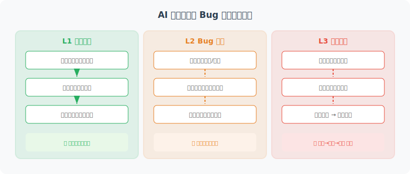

# 测试生成与 Bug 修复

> **本节目标**：让 AI 编程助手自动生成单元测试，并能定位和修复代码中的 Bug。



---

## 测试策略概述

AI 编程助手在测试领域可以发挥三个层次的作用：

| 层次 | 能力 | 说明 |
|------|------|------|
| **L1 测试生成** | 自动生成单元测试 | 分析函数签名和逻辑，生成测试用例 |
| **L2 Bug 诊断** | 分析错误并定位根因 | 理解错误信息、堆栈跟踪、代码逻辑 |
| **L3 自动修复** | 生成修复代码并验证 | 修复 → 运行测试 → 确认通过的闭环 |

---

## 自动生成测试

```python
class TestGenerator:
    """自动测试生成器"""
    
    def __init__(self, llm):
        self.llm = llm
    
    async def generate_tests(
        self,
        source_code: str,
        file_path: str,
        framework: str = "pytest"
    ) -> str:
        """为给定代码自动生成测试"""
        
        prompt = f"""请为以下代码生成全面的单元测试。

源代码文件：{file_path}
```python
{source_code}
```

测试框架：{framework}

要求：
1. 为每个公共函数/方法生成至少 2 个测试用例
2. 覆盖正常情况、边界情况和异常情况
3. 测试名称要清晰表达测试意图
4. 使用 {framework} 的最佳实践

请生成完整的测试文件代码。
"""
        response = await self.llm.ainvoke(prompt)
        return response.content
    
    async def analyze_coverage(
        self,
        source_code: str,
        test_code: str,
    ) -> dict:
        """分析测试覆盖率，建议补充哪些测试"""
        
        prompt = f"""分析以下测试代码对源代码的覆盖情况。

源代码：
```python
{source_code}
```

现有测试：
```python
{test_code}
```

请分析：
1. 哪些函数/分支已被测试覆盖
2. 哪些函数/分支尚未覆盖
3. 建议补充的测试用例

以 JSON 格式返回：
{{
    "covered": ["已覆盖的函数/分支列表"],
    "uncovered": ["未覆盖的函数/分支列表"],
    "suggestions": ["建议的测试用例描述"]
}}
"""
        response = await self.llm.ainvoke(prompt)
        import json
        return json.loads(response.content)
```

---

## Bug 定位与修复

```python
class BugFixer:
    """Bug 定位和修复器"""
    
    def __init__(self, llm):
        self.llm = llm
    
    async def diagnose_and_fix(
        self,
        code: str,
        error_message: str,
        file_path: str
    ) -> dict:
        """诊断并修复 Bug"""
        
        prompt = f"""以下代码运行时出现了错误，请帮我诊断并修复。

文件：{file_path}
代码：
```python
{code}
```

错误信息：
```
{error_message}
```

请分析：
1. 错误的根本原因
2. 出问题的代码位置
3. 修复方案

以 JSON 格式回复：
{{
    "root_cause": "根本原因分析",
    "bug_location": "出问题的函数/行号",
    "fix_description": "修复方案说明",
    "fixed_code": "修复后的完整代码"
}}
"""
        
        response = await self.llm.ainvoke(prompt)
        import json
        return json.loads(response.content)
    
    async def suggest_preventive_measures(
        self,
        bug_info: dict
    ) -> list[str]:
        """基于 Bug 分析，建议预防措施"""
        
        prompt = f"""根据以下 Bug 分析，提出 3-5 条预防类似问题再次出现的建议：

根因：{bug_info['root_cause']}
位置：{bug_info['bug_location']}
修复：{bug_info['fix_description']}

请返回建议列表（每条一行）。
"""
        response = await self.llm.ainvoke(prompt)
        return response.content.strip().split('\n')
```

---

## 集成使用：测试-诊断-修复闭环

```python
async def fix_workflow(llm, code: str, test_code: str):
    """修复工作流：运行测试 → 发现失败 → 自动修复 → 验证修复"""
    
    fixer = BugFixer(llm)
    test_gen = TestGenerator(llm)
    
    # 1. 如果没有测试，先生成
    if not test_code:
        test_code = await test_gen.generate_tests(code, "main.py")
        print("✅ 已生成测试用例")
    
    # 2. 运行测试（简化演示）
    print("🧪 运行测试中...")
    # result = subprocess.run(["python", "-m", "pytest", ...])
    
    # 3. 如果有失败的测试，让 Agent 修复
    error_msg = "AssertionError: expected 42, got 0"
    
    fix_result = await fixer.diagnose_and_fix(
        code=code,
        error_message=error_msg,
        file_path="main.py"
    )
    
    print(f"🔍 原因: {fix_result['root_cause']}")
    print(f"🔧 修复: {fix_result['fix_description']}")
    print(f"📝 位置: {fix_result['bug_location']}")
    
    # 4. 验证修复（回归测试）
    print("🔄 回归测试：验证修复是否引入新问题...")
    # re-run tests with fixed code
    
    # 5. 预防建议
    preventive = await fixer.suggest_preventive_measures(fix_result)
    print("💡 预防建议：")
    for suggestion in preventive:
        print(f"  {suggestion}")
    
    return fix_result["fixed_code"]
```

### 最佳实践

在将 AI 生成的测试和修复集成到开发流程中时，需要注意：

```python
best_practices = {
    "人工审查": "AI 生成的测试和修复建议必须经过人工审查后再合并",
    "增量测试": "先为新增/修改的代码生成测试，逐步覆盖已有代码",
    "测试质量": "检查 AI 生成的测试是否真正验证了业务逻辑，而非仅仅'凑覆盖率'",
    "修复验证": "自动修复后必须运行全量测试套件（回归测试），防止修复引入新问题",
    "记录与学习": "将常见 Bug 模式记录到知识库，帮助 Agent 提升诊断准确率",
}
```

---

## 小结

| 功能 | 说明 |
|------|------|
| 测试生成 | 自动为代码生成 pytest 测试用例 |
| Bug 诊断 | 分析错误信息，定位根本原因 |
| 自动修复 | 生成修复后的代码 |
| 修复工作流 | 测试 → 诊断 → 修复 的闭环 |

> **下一节预告**：最后，我们将所有组件整合为一个完整的 AI 编程助手。

---

[下一节：19.5 完整项目实现 →](./05_full_implementation.md)
